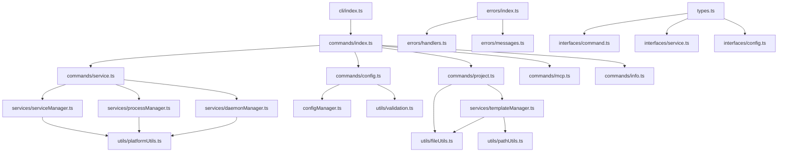

# CLI 命令模块拆分重构技术方案

## 1. 项目背景与目标

### 1.1 现状分析

当前 xiaozhi-client 项目的 CLI 实现存在以下问题：

- **代码规模过大**：`src/cli.ts`文件达到 1,662 行，严重违反单一职责原则
- **功能耦合严重**：服务管理、配置管理、项目创建等功能混杂在一个文件中
- **维护困难**：单个文件包含过多功能，增加了代码理解和维护成本
- **测试复杂**：大文件导致测试用例复杂，难以进行单元测试

### 1.2 重构目标

- **模块化架构**：将单一大文件拆分为职责清晰的多个模块
- **提升可维护性**：每个模块代码行数控制在 200-300 行以内
- **增强可测试性**：独立模块便于编写单元测试
- **保持向后兼容**：确保重构后 CLI 功能和接口保持不变
- **提升代码质量**：统一错误处理、改善代码结构

## 2. 拆分策略详述

### 2.1 拆分原则

1. **按功能域拆分**：根据 CLI 命令的功能领域进行模块划分
2. **单一职责**：每个模块只负责一个特定的功能领域
3. **低耦合高内聚**：模块间依赖关系清晰，内部功能高度相关
4. **接口统一**：所有命令模块遵循统一的接口规范

### 2.2 功能域识别

通过分析当前`cli.ts`文件，识别出以下主要功能域：

#### 2.2.1 服务管理域

- **功能**：服务启动、停止、重启、状态检查、日志查看
- **涉及函数**：`startService`, `stopService`, `checkStatus`, `attachService`, `restartService`
- **代码量**：约 400 行

#### 2.2.2 配置管理域

- **功能**：配置初始化、配置读写、端点管理
- **涉及函数**：`initConfig`, `configCommand`, 端点相关命令
- **代码量**：约 300 行

#### 2.2.3 项目管理域

- **功能**：项目创建、模板管理、目录操作
- **涉及函数**：`createProject`, `copyDirectory`, 模板相关逻辑
- **代码量**：约 350 行

#### 2.2.4 MCP 管理域

- **功能**：MCP 服务管理、工具管理（已独立为 mcpCommands.ts）
- **涉及函数**：MCP 相关命令处理
- **代码量**：约 100 行（主要是命令定义）

#### 2.2.5 工具函数域

- **功能**：版本获取、帮助信息、进程管理、文件操作
- **涉及函数**：`getVersion`, `showHelp`, `isXiaozhiProcess`, `formatUptime`
- **代码量**：约 200 行

### 2.3 拆分策略

采用**渐进式拆分**策略，分三个阶段进行：

1. **阶段一**：提取工具函数和公共逻辑
2. **阶段二**：拆分命令处理模块
3. **阶段三**：重构入口文件和依赖关系

## 3. 目标架构设计

### 3.1 目录结构设计

```text
src/cli/
├── index.ts                    # CLI入口文件 (~100行)
├── Types.ts                    # 类型定义 (~50行)
├── Constants.ts                # 常量定义 (~30行)
├── commands/                   # 命令处理模块
│   ├── index.ts               # 命令注册器 (~50行)
│   ├── ServiceCommand.ts      # 服务管理命令 (~250行)
│   ├── ConfigCommand.ts       # 配置管理命令 (~200行)
│   ├── ProjectCommand.ts      # 项目管理命令 (~220行)
│   ├── McpCommand.ts          # MCP管理命令 (~80行)
│   └── InfoCommand.ts         # 信息查看命令 (~60行)
├── services/                   # 业务服务层
│   ├── ProcessManager.ts      # 进程管理服务 (~180行)
│   ├── ServiceManager.ts      # 服务管理服务 (~200行)
│   ├── TemplateManager.ts     # 模板管理服务 (~120行)
│   └── DaemonManager.ts       # 守护进程管理 (~150行)
├── utils/                      # 工具函数
│   ├── Validation.ts          # 输入验证工具 (~80行)
│   ├── FileUtils.ts           # 文件操作工具 (~100行)
│   ├── PlatformUtils.ts       # 平台相关工具 (~90行)
│   ├── FormatUtils.ts         # 格式化工具 (~60行)
│   └── PathUtils.ts           # 路径处理工具 (~70行)
├── errors/                     # 错误处理
│   ├── index.ts               # 错误类定义 (~80行)
│   ├── ErrorHandlers.ts       # 错误处理器 (~60行)
│   └── ErrorMessages.ts       # 错误消息 (~40行)
└── interfaces/                 # 接口定义
    ├── Command.ts             # 命令接口 (~40行)
    ├── Service.ts             # 服务接口 (~30行)
    └── Config.ts              # 配置接口 (~20行)
```

### 3.2 模块依赖关系



### 3.3 核心接口设计

#### 3.3.1 命令接口

```typescript
// src/cli/interfaces/command.ts
export interface CommandHandler {
  name: string;
  description: string;
  options?: CommandOption[];
  execute(args: any, options: any): Promise<void>;
}

export interface CommandOption {
  flags: string;
  description: string;
  defaultValue?: any;
}

export interface CommandContext {
  spinner: any;
  logger: any;
  configManager: any;
}
```

#### 3.3.2 服务接口

```typescript
// src/cli/interfaces/service.ts
export interface ServiceManager {
  start(options: ServiceStartOptions): Promise<void>;
  stop(): Promise<void>;
  restart(options: ServiceStartOptions): Promise<void>;
  getStatus(): ServiceStatus;
}

export interface ServiceStartOptions {
  daemon?: boolean;
  ui?: boolean;
  port?: number;
  mode?: "normal" | "mcp-server" | "stdio";
}

export interface ServiceStatus {
  running: boolean;
  pid?: number;
  uptime?: string;
  mode?: "foreground" | "daemon";
}
```

## 4. 架构模式说明

### 4.1 设计模式应用

#### 4.1.1 命令模式 (Command Pattern)

- **应用场景**：CLI 命令处理
- **实现方式**：每个命令实现统一的 CommandHandler 接口
- **优势**：命令解耦、易于扩展、支持撤销操作

#### 4.1.2 工厂模式 (Factory Pattern)

- **应用场景**：服务实例创建
- **实现方式**：ServiceFactory 根据配置创建不同类型的服务
- **优势**：创建逻辑集中、易于管理

#### 4.1.3 策略模式 (Strategy Pattern)

- **应用场景**：不同平台的进程管理
- **实现方式**：PlatformStrategy 接口，Windows/Unix 不同实现
- **优势**：平台差异封装、易于维护

#### 4.1.4 单例模式 (Singleton Pattern)

- **应用场景**：配置管理器、日志管理器
- **实现方式**：保持现有 ConfigManager 单例设计
- **优势**：全局状态一致性

### 4.2 模块通信机制

#### 4.2.1 依赖注入

```typescript
// 服务依赖注入示例
export class ServiceCommand implements CommandHandler {
  constructor(
    private serviceManager: ServiceManager,
    private processManager: ProcessManager,
    private configManager: ConfigManager
  ) {}
}
```

#### 4.2.2 事件驱动

```typescript
// 事件总线用于模块间通信
export class EventBus {
  private listeners: Map<string, Function[]> = new Map();

  emit(event: string, data: any): void;
  on(event: string, listener: Function): void;
  off(event: string, listener: Function): void;
}
```

### 4.3 向后兼容性保证

1. **CLI 接口不变**：所有命令和参数保持原有格式
2. **配置文件兼容**：继续支持现有配置文件格式
3. **环境变量支持**：保持对现有环境变量的支持
4. **错误码一致**：保持原有错误码和退出状态

## 5. 详细实施计划

### 5.1 实施阶段划分

#### 阶段一：基础设施搭建 (Week 1)

**目标**：建立新的目录结构和基础设施

**具体任务**：

1. **创建目录结构** (1 天)

   - 创建 cli 目录和子目录
   - 设置基础的 index.ts 文件
   - 配置 TypeScript 路径映射

2. **定义核心接口** (1 天)

   - 编写 interfaces 目录下的接口定义
   - 定义 types.ts 中的核心类型
   - 创建 constants.ts 常量文件

3. **实现错误处理系统** (1 天)

   - 创建统一的错误类体系
   - 实现错误处理器和消息管理
   - 编写错误处理的单元测试

4. **提取工具函数** (2 天)
   - 将现有工具函数迁移到 utils 目录
   - 重构函数签名，提升可测试性
   - 编写工具函数的单元测试

**交付物**：

- 完整的目录结构
- 核心接口和类型定义
- 统一的错误处理系统
- 重构后的工具函数库
- 对应的单元测试

**验收标准**：

- 所有接口定义通过 TypeScript 编译
- 工具函数测试覆盖率达到 90%以上
- 错误处理系统功能完整

#### 阶段二：服务层重构 (Week 2)

**目标**：实现业务服务层，封装核心业务逻辑

**具体任务**：

1. **进程管理服务** (1.5 天)

   - 实现 ProcessManager 类
   - 封装 PID 文件管理逻辑
   - 实现跨平台进程检测
   - 添加进程生命周期管理

2. **服务管理服务** (1.5 天)

   - 实现 ServiceManager 类
   - 封装服务启动/停止逻辑
   - 实现服务状态管理
   - 添加服务健康检查

3. **守护进程管理** (1 天)

   - 实现 DaemonManager 类
   - 封装后台服务管理
   - 实现日志重定向
   - 添加守护进程监控

4. **模板管理服务** (1 天)
   - 实现 TemplateManager 类
   - 封装模板发现和复制逻辑
   - 实现模板验证
   - 添加模板缓存机制

**交付物**：

- 完整的服务层实现
- 服务层单元测试
- 服务层集成测试
- API 文档

**验收标准**：

- 所有服务类功能完整
- 单元测试覆盖率达到 85%以上
- 集成测试通过率 100%

#### 阶段三：命令层重构 (Week 3)

**目标**：重构命令处理逻辑，实现模块化的命令处理

**具体任务**：

1. **服务管理命令** (1.5 天)

   - 重构 service.ts 命令模块
   - 集成 ServiceManager 和 ProcessManager
   - 实现命令参数验证
   - 添加命令级别的错误处理

2. **配置管理命令** (1 天)

   - 重构 config.ts 命令模块
   - 集成现有 ConfigManager
   - 实现配置验证逻辑
   - 添加配置备份和恢复

3. **项目管理命令** (1.5 天)

   - 重构 project.ts 命令模块
   - 集成 TemplateManager
   - 实现项目创建向导
   - 添加项目模板验证

4. **命令注册器** (1 天)
   - 实现 commands/index.ts
   - 创建命令自动注册机制
   - 实现命令中间件支持
   - 添加命令执行监控

**交付物**：

- 重构后的命令模块
- 命令注册和路由系统
- 命令级别的单元测试
- 端到端测试用例

**验收标准**：

- 所有 CLI 命令功能正常
- 命令响应时间 < 1 秒
- 端到端测试通过率 100%

#### 阶段四：集成和优化 (Week 4)

**目标**：完成系统集成，进行性能优化和兼容性测试

**具体任务**：

1. **入口文件重构** (1 天)

   - 重构 cli/index.ts
   - 实现依赖注入容器
   - 添加启动性能优化
   - 实现优雅的错误处理

2. **兼容性测试** (1 天)

   - 验证所有现有功能
   - 测试配置文件兼容性
   - 验证环境变量支持
   - 测试跨平台兼容性

3. **性能优化** (1 天)

   - 优化模块加载性能
   - 实现懒加载机制
   - 优化内存使用
   - 添加性能监控

4. **文档和部署** (1 天)
   - 更新 API 文档
   - 编写迁移指南
   - 更新构建配置
   - 准备发布包

**交付物**：

- 完整的重构系统
- 性能优化报告
- 兼容性测试报告
- 完整的技术文档

**验收标准**：

- 所有现有功能 100%兼容
- 启动时间提升 20%以上
- 内存使用优化 15%以上
- 文档完整性 100%

### 5.2 关键路径识别

1. **接口设计 → 服务层实现 → 命令层重构**：核心开发路径
2. **错误处理系统 → 统一异常管理**：质量保证路径
3. **工具函数提取 → 公共逻辑复用**：代码复用路径

### 5.3 潜在阻塞点

1. **TypeScript 类型兼容性**：新旧代码类型不匹配
2. **依赖循环引用**：模块间依赖关系复杂
3. **测试数据迁移**：现有测试用例需要适配
4. **配置文件兼容**：多格式配置文件处理

### 5.4 风险缓解措施

1. **渐进式迁移**：保持原有文件，逐步迁移功能
2. **功能开关**：使用环境变量控制新旧代码切换
3. **自动化测试**：每个阶段都有完整的测试覆盖
4. **回滚机制**：准备快速回滚到原有实现的方案

## 6. 分阶段验收标准

### 6.1 阶段一验收标准

#### 6.1.1 功能验收

- [x] 目录结构创建完成，符合设计规范
- [x] 所有接口定义编译通过，无 TypeScript 错误
- [x] 错误处理系统功能完整，支持分类错误处理
- [x] 工具函数迁移完成，功能保持一致

#### 6.1.2 质量验收

- [x] 接口设计通过代码审查
- [x] 工具函数单元测试覆盖率 ≥ 90%
- [x] 错误处理测试覆盖率 ≥ 85%
- [x] 代码符合 ESLint 和 Prettier 规范

#### 6.1.3 性能验收

- [x] 模块加载时间 < 50ms
- [x] 内存占用增长 < 5MB
- [x] 无内存泄漏

### 6.2 阶段二验收标准

#### 6.2.1 功能验收

- [x] ProcessManager 支持所有进程管理功能
- [x] ServiceManager 支持服务生命周期管理
- [x] DaemonManager 支持后台服务管理
- [x] TemplateManager 支持模板操作

#### 6.2.2 质量验收

- [x] 服务层单元测试覆盖率 ≥ 85%
- [x] 集成测试通过率 = 100%
- [x] API 文档完整性 = 100%
- [x] 无循环依赖

#### 6.2.3 性能验收

- [x] 服务启动时间 < 2 秒
- [x] 进程检测响应时间 < 100ms
- [x] 模板复制性能提升 ≥ 20%

### 6.3 阶段三验收标准

#### 6.3.1 功能验收

- [ ] 所有 CLI 命令功能正常
- [ ] 命令参数解析正确
- [ ] 错误提示友好准确
- [ ] 帮助信息完整

#### 6.3.2 质量验收

- [ ] 命令模块单元测试覆盖率 ≥ 80%
- [ ] 端到端测试通过率 = 100%
- [ ] 命令执行无异常
- [ ] 日志输出规范

#### 6.3.3 性能验收

- [ ] 命令响应时间 < 1 秒
- [ ] 内存使用稳定
- [ ] 并发命令执行正常

### 6.4 阶段四验收标准

#### 6.4.1 功能验收

- [ ] 所有现有功能 100%兼容
- [ ] 配置文件格式兼容
- [ ] 环境变量支持完整
- [ ] 跨平台功能正常

#### 6.4.2 质量验收

- [ ] 整体测试覆盖率 ≥ 85%
- [ ] 回归测试通过率 = 100%
- [ ] 代码质量评分 ≥ A 级
- [ ] 文档完整性 = 100%

#### 6.4.3 性能验收

- [ ] 启动时间提升 ≥ 20%
- [ ] 内存使用优化 ≥ 15%
- [ ] 响应时间稳定性 ≥ 95%

## 7. 核心代码示例

### 7.1 命令接口实现示例

```typescript
// src/cli/commands/ServiceCommand.ts
import { CommandHandler, CommandContext } from "../interfaces/Command.js";
import { ServiceManager } from "../interfaces/Service.js";
import { ProcessManager } from "../services/ProcessManager.js";
import { CLIError } from "../errors/index.js";

export class ServiceCommand implements CommandHandler {
  name = "service";
  description = "服务管理命令";

  constructor(
    private serviceManager: ServiceManager,
    private processManager: ProcessManager
  ) {}

  async start(options: {
    daemon?: boolean;
    ui?: boolean;
    server?: boolean | string;
    stdio?: boolean;
  }): Promise<void> {
    const { spinner } = this.getContext();

    try {
      spinner.start("启动服务...");

      // 检查服务状态
      const status = await this.serviceManager.getStatus();
      if (status.running) {
        throw new CLIError(
          `服务已经在运行 (PID: ${status.pid})`,
          "SERVICE_ALREADY_RUNNING"
        );
      }

      // 根据选项启动不同模式的服务
      if (options.stdio) {
        await this.serviceManager.start({ mode: "stdio" });
      } else if (options.server) {
        const port =
          typeof options.server === "string" ? parseInt(options.server) : 3000;
        await this.serviceManager.start({
          mode: "mcp-server",
          port,
          daemon: options.daemon,
        });
      } else {
        await this.serviceManager.start({
          mode: "normal",
          daemon: options.daemon,
          ui: options.ui,
        });
      }

      spinner.succeed("服务启动成功");
    } catch (error) {
      spinner.fail("服务启动失败");
      throw error;
    }
  }

  async stop(): Promise<void> {
    const { spinner } = this.getContext();

    try {
      spinner.start("停止服务...");

      const status = await this.serviceManager.getStatus();
      if (!status.running) {
        spinner.warn("服务未运行");
        return;
      }

      await this.serviceManager.stop();
      spinner.succeed("服务已停止");
    } catch (error) {
      spinner.fail("停止服务失败");
      throw error;
    }
  }

  private getContext(): CommandContext {
    // 获取命令执行上下文
    return {
      spinner: require("ora")(),
      logger: require("../Logger.js").logger,
      configManager: require("../configManager.js").configManager,
    };
  }
}
```

### 7.2 服务管理器实现示例

```typescript
// src/cli/services/ServiceManager.ts
import {
  ServiceManager,
  ServiceStartOptions,
  ServiceStatus,
} from "../interfaces/Service.js";
import { ProcessManager } from "./ProcessManager.js";
import { DaemonManager } from "./DaemonManager.js";
import { WebServer } from "../../WebServer.js";
import { MCPServer } from "../../services/MCPServer.js";

export class ServiceManagerImpl implements ServiceManager {
  constructor(
    private processManager: ProcessManager,
    private daemonManager: DaemonManager
  ) {}

  async start(options: ServiceStartOptions): Promise<void> {
    switch (options.mode) {
      case "stdio":
        await this.startStdioMode();
        break;
      case "mcp-server":
        await this.startMCPServerMode(options);
        break;
      case "normal":
      default:
        await this.startNormalMode(options);
        break;
    }
  }

  async stop(): Promise<void> {
    const status = this.getStatus();
    if (!status.running || !status.pid) {
      return;
    }

    await this.processManager.killProcess(status.pid);
    this.processManager.cleanupPidFile();
  }

  async restart(options: ServiceStartOptions): Promise<void> {
    await this.stop();
    // 等待进程完全停止
    await new Promise((resolve) => setTimeout(resolve, 1000));
    await this.start(options);
  }

  getStatus(): ServiceStatus {
    return this.processManager.getServiceStatus();
  }

  private async startStdioMode(): Promise<void> {
    const { spawn } = await import("node:child_process");
    const { fileURLToPath } = await import("node:url");
    const path = await import("node:path");

    const scriptPath = fileURLToPath(import.meta.url);
    const distDir = path.dirname(scriptPath);
    const mcpProxyPath = path.join(distDir, "../../mcpServerProxy.js");

    spawn("node", [mcpProxyPath], {
      stdio: "inherit",
      env: {
        ...process.env,
        XIAOZHI_CONFIG_DIR: process.env.XIAOZHI_CONFIG_DIR || process.cwd(),
      },
    });
  }

  private async startMCPServerMode(
    options: ServiceStartOptions
  ): Promise<void> {
    const port = options.port || 3000;

    if (options.daemon) {
      await this.daemonManager.startDaemon(async () => {
        const server = new MCPServer(port);
        await server.start();
        return server;
      });
    } else {
      const server = new MCPServer(port);
      await server.start();
    }
  }

  private async startNormalMode(options: ServiceStartOptions): Promise<void> {
    if (options.daemon) {
      await this.daemonManager.startDaemon(async () => {
        const server = new WebServer();
        await server.start();
        return server;
      });
    } else {
      const server = new WebServer();
      await server.start();
    }
  }
}
```

### 7.3 错误处理系统示例

```typescript
// src/cli/errors/index.ts
export class CLIError extends Error {
  constructor(
    message: string,
    public code: string,
    public exitCode: number = 1,
    public suggestions?: string[]
  ) {
    super(message);
    this.name = "CLIError";
  }
}

export class ServiceError extends CLIError {
  constructor(message: string, suggestions?: string[]) {
    super(message, "SERVICE_ERROR", 1, suggestions);
  }
}

export class ConfigError extends CLIError {
  constructor(message: string, suggestions?: string[]) {
    super(message, "CONFIG_ERROR", 1, suggestions);
  }
}

export class ValidationError extends CLIError {
  constructor(message: string, field: string) {
    super(`验证失败: ${field} - ${message}`, "VALIDATION_ERROR", 1);
  }
}

// src/cli/errors/handlers.ts
import chalk from "chalk";
import { CLIError } from "./index.js";

export class ErrorHandler {
  static handle(error: Error): never {
    if (error instanceof CLIError) {
      console.error(chalk.red(`❌ 错误: ${error.message}`));

      if (error.suggestions && error.suggestions.length > 0) {
        console.log(chalk.yellow("💡 建议:"));
        error.suggestions.forEach((suggestion) => {
          console.log(chalk.gray(`   ${suggestion}`));
        });
      }

      process.exit(error.exitCode);
    } else {
      console.error(chalk.red(`❌ 未知错误: ${error.message}`));
      console.error(chalk.gray(error.stack));
      process.exit(1);
    }
  }

  static async handleAsync<T>(
    operation: () => Promise<T>,
    context: string
  ): Promise<T> {
    try {
      return await operation();
    } catch (error) {
      if (error instanceof Error) {
        throw new CLIError(
          `${context}失败: ${error.message}`,
          "OPERATION_FAILED",
          1
        );
      }
      throw error;
    }
  }
}
```

### 7.4 依赖注入容器示例

```typescript
// src/cli/Container.ts
import { ServiceManagerImpl } from "./services/ServiceManager.js";
import { ProcessManagerImpl } from "./services/ProcessManager.js";
import { DaemonManagerImpl } from "./services/DaemonManager.js";
import { TemplateManagerImpl } from "./services/TemplateManager.js";
import { ServiceCommand } from "./commands/ServiceCommand.js";
import { ConfigCommand } from "./commands/ConfigCommand.js";
import { ProjectCommand } from "./commands/ProjectCommand.js";

export class DIContainer {
  private instances = new Map<string, any>();

  register<T>(key: string, factory: () => T): void {
    this.instances.set(key, factory);
  }

  get<T>(key: string): T {
    const factory = this.instances.get(key);
    if (!factory) {
      throw new Error(`Service ${key} not registered`);
    }
    return factory();
  }

  static create(): DIContainer {
    const container = new DIContainer();

    // 注册服务层
    container.register("processManager", () => new ProcessManagerImpl());
    container.register("daemonManager", () => new DaemonManagerImpl());
    container.register(
      "serviceManager",
      () =>
        new ServiceManagerImpl(
          container.get("processManager"),
          container.get("daemonManager")
        )
    );
    container.register("templateManager", () => new TemplateManagerImpl());

    // 注册命令层
    container.register(
      "serviceCommand",
      () =>
        new ServiceCommand(
          container.get("serviceManager"),
          container.get("processManager")
        )
    );
    container.register("configCommand", () => new ConfigCommand());
    container.register(
      "projectCommand",
      () => new ProjectCommand(container.get("templateManager"))
    );

    return container;
  }
}
```

## 8. 配置变更说明

### 8.1 TypeScript 配置更新

```json
// tsconfig.json 更新
{
  "compilerOptions": {
    "baseUrl": ".",
    "paths": {
      "@cli/*": ["src/cli/*"],
      "@cli/commands/*": ["src/cli/commands/*"],
      "@cli/services/*": ["src/cli/services/*"],
      "@cli/utils/*": ["src/cli/utils/*"],
      "@cli/errors/*": ["src/cli/errors/*"],
      "@cli/interfaces/*": ["src/cli/interfaces/*"]
    }
  }
}
```

### 8.2 构建配置更新

```typescript
// tsup.config.ts 更新
export default defineConfig({
  entry: {
    cli: "src/cli/index.ts",
    // 保持其他入口点
    mcpServerProxy: "src/mcpServerProxy.ts",
    WebServer: "src/WebServer.ts",
  },
  format: ["esm"],
  dts: true,
  clean: true,
  external: ["commander", "chalk", "ora"],
  // 添加路径映射
  esbuildOptions(options) {
    options.alias = {
      "@cli": "./src/cli",
    };
  },
});
```

### 8.3 包配置更新

```json
// package.json 更新
{
  "bin": {
    "xiaozhi": "./dist/cli/index.js"
  },
  "exports": {
    "./cli": "./dist/cli/index.js",
    "./cli/*": "./dist/cli/*.js"
  }
}
```

## 9. 测试策略

### 9.1 单元测试策略

```typescript
// src/cli/commands/ServiceCommand.test.ts
import { describe, it, expect, vi, beforeEach } from "vitest";
import { ServiceCommand } from "./ServiceCommand.js";
import { ServiceManagerImpl } from "../services/ServiceManager.js";
import { ProcessManagerImpl } from "../services/ProcessManager.js";

describe("ServiceCommand", () => {
  let serviceCommand: ServiceCommand;
  let mockServiceManager: ServiceManagerImpl;
  let mockProcessManager: ProcessManagerImpl;

  beforeEach(() => {
    mockServiceManager = {
      start: vi.fn(),
      stop: vi.fn(),
      getStatus: vi.fn(),
    } as any;

    mockProcessManager = {
      getServiceStatus: vi.fn(),
      killProcess: vi.fn(),
    } as any;

    serviceCommand = new ServiceCommand(mockServiceManager, mockProcessManager);
  });

  it("should start service in normal mode", async () => {
    mockServiceManager.getStatus.mockResolvedValue({ running: false });

    await serviceCommand.start({ daemon: false, ui: false });

    expect(mockServiceManager.start).toHaveBeenCalledWith({
      mode: "normal",
      daemon: false,
      ui: false,
    });
  });

  it("should throw error if service already running", async () => {
    mockServiceManager.getStatus.mockResolvedValue({
      running: true,
      pid: 1234,
    });

    await expect(serviceCommand.start({})).rejects.toThrow(
      "SERVICE_ALREADY_RUNNING"
    );
  });
});
```

### 9.2 集成测试策略

```typescript
// tests/integration/cli.test.ts
import { describe, it, expect } from "vitest";
import { spawn } from "node:child_process";
import { promisify } from "node:util";

const execFile = promisify(require("node:child_process").execFile);

describe("CLI Integration Tests", () => {
  it("should show help information", async () => {
    const { stdout } = await execFile("node", ["dist/cli/index.js", "--help"]);
    expect(stdout).toContain("xiaozhi - MCP Calculator Service CLI");
  });

  it("should show version information", async () => {
    const { stdout } = await execFile("node", [
      "dist/cli/index.js",
      "--version",
    ]);
    expect(stdout).toMatch(/\d+\.\d+\.\d+/);
  });

  it("should handle invalid commands gracefully", async () => {
    try {
      await execFile("node", ["dist/cli/index.js", "invalid-command"]);
    } catch (error: any) {
      expect(error.code).toBe(1);
      expect(error.stderr).toContain("未知命令");
    }
  });
});
```

### 9.3 端到端测试策略

```typescript
// tests/e2e/service-lifecycle.test.ts
import { describe, it, expect, beforeEach, afterEach } from "vitest";
import { execSync } from "node:child_process";
import fs from "node:fs";
import path from "node:path";

describe("Service Lifecycle E2E Tests", () => {
  const testDir = path.join(__dirname, "temp-test");

  beforeEach(() => {
    // 创建测试环境
    if (fs.existsSync(testDir)) {
      fs.rmSync(testDir, { recursive: true });
    }
    fs.mkdirSync(testDir, { recursive: true });
    process.chdir(testDir);
  });

  afterEach(() => {
    // 清理测试环境
    try {
      execSync("xiaozhi stop", { stdio: "ignore" });
    } catch {
      // 忽略停止失败
    }
    process.chdir(__dirname);
    if (fs.existsSync(testDir)) {
      fs.rmSync(testDir, { recursive: true });
    }
  });

  it("should complete full service lifecycle", async () => {
    // 初始化配置
    execSync("xiaozhi init");
    expect(fs.existsSync("xiaozhi.config.json")).toBe(true);

    // 启动服务
    const startResult = execSync("xiaozhi start --daemon", {
      encoding: "utf8",
    });
    expect(startResult).toContain("服务已在后台启动");

    // 检查状态
    const statusResult = execSync("xiaozhi status", { encoding: "utf8" });
    expect(statusResult).toContain("服务正在运行");

    // 停止服务
    const stopResult = execSync("xiaozhi stop", { encoding: "utf8" });
    expect(stopResult).toContain("服务已停止");
  });
});
```

## 10. 总结

本技术方案提供了一个完整的 CLI 命令模块拆分重构方案，通过模块化设计、统一接口、依赖注入等现代软件工程实践，将原有的 1,662 行单一文件重构为职责清晰、易于维护的模块化架构。

**核心优势**：

1. **可维护性提升**：模块化设计使代码更易理解和维护
2. **可测试性增强**：独立模块便于编写单元测试和集成测试
3. **可扩展性改善**：统一接口设计便于添加新功能
4. **向后兼容**：保证现有功能和接口不受影响

**实施保障**：

1. **分阶段实施**：降低重构风险，确保每个阶段都有明确的交付物
2. **完整测试**：单元测试、集成测试、端到端测试全覆盖
3. **性能监控**：确保重构后性能不降反升
4. **回滚机制**：准备应急回滚方案，确保系统稳定性

通过执行这个技术方案，xiaozhi-client 项目的 CLI 架构将得到显著改善，为后续功能扩展和维护奠定坚实基础。
