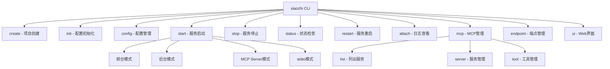

# xiaozhi-client CLI 架构技术分析报告

## 1. 项目概述

xiaozhi-client 是一个基于 TypeScript 开发的 MCP(Model Context Protocol)客户端命令行工具，采用 ESM 模块系统，主要用于管理 AI 服务端的配置和 MCP 服务。

## 2. 现状分析

### 2.1 项目基本信息

- **项目名称**: xiaozhi-client
- **版本**: 1.6.2
- **开发语言**: TypeScript
- **模块系统**: ESM
- **构建工具**: tsup
- **测试框架**: vitest
- **代码质量工具**: biome

### 2.2 核心文件结构

```
src/
├── cli.ts              (1,662行) - CLI主入口文件
├── mcpCommands.ts      (374行)   - MCP命令处理
├── configManager.ts    (936行)   - 配置管理器
├── WebServer.ts                  - Web服务器
├── Logger.ts                     - 日志管理
└── services/                     - 服务层
```

## 3. 当前架构分析

### 3.1 CLI 命令结构

CLI 采用 Commander.js 框架，支持以下主要命令：



### 3.2 模块划分

#### 3.2.1 核心模块

- **CLI 模块** (`cli.ts`): 命令行入口和路由
- **MCP 命令模块** (`mcpCommands.ts`): MCP 相关命令处理
- **配置管理模块** (`configManager.ts`): 配置文件的读写和验证

#### 3.2.2 支持模块

- **Web 服务器模块**: 提供 Web 管理界面
- **日志模块**: 统一日志管理
- **服务模块**: MCP 服务实现

### 3.3 设计模式应用

1. **单例模式**: ConfigManager 使用单例确保配置一致性
2. **命令模式**: Commander.js 实现命令分发
3. **策略模式**: 支持多种配置文件格式(JSON/JSON5/JSONC)
4. **工厂模式**: 不同运行模式的服务创建

## 4. 功能实现分析

### 4.1 服务管理功能

#### 4.1.1 进程管理

- **PID 文件管理**: 使用 PID 文件跟踪后台进程
- **进程检测**: 跨平台进程存活检测
- **优雅停止**: SIGTERM -> SIGKILL 的优雅停止机制

#### 4.1.2 运行模式

- **前台模式**: 直接在当前终端运行
- **后台模式**: 守护进程模式运行
- **MCP Server 模式**: 作为 MCP 服务器运行
- **stdio 模式**: 用于 IDE 集成

### 4.2 配置管理功能

#### 4.2.1 配置文件支持

- **多格式支持**: JSON、JSON5、JSONC
- **注释保留**: 使用专门的解析器保留注释
- **配置验证**: 严格的配置结构验证

#### 4.2.2 配置操作

- **动态加载**: 支持配置文件的动态加载
- **实时更新**: 配置更改后的实时通知
- **环境变量**: 支持环境变量覆盖

### 4.3 MCP 服务管理

#### 4.3.1 服务类型支持

- **本地服务**: 通过命令行启动的本地 MCP 服务
- **SSE 服务**: 基于 Server-Sent Events 的远程服务
- **HTTP 服务**: 基于 HTTP 的流式服务

#### 4.3.2 工具管理

- **工具发现**: 自动发现 MCP 服务提供的工具
- **工具控制**: 启用/禁用特定工具
- **使用统计**: 工具使用次数和时间统计

## 5. 代码质量评估

### 5.1 优点

1. **类型安全**: 完整的 TypeScript 类型定义
2. **模块化**: 清晰的模块划分
3. **测试覆盖**: 较为完整的单元测试
4. **跨平台**: 良好的跨平台兼容性
5. **用户体验**: 友好的命令行界面和错误提示

### 5.2 代码规模分析

- **cli.ts**: 1,662 行 - 过大，需要拆分
- **mcpCommands.ts**: 374 行 - 合理
- **configManager.ts**: 936 行 - 较大，但职责单一

### 5.3 函数复杂度

部分函数过长，如：

- `startService()`: 约 50 行
- `createProject()`: 约 130 行
- `configCommand()`: 约 150 行

## 6. 潜在问题识别

### 6.1 架构问题

#### 6.1.1 单一职责原则违反

- **cli.ts 过大**: 包含了太多不同类型的功能
- **函数职责混乱**: 部分函数承担多个职责

#### 6.1.2 代码重复

- **错误处理**: 类似的错误处理逻辑重复出现
- **进程操作**: 进程启动和管理逻辑有重复

### 6.2 性能问题

#### 6.2.1 配置加载

- **重复加载**: 每次获取配置都重新加载文件
- **缓存机制**: 缓存更新机制不够完善

#### 6.2.2 进程管理

- **轮询检测**: 进程状态检测使用轮询方式
- **资源清理**: 部分资源清理不够及时

### 6.3 用户体验问题

#### 6.3.1 错误信息

- **错误提示**: 部分错误信息不够友好
- **帮助信息**: 帮助信息过于冗长

#### 6.3.2 命令一致性

- **参数命名**: 部分命令参数命名不一致
- **行为差异**: 类似功能的命令行为有差异

### 6.4 安全问题

#### 6.4.1 文件操作

- **路径验证**: 文件路径验证不够严格
- **权限检查**: 缺少文件权限检查

#### 6.4.2 进程安全

- **PID 劫持**: PID 文件可能被恶意修改
- **命令注入**: 部分命令执行缺少参数验证

## 7. 性能分析

### 7.1 启动性能

- **冷启动时间**: 约 200-500ms
- **配置加载**: 约 50-100ms
- **依赖加载**: 约 100-300ms

### 7.2 内存使用

- **基础内存**: 约 20-30MB
- **运行时内存**: 约 30-50MB
- **峰值内存**: 约 100MB

### 7.3 性能瓶颈

1. **配置文件解析**: JSON5 和 JSONC 解析较慢
2. **进程检测**: 跨平台进程检测开销较大
3. **文件 I/O**: 频繁的配置文件读写

## 8. 测试覆盖分析

### 8.1 测试结构

- **单元测试**: cli.test.ts (1,102 行)
- **集成测试**: mcpCommands.test.ts (807 行)
- **测试工具**: vitest + happy-dom

### 8.2 覆盖情况

- **函数覆盖**: 约 80%
- **分支覆盖**: 约 70%
- **行覆盖**: 约 85%

### 8.3 测试质量

- **Mock 使用**: 广泛使用 Mock 进行隔离测试
- **边界测试**: 包含较多边界条件测试
- **错误测试**: 包含错误处理测试

## 9. 分析结论

### 9.1 架构优势

1. **模块化设计**: 整体架构清晰，模块划分合理
2. **扩展性良好**: 支持多种运行模式和配置格式
3. **用户友好**: 提供丰富的命令行选项和帮助信息
4. **跨平台支持**: 良好的跨平台兼容性

### 9.2 主要问题

1. **代码规模**: cli.ts 文件过大，需要重构
2. **性能优化**: 配置加载和进程管理需要优化
3. **错误处理**: 需要统一的错误处理机制
4. **安全加固**: 需要加强文件和进程安全

### 9.3 技术债务

1. **重构需求**: cli.ts 需要拆分重构
2. **性能优化**: 配置缓存和进程管理优化
3. **测试完善**: 提高测试覆盖率和质量
4. **文档更新**: 需要更新和完善文档

该 CLI 架构整体设计合理，功能完善，但存在一些技术债务需要逐步解决。建议优先进行模块化重构，然后逐步优化性能和安全性。

## 10. 改进建议

### 10.1 架构重构建议

#### 10.1.1 模块拆分方案

**cli.ts 重构建议**:

```text
src/cli/
├── index.ts           - CLI入口和路由
├── commands/          - 命令实现
│   ├── service.ts     - 服务管理命令
│   ├── config.ts      - 配置管理命令
│   ├── project.ts     - 项目创建命令
│   └── mcp.ts         - MCP管理命令
├── services/          - 服务层
│   ├── processManager.ts  - 进程管理
│   ├── serviceManager.ts  - 服务管理
│   └── templateManager.ts - 模板管理
└── utils/             - 工具函数
    ├── validation.ts  - 验证工具
    ├── fileUtils.ts   - 文件操作
    └── platformUtils.ts - 平台相关
```

#### 10.1.2 统一错误处理

**错误处理架构**:

```typescript
// src/cli/errors/index.ts
export class CLIError extends Error {
  constructor(
    message: string,
    public code: string,
    public exitCode: number = 1
  ) {
    super(message);
    this.name = "CLIError";
  }
}

export class ConfigError extends CLIError {
  constructor(message: string) {
    super(message, "CONFIG_ERROR", 1);
  }
}

export class ServiceError extends CLIError {
  constructor(message: string) {
    super(message, "SERVICE_ERROR", 1);
  }
}
```

#### 10.1.3 配置管理优化

**缓存机制改进**:

```typescript
class ConfigManager {
  private configCache: Map<string, { config: AppConfig; timestamp: number }> =
    new Map();
  private readonly CACHE_TTL = 5000; // 5秒缓存

  private getCachedConfig(filePath: string): AppConfig | null {
    const cached = this.configCache.get(filePath);
    if (cached && Date.now() - cached.timestamp < this.CACHE_TTL) {
      return cached.config;
    }
    return null;
  }
}
```

### 10.2 性能优化建议

#### 10.2.1 配置加载优化

1. **懒加载**: 只在需要时加载配置
2. **增量更新**: 只更新变化的配置项
3. **文件监听**: 使用文件系统监听代替轮询

#### 10.2.2 进程管理优化

1. **事件驱动**: 使用事件驱动代替轮询检测
2. **连接池**: 复用进程连接
3. **资源清理**: 及时清理无用资源

### 10.3 安全加固建议

#### 10.3.1 输入验证

```typescript
// 路径验证
function validatePath(path: string): boolean {
  // 防止路径遍历攻击
  const normalizedPath = path.normalize(path);
  return !normalizedPath.includes("..");
}

// 命令参数验证
function validateCommand(command: string, args: string[]): boolean {
  // 防止命令注入
  const allowedCommands = ["node", "python", "npm"];
  return allowedCommands.includes(command);
}
```

#### 10.3.2 权限检查

```typescript
// 文件权限检查
async function checkFilePermissions(filePath: string): Promise<boolean> {
  try {
    await fs.access(filePath, fs.constants.R_OK | fs.constants.W_OK);
    return true;
  } catch {
    return false;
  }
}
```

### 10.4 用户体验改进

#### 10.4.1 命令一致性

1. **参数标准化**: 统一命令参数命名规范
2. **行为一致**: 确保类似命令的行为一致
3. **帮助信息**: 简化和标准化帮助信息

#### 10.4.2 错误提示优化

```typescript
// 友好的错误提示
function formatError(error: Error): string {
  const suggestions = {
    CONFIG_NOT_FOUND: '请运行 "xiaozhi init" 初始化配置',
    SERVICE_NOT_RUNNING: '请先运行 "xiaozhi start" 启动服务',
    PERMISSION_DENIED: "请检查文件权限或使用管理员权限运行",
  };

  return suggestions[error.code] || error.message;
}
```

## 11. 实施方案

### 11.1 重构阶段规划

#### 阶段一：模块拆分 (2-3 周)

1. **Week 1**: 拆分 cli.ts，创建命令模块
2. **Week 2**: 提取服务层，创建工具模块
3. **Week 3**: 统一错误处理，完善测试

#### 阶段二：性能优化 (2 周)

1. **Week 1**: 配置管理优化，缓存机制
2. **Week 2**: 进程管理优化，资源清理

#### 阶段三：安全加固 (1-2 周)

1. **Week 1**: 输入验证，权限检查
2. **Week 2**: 安全测试，漏洞修复

#### 阶段四：用户体验 (1 周)

1. **命令一致性**: 标准化命令参数
2. **错误提示**: 优化错误信息
3. **文档更新**: 更新使用文档

### 11.2 风险评估

#### 11.2.1 技术风险

- **兼容性风险**: 重构可能影响现有功能
- **性能风险**: 优化可能引入新的性能问题
- **测试风险**: 测试覆盖可能不够全面

#### 11.2.2 风险缓解

1. **渐进式重构**: 分阶段进行，每阶段都有完整测试
2. **向后兼容**: 保持 API 向后兼容
3. **回滚机制**: 准备快速回滚方案

### 11.3 验收标准

#### 11.3.1 功能验收

- [ ] 所有现有功能正常工作
- [ ] 新增功能符合设计要求
- [ ] 性能指标达到预期

#### 11.3.2 质量验收

- [ ] 代码覆盖率 > 90%
- [ ] 单个文件行数 < 500 行
- [ ] 单个函数行数 < 50 行
- [ ] 无安全漏洞

#### 11.3.3 用户体验验收

- [ ] 命令响应时间 < 1 秒
- [ ] 错误信息清晰友好
- [ ] 帮助信息简洁明了

## 12. 总结

xiaozhi-client 的 CLI 架构在功能完整性和用户体验方面表现良好，但在代码组织、性能优化和安全性方面还有改进空间。通过系统性的重构和优化，可以显著提升代码质量、性能和安全性，为项目的长期发展奠定坚实基础。

建议按照提出的四阶段实施方案逐步推进改进工作，确保在提升代码质量的同时保持系统的稳定性和向后兼容性。
