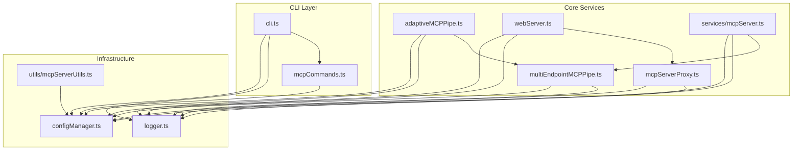
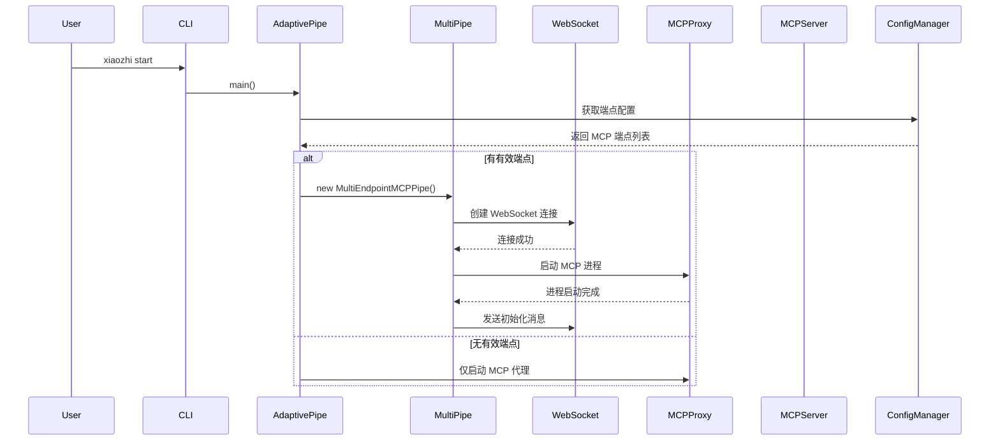
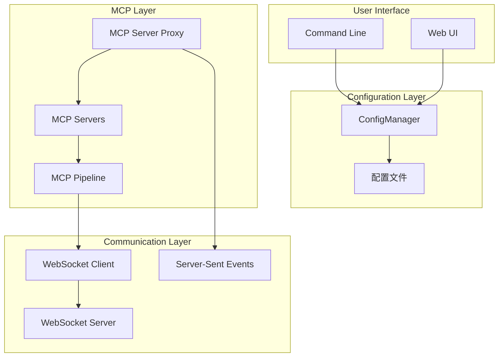
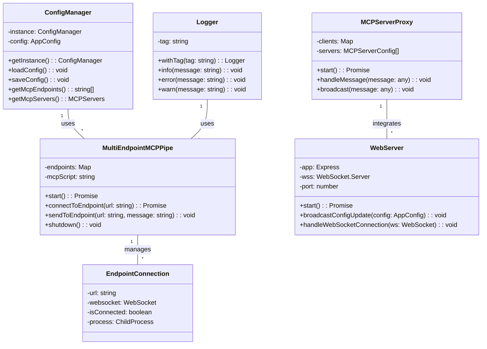

# xiaozhi-client 代码架构文档

## 项目概述

xiaozhi-client 是一个基于 Node.js 的 MCP (Model Context Protocol) 客户端，支持多端点连接和配置管理。项目采用模块化架构，包含 CLI 工具、配置管理、Web 界面和多端点 MCP 管道等核心组件。

## 项目结构

```
src/
├── cli.ts                    # CLI 主入口
├── adaptiveMCPPipe.ts        # 自适应 MCP 管道选择器
├── multiEndpointMCPPipe.ts   # 多端点 MCP 管道实现
├── mcpServerProxy.ts         # MCP 服务器代理聚合器
├── configManager.ts          # 配置管理器
├── webServer.ts              # Web UI 服务器
├── logger.ts                 # 日志工具
├── mcpCommands.ts            # MCP 相关 CLI 命令
├── services/
│   └── mcpServer.ts          # 独立 MCP 服务器
└── utils/
    └── mcpServerUtils.ts     # MCP 服务器工具函数
```

## 核心架构图

### 1. 文件依赖关系图



### 2. 模块调用流程图



### 3. 数据流架构图



### 4. 类关系图



## 模块详细说明

### 1. CLI 模块 (cli.ts)

**职责**: 提供命令行接口，管理服务的生命周期

**主要功能**:
- 服务启动/停止/重启/状态检查
- 配置管理命令
- Web UI 管理
- 守护进程模式支持

**关键代码**:
```typescript
// 服务启动命令
program
  .command("start")
  .option("-d, --daemon", "在后台运行服务")
  .action(async (options) => {
    await startService(options.daemon);
  });
```

### 2. 配置管理器 (configManager.ts)

**职责**: 统一管理应用配置，支持多种格式

**主要功能**:
- JSON/JSON5/JSONC 格式支持
- 配置热更新
- 动态配置修改
- 配置文件注释保留

**关键代码**:
```typescript
public static getInstance(): ConfigManager {
  if (!ConfigManager.instance) {
    ConfigManager.instance = new ConfigManager();
  }
  return ConfigManager.instance;
}
```

### 3. 多端点 MCP 管道 (multiEndpointMCPPipe.ts)

**职责**: 管理多个 MCP 服务端点的连接和通信

**主要功能**:
- 多 WebSocket 连接管理
- 自动重连机制
- 心跳检测
- 进程管理

**关键代码**:
```typescript
interface EndpointConnection {
  url: string;
  websocket: WebSocket | null;
  isConnected: boolean;
  reconnectAttempt: number;
  process: ChildProcess | null;
  stdoutBuffer: string;
}
```

### 4. MCP 服务器代理 (mcpServerProxy.ts)

**职责**: MCP 服务器的聚合代理，支持多种通信协议

**主要功能**:
- JSON-RPC 2.0 协议实现
- 多服务器类型支持 (stdio, SSE, HTTP)
- 工具发现和注册
- 消息路由

**关键代码**:
```typescript
export class MCPServerProxy {
  private clients: Map<string, MCPClient> = new Map();
  private servers: Map<string, MCPServerConfig> = new Map();
  private tools: Map<string, ToolInfo> = new Map();
}
```

### 5. Web 服务器 (webServer.ts)

**职责**: 提供 Web UI 和 REST API 接口

**主要功能**:
- 静态文件服务
- WebSocket 实时通信
- 配置动态更新
- 状态监控

**关键代码**:
```typescript
private broadcastConfigUpdate(config: AppConfig): void {
  const message = {
    type: 'configUpdate',
    data: config
  };
  this.wss.clients.forEach(client => {
    if (client.readyState === WebSocket.OPEN) {
      client.send(JSON.stringify(message));
    }
  });
}
```

### 6. 独立 MCP 服务器 (services/mcpServer.ts)

**职责**: 提供独立的 MCP 服务端

**主要功能**:
- SSE 端点支持
- MCP 协议实现
- 客户端连接管理
- 进程生命周期管理

**架构特点**:
- 基于 Express.js 的 HTTP 服务器
- 支持 Server-Sent Events
- 与 MCP 代理进程集成

## 通信协议

### 1. WebSocket 通信

**连接流程**:
1. 客户端发起 WebSocket 连接到服务端点
2. 建立连接后发送初始化消息
3. 服务端返回工具列表和能力
4. 进入消息循环，处理 JSON-RPC 2.0 消息

**消息格式**:
```json
{
  "jsonrpc": "2.0",
  "id": "unique-id",
  "method": "tools/call",
  "params": {
    "name": "tool-name",
    "arguments": {}
  }
}
```

### 2. Server-Sent Events

**端点结构**:
- `/sse` - SSE 连接端点
- `/messages?sessionId={id}` - 消息发送端点

**事件类型**:
- `endpoint` - 端点信息
- `message` - MCP 消息

### 3. 进程间通信

**stdio 模式**:
- 标准输入接收 JSON-RPC 消息
- 标准输出返回响应
- 标准错误输出日志

## 配置架构

### 配置结构

```typescript
interface AppConfig {
  mcpServers: Record<string, MCPServerConfig>;
  mcpEndpoints: string[];
  connection: {
    heartbeatInterval: number;
    heartbeatTimeout: number;
    reconnectInterval: number;
  };
  webUI: {
    port: number;
    host: string;
  };
}
```

### 配置示例

```json5
{
  "mcpServers": {
    "calculator": {
      "command": "node",
      "args": ["./mcpServers/calculator.js"]
    },
    "weather": {
      "type": "streamable-http",
      "url": "https://api.weather.com/mcp"
    }
  },
  "mcpEndpoints": [
    "wss://xiaozhi.me/mcp"
  ],
  "connection": {
    "heartbeatInterval": 30000,
    "heartbeatTimeout": 10000,
    "reconnectInterval": 5000
  }
}
```

## 部署架构

### 1. 单机部署

```
┌─────────────────┐    ┌─────────────────┐
│   CLI Client    │    │   Web UI        │
│   (cli.ts)      │    │   (webServer)   │
└─────────┬───────┘    └─────────┬───────┘
          │                      │
          └───────────┬──────────┘
                      │
          ┌───────────┴──────────┐
          │   MCP Pipeline       │
          │   (adaptiveMCPPipe)  │
          └───────────┬──────────┘
                      │
          ┌───────────┴──────────┐
          │   MCP Server Proxy   │
          │   (mcpServerProxy)   │
          └───────────┬──────────┘
                      │
          ┌───────────┴──────────┐
          │   MCP Services       │
          │   (External Tools)   │
          └──────────────────────┘
```

### 2. 多端点部署

支持同时连接多个 MCP 服务端点，实现负载均衡和故障转移。

## 安全考虑

### 1. 配置安全
- 配置文件支持注释，便于维护
- 敏感信息通过环境变量配置
- 路径验证防止路径遍历攻击

### 2. 进程安全
- 子进程超时保护
- 信号处理确保优雅关闭
- 资源清理机制

### 3. 网络安全
- WebSocket 连接验证
- CORS 配置
- 输入验证和清理

## 性能优化

### 1. 连接管理
- 连接池管理
- 自动重连机制
- 心跳检测

### 2. 资源管理
- 进程生命周期管理
- 内存使用优化
- 日志轮转

### 3. 缓存策略
- 配置缓存
- 连接状态缓存
- 工具信息缓存

## 扩展性设计

### 1. 插件架构
- 支持自定义 MCP 服务器
- 动态工具注册
- 配置热更新

### 2. 协议扩展
- 支持多种通信协议
- 可扩展的消息格式
- 向后兼容性

### 3. UI 扩展
- 模块化前端组件
- API 驱动的界面
- 主题支持

## 监控和调试

### 1. 日志系统
- 分级日志记录
- 结构化日志格式
- 文件和网络日志

### 2. 健康检查
- HTTP 健康检查端点
- 连接状态监控
- 性能指标收集

### 3. 调试工具
- 详细的错误信息
- 配置验证
- 连接诊断

## 总结

xiaozhi-client 采用分层架构设计，具备良好的可扩展性和可维护性。通过模块化设计，支持多种通信协议和服务端点，为 MCP 协议提供了完整的客户端实现。架构设计充分考虑了安全性、性能和可扩展性，适合在生产环境中部署使用。