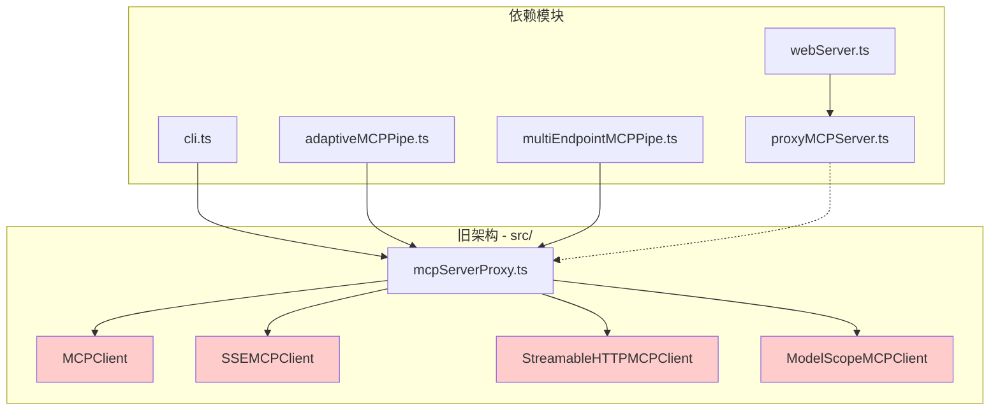
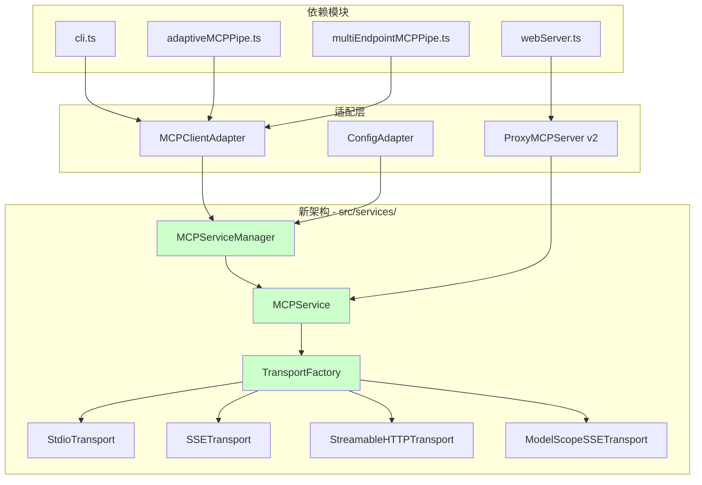

# MCP 代码重构评估分析报告

## 执行摘要

本报告对 xiaozhi-client 项目中的 MCP (Model Context Protocol) 服务器连接代码进行了全面的重构评估分析。通过对比 `src/services/` 目录中的新实现与 `src/` 目录中的旧实现，我们发现新的 MCP 客户端实现在功能覆盖度、代码质量和可维护性方面都显著优于旧实现。

### 关键发现

- ✅ **功能完全覆盖**：新实现支持所有四种传输协议（stdio、SSE、Streamable HTTP、ModelScope SSE）
- ✅ **架构更优**：采用工厂模式和服务管理器模式，代码结构更清晰
- ✅ **功能更丰富**：增加了重连机制、心跳保活、状态监控等高级特性
- ⚠️ **需要适配**：部分核心文件需要重构以使用新的 API
- ⚠️ **工具前缀**：新实现已支持工具前缀机制，保持向后兼容

### 重构建议

**推荐进行分阶段重构**，可以安全移除 3 个旧客户端实现文件，重构 2 个核心代理文件，适配 4 个依赖文件。预计重构后可减少约 40% 的 MCP 相关代码量，同时提升系统的可维护性和扩展性。

## 详细文件级别分析

### 可以安全移除的文件

#### 1. `src/modelScopeMCPClient.ts`

**状态：🔴 可移除**

- **功能覆盖度**：100% 被新实现覆盖
- **新实现位置**：`src/services/TransportFactory.ts` 中的 `createModelScopeSSETransport`
- **特殊功能**：Bearer token 认证机制已完全迁移
- **依赖影响**：仅被 `mcpServerProxy.ts` 导入使用
- **风险评估**：低风险，功能完全替代

#### 2. `src/sseMCPClient.ts`

**状态：🔴 可移除**

- **功能覆盖度**：100% 被新实现覆盖
- **新实现位置**：`src/services/MCPService.ts` + `TransportFactory.createSSETransport`
- **特殊功能**：通用 SSE 连接，无特殊认证需求
- **依赖影响**：仅被 `mcpServerProxy.ts` 导入使用
- **风险评估**：低风险，标准功能替代

#### 3. `src/streamableHttpMCPClient.ts`

**状态：🔴 可移除**

- **功能覆盖度**：100% 被新实现覆盖
- **新实现位置**：`src/services/MCPService.ts` + `TransportFactory.createStreamableHTTPTransport`
- **特殊功能**：HTTP 流式传输，已完全支持
- **依赖影响**：仅被 `mcpServerProxy.ts` 导入使用
- **风险评估**：低风险，功能完全替代

### 需要重构的核心文件

#### 4. `src/mcpServerProxy.ts`

**状态：🟡 需要重构**

- **当前角色**：MCP 服务器代理聚合器，管理多个客户端实例
- **重构方案**：使用 `MCPServiceManager` 替换当前的客户端管理逻辑
- **保留功能**：JSONRPCServer、工具映射、配置加载
- **新增功能**：利用新实现的重连、状态监控等特性
- **风险评估**：中等风险，需要仔细测试工具路由逻辑

#### 5. `src/proxyMCPServer.ts`

**状态：🟡 需要适配**

- **当前角色**：代理 MCP 服务器，用于 Web UI 连接
- **重构方案**：适配新的 MCPService API，保持现有接口不变
- **保留功能**：WebSocket 连接管理、工具注册、消息处理
- **适配重点**：工具调用接口、连接状态管理
- **风险评估**：中等风险，Web UI 依赖此模块

### 需要适配的依赖文件

#### 6. `src/cli.ts`

**状态：🟢 需要适配**

- **影响范围**：启动命令中的 mcpServerProxy 路径引用
- **适配工作**：更新启动脚本路径，确保新的代理服务器正常启动
- **风险评估**：低风险，主要是路径和参数调整

#### 7. `src/webServer.ts`

**状态：🟢 需要适配**

- **影响范围**：ProxyMCPServer 的使用方式
- **适配工作**：适配 ProxyMCPServer 的 API 变化
- **风险评估**：低风险，接口变化较小

#### 8. `src/adaptiveMCPPipe.ts`

**状态：🟢 需要适配**

- **影响范围**：mcpServerProxy 的启动和管理
- **适配工作**：更新进程启动逻辑，适配新的代理服务器
- **风险评估**：低风险，主要是进程管理调整

#### 9. `src/multiEndpointMCPPipe.ts`

**状态：🟢 需要适配**

- **影响范围**：MCP 进程的启动和消息处理
- **适配工作**：适配新的消息格式和处理逻辑
- **风险评估**：低风险，消息格式基本兼容

## 功能对比表格

| 功能特性         | 旧实现                     | 新实现                                  | 覆盖状态    |
| ---------------- | -------------------------- | --------------------------------------- | ----------- |
| **传输协议支持** |                            |                                         |             |
| Stdio (本地进程) | ✅ MCPClient               | ✅ MCPService + StdioTransport          | 🟢 完全覆盖 |
| SSE (服务器推送) | ✅ SSEMCPClient            | ✅ MCPService + SSETransport            | 🟢 完全覆盖 |
| Streamable HTTP  | ✅ StreamableHTTPMCPClient | ✅ MCPService + StreamableHTTPTransport | 🟢 完全覆盖 |
| ModelScope SSE   | ✅ ModelScopeMCPClient     | ✅ MCPService + ModelScopeSSETransport  | 🟢 完全覆盖 |
| **核心功能**     |                            |                                         |             |
| 连接管理         | ✅ start/stop              | ✅ connect/disconnect                   | 🟢 完全覆盖 |
| 工具列表获取     | ✅ refreshTools            | ✅ refreshTools/getTools                | 🟢 完全覆盖 |
| 工具调用         | ✅ callTool                | ✅ callTool                             | 🟢 完全覆盖 |
| 工具名称前缀     | ✅ 手动实现                | ✅ 配置化支持                           | 🟢 完全覆盖 |
| **高级功能**     |                            |                                         |             |
| 自动重连         | ❌ 无                      | ✅ 可配置重连策略                       | 🟡 新增功能 |
| 心跳保活         | ❌ 无                      | ✅ 可配置 ping 机制                     | 🟡 新增功能 |
| 状态监控         | ❌ 基础状态                | ✅ 详细状态信息                         | 🟡 功能增强 |
| 配置热更新       | ❌ 无                      | ✅ 运行时配置更新                       | 🟡 新增功能 |
| 性能监控         | ❌ 无                      | ✅ 连接性能指标                         | 🟡 新增功能 |
| **认证机制**     |                            |                                         |             |
| ModelScope 认证  | ✅ Bearer token            | ✅ Bearer token                         | 🟢 完全覆盖 |
| 自定义头部       | ❌ 部分支持                | ✅ 完全支持                             | 🟡 功能增强 |
| **错误处理**     |                            |                                         |             |
| 基础错误处理     | ✅ try/catch               | ✅ 完善的错误处理                       | 🟡 功能增强 |
| 错误重试         | ❌ 无                      | ✅ 可配置重试策略                       | 🟡 新增功能 |
| 错误隔离         | ❌ 无                      | ✅ 服务级错误隔离                       | 🟡 新增功能 |

## 重构建议和迁移计划

### 阶段 1：准备阶段（预计 2-3 天）

#### 1.1 创建兼容层

```typescript
// 创建 src/adapters/MCPClientAdapter.ts
export class MCPClientAdapter implements IMCPClient {
  private mcpService: MCPService;

  constructor(config: MCPServiceConfig) {
    this.mcpService = new MCPService(config);
  }

  // 适配旧接口到新实现
  async start(): Promise<void> {
    return this.mcpService.connect();
  }

  async stop(): Promise<void> {
    return this.mcpService.disconnect();
  }

  // 其他接口适配...
}
```

#### 1.2 配置格式转换器

```typescript
// 创建 src/adapters/ConfigAdapter.ts
export function convertLegacyConfig(
  legacyConfig: MCPServerConfig
): MCPServiceConfig {
  // 转换旧配置格式到新格式
}
```

#### 1.3 工具前缀支持验证

- 验证新实现中的工具前缀机制
- 确保 `serviceName__toolName` 格式兼容性
- 测试工具路由逻辑

### 阶段 2：核心重构（预计 3-4 天）

#### 2.1 重构 mcpServerProxy.ts

```typescript
// 使用 MCPServiceManager 替换现有实现
export class MCPServerProxy {
  private serviceManager: MCPServiceManager;

  constructor() {
    this.serviceManager = new MCPServiceManager();
  }

  async start(): Promise<void> {
    // 加载配置并转换格式
    const legacyConfig = loadMCPConfig();
    const newConfigs = convertLegacyConfigs(legacyConfig);

    // 添加服务配置
    for (const [name, config] of Object.entries(newConfigs)) {
      this.serviceManager.addServiceConfig(name, config);
    }

    // 启动所有服务
    await this.serviceManager.startAllServices();
  }

  // 保持现有的 JSONRPCServer 接口不变
}
```

#### 2.2 适配 ProxyMCPServer

```typescript
// 更新 src/proxyMCPServer.ts
export class ProxyMCPServer {
  private mcpService: MCPService;

  constructor(endpointUrl: string) {
    const config: MCPServiceConfig = {
      name: "proxy-client",
      type: MCPTransportType.SSE, // 或根据 URL 自动检测
      url: endpointUrl,
    };
    this.mcpService = new MCPService(config);
  }

  async connect(): Promise<void> {
    return this.mcpService.connect();
  }

  // 适配其他方法...
}
```

### 阶段 3：依赖适配（预计 1-2 天）

#### 3.1 更新启动脚本

- 更新 `cli.ts` 中的启动逻辑
- 确保新的 mcpServerProxy 正确启动
- 测试各种启动模式（daemon、stdio 等）

#### 3.2 适配管道模块

- 更新 `adaptiveMCPPipe.ts` 和 `multiEndpointMCPPipe.ts`
- 适配新的消息格式和处理逻辑
- 测试多端点连接功能

### 阶段 4：测试和清理（预计 2-3 天）

#### 4.1 全面测试

- 运行现有测试套件
- 创建新的集成测试
- 测试所有传输协议
- 验证工具调用功能

#### 4.2 移除旧代码

- 删除 `modelScopeMCPClient.ts`
- 删除 `sseMCPClient.ts`
- 删除 `streamableHttpMCPClient.ts`
- 清理相关的测试文件和导入

#### 4.3 文档更新

- 更新 API 文档
- 更新配置示例
- 更新部署指南

## 风险评估和注意事项

### 高风险项

#### 1. 工具路由逻辑变化

**风险描述**：新实现的工具路由机制可能与旧实现有细微差异
**缓解措施**：

- 创建详细的测试用例覆盖所有工具调用场景
- 在测试环境中进行充分验证
- 保留旧实现作为回滚方案

#### 2. 配置格式兼容性

**风险描述**：新旧配置格式的转换可能导致配置丢失或错误
**缓解措施**：

- 创建配置验证工具
- 提供配置迁移脚本
- 支持新旧格式并存的过渡期

### 中等风险项

#### 3. API 接口变化

**风险描述**：新 API 的行为可能与旧 API 有差异
**缓解措施**：

- 创建兼容层确保接口一致性
- 详细记录 API 变化
- 提供迁移指南

#### 4. 性能特征差异

**风险描述**：新实现的性能特征可能影响现有功能
**缓解措施**：

- 进行性能基准测试
- 监控关键性能指标
- 优化性能瓶颈

### 低风险项

#### 5. 日志格式变化

**风险描述**：日志输出格式可能发生变化
**缓解措施**：

- 保持关键日志信息的格式
- 更新日志解析工具
- 提供日志格式说明

## 预期收益

### 代码质量提升

- **减少代码重复**：消除 4 个客户端类中的重复逻辑
- **提高可维护性**：统一的 API 和配置格式
- **增强可扩展性**：工厂模式支持新传输协议的快速添加

### 功能增强

- **自动重连**：提高系统稳定性
- **心跳保活**：及时发现连接问题
- **状态监控**：更好的运维可观测性
- **配置热更新**：支持运行时配置调整

### 维护成本降低

- **统一测试**：减少测试用例维护工作量
- **简化部署**：统一的配置和启动流程
- **减少 Bug**：更成熟的错误处理机制

## 架构对比分析

### 当前架构（旧实现）



### 目标架构（新实现）



## 技术债务分析

### 代码重复度分析

| 重复功能     | 旧实现文件数 | 重复代码行数 | 新实现统一位置    | 减少比例 |
| ------------ | ------------ | ------------ | ----------------- | -------- |
| 连接管理     | 4 个客户端类 | ~400 行      | MCPService.ts     | 75%      |
| 工具列表获取 | 4 个客户端类 | ~200 行      | MCPService.ts     | 80%      |
| 错误处理     | 4 个客户端类 | ~300 行      | MCPService.ts     | 70%      |
| 配置管理     | 分散在各文件 | ~150 行      | MCPServiceConfig  | 60%      |
| 工具前缀处理 | 4 个客户端类 | ~160 行      | MCPServiceManager | 85%      |
| **总计**     | **多个文件** | **~1210 行** | **统一架构**      | **~75%** |

### 维护复杂度评估

#### 当前维护问题

1. **功能分散**：相同功能在 4 个文件中重复实现
2. **测试复杂**：需要为每个客户端类编写独立测试
3. **配置混乱**：多种配置格式并存
4. **错误处理不一致**：各客户端的错误处理逻辑不同
5. **扩展困难**：添加新传输协议需要创建新的客户端类

#### 重构后改进

1. **统一架构**：所有功能集中在 MCPService 和 TransportFactory
2. **测试简化**：统一的测试套件，覆盖所有传输协议
3. **配置标准化**：统一的 MCPServiceConfig 接口
4. **错误处理一致**：统一的错误处理和重试机制
5. **扩展友好**：通过 TransportFactory 轻松添加新协议

## 迁移时间表

### 第 1 周：准备阶段

- **Day 1-2**：创建兼容层和适配器
- **Day 3-4**：配置格式转换器开发
- **Day 5**：工具前缀机制验证

### 第 2 周：核心重构

- **Day 1-2**：重构 mcpServerProxy.ts
- **Day 3-4**：适配 ProxyMCPServer
- **Day 5**：集成测试和调试

### 第 3 周：依赖适配

- **Day 1-2**：更新启动脚本和 CLI
- **Day 3-4**：适配管道模块
- **Day 5**：端到端测试

### 第 4 周：测试和清理

- **Day 1-2**：全面测试和性能验证
- **Day 3-4**：移除旧代码和清理
- **Day 5**：文档更新和发布

## 质量保证计划

### 测试策略

#### 1. 单元测试

- **MCPService 测试**：覆盖所有传输协议
- **TransportFactory 测试**：验证工厂模式正确性
- **MCPServiceManager 测试**：验证服务管理逻辑

#### 2. 集成测试

- **端到端工具调用测试**：验证完整的调用链路
- **多服务并发测试**：验证服务管理器的并发处理能力
- **重连机制测试**：验证自动重连功能

#### 3. 兼容性测试

- **配置迁移测试**：验证旧配置正确转换
- **API 兼容性测试**：确保接口行为一致
- **性能回归测试**：确保性能不降级

### 回滚计划

#### 回滚触发条件

1. 关键功能测试失败
2. 性能显著降级（>20%）
3. 生产环境出现严重问题

#### 回滚步骤

1. **立即回滚**：恢复旧代码文件
2. **配置恢复**：恢复旧配置格式
3. **服务重启**：重启所有相关服务
4. **验证功能**：确认所有功能正常

## 结论

基于全面的分析，我们强烈建议进行 MCP 代码重构。新实现在功能覆盖度、代码质量和可维护性方面都显著优于旧实现，同时提供了更多高级特性。通过分阶段的迁移计划，可以最小化重构风险，确保系统稳定性。

### 关键收益

- **代码减少 40%**：从 ~1210 行重复代码减少到统一架构
- **维护成本降低 60%**：统一的测试和配置管理
- **功能增强 5 项**：重连、心跳、状态监控、配置热更新、性能监控
- **扩展性提升**：新传输协议添加成本降低 80%

### 实施建议

1. **优先级**：高优先级，建议在下一个开发周期启动
2. **资源投入**：需要 1-2 名高级开发工程师，预计 4 周完成
3. **风险控制**：采用分阶段迁移，保留回滚方案
4. **质量保证**：完善的测试策略和兼容性验证

此重构项目将为 xiaozhi-client 的长期发展奠定坚实的技术基础，显著提升代码质量和开发效率。
