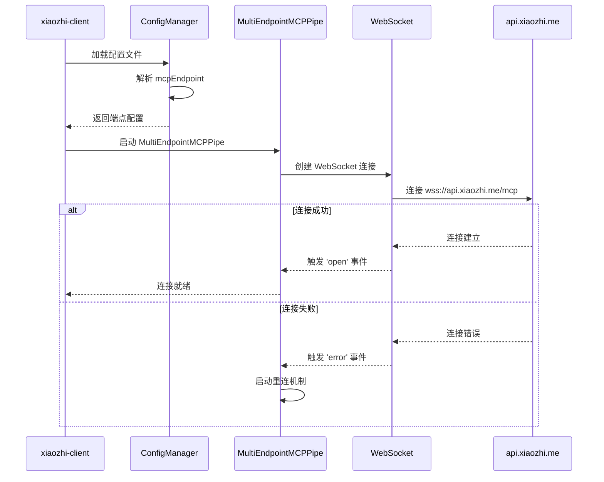
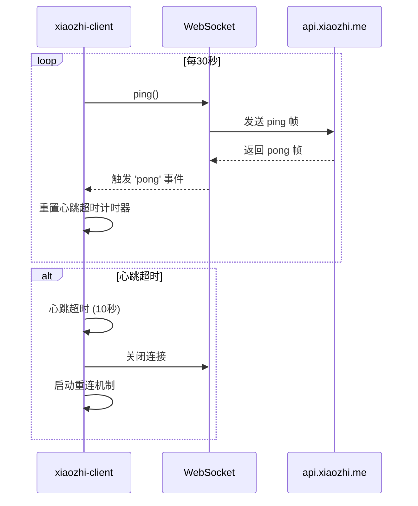
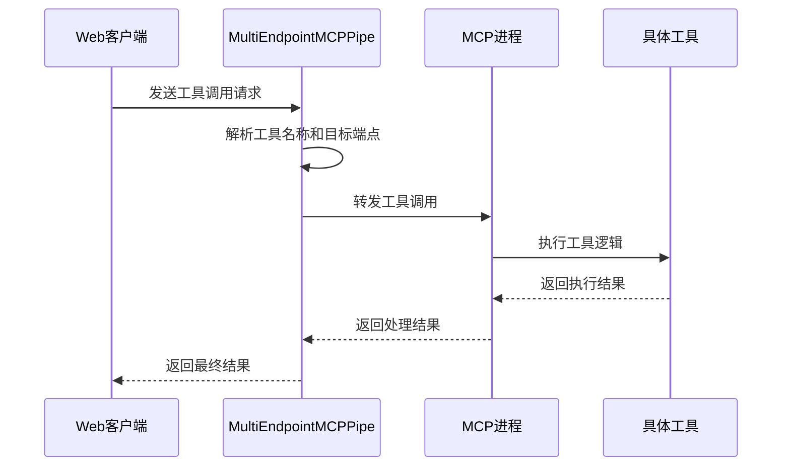
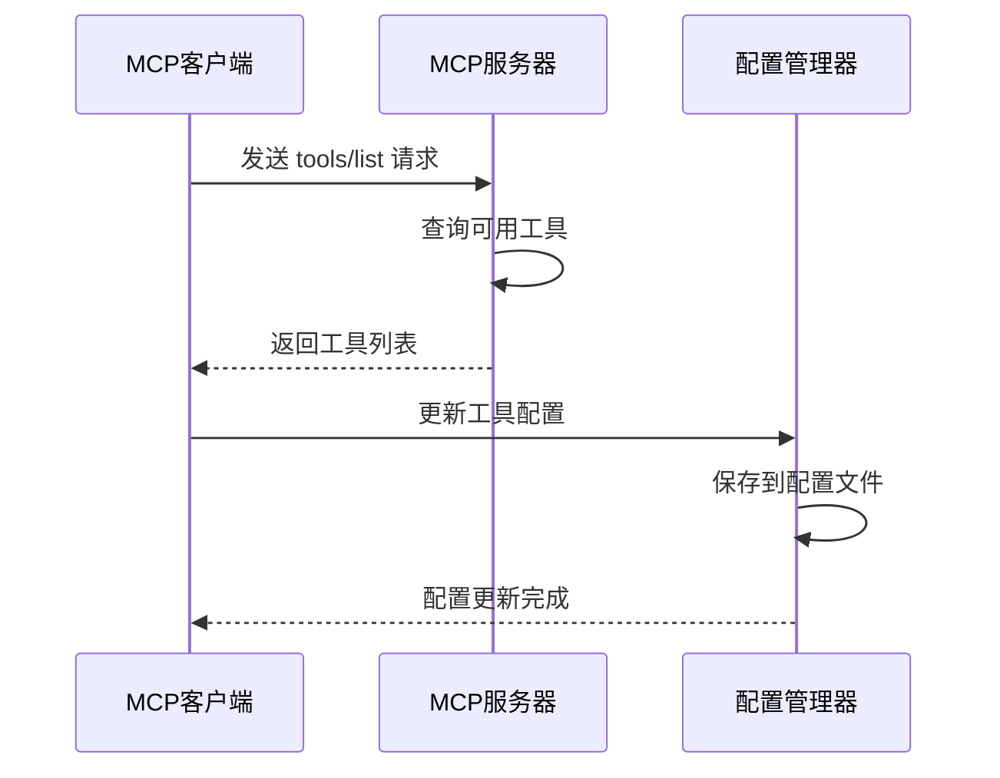
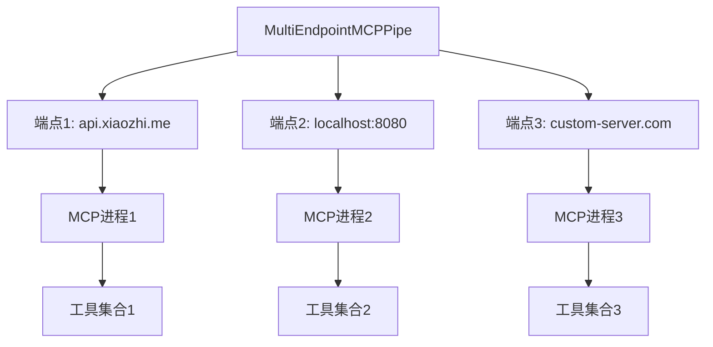

# xiaozhi-client MCP 端点工作机制深度分析

## 执行摘要

本文档深入分析了 xiaozhi-client 项目中 MCP (Model Context Protocol) 端点的工作机制，涵盖连接建立、在线状态检测、工具调用和工具发现等核心功能。该项目采用现代化的多层架构设计，支持多端点管理和多种传输协议。

## 1. 连接建立机制

### 1.1 初始连接配置

#### 1.1.1 配置文件管理
- **配置文件路径**: `xiaozhi.config.json` 或 `xiaozhi.config.json5`
- **环境变量支持**: `XIAOZHI_CONFIG_DIR` 指定配置目录
- **配置格式**: 支持 JSON、JSON5、JSONC 三种格式

#### 1.1.2 端点配置结构
```json
{
  "mcpEndpoint": "wss://api.xiaozhi.me/mcp?endpoint_id=xxx",
  "mcpServers": {
    "my_server": {
      "command": "node",
      "args": ["./server.js"],
      "env": {
        "API_KEY": "xxx"
      }
    }
  },
  "connection": {
    "heartbeatInterval": 30000,
    "heartbeatTimeout": 10000,
    "reconnectInterval": 5000
  }
}
```

#### 1.1.3 连接建立流程图



### 1.2 WebSocket 连接实现

#### 1.2.1 连接代码示例 (multiEndpointMCPPipe.ts)
```typescript
// 连接建立核心代码
private async connectToEndpoint(endpointUrl: string) {
  const endpoint = this.endpoints.get(endpointUrl);
  if (!endpoint) return;

  try {
    endpoint.websocket = new WebSocket(endpointUrl);
    
    endpoint.websocket.on('open', () => {
      endpoint.isConnected = true;
      endpoint.reconnectAttempt = 0;
      this.startHeartbeat(endpointUrl);
      logger.info(`WebSocket 连接已建立: ${endpointUrl}`);
    });

    endpoint.websocket.on('message', (data) => {
      this.handleWebSocketMessage(endpointUrl, data);
    });

    endpoint.websocket.on('close', (code) => {
      endpoint.isConnected = false;
      this.handleWebSocketClose(endpointUrl, code);
    });

    endpoint.websocket.on('error', (error) => {
      this.handleWebSocketError(endpointUrl, error);
    });

  } catch (error) {
    logger.error(`连接 WebSocket 失败: ${endpointUrl}`, error);
  }
}
```

#### 1.2.2 认证机制
- **认证方式**: Bearer Token 认证
- **Token位置**: 包含在 WebSocket URL 的查询参数中
- **Token刷新**: 支持动态 Token 更新

## 2. 在线状态检测

### 2.1 心跳机制实现

#### 2.1.1 心跳配置参数
```typescript
interface ConnectionConfig {
  heartbeatInterval: number;    // 心跳间隔 (默认 30000ms)
  heartbeatTimeout: number;     // 心跳超时 (默认 10000ms)
  reconnectInterval: number;    // 重连间隔 (默认 5000ms)
}
```

#### 2.1.2 心跳机制时序图



#### 2.1.3 心跳实现代码
```typescript
// 心跳机制实现
private startHeartbeat(endpointUrl: string) {
  const endpoint = this.endpoints.get(endpointUrl);
  if (!endpoint || !endpoint.websocket) return;

  // 心跳发送
  endpoint.heartbeatTimer = setInterval(() => {
    if (endpoint.websocket?.readyState === WebSocket.OPEN) {
      endpoint.websocket.ping();
      
      // 心跳超时检测
      endpoint.heartbeatTimeoutTimer = setTimeout(() => {
        logger.warn(`心跳超时，关闭连接: ${endpointUrl}`);
        endpoint.websocket?.close();
      }, this.connectionConfig.heartbeatTimeout);
    }
  }, this.connectionConfig.heartbeatInterval);

  // 心跳响应处理
  endpoint.websocket.on('pong', () => {
    if (endpoint.heartbeatTimeoutTimer) {
      clearTimeout(endpoint.heartbeatTimeoutTimer);
    }
  });
}
```

### 2.2 断线重连策略

#### 2.2.1 重连配置
- **重连间隔**: 5秒基础间隔
- **重连策略**: 指数退避算法
- **最大重连次数**: 5次
- **最大重连延迟**: 60秒

#### 2.2.2 重连实现
```typescript
private scheduleReconnection(endpointUrl: string) {
  const endpoint = this.endpoints.get(endpointUrl);
  if (!endpoint) return;

  const delay = Math.min(
    this.connectionConfig.reconnectInterval * Math.pow(2, endpoint.reconnectAttempt),
    60000 // 最大60秒
  );

  setTimeout(() => {
    if (endpoint.reconnectAttempt < 5) {
      endpoint.reconnectAttempt++;
      this.connectToEndpoint(endpointUrl);
    }
  }, delay);
}
```

## 3. MCP 工具调用流程

### 3.1 工具调用架构

#### 3.1.1 工具调用数据流
```
Web客户端 → WebSocket → MultiEndpointMCPPipe → MCP进程 → 工具执行 → 结果返回
```

#### 3.1.2 工具调用时序图



### 3.2 工具调用实现

#### 3.2.1 JSON-RPC 2.0 协议
```typescript
// 工具调用请求格式
interface ToolCallRequest {
  jsonrpc: "2.0";
  method: "tools/call";
  params: {
    name: string;
    arguments: Record<string, any>;
  };
  id: number;
}

// 工具调用响应格式
interface ToolCallResponse {
  jsonrpc: "2.0";
  result?: any;
  error?: {
    code: number;
    message: string;
    data?: any;
  };
  id: number;
}
```

#### 3.2.2 工具调用处理代码 (mcpServerProxy.ts)
```typescript
// 工具调用处理
async handleToolsCall(params: any): Promise<any> {
  const { name, arguments: args } = params;
  
  if (!name) {
    throw new Error("工具名称是必需的");
  }

  // 查找工具对应的客户端
  const clientName = this.toolMap.get(name);
  if (!clientName) {
    throw new Error(`未知的工具：${name}`);
  }

  const client = this.clients.get(clientName);
  if (!client || !client.initialized) {
    throw new Error(`客户端 ${clientName} 不可用`);
  }

  // 执行工具调用
  const result = await client.callTool(name, args || {});
  return result;
}
```

### 3.3 工具命名和路由

#### 3.3.1 工具命名规则
- **前缀命名**: `{server_name}_xzcli_{tool_name}`
- **命名空间**: 每个端点拥有独立的命名空间
- **冲突避免**: 通过命名前缀避免工具名冲突

#### 3.3.2 工具路由映射
```typescript
// 工具映射示例
const toolMap = new Map([
  ["weather_xzcli_get_weather", "weather_server"],
  ["search_xzcli_web_search", "search_server"],
  ["file_xzcli_read_file", "file_server"]
]);
```

## 4. 工具发现机制

### 4.1 工具发现流程

#### 4.1.1 工具发现时序图



#### 4.1.2 工具元数据结构
```typescript
interface Tool {
  name: string;
  description?: string;
  inputSchema?: {
    type: "object";
    properties: Record<string, any>;
    required?: string[];
  };
}

interface ToolsListResponse {
  tools: Tool[];
}
```

### 4.2 工具配置管理

#### 4.2.1 工具启用/禁用配置
```json
{
  "mcpServerConfig": {
    "weather_server": {
      "tools": {
        "get_weather": {
          "enable": true,
          "description": "获取天气信息",
          "usageCount": 15,
          "lastUsedTime": "2024-01-15 14:30:00"
        },
        "get_forecast": {
          "enable": false,
          "description": "获取天气预报"
        }
      }
    }
  }
}
```

#### 4.2.2 工具配置同步
```typescript
// 工具配置同步 (configManager.ts)
public async updateToolUsageStats(
  serverName: string,
  toolName: string,
  callTime: string
): Promise<void> {
  const config = this.getMutableConfig();
  
  // 确保配置结构存在
  if (!config.mcpServerConfig) {
    config.mcpServerConfig = {};
  }
  if (!config.mcpServerConfig[serverName]) {
    config.mcpServerConfig[serverName] = { tools: {} };
  }
  
  // 更新使用统计
  const toolConfig = config.mcpServerConfig[serverName].tools[toolName];
  toolConfig.usageCount = (toolConfig.usageCount || 0) + 1;
  toolConfig.lastUsedTime = dayjs(callTime).format("YYYY-MM-DD HH:mm:ss");
  
  this.saveConfig(config);
}
```

## 5. 多端点管理

### 5.1 多端点架构

#### 5.1.1 端点管理结构
```typescript
interface Endpoint {
  url: string;
  websocket: WebSocket | null;
  isConnected: boolean;
  reconnectAttempt: number;
  heartbeatTimer: NodeJS.Timeout | null;
  heartbeatTimeoutTimer: NodeJS.Timeout | null;
}
```

#### 5.1.2 多端点连接管理



### 5.2 传输协议适配

#### 5.2.1 支持的传输协议
1. **WebSocket (WSS)** - 主要协议
2. **SSE (Server-Sent Events)** - 流式传输
3. **Streamable HTTP** - HTTP流式传输
4. **Stdio** - 本地进程通信

#### 5.2.2 协议选择逻辑
```typescript
// 协议选择 (mcpServerProxy.ts:640-690)
if ("url" in serverConfig) {
  const isSSE = 
    (serverConfig.type === "sse") ||
    url.includes("/sse") ||
    url.includes("modelscope.net");
    
  if (isSSE) {
    client = new SSEMCPClient(serverName, serverConfig);
  } else {
    client = new StreamableHTTPMCPClient(serverName, serverConfig);
  }
} else {
  client = new MCPClient(serverName, serverConfig); // Stdio
}
```

## 6. 安全机制

### 6.1 认证与授权

#### 6.1.1 JWT Token认证
```typescript
// JWT认证配置
const sseOptions = {
  eventSourceInit: {
    fetch: async (url: string | URL | Request, init?: RequestInit) => {
      const headers = {
        ...init?.headers,
        Authorization: `Bearer ${token}`,
      };
      return fetch(url, { ...init, headers });
    },
  },
  requestInit: {
    headers: {
      Authorization: `Bearer ${token}`,
    },
  },
};
```

#### 6.1.2 环境变量配置
```bash
# 认证配置
export MODELSCOPE_API_TOKEN="your-api-token"
export XIAOZHI_CONFIG_DIR="/path/to/config"
```

### 6.2 连接安全

#### 6.2.1 安全特性
- **WSS协议**: 使用加密的WebSocket连接
- **Token验证**: 连接时验证JWT Token
- **权限控制**: 基于Token的权限控制
- **连接限制**: 防止DDoS攻击

## 7. 监控与调试

### 7.1 日志系统

#### 7.1.1 日志级别
- **DEBUG**: 详细调试信息
- **INFO**: 常规运行信息
- **WARN**: 警告信息
- **ERROR**: 错误信息

#### 7.1.2 日志示例
```
[2024-01-15 14:30:00] [INFO] WebSocket连接已建立: wss://api.xiaozhi.me/mcp
[2024-01-15 14:30:05] [DEBUG] 发送心跳 ping
[2024-01-15 14:30:05] [DEBUG] 收到心跳 pong
[2024-01-15 14:30:30] [INFO] 工具调用: weather_xzcli_get_weather
[2024-01-15 14:30:31] [INFO] 工具调用成功，耗时: 120ms
```

### 7.2 状态监控

#### 7.2.1 Web UI监控
- **连接状态**: 实时显示各端点连接状态
- **工具统计**: 显示工具调用次数和成功率
- **性能指标**: 显示响应时间和错误率

#### 7.2.2 API接口
```typescript
// 状态查询接口
GET /api/status
{
  "endpoints": [
    {
      "url": "wss://api.xiaozhi.me/mcp",
      "status": "connected",
      "uptime": 3600,
      "tools": 15
    }
  ]
}
```

## 8. 故障处理与恢复

### 8.1 错误处理机制

#### 8.1.1 错误分类
- **连接错误**: 网络问题、认证失败
- **协议错误**: JSON-RPC格式错误
- **工具错误**: 工具执行失败
- **配置错误**: 配置格式错误

#### 8.1.2 错误处理策略
- **重试机制**: 指数退避重试
- **降级处理**: 单个端点故障不影响其他端点
- **错误报告**: 详细错误日志和监控告警

### 8.2 故障恢复

#### 8.2.1 自动恢复机制
- **连接重试**: 自动重连机制
- **配置重载**: 支持运行时配置更新
- **进程重启**: 异常退出自动重启

## 总结

xiaozhi-client 的 MCP 端点机制展现了一个现代化、高可用的客户端架构设计，通过以下关键特性实现了稳定可靠的 MCP 通信：

1. **多层抽象**: 通过适配器模式支持多种传输协议
2. **多端点管理**: 支持同时管理多个 MCP 端点
3. **健壮的重连机制**: 指数退避算法保证连接稳定性
4. **完善的监控**: 提供实时监控和调试能力
5. **安全认证**: JWT Token 确保通信安全
6. **灵活配置**: 支持多种配置格式和动态更新

这个架构设计为 MCP 客户端提供了企业级的可靠性和可扩展性，能够适应各种复杂的部署场景。