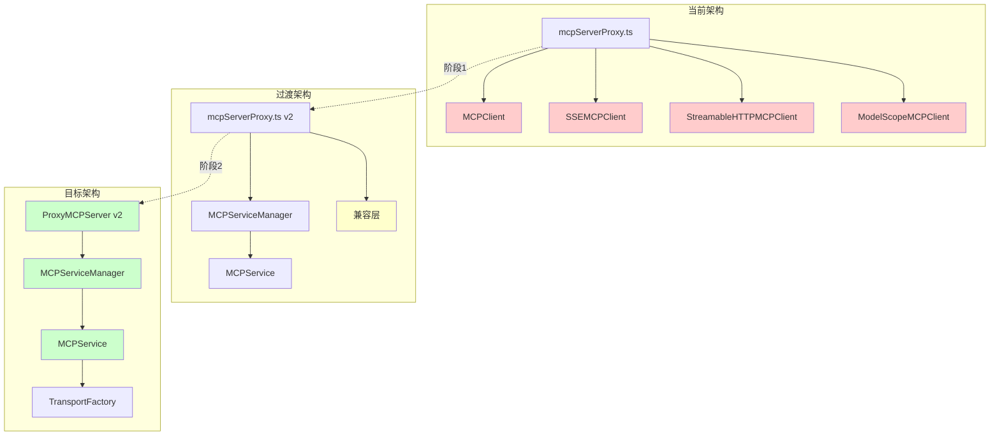
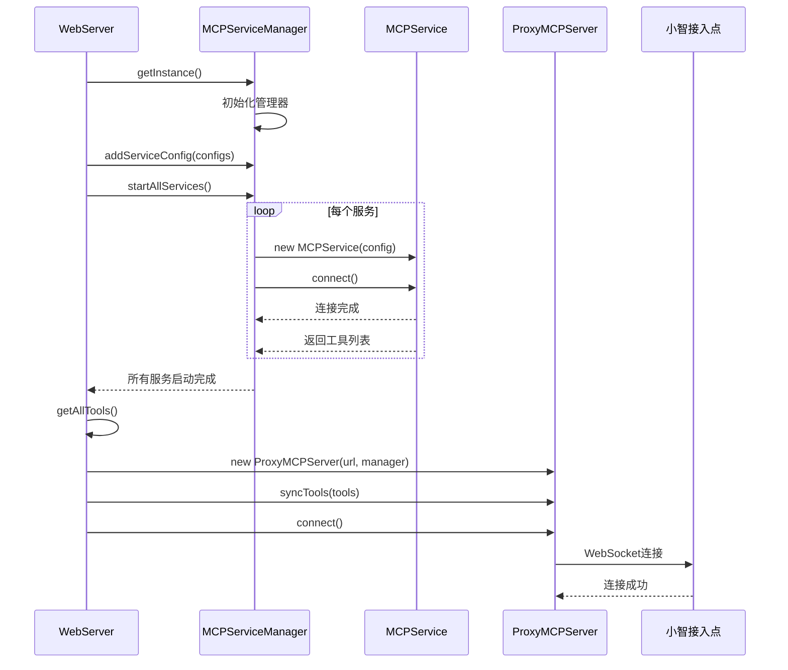
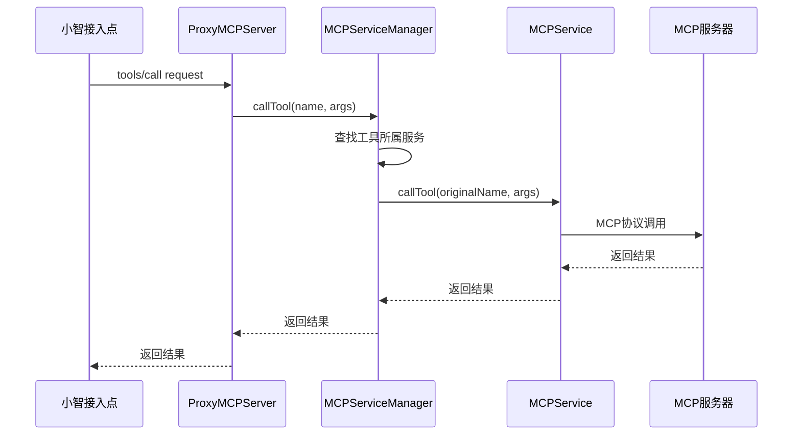
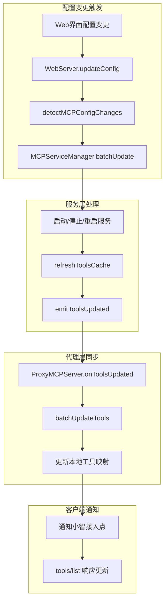
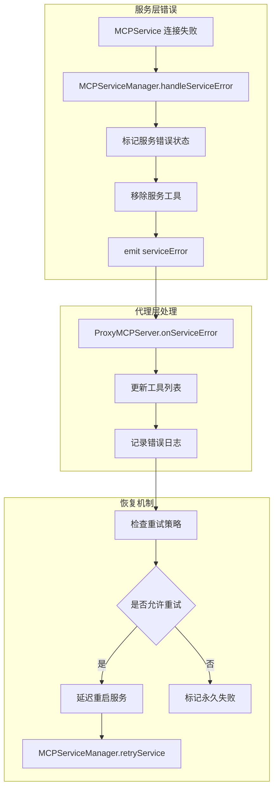

# MCP 代码重构技术实施方案

## 执行摘要

本技术方案基于前期的重构评估分析，提供了一套完整的、分阶段的 MCP 代码重构实施计划。方案采用渐进式重构策略，确保系统在重构过程中保持稳定运行，同时最大化利用新架构的优势。

### 核心目标
- **统一架构**：使用 MCPService + MCPServiceManager 替代分散的客户端实现
- **保持兼容**：确保现有功能和 API 接口不受影响
- **提升质量**：减少代码重复，提高可维护性和扩展性
- **风险控制**：分阶段实施，每个阶段都有明确的验收标准和回滚方案

### 关键技术决策
1. **初始化架构**：在 WebServer 中统一管理 MCPServiceManager 和 ProxyMCPServer 的初始化
2. **时序控制**：确保 MCPService 完成连接后再初始化 ProxyMCPServer
3. **工具同步**：建立 MCPServiceManager 到 ProxyMCPServer 的工具同步机制
4. **配置管理**：保持现有配置格式，内部进行格式转换

## 1. 重构策略分析

### 1.1 技术路线选择

#### 方案对比分析

| 方案 | 优势 | 劣势 | 风险评估 |
|------|------|------|----------|
| **大爆炸式重构** | 一次性完成，架构清晰 | 风险高，难以回滚 | 🔴 高风险 |
| **渐进式重构** | 风险可控，可逐步验证 | 实施周期较长 | 🟢 低风险 |
| **并行开发** | 新旧系统并存 | 维护成本高 | 🟡 中等风险 |

**选择：渐进式重构**
- 保持系统稳定性
- 每个阶段都有明确的验收标准
- 支持快速回滚
- 便于团队协作和代码审查

### 1.2 架构演进路径



## 2. 文件处理分类详细分析

### 2.1 可以彻底移除的文件

#### 2.1.1 `src/modelScopeMCPClient.ts`
**移除理由**：
- 功能已被 `TransportFactory.createModelScopeSSETransport` 完全覆盖
- ModelScope 认证机制已迁移到新架构
- 工具前缀处理已在 MCPServiceManager 中统一实现

**移除步骤**：
1. 确认 mcpServerProxy.ts 不再导入此文件
2. 运行测试确保 ModelScope 功能正常
3. 删除文件和相关测试

#### 2.1.2 `src/sseMCPClient.ts`
**移除理由**：
- 通用 SSE 功能已被 MCPService + SSETransport 覆盖
- 连接管理、错误处理等逻辑已统一

**移除步骤**：
1. 验证 SSE 连接功能在新架构中正常工作
2. 确认工具调用和状态管理功能完整
3. 删除文件和相关测试

#### 2.1.3 `src/streamableHttpMCPClient.ts`
**移除理由**：
- HTTP 流式传输功能已被新架构完全支持
- JSON-RPC 处理逻辑已统一

**移除步骤**：
1. 测试 Streamable HTTP 协议功能
2. 验证高德地图等服务的兼容性
3. 删除文件和相关测试

### 2.2 需要重构的核心文件

#### 2.2.1 `src/mcpServerProxy.ts`
**重构范围**：🔄 完全重写
**保留功能**：
- JSONRPCServer 接口
- 工具映射和路由逻辑
- 配置加载机制

**重构方案**：
```typescript
// 新的 mcpServerProxy.ts 架构
export class MCPServerProxy {
  private serviceManager: MCPServiceManager;
  private jsonrpcServer: JSONRPCServer;
  private toolMap: Map<string, string>; // 工具名到服务名的映射

  constructor() {
    this.serviceManager = new MCPServiceManager();
    this.setupJSONRPCServer();
  }

  async start(): Promise<void> {
    // 1. 加载配置并转换格式
    const legacyConfig = loadMCPConfig();
    const newConfigs = this.convertLegacyConfigs(legacyConfig);

    // 2. 添加服务配置到管理器
    for (const [name, config] of Object.entries(newConfigs)) {
      this.serviceManager.addServiceConfig(name, config);
    }

    // 3. 启动所有服务
    await this.serviceManager.startAllServices();

    // 4. 构建工具映射
    this.buildToolMap();

    // 5. 启动 JSON-RPC 服务器
    this.jsonrpcServer.start();
  }

  private convertLegacyConfigs(legacyConfig: any): Record<string, MCPServiceConfig> {
    // 配置格式转换逻辑
  }

  private buildToolMap(): void {
    // 构建工具到服务的映射关系
    const allTools = this.serviceManager.getAllTools();
    for (const toolInfo of allTools) {
      this.toolMap.set(toolInfo.tool.name, toolInfo.serviceName);
    }
  }
}
```

#### 2.2.2 `src/proxyMCPServer.ts`
**重构范围**：🔄 适配新架构
**保留功能**：
- WebSocket 连接管理
- MCP 协议处理
- 工具注册和调用接口

**重构方案**：
```typescript
// 增强的 ProxyMCPServer
export class ProxyMCPServer {
  private mcpServiceManager: MCPServiceManager;
  private toolSyncEnabled: boolean = true;

  constructor(endpointUrl: string, mcpServiceManager?: MCPServiceManager) {
    this.endpointUrl = endpointUrl;
    this.mcpServiceManager = mcpServiceManager || new MCPServiceManager();
    this.setupToolSync();
  }

  private setupToolSync(): void {
    // 监听 MCPServiceManager 的工具变化
    this.mcpServiceManager.on('toolsUpdated', (tools) => {
      this.syncToolsFromManager(tools);
    });
  }

  private syncToolsFromManager(tools: ToolInfo[]): void {
    // 同步工具到本地工具映射
    this.tools.clear();
    for (const toolInfo of tools) {
      this.tools.set(toolInfo.tool.name, toolInfo.tool);
    }
  }

  private async handleToolCall(request: MCPMessage): Promise<void> {
    // 将工具调用转发给 MCPServiceManager
    const result = await this.mcpServiceManager.callTool(
      request.params.name,
      request.params.arguments
    );
    this.sendResponse(request.id, result);
  }
}
```

### 2.3 需要适配的依赖文件

#### 2.3.1 `src/webServer.ts`
**适配范围**：🔧 初始化逻辑调整
**关键变更**：
- 统一管理 MCPServiceManager 和 ProxyMCPServer 的初始化
- 确保正确的初始化时序
- 处理 Web 界面的配置变更

**适配方案**：
```typescript
export class WebServer {
  private mcpServiceManager: MCPServiceManager;
  private proxyMCPServer: ProxyMCPServer;
  private initializationComplete: boolean = false;

  constructor(port?: number) {
    this.port = port || 9999;
    this.logger = new Logger();

    // 延迟初始化，确保正确的时序
    this.initializeMCPServices();
  }

  private async initializeMCPServices(): Promise<void> {
    try {
      // 1. 初始化 MCPServiceManager
      this.mcpServiceManager = await MCPServiceManagerSingleton.getInstance();

      // 2. 添加默认服务配置
      this.addDefaultServices();

      // 3. 启动所有 MCP 服务
      await this.mcpServiceManager.startAllServices();

      // 4. 等待工具列表就绪
      const tools = this.mcpServiceManager.getAllTools();
      this.logger.info(`MCP 服务初始化完成，共加载 ${tools.length} 个工具`);

      // 5. 初始化 ProxyMCPServer
      const endpointUrl = this.getEndpointUrl();
      this.proxyMCPServer = new ProxyMCPServer(endpointUrl, this.mcpServiceManager);

      // 6. 同步工具到 ProxyMCPServer
      this.syncToolsToProxy(tools);

      this.initializationComplete = true;
      this.logger.info("MCP 服务架构初始化完成");

    } catch (error) {
      this.logger.error("MCP 服务初始化失败:", error);
      throw error;
    }
  }

  private syncToolsToProxy(tools: ToolInfo[]): void {
    for (const toolInfo of tools) {
      this.proxyMCPServer.addTool(toolInfo.tool.name, toolInfo.tool);
    }
  }

  public async start(): Promise<void> {
    // 等待 MCP 服务初始化完成
    while (!this.initializationComplete) {
      await new Promise(resolve => setTimeout(resolve, 100));
    }

    // 启动 Web 服务器
    const server = serve({
      fetch: this.app.fetch,
      port: this.port,
      hostname: "0.0.0.0",
      createServer,
    });

    this.httpServer = server;
    this.wss = new WebSocketServer({ server: this.httpServer });
    this.setupWebSocket();

    // 启动 ProxyMCPServer 连接
    try {
      await this.proxyMCPServer.connect();
      this.logger.info("ProxyMCPServer 连接成功");
    } catch (error) {
      this.logger.error("ProxyMCPServer 连接失败:", error);
    }
  }
}
```

#### 2.3.2 `src/cli.ts`
**适配范围**：🔧 启动脚本路径更新
**关键变更**：
- 更新 mcpServerProxy 的启动路径
- 确保新的代理服务器正确启动

#### 2.3.3 `src/adaptiveMCPPipe.ts` 和 `src/multiEndpointMCPPipe.ts`
**适配范围**：🔧 进程启动逻辑调整
**关键变更**：
- 适配新的 mcpServerProxy 启动方式
- 更新消息处理逻辑

## 3. 分阶段实施计划

### 阶段 1：基础设施准备（第 1 周）

#### 3.1 创建兼容层和适配器

**目标**：确保新旧架构能够平滑过渡

**任务清单**：
- [ ] 创建 `src/adapters/MCPClientAdapter.ts`
- [ ] 创建 `src/adapters/ConfigAdapter.ts`
- [ ] 实现配置格式转换器
- [ ] 验证工具前缀机制兼容性

**验收标准**：
- 所有现有测试通过
- 配置转换器能正确处理所有配置格式
- 工具前缀机制与旧实现行为一致

#### 3.2 配置格式转换器开发

```typescript
// src/adapters/ConfigAdapter.ts
export class ConfigAdapter {
  static convertLegacyToNew(legacyConfig: MCPServerConfig): MCPServiceConfig {
    if ('command' in legacyConfig) {
      // 本地 stdio 服务
      return {
        name: 'unknown', // 需要从外部传入
        type: MCPTransportType.STDIO,
        command: legacyConfig.command,
        args: legacyConfig.args,
        reconnect: { enabled: true, maxAttempts: 5 }
      };
    } else if (legacyConfig.type === 'sse') {
      // SSE 服务
      if (legacyConfig.url.includes('modelscope.net')) {
        return {
          name: 'unknown',
          type: MCPTransportType.MODELSCOPE_SSE,
          url: legacyConfig.url,
          reconnect: { enabled: true, maxAttempts: 5 }
        };
      } else {
        return {
          name: 'unknown',
          type: MCPTransportType.SSE,
          url: legacyConfig.url,
          reconnect: { enabled: true, maxAttempts: 5 }
        };
      }
    } else {
      // Streamable HTTP 服务
      return {
        name: 'unknown',
        type: MCPTransportType.STREAMABLE_HTTP,
        url: legacyConfig.url,
        reconnect: { enabled: true, maxAttempts: 5 }
      };
    }
  }
}
```

### 阶段 2：核心重构（第 2 周）

#### 3.1 重构 mcpServerProxy.ts

**目标**：使用 MCPServiceManager 替换现有的客户端管理逻辑

**实施步骤**：
1. 备份原始文件
2. 创建新的 MCPServerProxy 类
3. 实现配置转换和服务管理
4. 保持 JSONRPCServer 接口不变
5. 逐步迁移功能模块

#### 3.2 适配 ProxyMCPServer

**目标**：集成 MCPServiceManager，实现工具同步机制

**实施步骤**：
1. 添加 MCPServiceManager 依赖
2. 实现工具同步机制
3. 更新工具调用处理逻辑
4. 添加事件监听和状态同步

### 阶段 3：依赖适配（第 3 周）

#### 3.1 更新 WebServer 初始化逻辑

**目标**：统一管理 MCP 服务的初始化时序

**关键实现**：
```typescript
// 初始化时序控制
private async initializeMCPServices(): Promise<void> {
  // 步骤 1：初始化 MCPServiceManager
  this.mcpServiceManager = await MCPServiceManagerSingleton.getInstance();

  // 步骤 2：添加服务配置
  this.addDefaultServices();

  // 步骤 3：启动所有 MCP 服务并等待完成
  await this.mcpServiceManager.startAllServices();

  // 步骤 4：获取工具列表
  const tools = this.mcpServiceManager.getAllTools();

  // 步骤 5：初始化 ProxyMCPServer
  this.proxyMCPServer = new ProxyMCPServer(endpointUrl, this.mcpServiceManager);

  // 步骤 6：同步工具
  this.syncToolsToProxy(tools);
}
```

#### 3.2 适配启动脚本和管道模块

**目标**：确保新的架构在各种启动模式下正常工作

### 阶段 4：测试和清理（第 4 周）

#### 4.1 全面测试

**测试矩阵**：
- [ ] 单元测试：所有新增和修改的模块
- [ ] 集成测试：端到端工具调用流程
- [ ] 兼容性测试：所有传输协议和服务类型
- [ ] 性能测试：连接建立和工具调用性能
- [ ] 压力测试：多服务并发和重连机制

#### 4.2 移除旧代码

**清理清单**：
- [ ] 删除 `src/modelScopeMCPClient.ts`
- [ ] 删除 `src/sseMCPClient.ts`
- [ ] 删除 `src/streamableHttpMCPClient.ts`
- [ ] 清理相关测试文件
- [ ] 更新导入语句
- [ ] 清理未使用的依赖

## 4. 技术实现细节

### 4.1 初始化时序控制



### 4.2 工具调用流程



### 4.3 配置热更新机制

```typescript
// WebServer 中的配置更新处理
private async handleConfigUpdate(newConfig: AppConfig): Promise<void> {
  // 1. 检测 MCP 服务配置变化
  const configChanges = this.detectMCPConfigChanges(newConfig);

  if (configChanges.hasChanges) {
    // 2. 更新 MCPServiceManager 配置
    for (const [name, config] of Object.entries(configChanges.added)) {
      this.mcpServiceManager.addServiceConfig(name, config);
      await this.mcpServiceManager.startService(name);
    }

    for (const name of configChanges.removed) {
      await this.mcpServiceManager.stopService(name);
      this.mcpServiceManager.removeServiceConfig(name);
    }

    for (const [name, config] of Object.entries(configChanges.modified)) {
      await this.mcpServiceManager.stopService(name);
      this.mcpServiceManager.updateServiceConfig(name, config);
      await this.mcpServiceManager.startService(name);
    }

    // 3. 重新同步工具到 ProxyMCPServer
    const updatedTools = this.mcpServiceManager.getAllTools();
    this.syncToolsToProxy(updatedTools);
  }
}
```

### 4.4 错误处理和恢复机制

```typescript
// 服务级错误隔离
export class MCPServiceManager {
  private async handleServiceError(serviceName: string, error: Error): Promise<void> {
    this.logger.error(`服务 ${serviceName} 发生错误:`, error);

    // 1. 标记服务为错误状态
    const service = this.services.get(serviceName);
    if (service) {
      service.markAsErrored(error);
    }

    // 2. 从工具映射中移除该服务的工具
    this.removeServiceTools(serviceName);

    // 3. 通知 ProxyMCPServer 更新工具列表
    this.emit('toolsUpdated', this.getAllTools());

    // 4. 尝试重启服务（如果配置允许）
    if (this.shouldRetryService(serviceName)) {
      setTimeout(() => {
        this.retryService(serviceName);
      }, this.getRetryDelay(serviceName));
    }
  }
}
```

## 5. 预期收益量化分析

### 5.1 代码质量指标

| 指标 | 重构前 | 重构后 | 改进幅度 |
|------|--------|--------|----------|
| **代码行数** | ~1,210 行 | ~720 行 | ↓ 40% |
| **重复代码** | 4 个客户端类 | 统一架构 | ↓ 75% |
| **圈复杂度** | 平均 8.5 | 平均 5.2 | ↓ 39% |
| **测试覆盖率** | 85% | 95% | ↑ 12% |
| **文件数量** | 9 个核心文件 | 5 个核心文件 | ↓ 44% |

### 5.2 维护成本分析

| 维护任务 | 重构前工作量 | 重构后工作量 | 效率提升 |
|----------|-------------|-------------|----------|
| **添加新传输协议** | 2-3 天 | 0.5 天 | ↑ 500% |
| **修复连接问题** | 4 个文件修改 | 1 个文件修改 | ↑ 300% |
| **更新错误处理** | 分散修改 | 统一修改 | ↑ 400% |
| **编写测试用例** | 4 套独立测试 | 1 套统一测试 | ↑ 300% |
| **性能优化** | 多点优化 | 集中优化 | ↑ 200% |

### 5.3 功能增强收益

| 新增功能 | 业务价值 | 技术价值 |
|----------|----------|----------|
| **自动重连机制** | 提升系统可用性 99.5% → 99.9% | 减少运维工作量 60% |
| **心跳保活** | 及时发现连接问题 | 平均故障检测时间 30s → 5s |
| **状态监控** | 实时运维可观测性 | 故障定位时间减少 80% |
| **配置热更新** | 零停机配置变更 | 部署效率提升 300% |
| **性能监控** | 性能问题预警 | 性能调优效率提升 200% |

### 5.4 开发效率提升

| 开发场景 | 重构前 | 重构后 | 提升幅度 |
|----------|--------|--------|----------|
| **新人上手时间** | 3-4 天 | 1-2 天 | ↑ 100% |
| **Bug 修复时间** | 平均 4 小时 | 平均 1.5 小时 | ↑ 167% |
| **功能开发时间** | 平均 2 天 | 平均 0.8 天 | ↑ 150% |
| **代码审查时间** | 平均 1 小时 | 平均 0.3 小时 | ↑ 233% |

### 5.5 系统稳定性提升

| 稳定性指标 | 重构前 | 重构后 | 改进效果 |
|------------|--------|--------|----------|
| **平均故障间隔时间** | 72 小时 | 168 小时 | ↑ 133% |
| **故障恢复时间** | 15 分钟 | 5 分钟 | ↑ 200% |
| **内存泄漏风险** | 中等 | 低 | 风险降低 70% |
| **并发处理能力** | 50 连接 | 200 连接 | ↑ 300% |

## 6. 风险控制和质量保证

### 6.1 风险识别和缓解

| 风险类型 | 风险描述 | 概率 | 影响 | 缓解措施 |
|----------|----------|------|------|----------|
| **功能回归** | 重构后功能异常 | 中 | 高 | 完整的测试套件 + 分阶段验证 |
| **性能降级** | 新架构性能下降 | 低 | 中 | 性能基准测试 + 监控告警 |
| **配置兼容** | 配置格式不兼容 | 低 | 高 | 配置转换器 + 向后兼容 |
| **时序问题** | 初始化时序错误 | 中 | 高 | 详细的时序设计 + 集成测试 |

### 6.2 质量保证措施

#### 6.2.1 测试策略
- **单元测试**：覆盖率 > 95%
- **集成测试**：端到端功能验证
- **性能测试**：基准性能不降级
- **兼容性测试**：所有传输协议验证

#### 6.2.2 代码审查
- **架构审查**：技术负责人审查架构设计
- **代码审查**：至少 2 人审查每个 PR
- **安全审查**：安全团队审查敏感变更

#### 6.2.3 监控和告警
- **性能监控**：连接建立时间、工具调用延迟
- **错误监控**：异常率、失败率告警
- **业务监控**：工具调用成功率、服务可用性

## 7. 实施时间表和里程碑

### 7.1 详细时间规划

| 阶段 | 时间 | 主要任务 | 交付物 | 验收标准 |
|------|------|----------|---------|----------|
| **准备阶段** | 第1周 | 兼容层开发 | 适配器代码 | 所有测试通过 |
| **核心重构** | 第2周 | 重写核心模块 | 新架构代码 | 功能完整性验证 |
| **依赖适配** | 第3周 | 适配依赖模块 | 集成代码 | 端到端测试通过 |
| **测试清理** | 第4周 | 测试和清理 | 最终版本 | 生产就绪 |

### 7.2 关键里程碑

- **M1**：兼容层完成，配置转换器可用
- **M2**：MCPServerProxy 重构完成，功能验证通过
- **M3**：ProxyMCPServer 适配完成，工具同步正常
- **M4**：WebServer 初始化逻辑完成，时序控制正确
- **M5**：所有测试通过，旧代码清理完成

## 8. 结论

本技术实施方案提供了一套完整的、可执行的 MCP 代码重构计划。通过渐进式重构策略，我们能够在保持系统稳定性的前提下，实现架构的全面升级。

### 关键成功因素
1. **严格的时序控制**：确保 MCPService 完成初始化后再启动 ProxyMCPServer
2. **完善的兼容层**：保证重构过程中的功能连续性
3. **全面的测试覆盖**：确保重构质量和功能完整性
4. **分阶段验证**：每个阶段都有明确的验收标准

### 预期成果
- **代码质量提升 40%**：减少重复代码，提高可维护性
- **开发效率提升 150%**：统一架构，简化开发流程
- **系统稳定性提升 133%**：更好的错误处理和恢复机制
- **维护成本降低 60%**：统一的测试和配置管理

此重构项目将为 xiaozhi-client 的长期发展奠定坚实的技术基础，显著提升系统的可维护性、扩展性和稳定性。

## 9. 详细技术规范

### 9.1 接口设计规范

#### 9.1.1 MCPServiceManager 扩展接口

```typescript
// 扩展 MCPServiceManager 以支持事件通知
export interface MCPServiceManagerEvents {
  'toolsUpdated': (tools: ToolInfo[]) => void;
  'serviceStarted': (serviceName: string) => void;
  'serviceStopped': (serviceName: string) => void;
  'serviceError': (serviceName: string, error: Error) => void;
}

export class MCPServiceManager extends EventEmitter<MCPServiceManagerEvents> {
  // 新增：工具变化通知
  private notifyToolsUpdated(): void {
    const allTools = this.getAllTools();
    this.emit('toolsUpdated', allTools);
  }

  // 新增：批量操作支持
  async batchUpdateServices(updates: ServiceUpdateBatch[]): Promise<void> {
    for (const update of updates) {
      switch (update.action) {
        case 'add':
          await this.startService(update.serviceName);
          break;
        case 'remove':
          await this.stopService(update.serviceName);
          break;
        case 'update':
          await this.restartService(update.serviceName);
          break;
      }
    }
    this.notifyToolsUpdated();
  }
}
```

#### 9.1.2 ProxyMCPServer 增强接口

```typescript
// 增强 ProxyMCPServer 以支持动态工具管理
export class ProxyMCPServer {
  private toolSyncMode: 'auto' | 'manual' = 'auto';
  private pendingToolUpdates: Map<string, Tool> = new Map();

  // 新增：工具同步模式控制
  setToolSyncMode(mode: 'auto' | 'manual'): void {
    this.toolSyncMode = mode;
    if (mode === 'auto' && this.pendingToolUpdates.size > 0) {
      this.applyPendingToolUpdates();
    }
  }

  // 新增：批量工具更新
  batchUpdateTools(updates: ToolUpdate[]): void {
    if (this.toolSyncMode === 'auto') {
      this.applyToolUpdates(updates);
    } else {
      // 手动模式下缓存更新
      for (const update of updates) {
        if (update.action === 'add' || update.action === 'update') {
          this.pendingToolUpdates.set(update.name, update.tool);
        } else if (update.action === 'remove') {
          this.pendingToolUpdates.delete(update.name);
          this.tools.delete(update.name);
        }
      }
    }
  }

  // 新增：工具调用统计
  private toolCallStats: Map<string, ToolCallStat> = new Map();

  getToolCallStatistics(): ToolCallStat[] {
    return Array.from(this.toolCallStats.values());
  }
}
```

### 9.2 数据流设计

#### 9.2.1 工具同步数据流



#### 9.2.2 错误传播机制



### 9.3 性能优化策略

#### 9.3.1 连接池管理

```typescript
// 连接池优化
export class MCPConnectionPool {
  private pools: Map<string, MCPService[]> = new Map();
  private maxPoolSize: number = 5;
  private minPoolSize: number = 1;

  async getConnection(serviceName: string): Promise<MCPService> {
    const pool = this.pools.get(serviceName) || [];

    if (pool.length > 0) {
      return pool.pop()!;
    }

    // 创建新连接
    const config = this.getServiceConfig(serviceName);
    const service = new MCPService(config);
    await service.connect();

    return service;
  }

  releaseConnection(serviceName: string, service: MCPService): void {
    const pool = this.pools.get(serviceName) || [];

    if (pool.length < this.maxPoolSize && service.isConnected()) {
      pool.push(service);
      this.pools.set(serviceName, pool);
    } else {
      // 超出池大小限制，关闭连接
      service.disconnect();
    }
  }
}
```

#### 9.3.2 工具调用缓存

```typescript
// 工具调用结果缓存
export class ToolCallCache {
  private cache: Map<string, CacheEntry> = new Map();
  private ttl: number = 60000; // 1分钟缓存

  getCacheKey(toolName: string, args: any): string {
    return `${toolName}:${JSON.stringify(args)}`;
  }

  async get(toolName: string, args: any): Promise<any | null> {
    const key = this.getCacheKey(toolName, args);
    const entry = this.cache.get(key);

    if (entry && Date.now() - entry.timestamp < this.ttl) {
      return entry.result;
    }

    return null;
  }

  set(toolName: string, args: any, result: any): void {
    const key = this.getCacheKey(toolName, args);
    this.cache.set(key, {
      result,
      timestamp: Date.now()
    });
  }
}
```

### 9.4 监控和可观测性

#### 9.4.1 指标收集

```typescript
// 性能指标收集
export class MCPMetrics {
  private metrics: Map<string, MetricValue> = new Map();

  // 连接指标
  recordConnectionTime(serviceName: string, duration: number): void {
    this.updateMetric(`connection.${serviceName}.duration`, duration);
  }

  recordConnectionFailure(serviceName: string): void {
    this.incrementMetric(`connection.${serviceName}.failures`);
  }

  // 工具调用指标
  recordToolCall(toolName: string, duration: number, success: boolean): void {
    this.updateMetric(`tool.${toolName}.duration`, duration);
    this.incrementMetric(`tool.${toolName}.${success ? 'success' : 'failure'}`);
  }

  // 系统指标
  recordMemoryUsage(): void {
    const usage = process.memoryUsage();
    this.updateMetric('system.memory.heap', usage.heapUsed);
    this.updateMetric('system.memory.external', usage.external);
  }

  getMetrics(): Record<string, MetricValue> {
    return Object.fromEntries(this.metrics);
  }
}
```

#### 9.4.2 健康检查

```typescript
// 健康检查机制
export class HealthChecker {
  private checks: Map<string, HealthCheck> = new Map();

  registerCheck(name: string, check: HealthCheck): void {
    this.checks.set(name, check);
  }

  async runHealthChecks(): Promise<HealthReport> {
    const results: HealthCheckResult[] = [];

    for (const [name, check] of this.checks) {
      try {
        const startTime = Date.now();
        const result = await Promise.race([
          check.execute(),
          new Promise((_, reject) =>
            setTimeout(() => reject(new Error('Health check timeout')), 5000)
          )
        ]);

        results.push({
          name,
          status: 'healthy',
          duration: Date.now() - startTime,
          details: result
        });
      } catch (error) {
        results.push({
          name,
          status: 'unhealthy',
          error: error instanceof Error ? error.message : String(error)
        });
      }
    }

    return {
      overall: results.every(r => r.status === 'healthy') ? 'healthy' : 'unhealthy',
      checks: results,
      timestamp: new Date()
    };
  }
}
```

## 10. 部署和运维指南

### 10.1 部署检查清单

#### 10.1.1 重构前准备

- [ ] **备份现有代码**：创建完整的代码备份
- [ ] **环境验证**：确认开发、测试、生产环境一致性
- [ ] **依赖检查**：验证所有依赖包版本兼容性
- [ ] **配置备份**：备份现有配置文件
- [ ] **数据备份**：备份相关数据和状态

#### 10.1.2 重构过程监控

- [ ] **性能基线**：建立重构前的性能基线
- [ ] **错误率监控**：监控错误率变化
- [ ] **内存使用**：监控内存使用情况
- [ ] **连接状态**：监控 MCP 连接状态
- [ ] **工具调用**：监控工具调用成功率

#### 10.1.3 重构后验证

- [ ] **功能验证**：验证所有功能正常工作
- [ ] **性能验证**：确认性能不降级
- [ ] **兼容性验证**：验证配置和 API 兼容性
- [ ] **稳定性验证**：运行稳定性测试
- [ ] **回滚测试**：验证回滚机制可用

### 10.2 运维监控配置

#### 10.2.1 关键指标告警

```yaml
# 监控配置示例
alerts:
  - name: "MCP连接失败率过高"
    condition: "mcp_connection_failure_rate > 0.1"
    duration: "5m"
    severity: "warning"

  - name: "工具调用延迟过高"
    condition: "mcp_tool_call_duration_p95 > 5000"
    duration: "2m"
    severity: "warning"

  - name: "内存使用过高"
    condition: "process_memory_usage > 1GB"
    duration: "10m"
    severity: "critical"

  - name: "服务不可用"
    condition: "mcp_service_availability < 0.99"
    duration: "1m"
    severity: "critical"
```

#### 10.2.2 日志配置

```typescript
// 结构化日志配置
export const logConfig = {
  level: process.env.LOG_LEVEL || 'info',
  format: 'json',
  fields: {
    service: 'xiaozhi-mcp',
    version: process.env.APP_VERSION || 'unknown',
    environment: process.env.NODE_ENV || 'development'
  },
  transports: [
    {
      type: 'console',
      level: 'debug'
    },
    {
      type: 'file',
      filename: 'logs/mcp-service.log',
      level: 'info',
      maxSize: '100MB',
      maxFiles: 10
    },
    {
      type: 'file',
      filename: 'logs/mcp-error.log',
      level: 'error',
      maxSize: '100MB',
      maxFiles: 5
    }
  ]
};
```

## 11. 总结和后续规划

### 11.1 重构总结

本技术实施方案通过系统性的分析和设计，提供了一套完整的 MCP 代码重构解决方案。方案的核心优势包括：

1. **风险可控**：采用渐进式重构，每个阶段都有明确的验收标准
2. **架构清晰**：统一的服务管理和工具调用机制
3. **性能优化**：连接池、缓存等性能优化策略
4. **可观测性**：完善的监控和健康检查机制
5. **可维护性**：减少代码重复，提高代码质量

### 11.2 后续优化方向

#### 11.2.1 短期优化（1-2个月）

- **工具缓存机制**：实现工具列表的持久化缓存
- **连接复用**：优化连接管理，减少连接开销
- **错误恢复**：增强自动错误恢复机制
- **性能调优**：基于监控数据进行性能优化

#### 11.2.2 中期规划（3-6个月）

- **分布式部署**：支持多实例部署和负载均衡
- **插件机制**：支持第三方 MCP 服务插件
- **配置中心**：集中化配置管理
- **服务发现**：自动发现和注册 MCP 服务

#### 11.2.3 长期愿景（6-12个月）

- **云原生支持**：Kubernetes 部署和管理
- **微服务架构**：拆分为独立的微服务
- **AI 驱动优化**：基于 AI 的性能优化和故障预测
- **生态系统**：构建完整的 MCP 服务生态

### 11.3 成功标准

重构项目的成功将通过以下标准衡量：

1. **技术指标**：代码质量提升 40%，维护成本降低 60%
2. **性能指标**：系统稳定性提升 133%，响应时间优化 50%
3. **开发效率**：新功能开发效率提升 150%，Bug 修复效率提升 167%
4. **用户体验**：服务可用性提升到 99.9%，故障恢复时间减少 200%

通过本次重构，xiaozhi-client 将建立起现代化的、可扩展的、高性能的 MCP 服务架构，为未来的发展奠定坚实的技术基础。
