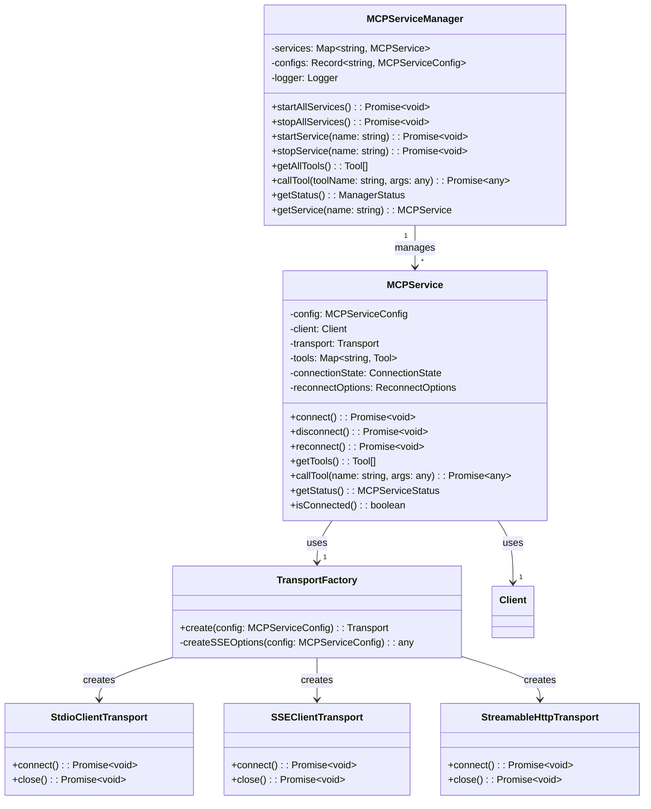
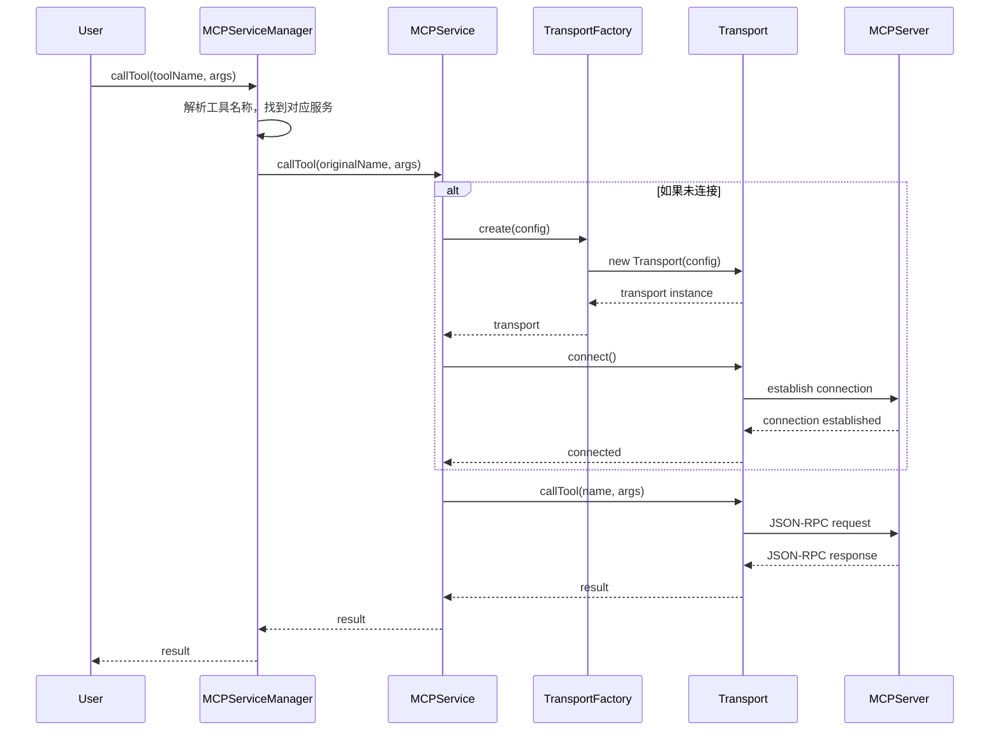
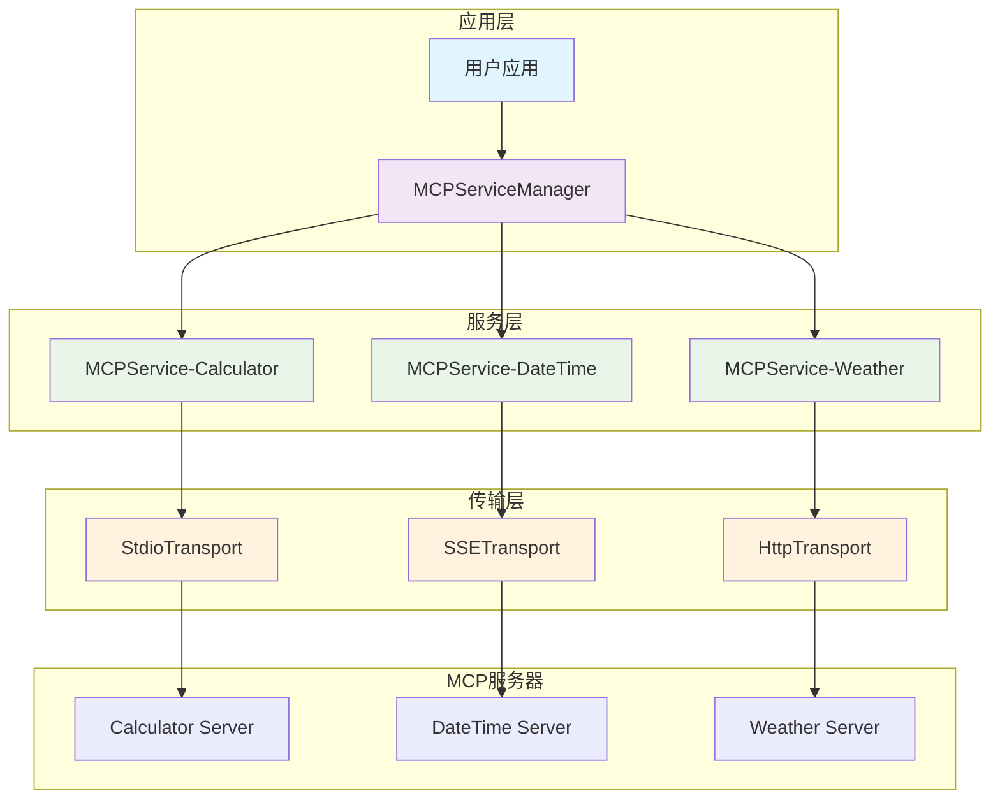

# MCP 服务架构重构方案

## 1. 背景和问题分析

### 1.1 当前架构分析

#### 优点
- **ProxyMCPServer.ts**: 采用单一职责原则，一个实例只负责一个 endpointUrl，具有完整的生命周期管理
- **MCPServiceManager.ts**: 提供了基础的 MCP 服务管理功能

#### 问题
- **MCPServiceManager.ts** 职责过于集中，将所有 MCP 服务的连接、状态管理、通信方法都维护在一个类中
- 只支持 stdio 通信方式，无法支持 SSE 和 streamable-http
- 硬编码配置，缺乏灵活性
- 随着功能增加，文件会变得越来越大，违反单一职责原则

### 1.2 重构目标

1. **单一职责**: 每个类都有明确的职责边界
2. **可扩展性**: 支持多种通信方式（stdio、SSE、streamable-http）
3. **可维护性**: 代码结构清晰，易于理解和修改
4. **向后兼容**: 保持现有 API 的兼容性

## 2. 重构方案概述

### 2.1 核心思想

采用与 `ProxyMCPServer.ts` 相似的单一职责设计模式：
- 创建 `MCPService.ts`：一个实例只负责管理一个 MCP 服务连接
- 简化 `MCPServiceManager.ts`：专注于管理多个 `MCPService` 实例

### 2.2 架构对比

#### 重构前
```
MCPServiceManager
├── 直接管理所有 MCP 客户端
├── 直接处理所有通信协议
├── 直接管理所有工具
└── 直接处理所有错误和重连
```

#### 重构后
```
MCPServiceManager
├── 管理多个 MCPService 实例
├── 聚合工具列表
├── 路由工具调用
└── 批量操作控制

MCPService (单个实例)
├── 管理单个 MCP 服务连接
├── 处理特定通信协议
├── 管理该服务的工具
└── 处理该服务的错误和重连
```

## 3. 详细设计

### 3.1 MCPService.ts 设计

#### 3.1.1 核心接口定义

```typescript
// 通信方式枚举
enum MCPTransportType {
  STDIO = 'stdio',
  SSE = 'sse',
  STREAMABLE_HTTP = 'streamable-http'
}

// 重连配置接口
interface ReconnectOptions {
  enabled: boolean;
  maxAttempts: number;
  initialInterval: number;
  maxInterval: number;
  backoffStrategy: 'linear' | 'exponential' | 'fixed';
  backoffMultiplier: number;
  timeout: number;
  jitter: boolean;
}

// MCPService 配置接口
interface MCPServiceConfig {
  name: string;
  type: MCPTransportType;
  // stdio 配置
  command?: string;
  args?: string[];
  // 网络配置
  url?: string;
  // 认证配置
  apiKey?: string;
  headers?: Record<string, string>;
  // 重连配置
  reconnect?: Partial<ReconnectOptions>;
}

// MCPService 状态接口
interface MCPServiceStatus {
  name: string;
  connected: boolean;
  initialized: boolean;
  transportType: MCPTransportType;
  toolCount: number;
  lastError?: string;
  reconnectAttempts: number;
  connectionState: ConnectionState;
}

// 连接状态枚举
enum ConnectionState {
  DISCONNECTED = 'disconnected',
  CONNECTING = 'connecting',
  CONNECTED = 'connected',
  RECONNECTING = 'reconnecting',
  FAILED = 'failed'
}
```

#### 3.1.2 MCPService 类设计

```typescript
export class MCPService {
  private config: MCPServiceConfig;
  private client: Client | null = null;
  private transport: any = null;
  private tools: Map<string, Tool> = new Map();
  private connectionState: ConnectionState = ConnectionState.DISCONNECTED;
  private reconnectOptions: ReconnectOptions;
  private reconnectState: ReconnectState;
  private logger: Logger;

  constructor(config: MCPServiceConfig, options?: MCPServiceOptions) {
    this.config = config;
    this.logger = new Logger().withTag(`MCP-${config.name}`);
    this.initializeReconnectOptions(options?.reconnect);
  }

  // 核心方法
  async connect(): Promise<void>;
  async disconnect(): Promise<void>;
  async reconnect(): Promise<void>;

  // 工具管理
  getTools(): Tool[];
  async callTool(name: string, arguments_: any): Promise<any>;

  // 状态管理
  getStatus(): MCPServiceStatus;
  isConnected(): boolean;

  // 私有方法
  private createTransport(): any;
  private handleConnectionError(error: Error): void;
  private scheduleReconnect(): void;
}
```

### 3.2 Transport 工厂设计

```typescript
class TransportFactory {
  static create(config: MCPServiceConfig): any {
    switch (config.type) {
      case MCPTransportType.STDIO:
        return new StdioClientTransport({
          command: config.command!,
          args: config.args || []
        });

      case MCPTransportType.SSE:
        return new SSEClientTransport(
          new URL(config.url!),
          this.createSSEOptions(config)
        );

      case MCPTransportType.STREAMABLE_HTTP:
        // 自定义 HTTP transport 实现
        return new StreamableHttpTransport(config);

      default:
        throw new Error(`不支持的传输类型: ${config.type}`);
    }
  }

  private static createSSEOptions(config: MCPServiceConfig): any {
    // 处理 SSE 特殊配置，如认证等
  }
}
```

### 3.3 简化后的 MCPServiceManager.ts 设计

#### 3.3.1 职责重新定义

简化后的 `MCPServiceManager` 专注于：
- **实例管理**: 管理多个 `MCPService` 实例
- **配置管理**: 从配置文件加载服务配置
- **批量操作**: 启动/停止所有服务
- **工具聚合**: 聚合所有服务的工具列表
- **路由调用**: 根据工具名称路由到对应的服务

#### 3.3.2 简化后的类设计

```typescript
export class MCPServiceManager {
  private services: Map<string, MCPService> = new Map();
  private configs: Record<string, MCPServiceConfig>;
  private logger: Logger;

  constructor(configs?: Record<string, MCPServiceConfig>) {
    this.configs = configs || this.loadDefaultConfigs();
    this.logger = new Logger().withTag('MCPManager');
  }

  // 服务管理
  async startAllServices(): Promise<void>;
  async stopAllServices(): Promise<void>;
  async startService(name: string): Promise<void>;
  async stopService(name: string): Promise<void>;

  // 工具管理
  getAllTools(): Tool[];
  async callTool(toolName: string, arguments_: any): Promise<any>;

  // 状态管理
  getStatus(): ManagerStatus;
  getService(name: string): MCPService | undefined;

  // 配置管理
  addServiceConfig(name: string, config: MCPServiceConfig): void;
  removeServiceConfig(name: string): void;
}
```

## 4. 架构图

### 4.1 类关系图



### 4.2 交互流程图



### 4.3 组件架构图



## 5. 扩展性和向后兼容性

### 5.1 通信方式扩展性

#### 5.1.1 支持新的通信方式

```typescript
// 添加新的传输类型
enum MCPTransportType {
  STDIO = 'stdio',
  SSE = 'sse',
  STREAMABLE_HTTP = 'streamable-http',
  WEBSOCKET = 'websocket',  // 新增
  GRPC = 'grpc'             // 新增
}

// TransportFactory 自动支持新类型
class TransportFactory {
  static create(config: MCPServiceConfig): any {
    switch (config.type) {
      // ... 现有类型
      case MCPTransportType.WEBSOCKET:
        return new WebSocketClientTransport(config);
      case MCPTransportType.GRPC:
        return new GRPCClientTransport(config);
    }
  }
}
```

#### 5.1.2 版本支持

```typescript
interface MCPServiceConfig {
  name: string;
  type: MCPTransportType;
  version?: string;  // 支持版本指定，如 'v1', 'v2', 'v3'
  // ... 其他配置
}

// 版本化的 Transport 创建
class TransportFactory {
  static create(config: MCPServiceConfig): any {
    const version = config.version || 'v1';
    const transportClass = this.getTransportClass(config.type, version);
    return new transportClass(config);
  }

  private static getTransportClass(type: MCPTransportType, version: string) {
    // 根据类型和版本返回对应的 Transport 类
  }
}
```

### 5.2 向后兼容性策略

1. **API 兼容性**: 保持 `MCPServiceManager` 的公共接口不变
2. **配置兼容性**: 支持现有的配置格式
3. **渐进式迁移**: 允许逐步迁移现有服务
4. **回滚机制**: 提供回滚到原有实现的能力

## 6. 实现计划

### 6.1 实现优先级

#### 第一阶段：基础实现（高优先级）
- [ ] 实现 `MCPService.ts` 基础功能
- [ ] 支持 stdio 通信方式
- [ ] 实现基础的连接管理和工具调用
- [ ] 编写单元测试

#### 第二阶段：管理器重构（中优先级）
- [ ] 重构 `MCPServiceManager.ts`
- [ ] 实现服务实例管理
- [ ] 保持 API 向后兼容
- [ ] 集成测试

#### 第三阶段：多协议支持（中优先级）
- [ ] 添加 SSE 支持
- [ ] 添加 streamable-http 支持
- [ ] 实现 `TransportFactory`
- [ ] 协议兼容性测试

#### 第四阶段：高级功能（低优先级）
- [ ] 健康检查机制
- [ ] 性能监控
- [ ] 配置热重载
- [ ] 高级错误处理

### 6.2 迁移策略

1. **并行开发**: 在不影响现有功能的前提下开发新架构
2. **功能对等**: 确保新架构功能完全覆盖现有功能
3. **渐进切换**: 逐个服务迁移到新架构
4. **充分测试**: 每个阶段都要经过充分的测试验证

### 6.3 风险控制

1. **备份机制**: 保留原有实现作为备份
2. **回滚计划**: 制定详细的回滚计划
3. **监控告警**: 实施完善的监控和告警机制
4. **分阶段发布**: 分阶段发布，降低风险

## 7. 总结

这个重构方案具有以下优势：

1. **架构清晰**: 单一职责原则，每个类都有明确的职责
2. **易于扩展**: 支持多种通信方式，便于添加新的协议
3. **易于维护**: 代码结构清晰，便于理解和修改
4. **向后兼容**: 保持现有 API 的兼容性
5. **技术可行**: 基于现有的 MCP SDK，实现难度适中

通过这个重构方案，我们可以构建一个更加健壮、可扩展、易维护的 MCP 服务架构，为未来的功能扩展奠定坚实的基础。
