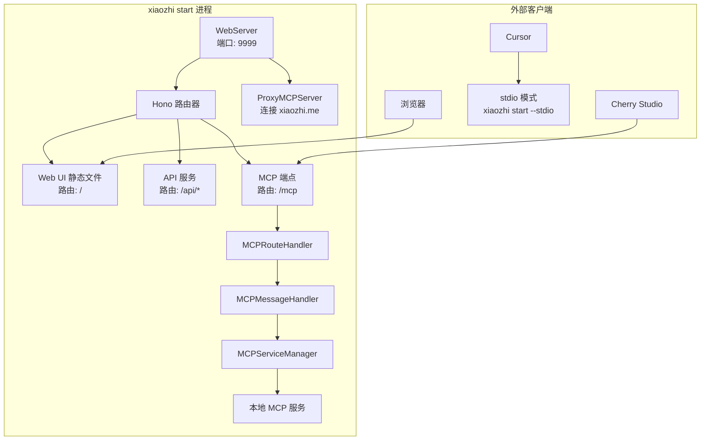

# MCP 服务优化技术方案

## 1. 现状分析

### 1.1 当前架构分析

**现有组件：**

- `WebServer`：提供 Web UI 和 API 服务（端口 9999）
- `MCPMessageHandler`：统一的 MCP 消息处理器
- `HTTPAdapter`：HTTP/SSE 传输适配器（独立端口）
- `MCPServiceManager`：MCP 服务管理器
- `ServiceCommandHandler`：CLI 命令处理器

**存在问题：**

1. HTTP Server 模式 CLI 实现缺失（`startMCPServerMode` 方法未实现）
2. HTTPAdapter 使用独立端口（3000），与 WebServer（9999）分离
3. 需要单独启动 HTTP 服务器才能提供 MCP 服务
4. 部署配置复杂，需要管理多个端口

### 1.2 MCP Streamable HTTP 规范要求

根据 MCP 规范，Streamable HTTP 传输需要：

1. **单一端点**：服务器必须提供单一 HTTP 端点路径，支持 POST 和 GET 方法
2. **JSON-RPC 协议**：所有消息必须使用 JSON-RPC 2.0 格式
3. **POST 请求**：每个 JSON-RPC 消息都是一个新的 HTTP POST 请求
4. **SSE 支持**：服务器可选择返回 SSE 流进行双向通信
5. **协议版本头**：必须包含 `MCP-Protocol-Version` 头

### 1.3 用户需求分析

**核心需求：**

- `xiaozhi start` 启动后默认提供单一 `/mcp` 端点
- 符合 MCP Streamable HTTP 规范
- 保持原有功能不变（Web UI、API 服务）
- 统一端口管理，避免多端口配置

## 2. 架构设计方案

### 2.1 整体架构



### 2.2 核心设计原则

1. **单一端点**：只提供 `/mcp` 端点，符合 MCP 规范
2. **统一端口**：所有 HTTP 服务统一使用 9999 端口
3. **JSON-RPC 协议**：严格遵循 MCP Streamable HTTP 规范
4. **向后兼容**：保持现有功能和配置不变

### 2.3 路由规划

| 路由 | 方法 | 功能 | 处理器 |
|------|------|------|--------|
| `/` | GET | Web UI 静态文件 | StaticFileHandler |
| `/api/*` | GET/POST | 现有 API 服务 | 各种 ApiHandler |
| `/mcp` | POST | MCP JSON-RPC 请求 | MCPRouteHandler |
| `/mcp` | GET | MCP SSE 连接 | MCPRouteHandler |

## 3. 具体实现步骤

### 3.1 阶段一：创建 MCPRouteHandler

**目标：** 创建符合 MCP 规范的单一端点处理器

**主要修改：**

1. **创建 MCPRouteHandler**

```typescript
// src/handlers/MCPRouteHandler.ts
export class MCPRouteHandler {
  private mcpMessageHandler: MCPMessageHandler;
  private sseClients: Map<string, SSEClient> = new Map();

  // 处理 POST 请求（JSON-RPC 消息）
  async handlePost(c: Context): Promise<Response>

  // 处理 GET 请求（SSE 连接）
  async handleGet(c: Context): Promise<Response>
}
```

**验收标准：**

- 创建符合 MCP 规范的路由处理器
- 支持 POST 和 GET 方法
- 实现基本的 JSON-RPC 消息处理

### 3.2 阶段二：WebServer 集成 MCP 端点

**目标：** 在现有 WebServer 中添加 `/mcp` 端点

**主要修改：**

1. **修改 WebServer 类**

```typescript
// src/WebServer.ts
export class WebServer {
  private mcpRouteHandler: MCPRouteHandler;

  constructor(port?: number) {
    // ... 现有代码

    // 初始化 MCP 路由处理器
    this.mcpRouteHandler = new MCPRouteHandler();
  }

  private setupRoutes() {
    // ... 现有路由

    // 新增 MCP 端点
    this.app.post("/mcp", (c) => this.mcpRouteHandler.handlePost(c));
    this.app.get("/mcp", (c) => this.mcpRouteHandler.handleGet(c));
  }
}
```

**验收标准：**

- `xiaozhi start` 启动后，`http://localhost:9999/mcp` 端点可访问
- 支持 POST 和 GET 方法
- 符合 MCP Streamable HTTP 规范

### 3.3 阶段三：实现 MCPRouteHandler

**目标：** 实现符合 MCP 规范的端点处理逻辑

**主要功能：**

1. **POST 请求处理**：处理 JSON-RPC 消息
2. **GET 请求处理**：建立 SSE 连接
3. **协议版本验证**：检查 `MCP-Protocol-Version` 头
4. **会话管理**：支持 `Mcp-Session-Id` 头

**验收标准：**

- 正确处理 JSON-RPC 2.0 消息
- 支持 SSE 流式响应
- 实现会话管理机制
- 错误处理符合 MCP 规范

### 3.4 阶段四：修复 CLI 实现

**目标：** 修复独立 HTTP Server 模式（可选）

**主要修改：**

```typescript
// src/cli/commands/ServiceCommandHandler.ts
private async startMCPServerMode(port: number, daemon: boolean): Promise<void> {
  // 使用现有的 HTTPAdapter 实现
  const { HTTPAdapter } = await import("../../transports/HTTPAdapter.js");
  const { MCPMessageHandler } = await import("../../core/MCPMessageHandler.js");

  const messageHandler = new MCPMessageHandler(this.mcpServiceManager);
  const httpAdapter = new HTTPAdapter(messageHandler, { port });

  await httpAdapter.start();

  if (!daemon) {
    process.on("SIGINT", async () => {
      await httpAdapter.stop();
      process.exit(0);
    });
  }
}
```

**验收标准：**

- `xiaozhi start -s 3000` 命令正常工作
- 独立 HTTP Server 模式可以提供 MCP 服务

## 4. 配置调整

### 4.1 配置文件更新

**新增配置选项：**

```json
{
  "mcpEndpoint": "...",
  "mcpServers": {...},
  "webUI": {
    "port": 9999,
    "enableMCPService": true
  }
}
```

### 4.2 向后兼容性

- 默认启用 MCP 服务（`enableMCPService: true`）
- 现有配置文件无需修改
- 新配置项有合理默认值

## 5. 集成方式更新

### 5.1 Cherry Studio 配置

**新的集成方式（Streamable HTTP）：**

```json
{
  "mcpServers": {
    "xiaozhi-client": {
      "url": "http://localhost:9999/mcp"
    }
  }
}
```

**说明：**

- 使用 Streamable HTTP 传输，无需指定 `type` 字段
- Cherry Studio 会自动识别为 Streamable HTTP 协议
- 更简洁的配置，符合 MCP 规范

### 5.2 与现有方式对比

| 方式 | 配置 | 端口 | 状态 |
|------|------|------|------|
| 旧方式 | `{"type": "sse", "url": "..."}` | 3000 | 需要单独启动 |
| 新方式 | `{"url": "http://localhost:9999/mcp"}` | 9999 | 默认启用 |

## 6. 实施计划

### 6.1 时间安排

| 阶段 | 时间 | 主要任务 | 交付物 |
|------|------|----------|--------|
| 阶段一 | 1天 | 创建 MCPRouteHandler | 基础处理器框架 |
| 阶段二 | 1天 | WebServer 集成 | `/mcp` 端点可用 |
| 阶段三 | 1天 | 完善处理逻辑 | 完整的 MCP 支持 |
| 阶段四 | 1天 | CLI 修复和测试 | 所有模式正常工作 |

### 6.2 验收标准

**功能验收：**

- [ ] `xiaozhi start` 启动后，`http://localhost:9999/mcp` 可访问
- [ ] Cherry Studio 可以通过新端点连接并使用工具
- [ ] 现有功能（Web UI、API）不受影响
- [ ] stdio 模式继续正常工作

**规范符合性：**

- [ ] 支持单一 `/mcp` 端点
- [ ] 正确处理 JSON-RPC 2.0 消息
- [ ] 支持 POST 和 GET 方法
- [ ] 实现 SSE 流式响应
- [ ] 包含必要的 HTTP 头

## 7. 风险评估

### 7.1 主要风险

| 风险 | 影响 | 概率 | 缓解措施 |
|------|------|------|----------|
| 路由冲突 | 低 | 低 | `/mcp` 是新路由，不会冲突 |
| 性能影响 | 低 | 中 | 复用现有架构，影响最小 |
| 兼容性问题 | 中 | 低 | 保持现有功能不变 |

### 7.2 回滚方案

如果出现问题，可以：

1. 通过配置禁用 MCP 服务
2. 回退到独立 HTTP Server 模式
3. 继续使用 stdio 模式

## 8. 总结

这个简化的技术方案：

1. **符合 MCP 规范**：实现单一 `/mcp` 端点，支持 JSON-RPC 和 SSE
2. **架构简洁**：在现有 WebServer 基础上添加路由，避免多端口问题
3. **向后兼容**：保持现有功能不变，新功能可配置
4. **实施简单**：4天完成，风险可控

通过这个方案，用户只需要：

1. **启动服务**：`xiaozhi start`
2. **配置 Cherry Studio**：

   ```json
   {
     "mcpServers": {
       "xiaozhi-client": {
         "url": "http://localhost:9999/mcp"
       }
     }
   }
   ```

就可以获得完整的 MCP Streamable HTTP 服务支持，配置极其简洁。
