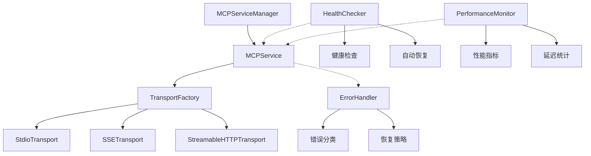
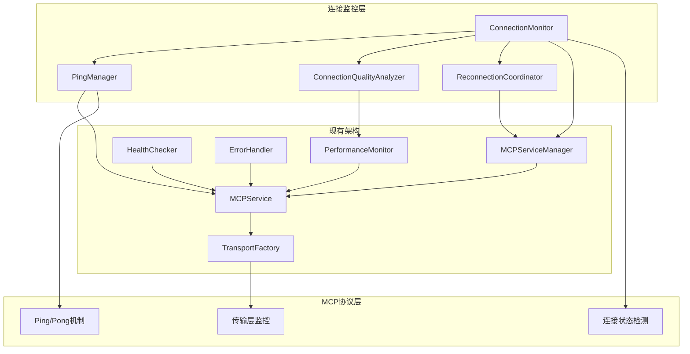

# MCP服务器连接监控与自动重连技术方案

## 1. 现状分析

### 1.1 当前架构优势

**架构设计优秀**：
- `MCPServiceManager` 作为统一管理入口，职责清晰
- `MCPService` 封装单个服务的完整生命周期
- `TransportFactory` 提供良好的传输层抽象，支持三种协议（stdio/sse/streamablehttp）
- 已实现基础的重连机制，包括指数退避、重连次数限制等

**现有组件完善**：
- `ErrorHandler.ts` 提供完整的错误分类和恢复策略
- `HealthChecker.ts` 具备基础健康检查能力
- `PerformanceMonitor.ts` 提供性能指标监控

### 1.2 当前不足

**缺乏主动监控**：
- 仅在连接断开时被动重连，无法提前发现连接问题
- 没有定期的连接健康检查机制
- 无法检测"僵尸连接"（连接看似正常但实际不可用）

**重连机制局限**：
- 重连仅在连接完全断开时触发
- 缺乏基于MCP协议标准的ping/pong健康检查
- 多服务重连时缺乏协调机制，可能造成性能问题

**监控能力不足**：
- 健康检查主要依赖工具列表获取，检测能力有限
- 缺乏连接质量的持续评估
- 没有连接稳定性的历史趋势分析

## 2. 架构分析

### 2.1 现有组件职责分析



**MCPServiceManager**：
- 管理多个MCP服务实例
- 提供统一的工具调用接口
- 维护服务状态和工具缓存

**MCPService**：
- 管理单个MCP服务的完整生命周期
- 已实现基础重连逻辑（指数退避、次数限制）
- 提供连接状态管理

**现有辅助组件**：
- `ErrorHandler`：完善的错误分类和恢复策略
- `HealthChecker`：基础健康检查，支持自动恢复
- `PerformanceMonitor`：性能指标收集

### 2.2 三种传输类型特性分析

**Stdio传输**：
- 基于进程通信，连接相对稳定
- 断线检测：进程退出、管道关闭
- 重连方式：重启子进程

**SSE传输**：
- 基于HTTP长连接，易受网络影响
- 断线检测：连接超时、EventSource错误事件
- 重连方式：重新建立HTTP连接

**StreamableHTTP传输**：
- 基于HTTP流式传输
- 断线检测：请求超时、连接错误
- 重连方式：重新发起HTTP请求

## 3. 解决方案设计

### 3.1 整体架构设计



### 3.2 核心组件设计

#### 3.2.1 ConnectionMonitor（连接监控器）
- **职责**：统一管理所有MCP服务的连接监控
- **功能**：
  - 定期触发健康检查
  - 协调多服务的监控任务
  - 管理监控配置和策略
  - 提供监控状态报告

#### 3.2.2 PingManager（Ping管理器）
- **职责**：实现基于MCP协议的ping/pong机制
- **功能**：
  - 定期发送ping请求
  - 监控pong响应时间
  - 检测连接延迟和稳定性
  - 支持不同传输类型的ping实现

#### 3.2.3 ConnectionQualityAnalyzer（连接质量分析器）
- **职责**：分析连接质量和稳定性
- **功能**：
  - 收集连接质量指标
  - 分析连接稳定性趋势
  - 预测连接问题
  - 提供连接质量评分

#### 3.2.4 ReconnectionCoordinator（重连协调器）
- **职责**：协调多服务的重连操作
- **功能**：
  - 管理重连队列和优先级
  - 控制并发重连数量
  - 实现重连限流和退避
  - 避免重连风暴

### 3.3 监控策略设计

#### 3.3.1 多层次监控
1. **L1 - 传输层监控**：检测底层连接状态
2. **L2 - 协议层监控**：MCP ping/pong机制
3. **L3 - 应用层监控**：工具调用成功率

#### 3.3.2 自适应监控频率
- 连接稳定时：降低监控频率（60秒）
- 连接不稳定时：提高监控频率（10秒）
- 重连期间：暂停监控，避免干扰

#### 3.3.3 智能重连策略
- 基于连接质量评分决定重连时机
- 考虑服务优先级和依赖关系
- 实现渐进式重连（先重要服务，后次要服务）

## 4. 技术实现细节

### 4.1 ConnectionMonitor实现

```typescript
interface ConnectionMonitorConfig {
  enabled: boolean;
  checkInterval: number; // 基础检查间隔
  adaptiveInterval: boolean; // 是否启用自适应间隔
  maxConcurrentChecks: number; // 最大并发检查数
  qualityThreshold: number; // 连接质量阈值
}

class ConnectionMonitor {
  private config: ConnectionMonitorConfig;
  private pingManager: PingManager;
  private qualityAnalyzer: ConnectionQualityAnalyzer;
  private reconnectionCoordinator: ReconnectionCoordinator;
  private monitoringTasks: Map<string, NodeJS.Timeout>;

  // 启动监控
  async startMonitoring(manager: MCPServiceManager): Promise<void>

  // 停止监控
  async stopMonitoring(): Promise<void>

  // 检查单个服务
  private async checkService(service: MCPService): Promise<void>

  // 自适应调整监控频率
  private adjustMonitoringInterval(serviceName: string, quality: number): void
}
```

### 4.2 PingManager实现

```typescript
interface PingConfig {
  enabled: boolean;
  interval: number; // ping间隔
  timeout: number; // ping超时
  maxFailures: number; // 最大失败次数
}

class PingManager {
  // 发送ping请求
  async ping(service: MCPService): Promise<PingResult>

  // 处理不同传输类型的ping
  private async pingStdio(client: Client): Promise<PingResult>
  private async pingSSE(client: Client): Promise<PingResult>
  private async pingStreamableHTTP(client: Client): Promise<PingResult>

  // 分析ping结果
  private analyzePingResult(result: PingResult): ConnectionHealth
}
```

### 4.3 ConnectionQualityAnalyzer实现

```typescript
interface ConnectionQuality {
  score: number; // 0-100的质量评分
  stability: number; // 连接稳定性
  latency: number; // 平均延迟
  reliability: number; // 可靠性指标
  trend: 'improving' | 'stable' | 'degrading';
}

class ConnectionQualityAnalyzer {
  // 分析连接质量
  analyzeQuality(serviceName: string): ConnectionQuality

  // 预测连接问题
  predictIssues(serviceName: string): PredictionResult

  // 更新质量指标
  updateMetrics(serviceName: string, metrics: QualityMetrics): void
}
```

### 4.4 ReconnectionCoordinator实现

```typescript
interface ReconnectionTask {
  serviceName: string;
  priority: number;
  attempts: number;
  nextAttempt: Date;
  reason: string;
}

class ReconnectionCoordinator {
  private reconnectionQueue: PriorityQueue<ReconnectionTask>;
  private activeReconnections: Set<string>;
  private maxConcurrentReconnections: number = 3;

  // 添加重连任务
  scheduleReconnection(task: ReconnectionTask): void

  // 执行重连
  private async executeReconnection(task: ReconnectionTask): Promise<void>

  // 控制重连并发
  private canStartReconnection(): boolean
}
```

### 4.5 与现有组件的集成

#### 4.5.1 增强MCPService
```typescript
// 在MCPService中添加监控支持
class MCPService {
  private connectionMonitor?: ConnectionMonitor;
  private lastPingTime?: Date;
  private connectionQuality: number = 100;

  // 启用连接监控
  enableConnectionMonitoring(monitor: ConnectionMonitor): void

  // 处理ping请求
  async handlePing(): Promise<void>

  // 获取连接质量
  getConnectionQuality(): number

  // 更新连接质量
  updateConnectionQuality(quality: number): void
}
```

#### 4.5.2 增强MCPServiceManager
```typescript
// 在MCPServiceManager中集成监控
class MCPServiceManager {
  private connectionMonitor: ConnectionMonitor;

  // 启动监控
  async startConnectionMonitoring(): Promise<void>

  // 获取监控报告
  getMonitoringReport(): MonitoringReport

  // 配置监控策略
  configureMonitoring(config: ConnectionMonitorConfig): void
}
```

## 5. 实现的最终效果

### 5.1 用户体验提升
- **透明的连接管理**：用户无需关心连接状态，系统自动维护
- **更高的可用性**：主动发现并修复连接问题，减少服务中断
- **智能重连**：避免重连风暴，保证系统稳定性

### 5.2 系统性能优化
- **资源使用优化**：自适应监控频率，减少不必要的检查
- **并发控制**：限制同时重连的服务数量，避免系统过载
- **性能监控**：实时监控连接质量，提供性能洞察

### 5.3 运维能力增强
- **详细的监控报告**：提供连接状态、质量趋势等信息
- **预警机制**：提前发现潜在问题，支持主动运维
- **可配置策略**：支持根据业务需求调整监控和重连策略

## 6. 任务分解

### 6.1 阶段一：基础监控框架（预计3-4天）

#### 任务1.1：实现ConnectionMonitor核心框架
- **目标**：创建连接监控的基础架构
- **输出**：`ConnectionMonitor.ts`基础实现
- **关键功能**：
  - 监控任务调度
  - 配置管理
  - 与MCPServiceManager集成

#### 任务1.2：实现PingManager
- **目标**：基于MCP协议实现ping/pong机制
- **输出**：`PingManager.ts`完整实现
- **关键功能**：
  - 支持三种传输类型的ping
  - ping结果分析
  - 超时和错误处理

#### 任务1.3：集成现有HealthChecker
- **目标**：增强现有健康检查能力
- **输出**：更新`HealthChecker.ts`
- **关键功能**：
  - 集成ping检查
  - 增强健康评估逻辑
  - 支持连接质量评估

### 6.2 阶段二：连接质量分析（预计2-3天）

#### 任务2.1：实现ConnectionQualityAnalyzer
- **目标**：分析和评估连接质量
- **输出**：`ConnectionQualityAnalyzer.ts`
- **关键功能**：
  - 质量评分算法
  - 趋势分析
  - 问题预测

#### 任务2.2：增强PerformanceMonitor集成
- **目标**：利用性能数据进行质量分析
- **输出**：更新`PerformanceMonitor.ts`
- **关键功能**：
  - 连接质量指标收集
  - 历史数据分析
  - 性能趋势监控

### 6.3 阶段三：智能重连机制（预计3-4天）

#### 任务3.1：实现ReconnectionCoordinator
- **目标**：协调多服务重连操作
- **输出**：`ReconnectionCoordinator.ts`
- **关键功能**：
  - 重连队列管理
  - 并发控制
  - 优先级调度

#### 任务3.2：增强MCPService重连逻辑
- **目标**：集成智能重连机制
- **输出**：更新`MCPService.ts`
- **关键功能**：
  - 基于质量评分的重连决策
  - 与协调器的集成
  - 重连状态管理

#### 任务3.3：更新ErrorHandler策略
- **目标**：优化错误处理和恢复策略
- **输出**：更新`ErrorHandler.ts`
- **关键功能**：
  - 连接质量相关的错误分类
  - 智能恢复策略
  - 与监控系统的集成

### 6.4 阶段四：系统集成与优化（预计2-3天）

#### 任务4.1：MCPServiceManager集成
- **目标**：在管理器层面集成监控功能
- **输出**：更新`MCPServiceManager.ts`
- **关键功能**：
  - 监控生命周期管理
  - 统一配置接口
  - 监控报告生成

#### 任务4.2：配置和策略优化
- **目标**：优化默认配置和策略
- **输出**：配置文件和策略调优
- **关键功能**：
  - 自适应参数调整
  - 性能优化
  - 资源使用优化

#### 任务4.3：监控报告和API
- **目标**：提供监控状态查询接口
- **输出**：监控API和报告功能
- **关键功能**：
  - 实时状态查询
  - 历史数据报告
  - 监控配置管理

### 6.5 阶段五：测试和文档（预计2天）

#### 任务5.1：编写测试用例
- **目标**：确保功能正确性和稳定性
- **输出**：完整的测试套件
- **覆盖范围**：
  - 单元测试
  - 集成测试
  - 性能测试

#### 任务5.2：更新文档
- **目标**：提供使用指南和API文档
- **输出**：用户文档和开发文档
- **内容包括**：
  - 配置指南
  - API参考
  - 最佳实践

## 7. 风险评估与缓解

### 7.1 技术风险
- **性能影响**：监控可能增加系统开销
  - 缓解：自适应监控频率，优化检查逻辑
- **复杂性增加**：新增组件可能增加维护成本
  - 缓解：良好的模块化设计，充分的测试覆盖

### 7.2 兼容性风险
- **现有功能影响**：可能影响现有重连逻辑
  - 缓解：渐进式集成，保持向后兼容
- **第三方依赖**：MCP SDK的兼容性
  - 缓解：基于标准协议实现，降低依赖风险

### 7.3 运维风险
- **配置复杂性**：新增配置项可能增加配置难度
  - 缓解：提供合理默认值，简化配置接口
- **故障排查**：新增组件可能增加故障排查难度
  - 缓解：完善日志记录，提供诊断工具

## 8. 总结

本技术方案通过引入连接监控层，在现有架构基础上增加了主动的连接健康检查和智能重连机制。方案充分利用了现有的`ErrorHandler`、`HealthChecker`和`PerformanceMonitor`组件，通过新增`ConnectionMonitor`、`PingManager`、`ConnectionQualityAnalyzer`和`ReconnectionCoordinator`四个核心组件，实现了：

1. **主动监控**：基于MCP协议的ping/pong机制，主动发现连接问题
2. **智能重连**：基于连接质量评估的智能重连策略
3. **性能优化**：自适应监控频率和并发控制，避免系统过载
4. **运维友好**：详细的监控报告和可配置的策略

该方案采用渐进式实施策略，分5个阶段完成，预计总开发时间12-16天。通过合理的任务分解和风险控制，确保方案的可执行性和系统的稳定性。
```
