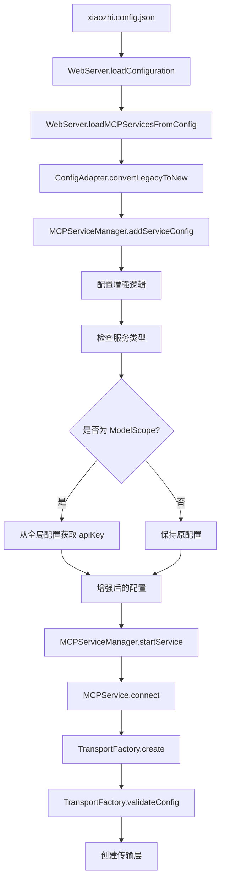
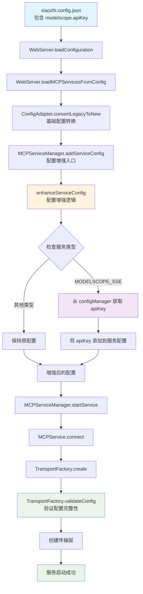
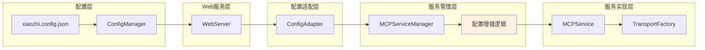

# MCP 服务配置增强技术方案

## 1. 问题分析

### 1.1 问题描述

在运行 xiaozhi-client 项目时遇到 MCP 服务初始化错误：

```
[ERROR] 启动 Bazi-MCP 服务失败: modelscope-sse 类型需要 apiKey 字段
[ERROR] 连接初始化失败: Error: modelscope-sse 类型需要 apiKey 字段
```

### 1.2 根本原因

1. **配置分离**：用户在 `xiaozhi.config.json` 中配置了 `"modelscope": { "apiKey": "xxx" }`，但这个配置与 `mcpServers` 中的服务配置是分离的
2. **配置转换缺失**：在 `ConfigAdapter.ts` 的 `convertLegacyToNew` 方法中，虽然能识别 ModelScope 服务并设置正确的传输类型，但没有将全局的 `modelscope.apiKey` 传递给服务配置
3. **验证失败**：`TransportFactory.ts` 在验证 `modelscope-sse` 类型配置时发现缺少必需的 `apiKey` 字段

### 1.3 配置流转链路

```
xiaozhi.config.json
├── modelscope.apiKey (全局配置)
└── mcpServers.xxx (服务配置)
    ↓
WebServer.loadMCPServicesFromConfig()
    ↓
ConfigAdapter.convertLegacyToNew() (缺少 apiKey 传递)
    ↓
MCPServiceManager.addServiceConfig()
    ↓
TransportFactory.validateConfig() (验证失败)
```

## 2. 解决方案分析

### 2.1 候选方案对比

| 方案 | 实施位置 | 可扩展性 | 代码解耦 | 实现复杂度 | 长远架构 |
|------|----------|----------|----------|------------|----------|
| 方案一 | WebServer.ts | 中等 | 差 | 中等 | 不适合 |
| 方案二 | MCPServiceManager.ts | 好 | 中等 | 低 | 适合 |
| 方案三 | TransportFactory.ts | 好 | 好 | 低 | 适合 |
| 方案四 | MCPService.ts | 差 | 中等 | 高 | 不适合 |

### 2.2 各方案详细分析

#### 方案一：WebServer 初始化阶段组装配置

**优势：**
- 配置逻辑集中在初始化阶段
- 可以统一处理所有需要全局配置的服务

**劣势：**
- WebServer 承担过多职责，违反单一职责原则
- 如果有多种服务类型需要全局配置，WebServer 会变得复杂
- 配置逻辑与业务逻辑混合

#### 方案二：MCPServiceManager 处理配置增强

**优势：**
- MCPServiceManager 作为服务管理中心，处理服务配置是其职责范围
- 可以在服务启动前统一处理所有服务的配置增强
- 对其他组件透明，不影响现有架构
- 支持未来扩展更多服务类型的配置需求

**劣势：**
- MCPServiceManager 需要访问全局配置，增加了依赖

#### 方案三：TransportFactory 生成时添加配置

**优势：**
- TransportFactory 专门处理传输层配置，职责明确
- 可以根据不同传输类型灵活处理配置
- 配置逻辑集中在传输层创建时

**劣势：**
- TransportFactory 需要访问全局配置，增加了依赖
- 如果全局配置复杂，TransportFactory 会变得臃肿

#### 方案四：MCPService 直接处理

**优势：**
- 每个服务独立处理自己的配置需求
- 高度解耦，不影响其他组件

**劣势：**
- 配置逻辑分散在每个服务实例中
- 如果多个服务需要相同配置，会有重复代码
- 难以统一管理和维护

## 3. 推荐方案

### 3.1 选择方案二：MCPServiceManager 配置增强

**选择理由：**

1. **职责合理**：MCPServiceManager 作为服务管理中心，负责服务配置的增强和管理符合其职责定位
2. **可扩展性好**：未来如果有其他服务类型（如 GitHub、OpenAI 等）需要全局配置，可以在同一个地方统一处理
3. **实现简单**：只需要在服务启动前增强配置，不需要大幅修改现有架构
4. **风险较低**：修改范围小，不影响其他组件的正常工作
5. **维护性好**：配置增强逻辑集中，便于维护和调试

### 3.2 架构设计



## 4. 具体实施步骤

### 4.1 第一步：修改 MCPServiceManager.ts

在 `MCPServiceManager` 类中添加配置增强功能：

```typescript
import { configManager } from '../configManager.js';
import { MCPTransportType } from './MCPService.js';

export class MCPServiceManager {
  // ... 现有代码

  /**
   * 增强服务配置
   * 根据服务类型添加必要的全局配置
   */
  private enhanceServiceConfig(config: MCPServiceConfig): MCPServiceConfig {
    const enhancedConfig = { ...config };

    // 处理 ModelScope SSE 服务
    if (config.type === MCPTransportType.MODELSCOPE_SSE) {
      const modelScopeApiKey = configManager.getModelScopeApiKey();
      if (modelScopeApiKey) {
        enhancedConfig.apiKey = modelScopeApiKey;
      }
    }

    // 未来可以在这里添加其他服务类型的配置增强逻辑
    // if (config.type === MCPTransportType.GITHUB_SSE) {
    //   const githubApiKey = configManager.getGitHubApiKey();
    //   if (githubApiKey) {
    //     enhancedConfig.apiKey = githubApiKey;
    //   }
    // }

    return enhancedConfig;
  }

  /**
   * 添加服务配置（重载方法，支持配置增强）
   */
  addServiceConfig(name: string, config: MCPServiceConfig): void;
  addServiceConfig(config: MCPServiceConfig): void;
  addServiceConfig(
    nameOrConfig: string | MCPServiceConfig,
    config?: MCPServiceConfig
  ): void {
    let finalConfig: MCPServiceConfig;
    let serviceName: string;

    if (typeof nameOrConfig === "string" && config) {
      serviceName = nameOrConfig;
      finalConfig = config;
    } else if (typeof nameOrConfig === "object") {
      serviceName = nameOrConfig.name;
      finalConfig = nameOrConfig;
    } else {
      throw new Error("Invalid arguments for addServiceConfig");
    }

    // 增强配置
    const enhancedConfig = this.enhanceServiceConfig(finalConfig);

    // 存储增强后的配置
    this.configs[serviceName] = enhancedConfig;
    this.logger.info(`已添加并增强服务配置: ${serviceName}`);
  }
}
```

### 4.2 第二步：添加错误处理和日志

```typescript
/**
 * 增强服务配置
 * 根据服务类型添加必要的全局配置
 */
private enhanceServiceConfig(config: MCPServiceConfig): MCPServiceConfig {
  const enhancedConfig = { ...config };

  try {
    // 处理 ModelScope SSE 服务
    if (config.type === MCPTransportType.MODELSCOPE_SSE) {
      const modelScopeApiKey = configManager.getModelScopeApiKey();
      if (modelScopeApiKey) {
        enhancedConfig.apiKey = modelScopeApiKey;
        this.logger.info(`为 ${config.name} 服务添加 ModelScope API Key`);
      } else {
        this.logger.warn(`${config.name} 服务需要 ModelScope API Key，但未在配置中找到`);
        throw new Error(`ModelScope SSE 服务 ${config.name} 需要 API Key，请在配置文件中设置 modelscope.apiKey`);
      }
    }

    return enhancedConfig;
  } catch (error) {
    this.logger.error(`配置增强失败: ${config.name}`, error);
    throw error;
  }
}
```

### 4.3 第三步：更新配置验证

在 `TransportFactory.ts` 中优化错误提示：

```typescript
case MCPTransportType.MODELSCOPE_SSE:
  if (!config.url) {
    throw new Error("modelscope-sse 类型需要 url 字段");
  }
  if (!config.apiKey) {
    throw new Error(
      `modelscope-sse 类型需要 apiKey 字段。请在配置文件中设置 modelscope.apiKey 或确保服务配置包含 apiKey`
    );
  }
  break;
```

## 5. 测试策略

### 5.1 单元测试

为配置增强逻辑添加单元测试：

```typescript
// src/services/__tests__/MCPServiceManager.test.ts
describe('MCPServiceManager 配置增强', () => {
  it('应该为 ModelScope SSE 服务添加 API Key', () => {
    const mockConfig = {
      name: 'test-modelscope',
      type: MCPTransportType.MODELSCOPE_SSE,
      url: 'https://mcp.api-inference.modelscope.net/test/sse'
    };

    // Mock configManager
    jest.spyOn(configManager, 'getModelScopeApiKey').mockReturnValue('test-api-key');

    const manager = new MCPServiceManager();
    manager.addServiceConfig(mockConfig);

    const storedConfig = manager.getServiceConfig('test-modelscope');
    expect(storedConfig.apiKey).toBe('test-api-key');
  });

  it('应该在缺少 API Key 时抛出错误', () => {
    const mockConfig = {
      name: 'test-modelscope',
      type: MCPTransportType.MODELSCOPE_SSE,
      url: 'https://mcp.api-inference.modelscope.net/test/sse'
    };

    // Mock configManager 返回空值
    jest.spyOn(configManager, 'getModelScopeApiKey').mockReturnValue(undefined);

    const manager = new MCPServiceManager();
    expect(() => {
      manager.addServiceConfig(mockConfig);
    }).toThrow('ModelScope SSE 服务 test-modelscope 需要 API Key');
  });
});
```

### 5.2 集成测试

验证整个配置流程：

```typescript
// src/__tests__/integration/mcp-config.test.ts
describe('MCP 配置集成测试', () => {
  it('应该正确处理 ModelScope 服务配置', async () => {
    // 模拟配置文件
    const mockConfig = {
      mcpEndpoint: 'wss://test.xiaozhi.me',
      mcpServers: {
        'modelscope-test': {
          type: 'sse',
          url: 'https://mcp.api-inference.modelscope.net/test/sse'
        }
      },
      modelscope: {
        apiKey: 'test-api-key'
      }
    };

    // 测试完整流程
    const webServer = new WebServer();
    await webServer.loadMCPServicesFromConfig(mockConfig.mcpServers);

    // 验证服务配置是否正确增强
    const serviceManager = await MCPServiceManagerSingleton.getInstance();
    const config = serviceManager.getServiceConfig('modelscope-test');

    expect(config.type).toBe(MCPTransportType.MODELSCOPE_SSE);
    expect(config.apiKey).toBe('test-api-key');
  });
});
```

## 6. 部署和回滚策略

### 6.1 部署步骤

1. **代码审查**：确保所有修改都经过代码审查
2. **单元测试**：运行所有相关的单元测试
3. **集成测试**：在测试环境中验证完整流程
4. **灰度发布**：先在部分用户中测试
5. **全量发布**：确认无问题后全量发布

### 6.2 回滚策略

如果发现问题，可以快速回滚：

1. **配置回滚**：恢复到修改前的配置处理逻辑
2. **代码回滚**：回滚到上一个稳定版本
3. **数据一致性**：确保配置文件格式兼容

## 7. 后续扩展考虑

### 7.1 通用配置增强机制

设计一个可扩展的配置增强框架：

```typescript
interface ConfigEnhancer {
  canEnhance(config: MCPServiceConfig): boolean;
  enhance(config: MCPServiceConfig): MCPServiceConfig;
}

class ModelScopeConfigEnhancer implements ConfigEnhancer {
  canEnhance(config: MCPServiceConfig): boolean {
    return config.type === MCPTransportType.MODELSCOPE_SSE;
  }

  enhance(config: MCPServiceConfig): MCPServiceConfig {
    const apiKey = configManager.getModelScopeApiKey();
    if (!apiKey) {
      throw new Error(`ModelScope SSE 服务 ${config.name} 需要 API Key`);
    }
    return { ...config, apiKey };
  }
}

class ConfigEnhancerRegistry {
  private enhancers: ConfigEnhancer[] = [];

  register(enhancer: ConfigEnhancer): void {
    this.enhancers.push(enhancer);
  }

  enhance(config: MCPServiceConfig): MCPServiceConfig {
    let enhancedConfig = config;
    for (const enhancer of this.enhancers) {
      if (enhancer.canEnhance(enhancedConfig)) {
        enhancedConfig = enhancer.enhance(enhancedConfig);
      }
    }
    return enhancedConfig;
  }
}
```

### 7.2 配置热更新支持

支持配置文件变更时自动重新加载服务：

```typescript
class MCPServiceManager {
  private configWatcher?: FSWatcher;

  startConfigWatcher(): void {
    const configPath = configManager.getConfigFilePath();
    this.configWatcher = watch(configPath, async (eventType) => {
      if (eventType === 'change') {
        this.logger.info('配置文件发生变更，重新加载服务...');
        await this.reloadServices();
      }
    });
  }

  private async reloadServices(): Promise<void> {
    // 停止所有服务
    await this.stopAllServices();

    // 重新加载配置
    configManager.clearCache();

    // 重新启动服务
    await this.startAllServices();
  }
}
```

### 7.3 配置验证增强

添加更完善的配置验证：

```typescript
interface ConfigValidator {
  validate(config: MCPServiceConfig): ValidationResult;
}

interface ValidationResult {
  valid: boolean;
  errors: string[];
  warnings: string[];
}

class ModelScopeConfigValidator implements ConfigValidator {
  validate(config: MCPServiceConfig): ValidationResult {
    const result: ValidationResult = {
      valid: true,
      errors: [],
      warnings: []
    };

    if (config.type === MCPTransportType.MODELSCOPE_SSE) {
      if (!config.apiKey) {
        result.valid = false;
        result.errors.push('ModelScope SSE 服务需要 API Key');
      }

      if (!config.url?.includes('modelscope.net')) {
        result.warnings.push('URL 似乎不是 ModelScope 的官方地址');
      }
    }

    return result;
  }
}
```

## 8. 架构图

### 8.1 配置流转架构



### 8.2 组件职责图



## 9. 总结

本技术方案通过在 `MCPServiceManager` 中添加配置增强逻辑，解决了 ModelScope MCP 服务初始化时缺少 API Key 的问题。该方案具有以下优势：

### 9.1 核心优势

1. **职责清晰**：配置增强逻辑集中在服务管理层，符合单一职责原则
2. **可扩展性好**：支持未来添加更多服务类型的配置需求（如 GitHub、OpenAI 等）
3. **实现简单**：修改范围小，风险可控，不破坏现有架构
4. **维护性好**：配置逻辑集中，便于维护和调试
5. **用户友好**：用户只需在一个地方配置 API Key，系统自动应用到相关服务

### 9.2 解决的问题

- ✅ **配置分离问题**：统一处理全局配置和服务配置的关联
- ✅ **错误提示优化**：提供更友好的错误信息和解决建议
- ✅ **配置复用**：避免在每个服务配置中重复设置相同的认证信息
- ✅ **架构一致性**：保持现有组件职责清晰，不引入额外复杂性

### 9.3 实施效果

通过这个方案，用户只需要在 `xiaozhi.config.json` 中配置：

```json
{
  "modelscope": {
    "apiKey": "your-api-key-here"
  },
  "mcpServers": {
    "modelscope-service": {
      "type": "sse",
      "url": "https://mcp.api-inference.modelscope.net/xxx/sse"
    }
  }
}
```

系统就能自动将 `modelscope.apiKey` 应用到所有 ModelScope 类型的 MCP 服务中，无需在每个服务配置中重复设置，大大提升了用户体验和配置的可维护性。
