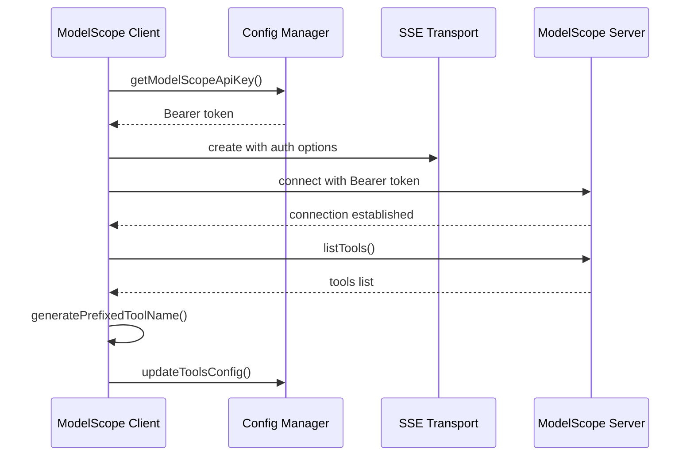
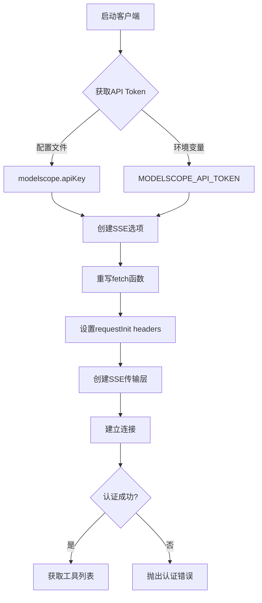
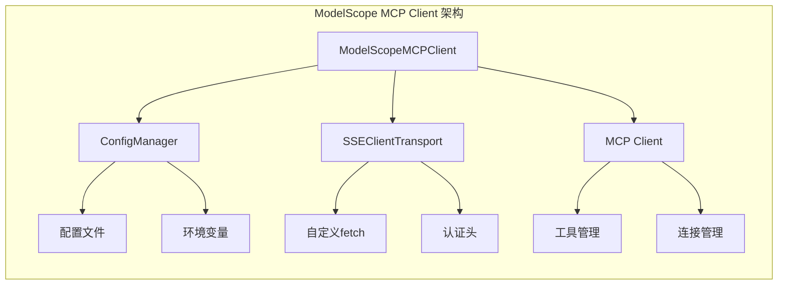
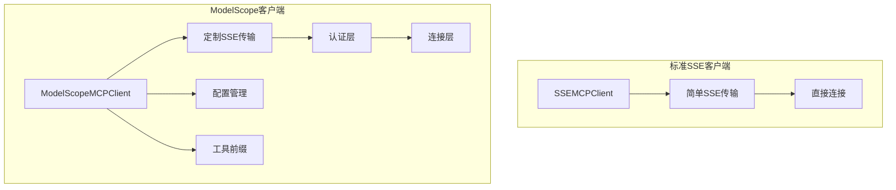

# ModelScope MCP客户端差异分析报告

## 执行摘要

本报告对`src/modelScopeMCPClient.ts`的实现进行了深入的技术分析，重点关注其与标准SSE MCP服务的差异。ModelScope MCP客户端采用了专门的认证机制和传输层定制，以支持ModelScope平台的特殊要求。

### 关键发现
- ModelScope使用Bearer token认证，需要在多个层面配置认证头
- 实现了复杂的SSE传输层定制，包括fetch函数重写
- 采用了工具名称前缀机制避免冲突
- 与配置管理系统深度集成

## 1. 实现细节分析

### 1.1 类结构和依赖

```typescript
export class ModelScopeMCPClient implements IMCPClient {
  private name: string;
  private config: SSEMCPServerConfig;
  private client: Client | null = null;
  private transport: SSEClientTransport | null = null;
  public initialized = false;
  public tools: Tool[] = [];
  public originalTools: Tool[] = [];
}
```

**关键依赖**：
- `@modelcontextprotocol/sdk/client/sse.js` - SSE传输层
- `eventsource` - EventSource polyfill
- `configManager` - 配置管理集成

### 1.2 认证机制深度解析

#### 1.2.1 Token获取策略
```typescript
const token = configManager.getModelScopeApiKey();
```

**优先级顺序**：
1. 配置文件中的`modelscope.apiKey`
2. 环境变量`MODELSCOPE_API_TOKEN`

#### 1.2.2 认证头配置
ModelScope客户端在两个层面配置认证头：

```typescript
const sseOptions = {
  eventSourceInit: {
    fetch: async (url: string | URL | Request, init?: RequestInit) => {
      const headers = {
        ...init?.headers,
        Authorization: `Bearer ${token}`,
      };
      return fetch(url, { ...init, headers });
    },
  },
  requestInit: {
    headers: {
      Authorization: `Bearer ${token}`,
    },
  },
};
```

**技术要点**：
- `eventSourceInit.fetch`：重写fetch函数，确保所有请求都包含认证头
- `requestInit.headers`：为初始连接请求设置认证头
- 双重保障机制确保认证的可靠性

## 2. 与标准SSE服务的对比分析

### 2.1 连接建立差异

#### 标准SSE客户端 (`src/sseMCPClient.ts`)
```typescript
this.transport = new SSEClientTransport(new URL(this.config.url));
```

#### ModelScope SSE客户端
```typescript
this.transport = new SSEClientTransport(
  new URL(this.config.url),
  sseOptions
);
```

### 2.2 配置复杂度对比

| 特性 | 标准SSE | ModelScope SSE |
|------|---------|----------------|
| 认证方式 | 无或简单headers | Bearer token + fetch重写 |
| 配置复杂度 | 低 | 高 |
| 传输层定制 | 无 | eventSourceInit + requestInit |
| 错误处理 | 基础 | 增强（认证失败处理） |

## 3. ModelScope特有的协议扩展

### 3.1 工具名称前缀机制

```typescript
private generatePrefixedToolName(originalToolName: string): string {
  const normalizedServerName = this.name.replace(/-/g, "_");
  return `${normalizedServerName}_xzcli_${originalToolName}`;
}
```

**目的**：避免不同MCP服务间的工具名称冲突

**示例**：
- 原始工具名：`search`
- 前缀后：`modelscope_server_xzcli_search`

### 3.2 配置管理集成

ModelScope客户端与配置管理系统深度集成：

```typescript
// 工具过滤
private filterEnabledTools(allTools: Tool[]): Tool[] {
  return allTools.filter((tool) => {
    const originalName = this.getOriginalToolName(tool.name);
    return configManager.isToolEnabled(this.name, originalName);
  });
}

// 配置更新
private async updateToolsConfig(): Promise<void> {
  // 自动更新配置文件中的工具列表
}
```

## 4. 数据格式和流程分析

### 4.1 工具调用流程



### 4.2 认证流程详解



## 5. 错误处理和异常情况

### 5.1 认证失败处理
```typescript
if (!token || token === "") {
  throw new Error(
    "未设置 ModelScope API Key。请在配置文件中设置 modelscope.apiKey 或设置 MODELSCOPE_API_TOKEN 环境变量。"
  );
}
```

### 5.2 连接错误处理
- 详细的错误日志记录
- 认证错误的特殊处理
- 连接状态的准确跟踪

## 6. 性能和资源使用分析

### 6.1 内存使用
- 维护两套工具列表：`tools`（前缀后）和`originalTools`（原始）
- 配置缓存和工具配置的内存开销

### 6.2 网络开销
- 双重认证头设置可能导致轻微的网络开销
- fetch函数重写增加了请求处理的复杂度

## 7. 安全性分析

### 7.1 认证安全
- Bearer token通过HTTPS传输
- 支持配置文件和环境变量两种token存储方式
- 没有token缓存或持久化的安全风险

### 7.2 潜在风险
- fetch函数重写可能引入安全漏洞
- 需要确保token的安全存储和传输

## 8. 架构模式分析

### 8.1 当前架构模式



### 8.2 与标准架构的差异



## 9. 技术债务和维护性分析

### 9.1 代码复杂度评估
- **认证逻辑复杂度**: 中等（双重认证机制）
- **配置管理复杂度**: 高（深度集成configManager）
- **工具管理复杂度**: 中等（前缀机制 + 过滤）
- **错误处理复杂度**: 中等（多层错误处理）

### 9.2 维护成本分析
1. **依赖管理**: 与configManager强耦合，增加维护成本
2. **测试复杂度**: 需要mock多个依赖，测试用例复杂
3. **文档维护**: 需要维护ModelScope特有的配置文档

### 9.3 扩展性评估
- **认证机制扩展**: 容易扩展其他认证方式
- **传输层扩展**: 受限于SSE协议，扩展性一般
- **工具管理扩展**: 前缀机制可扩展到其他命名策略

## 10. 结论和建议

### 10.1 技术优势
1. **专门优化**：针对ModelScope平台的特殊需求进行了专门优化
2. **认证可靠**：双重认证机制确保连接的可靠性
3. **配置集成**：与配置管理系统的深度集成提供了良好的用户体验
4. **工具隔离**：前缀机制有效避免了工具名称冲突

### 10.2 潜在改进点
1. **代码复用**：认证逻辑可以抽象为可复用的认证适配器
2. **配置解耦**：减少与configManager的强耦合
3. **错误处理**：可以增强错误处理和重试机制
4. **性能优化**：优化工具列表的内存使用

### 10.3 架构建议
1. **保持独立性**：在集成到通用架构时保持ModelScope客户端的独立性
2. **抽象认证层**：将认证机制抽象为可复用的认证适配器
3. **配置标准化**：建立ModelScope服务的配置标准
4. **监控增强**：添加更详细的连接和性能监控

### 10.4 集成建议
1. **渐进式集成**：分阶段将功能集成到通用架构
2. **功能保持**：确保现有功能在集成后完全保持
3. **测试覆盖**：建立全面的测试覆盖，特别是认证和工具管理部分
4. **文档完善**：提供详细的ModelScope集成文档

---

**报告生成时间**: 2025-08-12
**分析范围**: src/modelScopeMCPClient.ts 及相关依赖
**技术栈**: TypeScript, MCP SDK, SSE, Node.js
**代码行数**: 283行（主要实现）+ 测试文件
