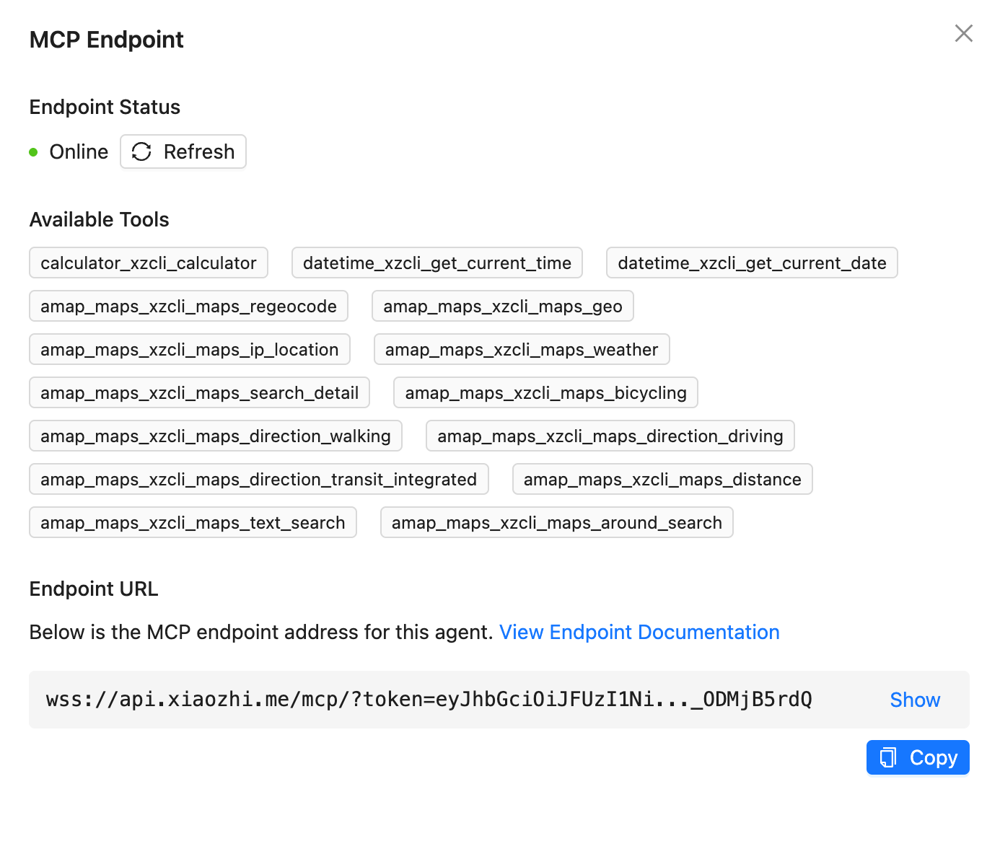

# Xiaozhi Client

小智 AI 客户端，目前主要用于 MCP 的对接



## 安装和使用

### 开发环境

1. 克隆项目：

```bash
git clone <repository-url>
cd xiaozhi-client
```

2. 安装依赖：

```bash
pnpm install
```

3. 构建项目：

```bash
pnpm run build
```

4. 本地安装（用于开发测试）：

```bash
npm link
```

现在你可以在任何地方使用 `xiaozhi` 命令了。

### 生产环境

项目使用 tsup 打包成单个可执行的 JavaScript 文件，所有依赖都被正确处理。

构建后的文件位于 `dist/cli.js`，这是一个完整的可执行文件，包含：

- 正确的 shebang (`#!/usr/bin/env node`)
- 所有必要的代码（除了外部依赖）
- 可执行权限

### 可用命令

```bash
# 查看帮助
xiaozhi --help

# 配置端点
xiaozhi set-config xiaozhi.endpoint=wss://your-endpoint

# 查看配置
xiaozhi get-config

# 启动服务
xiaozhi start

# 后台启动服务
xiaozhi start --daemon

# 查看服务状态
xiaozhi status

# 停止服务
xiaozhi stop

# 重启服务
xiaozhi restart
```

## 开发

### 构建脚本

- `pnpm run build` - 使用 tsup 构建项目（推荐）
- `pnpm run build:tsc` - 使用 TypeScript 编译器构建（备用）
- `pnpm run clean` - 清理构建文件
- `pnpm run dev` - 开发模式（监听文件变化）
- `pnpm run type-check` - 仅进行类型检查
- `pnpm run start` - 编译并启动服务

### 技术栈

- TypeScript
- tsup (打包工具)
- Commander.js (CLI 框架)
- Chalk (终端颜色)
- Ora (加载动画)
- Biome (代码格式化和检查)
- Vitest (单元测试)

### 代码质量

项目使用完整的 CI/CD 流程确保代码质量：

#### 测试

```bash
# 运行所有测试
pnpm run test

# 运行测试并生成覆盖率报告
pnpm run test:coverage

# 监听模式运行测试
pnpm run test:watch

# 运行测试UI界面
pnpm run test:ui
```

#### 代码检查和格式化

```bash
# 运行Biome代码检查（CI模式）
pnpm run ci

# 格式化代码
pnpm run format

# 检查格式（不修改文件）
pnpm run format:check

# 运行lint检查
pnpm run lint:check

# 运行lint并自动修复
pnpm run lint

# TypeScript类型检查
pnpm run type-check
```

#### CI/CD 流程

每次向 main 分支提交 PR 时，会自动运行以下检查：

1. **TypeScript 类型检查** - 确保没有类型错误
2. **Biome 代码检查** - 确保代码格式和质量符合规范
3. **单元测试** - 运行所有测试用例并生成覆盖率报告
4. **覆盖率检查** - 确保测试覆盖率不低于配置的阈值
5. **构建验证** - 确保项目能够正确构建
6. **产物验证** - 验证所有必要的构建产物都已生成
7. **CLI 可执行性测试** - 确保 CLI 工具可以正常执行

只有所有检查都通过，PR 才能被合并到 main 分支。

### 打包特性

- 使用 tsup 进行快速打包
- 自动处理 shebang 重复问题
- 自动添加可执行权限
- 支持 ES 模块
- 生成 source maps 和类型定义文件
