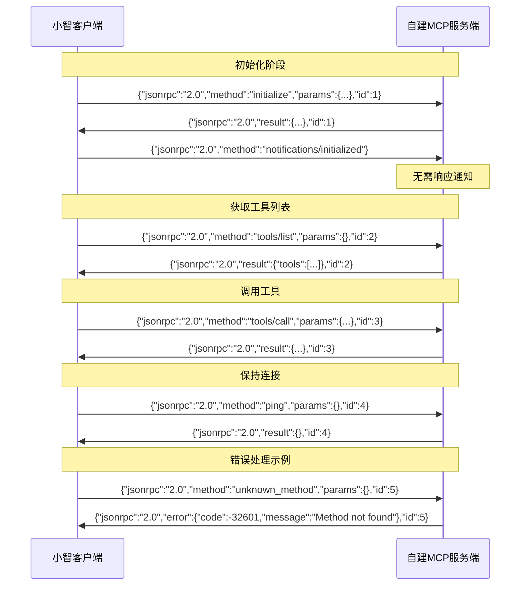

# Xiaozhi Client

[](https://badge.fury.io/js/xiaozhi-client)
[](https://codecov.io/gh/shenjingnan/xiaozhi-client)
[](https://github.com/shenjingnan/xiaozhi-client/actions)
[](https://opensource.org/licenses/MIT)

小智 AI 客户端，目前主要用于 MCP 的对接


## 功能特性

- 支持 小智(xiaozhi.me) 官方服务器接入点
- 支持 自定义 MCP 服务
- 支持 使用标准 MCP 配置方式多个 MCP Server
- 支持 聚合多个 MCP Server
- 支持 动态控制 MCP Server 提供的工具
- 支持 通过模板创建
- 支持 后台运行
- 支持 通过 SSE 类型接入 ModelScope MCP 服务

## 快速上手

### 全局安装 xiaozhi-client 命令行工具

```bash
## 安装
npm i -g xiaozhi-client

## 创建项目
xiaozhi create my-app --template hello-world

## 进入项目
cd my-app

## 安装依赖（主要是示例代码中mcp服务所使用的依赖）
pnpm install

# 修改 xiaozhi.config.json 中的 mcpEndpoint 为你的接入点地址（需要自行前往xiaozhi.me获取）
# 小智AI配置MCP接入点使用说明：https://ccnphfhqs21z.feishu.cn/wiki/HiPEwZ37XiitnwktX13cEM5KnSb

## 运行
xiaozhi start
```

### 通过 npx 直接运行

```bash
# 创建项目
npx -y xiaozhi-client create --template hello-world

# 进入项目目录
cd hello-world

# 安装依赖
pnpm install

# 修改 xiaozhi.config.json 中的 mcpEndpoint 为你的接入点地址（需要自行前往xiaozhi.me获取）
# 小智AI配置MCP接入点使用说明：https://ccnphfhqs21z.feishu.cn/wiki/HiPEwZ37XiitnwktX13cEM5KnSb

# 启动服务
npx -y xiaozhi-client start
```

## 可用命令

```bash
# 查看帮助
xiaozhi --help

# 启动服务
xiaozhi start

# 后台启动服务
xiaozhi start --daemon

# 将后台服务转到前台运行
xiaozhi attach

# 查看服务状态
xiaozhi status

# 停止服务
xiaozhi stop

# 重启服务
xiaozhi restart

# 列出所有使用的mcp服务
xiaozhi mcp list

# 列出所有mcp所提供的tools
xiaozhi mcp list --tools
```

## ModelScope MCP 服务集成

xiaozhi-client 现已支持接入 [ModelScope](https://www.modelscope.cn/mcp) 托管的 MCP 服务。

### 配置方式

在 `xiaozhi.config.json` 的 `mcpServers` 中添加 SSE 类型的配置：

```json
{
  "mcpServers": {
    "amap-maps": {
      "type": "sse",
      "url": "https://mcp.api-inference.modelscope.net/caa0bd914d9b44/sse"
    }
  }
}
```

### 使用前准备

1. 获取 ModelScope API Token：

   - 访问 [ModelScope](https://www.modelscope.cn) 并登录
   - 在个人中心获取 API Token

2. 配置 API Token（两种方式任选其一）：

   **方式一：在配置文件中设置（推荐）**

   ```json
   {
     "modelscope": {
       "apiKey": "你的API Token"
     }
   }
   ```

   **方式二：设置环境变量**

   ```bash
   export MODELSCOPE_API_TOKEN="你的API Token"
   ```

3. 启动服务：
   ```bash
   xiaozhi start
   ```

### 注意事项

- ModelScope MCP 服务需要有效的 API Token 才能使用
- 配置文件中的 API Token 优先级高于环境变量
- 确保网络能够访问 ModelScope 的服务端点
- SSE 类型的服务会自动识别并使用相应的连接方式

## 自建服务端 JSON-RPC 消息格式规范

如果您使用自建的 MCP 服务端，请确保遵循以下 JSON-RPC 2.0 消息格式规范：

### 消息类型

#### 1. 请求（Request）- 需要响应

```json
{
  "jsonrpc": "2.0",
  "method": "方法名",
  "params": {},
  "id": 1 // 必须包含id字段，可以是数字或字符串
}
```

支持的请求方法：

- `initialize` - 初始化连接
- `tools/list` - 获取工具列表
- `tools/call` - 调用工具
- `ping` - 连接测试

#### 2. 通知（Notification）- 不需要响应

```json
{
  "jsonrpc": "2.0",
  "method": "方法名",
  "params": {}
  // 注意：不能包含id字段
}
```

支持的通知方法：

- `notifications/initialized` - 初始化完成通知

#### 3. 成功响应（Response）

```json
{
  "jsonrpc": "2.0",
  "result": {},
  "id": 1 // 必须与请求的id相同
}
```

#### 4. 错误响应（Error）

```json
{
  "jsonrpc": "2.0",
  "error": {
    "code": -32600,
    "message": "错误描述"
  },
  "id": 1 // 必须与请求的id相同
}
```

### 重要注意事项

1. **关键区别**：请求和通知的唯一区别是是否包含 `id` 字段

   - 有 `id` = 请求，需要响应
   - 无 `id` = 通知，不需要响应

2. **"notifications/initialized" 必须作为通知发送**：

   ```json
   // ✅ 正确
   {
     "jsonrpc": "2.0",
     "method": "notifications/initialized"
   }

   // ❌ 错误 - 不应包含id
   {
     "jsonrpc": "2.0",
     "method": "notifications/initialized",
     "id": 1
   }
   ```

3. **消息分隔**：每条 JSON-RPC 消息必须以换行符 `\n` 结束

4. **通信流程**：
   1. 客户端发送 `initialize` 请求
   2. 服务端返回 `initialize` 响应
   3. 客户端发送 `notifications/initialized` 通知（无需响应）
   4. 后续可进行工具列表查询和调用

### 通信时序图



### 常见错误

如果您看到类似 "未知的方法：notifications/initialized" 的错误，通常是因为在通知消息中错误地包含了 `id` 字段，导致客户端将其识别为请求而非通知。

## Web UI 配置界面

xiaozhi-client 提供了一个现代化的 Web UI 界面，让配置 MCP 服务更加直观和便捷。


### 功能特性

- 🎨 **现代化界面**：基于 React + TypeScript + Tailwind CSS 构建
- 🔧 **可视化配置**：直观的界面操作，无需手动编辑 JSON 文件
- 🚀 **实时连接状态**：实时显示与小智服务器的连接状态
- 📦 **MCP 服务管理**：
  - 添加/编辑/删除 MCP 服务
  - 支持本地服务和 SSE 服务
  - 支持批量导入配置
- ⚙️ **配置管理**：
  - 编辑连接参数（心跳间隔、超时时间等）
  - 管理 ModelScope API Key

### 启动 Web UI

```bash
xiaozhi ui
```
