# Xiaozhi Client

[](https://badge.fury.io/js/xiaozhi-client)
[](https://codecov.io/gh/shenjingnan/xiaozhi-client)
[](https://github.com/shenjingnan/xiaozhi-client/actions)
[](https://opensource.org/licenses/MIT)


小智 AI 客户端，目前主要用于 MCP 的对接


## 目录

1. [Xiaozhi Client](#xiaozhi-client)
   1. [目录](#目录)
   2. [功能特色](#功能特色)
   3. [快速上手](#快速上手)
      1. [全局安装 xiaozhi-client 命令行工具](#全局安装-xiaozhi-client-命令行工具)
      2. [通过 npx 直接运行](#通过-npx-直接运行)
      3. [使用 Docker 运行](#使用-docker-运行)
         1. [前置要求](#前置要求)
         2. [快速启动](#快速启动)
         3. [获取小智接入点地址](#获取小智接入点地址)
         4. [配置服务](#配置服务)
            1. [方式一：通过 Web UI 配置（推荐）](#方式一通过-web-ui-配置推荐)
            2. [方式二：直接编辑配置文件](#方式二直接编辑配置文件)
         5. [常用操作](#常用操作)
         6. [故障排除](#故障排除)
   4. [可用命令](#可用命令)
   5. [多接入点配置](#多接入点配置)
      1. [配置方式](#配置方式)
         1. [方式一：单接入点配置（字符串）](#方式一单接入点配置字符串)
         2. [方式二：多接入点配置（字符串数组）](#方式二多接入点配置字符串数组)
      2. [使用命令管理接入点](#使用命令管理接入点)
      3. [示例配置](#示例配置)
      4. [注意事项](#注意事项)
   6. [ModelScope MCP 服务集成](#modelscope-mcp-服务集成)
      1. [配置方式](#配置方式-1)
      2. [使用前准备](#使用前准备)
      3. [注意事项](#注意事项-1)
   7. [自建服务端 JSON-RPC 消息格式规范](#自建服务端-json-rpc-消息格式规范)
      1. [消息类型](#消息类型)
         1. [1. 请求（Request）- 需要响应](#1-请求request--需要响应)
         2. [2. 通知（Notification）- 不需要响应](#2-通知notification--不需要响应)
         3. [3. 成功响应（Response）](#3-成功响应response)
         4. [4. 错误响应（Error）](#4-错误响应error)
      2. [重要注意事项](#重要注意事项)
      3. [通信时序图](#通信时序图)
      4. [常见错误](#常见错误)
   8. [Web UI 配置界面](#web-ui-配置界面)
      1. [功能特性](#功能特性)
      2. [启动 Web UI](#启动-web-ui)
   9. [作为 MCP Server 集成到其他客户端](#作为-mcp-server-集成到其他客户端)
      1. [方式一：使用 stdio 模式（推荐）](#方式一使用-stdio-模式推荐)
      2. [方式二：使用 HTTP Server 模式](#方式二使用-http-server-模式)

## 功能特色

- 支持 小智(xiaozhi.me) 官方服务器接入点
- 支持 作为普通 MCP Server 集成到 Cursor/Cherry Studio 等客户端
- 支持 配置多个小智接入点，实现多个小智设备共享一个 MCP 配置
- 支持 通过标准方式聚合多个 MCP Server
- 支持 动态控制 MCP Server 工具的可见性，避免由于无用工具过多导致的小智服务端异常
- 支持 本地化部署的开源服务端集成，你可以使用和小智官方服务端一样的 RPC 通信或直接使用标准 MCP 集成方式
- 支持 Web 网页可视化配置(允许自定义 IP 和端口，你能将 xiaozhi-client 部署在设备 A，然后在设备 B 通过网页控制 xiaozhi-client)
- 支持 集成 ModelScope 的远程 MCP 服务
- 支持 通过模板创建 xiaozhi-client 项目 (xiaozhi create \<my-app\> --template hello-world)
- 支持 后台运行(xiaozhi start -d)

## 快速上手

### 全局安装 xiaozhi-client 命令行工具

```bash
## 安装
npm i -g xiaozhi-client

## 创建项目
xiaozhi create my-app --template hello-world

## 进入项目
cd my-app

## 安装依赖（主要是示例代码中mcp服务所使用的依赖）
pnpm install

## 初始化配置
xiaozhi config init

## 设置接入点地址（需要自行前往xiaozhi.me获取）
xiaozhi config set mcpEndpoint "your-endpoint-url"
# 小智AI配置MCP接入点使用说明：https://ccnphfhqs21z.feishu.cn/wiki/HiPEwZ37XiitnwktX13cEM5KnSb

## 运行
xiaozhi start
```

### 通过 npx 直接运行

```bash
# 创建项目
npx -y xiaozhi-client create my-app --template hello-world

# 进入项目目录
cd my-app

# 安装依赖
pnpm install

# 初始化配置
npx -y xiaozhi-client config init

# 设置接入点地址（需要自行前往xiaozhi.me获取）
npx -y xiaozhi-client config set mcpEndpoint "your-endpoint-url"
# 小智AI配置MCP接入点使用说明：https://ccnphfhqs21z.feishu.cn/wiki/HiPEwZ37XiitnwktX13cEM5KnSb

# 启动服务
npx -y xiaozhi-client start
```

### 使用 Docker 运行

我们提供了预配置的 Docker 镜像，可以快速启动 xiaozhi-client 环境。

#### 前置要求

- 已安装 Docker
- 已获取小智接入点地址（参见下方"[获取小智接入点地址](#获取小智接入点地址)"部分）

#### 快速启动

**方式一：使用启动脚本（推荐）**

这个脚本会自动完成以下操作：

- 创建工作目录 `~/xiaozhi-client`
- 拉取指定版本的 Docker 镜像
- 停止并删除已存在的容器（如果有）
- 启动新的容器并配置端口映射

**基本使用：**

> 下载并运行启动脚本（默认使用最新版本）

```bash
curl -fsSL https://raw.githubusercontent.com/shenjingnan/xiaozhi-client/main/docker-start.sh | bash
```

> 无法访问 `Github` 可以使用 `Gitee` 替代

```bash
curl -fsSL https://gitee.com/shenjingnan/xiaozhi-client/raw/main/docker-start.sh | bash
```

**指定版本运行：**

启动脚本现在支持灵活的版本指定方式：

```bash
# 下载脚本
curl -fsSL https://raw.githubusercontent.com/shenjingnan/xiaozhi-client/main/docker-start.sh -o docker-start.sh

# 下载脚本（Gitee）
curl -fsSL https://gitee.com/shenjingnan/xiaozhi-client/raw/main/docker-start.sh | bash

# 为脚本设置可执行权限
chmod +x docker-start.sh

# 使用默认版本 (latest)
./docker-start.sh

# 通过位置参数指定版本
./docker-start.sh v1.6.0

# 查看帮助信息
./docker-start.sh --help
```

**方式二：使用 Docker Compose**

首先获取 docker-compose.yml 文件：

```bash
# 下载 docker-compose.yml 文件
curl -O https://raw.githubusercontent.com/shenjingnan/xiaozhi-client/main/docker-compose.yml

# 下载 docker-compose.yml 文件（Gitee）
curl -O https://gitee.com/shenjingnan/xiaozhi-client/raw/main/docker-compose.yml

# 使用 Docker Compose 启动
docker-compose up -d

# 查看日志
docker-compose logs -f

# 停止服务
docker-compose down
```

**方式三：手动启动**

```bash
# 创建工作目录（用于持久化配置文件）
mkdir -p ~/xiaozhi-client

# 拉取并运行 Docker 镜像（后台运行）
docker run -d \
  --name xiaozhi-client \
  -p 9999:9999 \
  -p 3000:3000 \
  -v ~/xiaozhi-client:/workspaces \
  --restart unless-stopped \
  shenjingnan/xiaozhi-client
```

**参数说明**：

- `-d`：后台运行
- `--name xiaozhi-client`：容器名称
- `-p 9999:9999`：Web UI 配置界面端口
- `-p 3000:3000`：HTTP Server 模式端口（用于与其他 MCP 客户端集成）
- `-v ~/xiaozhi-client:/workspaces`：挂载本地目录用于持久化配置文件和数据
- `--restart unless-stopped`：容器自动重启策略

#### 获取小智接入点地址

在配置 xiaozhi-client 之前，您需要先获取小智接入点地址：

1. 访问 [xiaozhi.me](https://xiaozhi.me) 并登录
2. 进入 MCP 配置页面
3. 创建新的接入点或使用现有接入点
4. 复制接入点地址（格式类似：`wss://api.xiaozhi.me/mcp/your-endpoint-id`）

详细配置说明请参考：[小智 AI 配置 MCP 接入点使用说明](https://ccnphfhqs21z.feishu.cn/wiki/HiPEwZ37XiitnwktX13cEM5KnSb)

#### 配置服务

容器启动后，有两种方式配置 xiaozhi-client：

##### 方式一：通过 Web UI 配置（推荐）

1. 打开浏览器访问：<http://localhost:9999>
2. 在 Web UI 界面中设置你的小智接入点地址
3. 配置其他 MCP 服务（可选）

##### 方式二：直接编辑配置文件

1. 首次启动后，容器会在 `~/xiaozhi-client` 目录中创建默认配置文件。如果文件不存在，可以手动创建：

```bash
# 创建配置文件
cat > ~/xiaozhi-client/xiaozhi.config.json << 'EOF'
{
  "mcpEndpoint": "",
  "mcpServers": {},
  "modelscope": {
    "apiKey": ""
  },
  "connection": {
    "heartbeatInterval": 30000,
    "heartbeatTimeout": 10000,
    "reconnectInterval": 5000
  },
  "webUI": {
    "port": 9999
  }
}
EOF
```

2. 编辑配置文件，修改 `mcpEndpoint` 字段：

```bash
# 编辑配置文件
vim ~/xiaozhi-client/xiaozhi.config.json
```

将 `mcpEndpoint` 修改为您的实际接入点地址：

```json
{
  "mcpEndpoint": "wss://api.xiaozhi.me/mcp/your-actual-endpoint-id"
}
```

3. 重启容器使配置生效：

```bash
docker restart xiaozhi-client
```

#### 常用操作

```bash
# 查看日志
docker logs -f xiaozhi-client

# 停止服务
docker stop xiaozhi-client

# 启动服务
docker start xiaozhi-client

# 重启服务
docker restart xiaozhi-client

# 删除容器（注意：配置文件会保留在 ~/xiaozhi-client 中）
docker rm -f xiaozhi-client

# 检查服务状态
docker exec -it xiaozhi-client xiaozhi status

# 列出所有mcp服务
docker exec -it xiaozhi-client xiaozhi mcp list

# 列出所有mcp所提供的tools
docker exec -it xiaozhi-client xiaozhi mcp list --tools
```

#### 故障排除

**问题 1：容器启动失败**

```bash
# 检查容器状态
docker ps -a | grep xiaozhi-client

# 查看详细错误日志
docker logs xiaozhi-client
```

**问题 2：无法访问 Web UI (http://localhost:9999)**

- 检查容器是否正在运行：`docker ps | grep xiaozhi-client`
- 检查端口是否被占用：`lsof -i :9999` (macOS/Linux) 或 `netstat -ano | findstr :9999` (Windows)
- 确认防火墙设置允许访问 9999 端口

**问题 3：配置文件不生效**

- 确认配置文件路径：`ls -la ~/xiaozhi-client/xiaozhi.config.json`
- 检查配置文件格式是否正确（JSON 语法）
- 重启容器：`docker restart xiaozhi-client`

**问题 4：连接小智服务器失败**

- 检查接入点地址是否正确
- 确认网络连接正常
- 查看容器日志：`docker logs -f xiaozhi-client`

**问题 5：端口冲突**

如果默认端口被占用，可以修改端口映射：

```bash
# 使用不同的端口启动
docker run -d \
  --name xiaozhi-client \
  -p 8888:9999 \
  -p 3001:3000 \
  -v ~/xiaozhi-client:/workspaces \
  --restart unless-stopped \
  shenjingnan/xiaozhi-client
```

然后访问 <http://localhost:8888> 进行配置。

## 可用命令

### 基本命令

```bash
# 查看帮助
xiaozhi --help

# 查看版本信息
xiaozhi --version

# 查看详细系统信息
xiaozhi --info
```

### 项目管理

```bash
# 创建项目
xiaozhi create my-app --template hello-world

# 初始化配置文件
xiaozhi config init

# 查看配置
xiaozhi config get mcpEndpoint

# 设置配置
xiaozhi config set mcpEndpoint "your-endpoint-url"
```

### 服务管理

```bash
# 启动服务（前台）
xiaozhi start

# 后台启动服务
xiaozhi start -d

# 启动并打开 Web UI
xiaozhi start -u

# 以 MCP Server 模式启动（用于 Cursor 等客户端）
xiaozhi start --stdio

# 查看服务状态
xiaozhi status

# 停止服务
xiaozhi stop

# 重启服务
xiaozhi restart

# 将后台服务转到前台运行
xiaozhi attach
```

### MCP 管理

```bash
# 列出所有 MCP 服务
xiaozhi mcp list

# 列出所有 MCP 工具
xiaozhi mcp list --tools

# 查看特定服务
xiaozhi mcp server calculator
```

### 端点管理

```bash
# 列出所有端点
xiaozhi endpoint list

# 添加端点
xiaozhi endpoint add "ws://new-server:8080"

# 移除端点
xiaozhi endpoint remove "ws://old-server:8080"
```

### Web UI

```bash
# 启动 Web 配置界面
xiaozhi ui
```

> 📖 **详细使用说明**: 查看 [CLI 使用手册](docs/CLI.md) 获取完整的命令参考和使用示例。

## 多接入点配置

xiaozhi-client 支持同时连接多个小智 AI 接入点

### 配置方式

在 `xiaozhi.config.json` 中，`mcpEndpoint` 字段支持两种配置方式：

#### 方式一：单接入点配置（字符串）

```json
{
  "mcpEndpoint": "wss://api.xiaozhi.me/mcp/your-endpoint-id"
}
```

#### 方式二：多接入点配置（字符串数组）

```json
{
  "mcpEndpoint": [
    "wss://api.xiaozhi.me/mcp/endpoint-1",
    "wss://api.xiaozhi.me/mcp/endpoint-2",
    "wss://api.xiaozhi.me/mcp/endpoint-3"
  ]
}
```

### 使用命令管理接入点

```bash
# 查看当前配置的所有接入点
xiaozhi endpoint list

# 添加新的接入点
xiaozhi endpoint add "wss://api.xiaozhi.me/mcp/new-endpoint"

# 移除指定的接入点
xiaozhi endpoint remove "wss://api.xiaozhi.me/mcp/old-endpoint"

# 设置单个接入点（覆盖现有配置）
xiaozhi endpoint set "wss://api.xiaozhi.me/mcp/endpoint-1"

# 或者使用 config 命令设置
xiaozhi config set mcpEndpoint "wss://api.xiaozhi.me/mcp/endpoint-1"
```

### 示例配置

```json
{
  "mcpEndpoint": [
    "wss://api.xiaozhi.me/mcp/305847/abc123",
    "wss://api.xiaozhi.me/mcp/468832/def456"
  ],
  "mcpServers": {
    "calculator": {
      "command": "node",
      "args": ["./mcpServers/calculator.js"]
    },
    "datetime": {
      "command": "node",
      "args": ["./mcpServers/datetime.js"]
    }
  }
}
```

### 注意事项

- 多接入点配置时，每个接入点会启动独立的 MCP 进程
- 确保每个接入点的 URL 都是有效的
- 接入点之间相互独立，一个接入点的故障不会影响其他接入点
- 建议根据实际需求合理配置接入点数量

## ModelScope MCP 服务集成

xiaozhi-client 现已支持接入 [ModelScope](https://www.modelscope.cn/mcp) 托管的 MCP 服务。

### 配置方式

在 `xiaozhi.config.json` 的 `mcpServers` 中添加 SSE 类型的配置：

```json
{
  "mcpServers": {
    "amap-maps": {
      "type": "sse",
      "url": "https://mcp.api-inference.modelscope.net/caa0bd914d9b44/sse"
    }
  }
}
```

### 使用前准备

1. 获取 ModelScope API Token：

   - 访问 [ModelScope](https://www.modelscope.cn) 并登录
   - 在个人中心获取 API Token

2. 配置 API Token（两种方式任选其一）：

   **方式一：在配置文件中设置（推荐）**

   ```json
   {
     "modelscope": {
       "apiKey": "你的API Token"
     }
   }
   ```

   **方式二：设置环境变量**

   ```bash
   export MODELSCOPE_API_TOKEN="你的API Token"
   ```

3. 启动服务：

   ```bash
   xiaozhi start
   ```

### 注意事项

- ModelScope MCP 服务需要有效的 API Token 才能使用
- 配置文件中的 API Token 优先级高于环境变量
- 确保网络能够访问 ModelScope 的服务端点
- SSE 类型的服务会自动识别并使用相应的连接方式

## 自建服务端 JSON-RPC 消息格式规范

如果您使用自建的 MCP 服务端，请确保遵循以下 JSON-RPC 2.0 消息格式规范：

### 消息类型

#### 1. 请求（Request）- 需要响应

```json
{
  "jsonrpc": "2.0",
  "method": "方法名",
  "params": {},
  "id": 1 // 必须包含id字段，可以是数字或字符串
}
```

支持的请求方法：

- `initialize` - 初始化连接
- `tools/list` - 获取工具列表
- `tools/call` - 调用工具
- `ping` - 连接测试

#### 2. 通知（Notification）- 不需要响应

```json
{
  "jsonrpc": "2.0",
  "method": "方法名",
  "params": {}
  // 注意：不能包含id字段
}
```

支持的通知方法：

- `notifications/initialized` - 初始化完成通知

#### 3. 成功响应（Response）

```json
{
  "jsonrpc": "2.0",
  "result": {},
  "id": 1 // 必须与请求的id相同
}
```

#### 4. 错误响应（Error）

```json
{
  "jsonrpc": "2.0",
  "error": {
    "code": -32600,
    "message": "错误描述"
  },
  "id": 1 // 必须与请求的id相同
}
```

### 重要注意事项

1. **关键区别**：请求和通知的唯一区别是是否包含 `id` 字段

   - 有 `id` = 请求，需要响应
   - 无 `id` = 通知，不需要响应

2. **"notifications/initialized" 必须作为通知发送**：

   ```json
   // ✅ 正确
   {
     "jsonrpc": "2.0",
     "method": "notifications/initialized"
   }

   // ❌ 错误 - 不应包含id
   {
     "jsonrpc": "2.0",
     "method": "notifications/initialized",
     "id": 1
   }
   ```

3. **消息分隔**：每条 JSON-RPC 消息必须以换行符 `\n` 结束

4. **通信流程**：
   1. 客户端发送 `initialize` 请求
   2. 服务端返回 `initialize` 响应
   3. 客户端发送 `notifications/initialized` 通知（无需响应）
   4. 后续可进行工具列表查询和调用

### 通信时序图

```mermaid
sequenceDiagram
    participant Client as 小智客户端
    participant Server as 自建MCP服务端

    Note over Client,Server: 初始化阶段
    Client->>Server: {"jsonrpc":"2.0","method":"initialize","params":{...},"id":1}
    Server->>Client: {"jsonrpc":"2.0","result":{...},"id":1}
    Client->>Server: {"jsonrpc":"2.0","method":"notifications/initialized"}
    Note over Server: 无需响应通知

    Note over Client,Server: 获取工具列表
    Client->>Server: {"jsonrpc":"2.0","method":"tools/list","params":{},"id":2}
    Server->>Client: {"jsonrpc":"2.0","result":{"tools":[...]},"id":2}

    Note over Client,Server: 调用工具
    Client->>Server: {"jsonrpc":"2.0","method":"tools/call","params":{...},"id":3}
    Server->>Client: {"jsonrpc":"2.0","result":{...},"id":3}

    Note over Client,Server: 保持连接
    Client->>Server: {"jsonrpc":"2.0","method":"ping","params":{},"id":4}
    Server->>Client: {"jsonrpc":"2.0","result":{},"id":4}

    Note over Client,Server: 错误处理示例
    Client->>Server: {"jsonrpc":"2.0","method":"unknown_method","params":{},"id":5}
    Server->>Client: {"jsonrpc":"2.0","error":{"code":-32601,"message":"Method not found"},"id":5}
```



### 常见错误

如果您看到类似 "未知的方法：notifications/initialized" 的错误，通常是因为在通知消息中错误地包含了 `id` 字段，导致客户端将其识别为请求而非通知。

## Web UI 配置界面

xiaozhi-client 提供了一个现代化的 Web UI 界面，让配置 MCP 服务更加直观和便捷。


### 功能特性

- 🎨 **现代化界面**：基于 React + TypeScript + Tailwind CSS 构建
- 🔧 **可视化配置**：直观的界面操作，无需手动编辑 JSON 文件
- 🚀 **实时连接状态**：实时显示与小智服务器的连接状态
- 📦 **MCP 服务管理**：
  - 添加/编辑/删除 MCP 服务
  - 支持本地服务和 SSE 服务
  - 支持批量导入配置
- ⚙️ **配置管理**：
  - 编辑连接参数（心跳间隔、超时时间等）
  - 管理 ModelScope API Key

### 启动 Web UI

```bash
# 启动 Web 配置界面
xiaozhi ui

# 或者在启动服务时同时启动 Web UI
xiaozhi start -u
```

启动后访问 <http://localhost:9999> 进行可视化配置。

## 作为 MCP Server 集成到其他客户端

> 需升级至 `1.5.0` 及以上版本

xiaozhi-client 不仅可以作为小智 AI 的客户端使用，还可以作为标准的 MCP Server 被 Cursor、Cherry Studio 等支持 MCP 协议的客户端集成。

这样做的好处是你无需在多个客户端中重复配置 MCP Server，只需要在 xiaozhi.config.json 中配置一遍 MCP 服务，即可在任意客户端集成。

并且，由于 xiaozhi-client 允许你自定义暴露哪些 MCP Server tools 因此你可以选择性的定制自己的工具集。


### 方式一：使用 stdio 模式（推荐）

第一步：确保已全局安装 xiaozhi-client：

```bash
npm install -g xiaozhi-client
```

第二步：在 客户端 的 MCP 配置中添加：

```json
{
  "mcpServers": {
    "xiaozhi-client": {
      "command": "xiaozhi",
      "args": ["start", "--stdio"]
    }
  }
}
```

提示：如果需要指定配置文件位置，可以使用环境变量

配置文件的查找顺序

1. 当前工作目录
2. 通过 `XIAOZHI_CONFIG_DIR` 环境变量指定的目录

```json
{
  "mcpServers": {
    "xiaozhi-client": {
      "command": "xiaozhi",
      "args": ["start", "--stdio"],
      "env": {
        "XIAOZHI_CONFIG_DIR": "/path/to/your/config/directory"
      }
    }
  }
}
```

### 方式二：使用 HTTP Server 模式

> 如果你将 xiaozhi-client 装在 docker 中使用，可以通过 HTTP 的方式暴露给外部客户端

第一步：启动 xiaozhi-client 服务：

```bash
# 使用默认端口 9999
xiaozhi start

# 使用自定义端口
xiaozhi start --port 8080

# 后台运行
xiaozhi start -d
```

第二步：在客户端中配置 HTTP 连接：

```json
{
  "mcpServers": {
    "xiaozhi-client": {
      "type": "streamableHttp",
      "url": "http://localhost:9999/mcp"
    }
  }
}
```

**说明：**
- 服务启动后，MCP 端点将在 `http://localhost:9999/mcp` 提供服务
- 支持标准的 MCP over HTTP 协议
- 可以通过 `--port` 参数自定义端口号
- 使用 `-d` 参数可以后台运行服务
