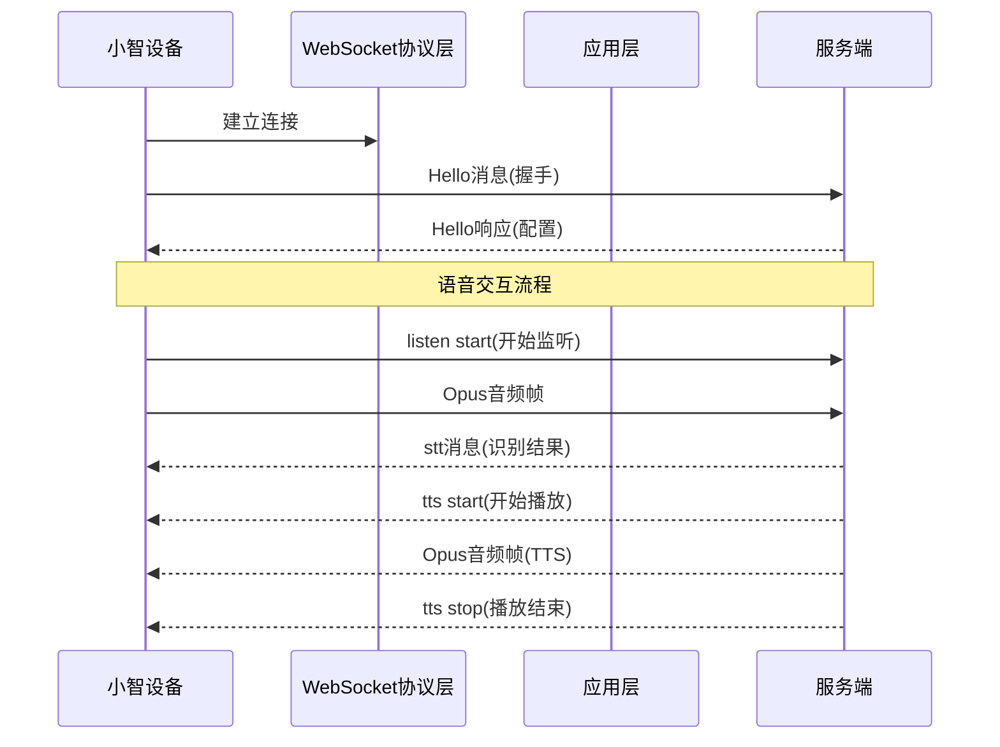
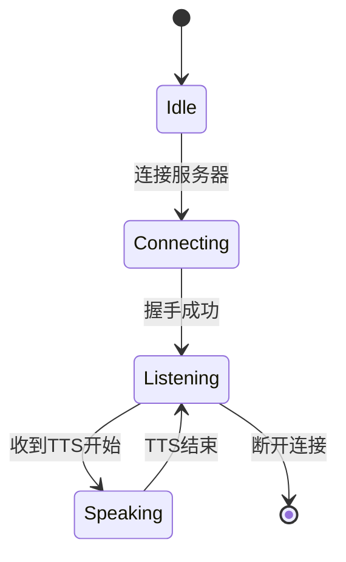
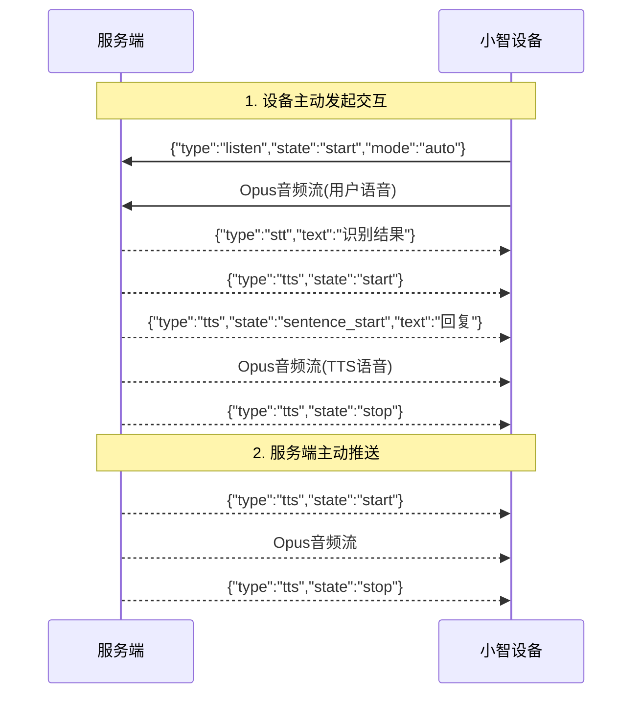

# Websocket语音互动分析报告

## 1. 现状分析

小智ESP32设备通过WebSocket与服务端建立长连接，采用双向通信机制进行语音互动。设备既可以向服务端发送音频和指令，服务端也可以向设备下发各种控制消息。

## 2. 当前架构分析

### 2.1 通信架构



### 2.2 核心文件

| 文件路径 | 功能描述 |
|---------|---------|
| `main/protocols/websocket_protocol.cc` | WebSocket协议实现 |
| `main/protocols/websocket_protocol.h` | 协议层接口定义 |
| `main/application.cc` | 应用层消息处理 |
| `main/mcp_server.cc` | MCP协议实现 |

## 3. 服务端指令方式

### 3.1 JSON文本消息

服务端通过发送JSON格式的消息控制设备行为：

#### TTS控制（语音播放）

```json
{
  "session_id": "会话ID",
  "type": "tts",
  "state": "start"
}
```

```json
{
  "session_id": "会话ID",
  "type": "tts",
  "state": "sentence_start",
  "text": "要播放的文本内容"
}
```

```json
{
  "session_id": "会话ID",
  "type": "tts",
  "state": "stop"
}
```

#### STT结果（语音识别）

```json
{
  "session_id": "会话ID",
  "type": "stt",
  "text": "用户说的话"
}
```

#### LLM表情控制

```json
{
  "session_id": "会话ID",
  "type": "llm",
  "emotion": "happy"
}
```

#### 系统控制命令

```json
{
  "session_id": "会话ID",
  "type": "system",
  "command": "reboot"
}
```

#### 告警消息

```json
{
  "session_id": "会话ID",
  "type": "alert",
  "message": "告警内容"
}
```

### 3.2 MCP协议指令

服务端可通过MCP协议调用设备功能：

```json
{
  "session_id": "会话ID",
  "type": "mcp",
  "payload": {
    "jsonrpc": "2.0",
    "method": "tools/call",
    "params": {
      "name": "self.audio_speaker.set_volume",
      "arguments": { "volume": 80 }
    },
    "id": 1
  }
}
```

**支持的MCP工具**：
- `self.get_device_status` - 获取设备状态
- `self.audio_speaker.set_volume` - 设置音量
- `self.screen.set_brightness` - 设置亮度
- `self.screen.set_theme` - 设置主题

### 3.3 二进制音频数据

服务端可直接发送Opus编码的音频帧，格式如下：

```
协议版本2格式：
┌───────────┬──────────┬───────────┬───────────┬─────────────┬──────────┐
│ Version   │ Type     │ Reserved  │ Timestamp │ PayloadSize │ Payload │
│ (2 bytes) │ (2 bytes)│ (4 bytes) │ (4 bytes) │ (4 bytes)   │ (bytes)  │
└───────────┴──────────┴───────────┴───────────┴─────────────┴──────────┘
```

## 4. 语音交互流程

### 4.1 自动模式流程



### 4.2 完整交互时序



## 5. 结论

服务端向小智设备发送语音互动指令有以下三种方式：

1. **JSON消息控制**：通过type字段区分消息类型（tts/stt/llm/system/alert），是最常用的控制方式

2. **MCP协议调用**：用于调用设备的具体功能（音量、亮度等），适合复杂控制场景

3. **二进制音频数据**：直接发送Opus编码的语音数据，用于TTS播放

**推荐实现**：
- 播放语音：先发送 `{"type":"tts","state":"start"}`，然后发送二进制Opus音频，最后发送 `{"type":"tts","state":"stop"}`
- 显示文本：发送 `{"type":"tts","state":"sentence_start","text":"内容"}`
- 识别结果：发送 `{"type":"stt","text":"用户说话内容"}`
