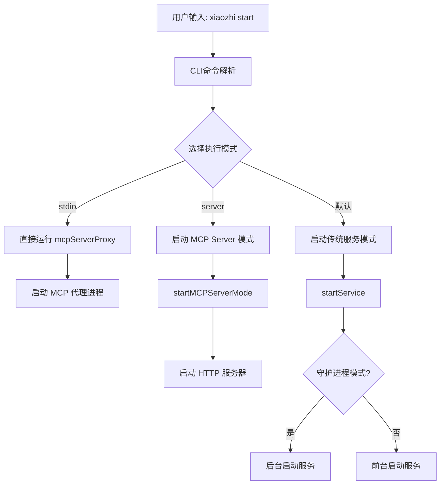
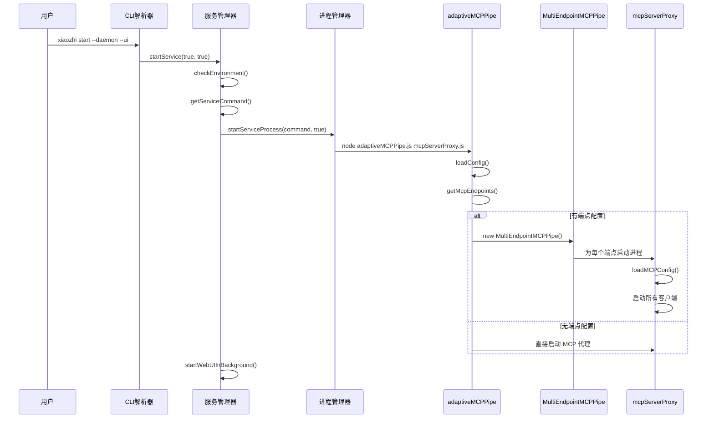
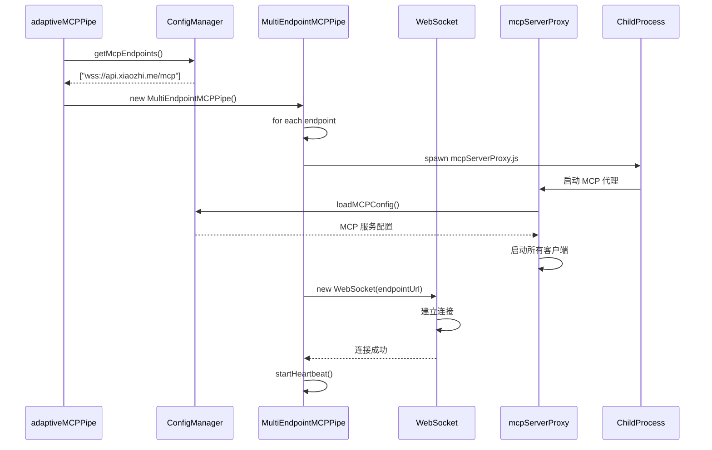
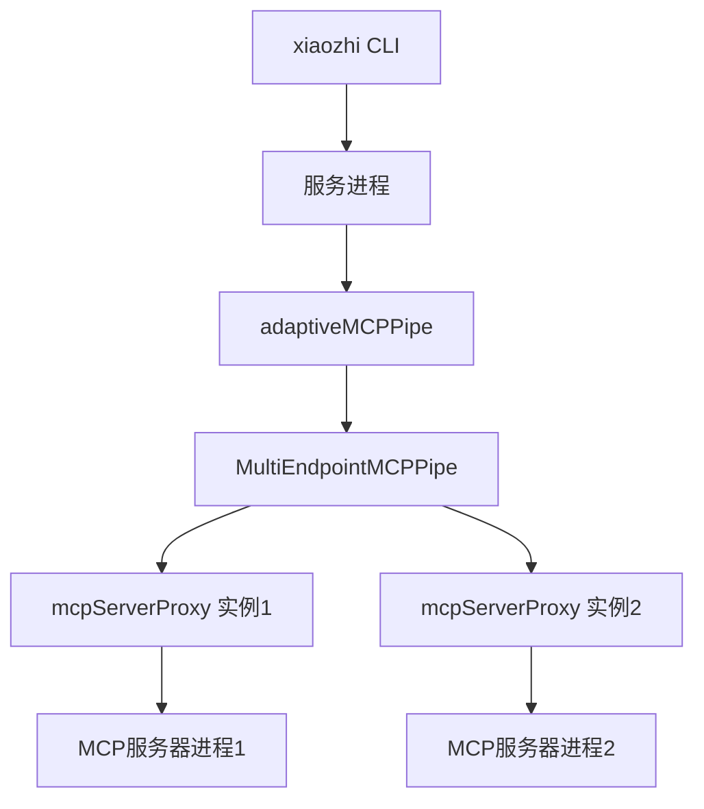

# xiaozhi-client `xiaozhi start` 命令完整执行流程分析

## 执行摘要

本文档深入分析了 xiaozhi-client 项目中 `xiaozhi start` 命令的完整执行流程，从 CLI 命令解析到 MCP 连接建立的全过程。该命令支持多种运行模式，包括前台模式、守护进程模式、Web UI 模式和 stdio 模式，通过自适应架构实现了与 MCP (Model Context Protocol) 端点的灵活连接。

## 1. 命令入口点分析

### 1.1 CLI 命令注册

#### 1.1.1 命令定义位置
- **文件**: `src/cli.ts`
- **行数**: 1470-1507
- **注册方式**: Commander.js 框架

#### 1.1.2 命令语法结构
```bash
xiaozhi start [options]

选项:
  --daemon        以守护进程模式运行
  --ui            启动 Web UI
  --server [port] 启动 MCP 服务器模式
  --stdio         直接通过 stdio 通信
  --endpoint      指定端点 URL
```

#### 1.1.3 命令注册代码
```typescript
// src/cli.ts:1470-1507
startCommand
  .description("启动 xiaozhi 客户端")
  .option("--daemon", "以守护进程模式运行")
  .option("--ui", "启动 Web UI")
  .option("--server [port]", "启动 MCP 服务器模式")
  .option("--stdio", "直接通过 stdio 通信")
  .option("--endpoint <endpoint>", "指定端点 URL")
  .action(async (options) => {
    await handleStartCommand(options);
  });
```

### 1.2 命令执行流程图



## 2. 传统服务模式执行流程

### 2.1 服务启动主函数

#### 2.1.1 核心启动函数
```typescript
// src/cli.ts:321-469
async function startService(daemon = false, ui = false) {
    // 1. 环境检查
    await checkEnvironment();
    
    // 2. 获取服务启动命令
    const serviceCommand = await getServiceCommand();
    
    // 3. 启动服务进程
    const result = await startServiceProcess(serviceCommand, daemon);
    
    // 4. 可选：启动 Web UI
    if (ui) {
        await startWebUIInBackground();
    }
}
```

#### 2.1.2 启动时序图



### 2.2 环境检查与验证

#### 2.2.1 环境检查流程
```typescript
// src/cli.ts:479-525
async function checkEnvironment() {
    // 1. 检查配置文件存在性
    if (!configManager.configExists()) {
        throw new Error('配置文件不存在，请先运行 xiaozhi init');
    }
    
    // 2. 验证配置格式
    const config = configManager.getConfig();
    
    // 3. 检查必要字段
    if (!config.mcpEndpoint || !config.mcpServers) {
        throw new Error('配置缺少必要字段');
    }
}
```

#### 2.2.2 服务命令生成
```typescript
// src/cli.ts:527-576
async function getServiceCommand(): Promise<ServiceCommand> {
    // 1. 自动检测执行文件路径
    const cliPath = await findExecutablePath();
    
    // 2. 构建启动命令
    const command = 'node';
    const args = [
        path.join(cliPath, 'adaptiveMCPPipe.js'),
        path.join(cliPath, 'mcpServerProxy.js')
    ];
    
    return { command, args };
}
```

### 2.3 进程管理

#### 2.3.1 守护进程启动
```typescript
// src/cli.ts:578-650
async function startServiceProcess(
    serviceCommand: ServiceCommand,
    daemon: boolean
): Promise<ServiceResult> {
    if (daemon) {
        // 守护进程模式
        const child = spawn(serviceCommand.command, serviceCommand.args, {
            detached: true,
            stdio: 'ignore',
            env: {
                ...process.env,
                XIAOZHI_DAEMON: 'true',
                XIAOZHI_CONFIG_DIR: process.cwd()
            }
        });
        
        // 写入PID文件
        const pidContent = `${child.pid}|${Date.now()}|service`;
        fs.writeFileSync('.xiaozhi-mcp-service.pid', pidContent);
        
        child.unref();
        return { success: true, pid: child.pid };
    } else {
        // 前台模式
        return spawnForeground(serviceCommand);
    }
}
```

## 3. MCP连接建立机制

### 3.1 自适应连接架构

#### 3.1.1 自适应MCP管道设计
**文件**: `src/adaptiveMCPPipe.ts`

```typescript
// 自适应连接选择逻辑
async function start() {
    const endpoints = configManager.getMcpEndpoints();
    const validEndpoints = endpoints.filter(filterValidEndpoints);
    
    if (validEndpoints.length === 0) {
        // 无可用端点，仅启动MCP代理
        await startMCPServerProxyOnly(mcpScript);
    } else {
        // 启动多端点连接
        const mcpPipe = new MultiEndpointMCPPipe(mcpScript, validEndpoints);
        await mcpPipe.start();
    }
}
```

#### 3.1.2 端点验证规则
```typescript
function filterValidEndpoints(endpoint: string): boolean {
    try {
        const url = new URL(endpoint);
        return url.protocol === 'ws:' || url.protocol === 'wss:';
    } catch {
        return false;
    }
}
```

### 3.2 多端点连接管理

#### 3.2.1 MultiEndpointMCPPipe架构
**文件**: `src/multiEndpointMCPPipe.ts`

```typescript
class MultiEndpointMCPPipe {
    private endpoints: Map<string, EndpointConnection>;
    private mcpScript: string;
    private connectionConfig: Required<ConnectionConfig>;

    async start() {
        // 1. 初始化所有端点
        const endpointUrls = configManager.getMcpEndpoints();
        
        // 2. 为每个端点创建连接
        for (const endpointUrl of endpointUrls) {
            await this.addEndpoint(endpointUrl);
        }
        
        // 3. 启动主MCP代理
        await this.startMCPProxy();
    }
}
```

#### 3.2.2 端点连接管理
```typescript
interface EndpointConnection {
    url: string;
    websocket: WebSocket | null;
    isConnected: boolean;
    reconnectAttempt: number;
    process: ChildProcess | null;
    heartbeatTimer?: NodeJS.Timeout;
    heartbeatTimeout?: NodeJS.Timeout;
}
```

### 3.3 连接建立流程

#### 3.3.1 连接建立时序图



#### 3.3.2 心跳机制实现
```typescript
// src/multiEndpointMCPPipe.ts:385-426
private startHeartbeat(endpointUrl: string) {
    const endpoint = this.endpoints.get(endpointUrl);
    if (!endpoint) return;

    endpoint.heartbeatTimer = setInterval(() => {
        if (endpoint.websocket?.readyState === WebSocket.OPEN) {
            endpoint.websocket.ping();
            
            endpoint.heartbeatTimeout = setTimeout(() => {
                endpoint.websocket?.close();
            }, this.connectionConfig.heartbeatTimeout);
        }
    }, this.connectionConfig.heartbeatInterval);

    endpoint.websocket.on('pong', () => {
        clearTimeout(endpoint.heartbeatTimeout);
    });
}
```

## 4. MCP 代理服务架构

### 4.1 MCP Server Proxy 设计

#### 4.1.1 核心类结构
**文件**: `src/mcpServerProxy.ts`

```typescript
class MCPServerProxy {
    private clients: Map<string, IMCPClient>;
    private toolMap: Map<string, string>;
    private config: Record<string, MCPServerConfig> | null;

    async start() {
        // 1. 加载配置
        this.config = loadMCPConfig();
        
        // 2. 清理已删除的服务配置
        await this.cleanupRemovedServers();
        
        // 3. 初始化客户端
        await this.initializeClients();
        
        // 4. 构建工具映射
        this.buildToolMap();
    }
}
```

#### 4.1.2 客户端类型支持
```typescript
type MCPServerConfig = 
    | LocalMCPServerConfig      // 本地进程
    | SSEMCPServerConfig        // SSE协议
    | StreamableHTTPMCPServerConfig; // Streamable HTTP

// 客户端选择逻辑
if ("url" in serverConfig) {
    if (isSSE(serverConfig.url)) {
        client = new SSEMCPClient(serverName, serverConfig);
    } else {
        client = new StreamableHTTPMCPClient(serverName, serverConfig);
    }
} else {
    client = new MCPClient(serverName, serverConfig);
}
```

### 4.2 工具发现与管理

#### 4.2.1 工具注册流程
```typescript
// src/mcpServerProxy.ts:740-762
buildToolMap() {
    this.toolMap.clear();
    
    for (const [clientName, client] of this.clients) {
        for (const tool of client.tools) {
            const prefixedName = `${clientName}_xzcli_${tool.name}`;
            this.toolMap.set(prefixedName, clientName);
        }
    }
}
```

#### 4.2.2 工具调用路由
```typescript
// src/mcpServerProxy.ts:839-896
async callTool(toolName: string, arguments_: any): Promise<any> {
    const clientName = this.toolMap.get(toolName);
    if (!clientName) {
        throw new Error(`未知的工具: ${toolName}`);
    }
    
    const client = this.clients.get(clientName);
    return await client.callTool(toolName, arguments_);
}
```

## 5. 配置管理与环境变量

### 5.1 配置加载流程

#### 5.1.1 配置文件搜索路径
```bash
# 配置搜索优先级
1. $XIAOZHI_CONFIG_DIR/xiaozhi.config.json5
2. $XIAOZHI_CONFIG_DIR/xiaozhi.config.jsonc
3. $XIAOZHI_CONFIG_DIR/xiaozhi.config.json
4. 当前工作目录/xiaozhi.config.json5
5. 当前工作目录/xiaozhi.config.jsonc
6. 当前工作目录/xiaozhi.config.json
```

#### 5.1.2 环境变量配置
```bash
# 关键环境变量
XIAOZHI_CONFIG_DIR=/path/to/config    # 配置目录
XIAOZHI_DAEMON=true                   # 守护进程模式
MCP_SERVER_MODE=true                  # MCP服务器模式
MODELSCOPE_API_TOKEN=your-token       # 魔搭API密钥
```

### 5.2 配置示例

#### 5.2.1 基础配置
```json
{
  "mcpEndpoint": "wss://api.xiaozhi.me/mcp",
  "mcpServers": {
    "calculator": {
      "command": "python",
      "args": ["-m", "mcp_server.calculator"]
    }
  },
  "connection": {
    "heartbeatInterval": 30000,
    "heartbeatTimeout": 10000,
    "reconnectInterval": 5000
  },
  "webUI": {
    "port": 9999,
    "autoRestart": true
  }
}
```

#### 5.2.2 多端点配置
```json
{
  "mcpEndpoint": [
    "wss://api.xiaozhi.me/mcp",
    "wss://backup.xiaozhi.me/mcp"
  ],
  "mcpServers": {
    "local_fs": {
      "command": "npx",
      "args": ["@modelcontextprotocol/server-filesystem", "/home/user"]
    },
    "github": {
      "type": "sse",
      "url": "https://github-mcp.example.com/sse"
    },
    "modelscope": {
      "type": "sse",
      "url": "https://modelscope.net/api/mcp/sse"
    }
  }
}
```

## 6. 错误处理与监控

### 6.1 错误处理机制

#### 6.1.1 连接错误处理
```typescript
// src/multiEndpointMCPPipe.ts:446-470
private handleWebSocketError(endpointUrl: string, error: Error) {
    logger.error(`WebSocket 错误: ${endpointUrl}`, error);
    
    // 重置连接状态
    const endpoint = this.endpoints.get(endpointUrl);
    if (endpoint) {
        endpoint.isConnected = false;
        this.scheduleReconnection(endpointUrl);
    }
}
```

#### 6.1.2 重连策略
```typescript
private scheduleReconnection(endpointUrl: string) {
    const endpoint = this.endpoints.get(endpointUrl);
    if (!endpoint || endpoint.reconnectAttempt >= 5) return;

    const delay = Math.min(
        5000 * Math.pow(2, endpoint.reconnectAttempt),
        60000
    );

    setTimeout(() => {
        this.connectToEndpoint(endpointUrl);
    }, delay);
}
```

### 6.2 监控与日志

#### 6.2.1 日志文件结构
```
xiaozhi.log
├── [时间戳] [INFO] 服务启动信息
├── [时间戳] [DEBUG] WebSocket连接详情
├── [时间戳] [WARN] 连接警告
├── [时间戳] [ERROR] 连接错误
└── [时间戳] [INFO] 工具调用记录
```

#### 6.2.2 状态监控接口
```typescript
// 通过Web UI获取状态
GET /api/status
{
  "endpoints": [
    {
      "url": "wss://api.xiaozhi.me/mcp",
      "status": "connected",
      "uptime": 3600,
      "tools": 15
    }
  ],
  "mcpServers": [
    {
      "name": "calculator",
      "status": "running",
      "toolCount": 5
    }
  ]
}
```

## 7. 进程管理与信号处理

### 7.1 进程层次结构



### 7.2 信号处理

#### 7.2.1 优雅关闭机制
```typescript
// 信号处理注册
process.on('SIGINT', gracefulShutdown);
process.on('SIGTERM', gracefulShutdown);

function gracefulShutdown() {
    logger.info('收到关闭信号，正在优雅关闭...');
    
    // 1. 停止所有MCP客户端
    for (const client of clients.values()) {
        await client.stop();
    }
    
    // 2. 清理PID文件
    cleanupPidFile();
    
    // 3. 退出进程
    process.exit(0);
}
```

## 8. 总结与最佳实践

### 8.1 启动模式选择

| 模式 | 适用场景 | 特点 |
|---|---|---|
| 前台模式 | 开发调试 | 实时日志输出 |
| 守护进程模式 | 生产环境 | 后台运行，自动重启 |
| MCP Server模式 | 独立服务 | HTTP API接口 |
| stdio模式 | 集成测试 | 直接进程通信 |

### 8.2 配置优化建议

1. **多端点配置**: 配置多个端点提高可用性
2. **心跳参数**: 根据网络环境调整心跳间隔
3. **日志级别**: 生产环境使用INFO，开发使用DEBUG
4. **资源限制**: 合理配置MCP服务器资源限制

### 8.3 监控与维护

- **定期检查**: 监控端点连接状态和工具可用性
- **日志分析**: 定期检查错误日志和性能指标
- **配置备份**: 定期备份配置文件
- **版本管理**: 跟踪配置变更历史

这套架构设计实现了高度可扩展和可靠的 MCP 客户端系统，支持多种部署场景和运维需求。