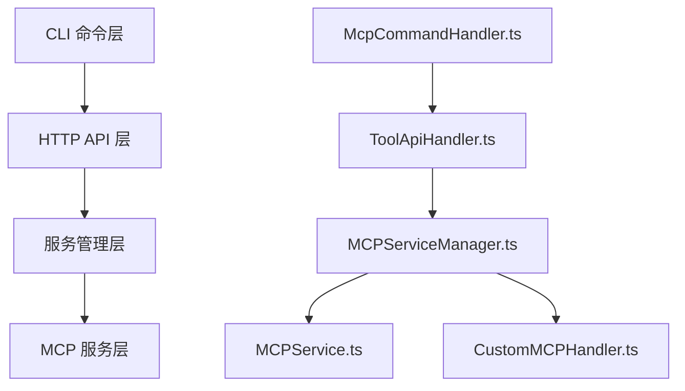
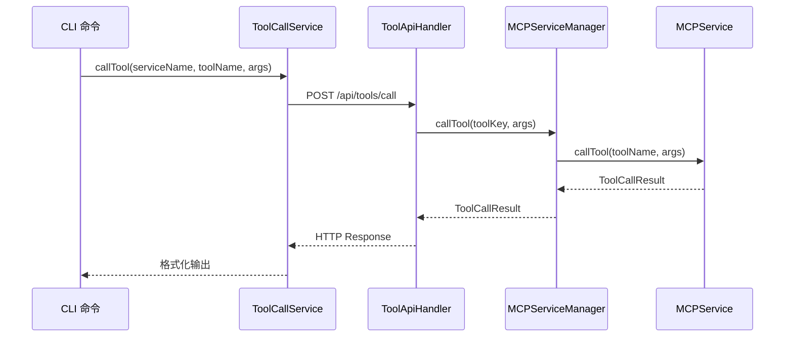

# customMCP 工具调用技术方案

## 1. 现状分析

### 1.1 当前系统架构

当前 xiaozhi 系统采用分层架构设计：



**关键组件分析**：

1. **CLI 命令层**：`McpCommandHandler.ts` 处理 `xiaozhi mcp call` 命令
2. **HTTP API 层**：`ToolApiHandler.ts` 提供 `/api/tools/call` 端点
3. **服务管理层**：`MCPServiceManager.ts` 统一管理所有工具调用
4. **工具执行层**：标准 MCP 服务和 CustomMCP 处理器

### 1.2 当前 customMCP 实现状态

**已实现功能**：
- ✅ 配置结构定义（CustomMCPTool, CustomMCPConfig 接口）
- ✅ CustomMCPHandler 实现，支持多种 handler 类型
- ✅ MCPServiceManager 集成 CustomMCPHandler
- ✅ 配置文件支持 customMCP 字段

**存在问题**：
- ❌ CLI 命令无法直接调用 customMCP 工具
- ❌ 缺少统一的调用接口
- ❌ 工具列表不包含 customMCP 工具

## 2. 当前架构分析

### 2.1 标准 MCP 工具调用流程



### 2.2 当前 customMCP 工具调用能力

CustomMCPHandler 已经具备完整的工具调用能力：
- 支持 proxy、http、function、script、chain 等多种 handler 类型
- 集成在 MCPServiceManager 中，优先检查 customMCP 工具
- 具备完整的错误处理和参数验证机制

**关键代码片段**：
```typescript
// MCPServiceManager.ts - 已实现的调用逻辑
async callTool(toolName: string, arguments_: any): Promise<ToolCallResult> {
  // 首先检查是否是 customMCP 工具
  if (this.customMCPHandler.hasTool(toolName)) {
    return await this.customMCPHandler.callTool(toolName, arguments_);
  }
  // 回退到标准 MCP 工具...
}
```

## 3. 技术方案设计

### 3.1 核心设计思路

**设计原则**：
1. **最小侵入性**：在现有架构基础上扩展，避免大规模重构
2. **向后兼容性**：保持现有 CLI 接口和行为不变
3. **统一用户体验**：customMCP 工具调用与标准 MCP 工具保持一致
4. **可扩展性**：为未来添加更多平台预留空间

**核心方案**：引入 "customMCP" 作为虚拟服务名，使用户能够通过以下方式调用：
```bash
xiaozhi mcp call customMCP <toolName> --args '{"param": "value"}'
```

### 3.2 技术实现方案

#### 方案一：CLI 层面特殊处理（推荐）

**优势**：
- 实现简单，修改点少
- 保持现有架构清晰
- 错误处理统一

**实现步骤**：

1. **修改 ToolApiHandler.ts**：
```typescript
async callTool(c: Context): Promise<Response> {
  const { serviceName, toolName, args } = await c.req.json();
  
  // 特殊处理 customMCP 服务
  if (serviceName === 'customMCP') {
    // 直接调用 customMCP 工具，使用 toolName 作为工具标识
    const result = await serviceManager.callTool(toolName, args || {});
    return c.json(this.createSuccessResponse(result, "工具调用成功"));
  }
  
  // 标准 MCP 服务处理逻辑...
  const toolKey = `${serviceName}__${toolName}`;
  const result = await serviceManager.callTool(toolKey, args || {});
}
```

2. **优化工具验证逻辑**：
```typescript
private async validateServiceAndTool(
  serviceManager: MCPServiceManager,
  serviceName: string,
  toolName: string
): Promise<void> {
  if (serviceName === 'customMCP') {
    // 验证 customMCP 工具是否存在
    if (!serviceManager.hasCustomMCPTool(toolName)) {
      throw new Error(`customMCP 工具 '${toolName}' 不存在`);
    }
    return;
  }
  
  // 标准 MCP 服务验证逻辑...
}
```

### 3.3 工具列表集成

修改工具列表 API，包含 customMCP 工具：

```typescript
// ToolApiHandler.ts
async listTools(c: Context): Promise<Response> {
  const serviceManager = await MCPServiceManagerSingleton.getInstance();
  
  // 获取标准 MCP 工具
  const mcpTools = serviceManager.getAllTools();
  
  // 获取 customMCP 工具
  const customTools = serviceManager.getCustomMCPTools().map(tool => ({
    serviceName: 'customMCP',
    toolName: tool.name,
    description: tool.description,
    enabled: true // customMCP 工具默认启用
  }));
  
  return c.json({
    success: true,
    data: {
      tools: [...mcpTools, ...customTools],
      totalTools: mcpTools.length + customTools.length
    }
  });
}
```

## 4. 具体实施方案

### 4.1 第一阶段：基础支持（1-2 天）

**任务 1.1：修改后端 API 处理逻辑**
- 文件：`src/handlers/ToolApiHandler.ts`
- 修改：`callTool` 方法，添加 customMCP 特殊处理
- 修改：`validateServiceAndTool` 方法，支持 customMCP 验证

**任务 1.2：扩展 MCPServiceManager 接口**
- 文件：`src/services/MCPServiceManager.ts`
- 新增：`hasCustomMCPTool(toolName: string)` 方法
- 新增：`getCustomMCPTools()` 方法

**任务 1.3：编写基础单元测试**
- 测试 customMCP 工具调用基础功能
- 测试错误处理逻辑

**验收标准**：
- 能够通过 CLI 成功调用 customMCP 工具
- 错误提示信息正确显示

### 4.2 第二阶段：功能完善（1 天）

**任务 2.1：优化工具列表 API**
- 修改：`listTools` 方法，包含 customMCP 工具
- 确保：`xiaozhi mcp list` 命令显示 customMCP 工具

**任务 2.2：完善错误处理**
- 统一错误消息格式
- 添加有用的提示信息

**任务 2.3：参数验证优化**
- 利用 customMCP 工具的 inputSchema 进行参数验证
- 提供详细的参数错误提示

**验收标准**：
- 所有类型的 customMCP handler 正常工作
- 工具列表正确显示 customMCP 工具
- 参数验证和错误提示完善

### 4.3 第三阶段：测试和优化（1 天）

**任务 3.1：完整测试用例**
- 单元测试：各个修改模块的功能测试
- 集成测试：CLI 到后端的完整调用链路测试
- 端到端测试：使用实际 customMCP 配置测试

**任务 3.2：性能测试和优化**
- 测试 customMCP 工具调用性能
- 优化工具查找和调用逻辑

**任务 3.3：文档更新**
- 更新 `docs/mcp-tool-calling.md`
- 添加 customMCP 工具调用示例

**验收标准**：
- 通过所有测试用例
- 性能与标准 MCP 工具相当
- 文档完整准确

### 4.4 第四阶段：部署验证（0.5 天）

**任务 4.1：测试环境验证**
- 在测试环境部署新版本
- 验证所有功能正常工作

**任务 4.2：用户验收测试**
- 使用实际的 Coze 工作流配置测试
- 验证用户体验和功能完整性

**任务 4.3：问题修复**
- 修复测试中发现的问题
- 性能优化和稳定性改进

**验收标准**：
- 用户能够正常使用所有功能
- 系统稳定性和性能达标
- 无回归问题

## 5. 风险评估与缓解

### 5.1 技术风险

**风险等级：低**

**主要风险**：
1. **工具名称冲突**：customMCP 工具名称可能与标准 MCP 工具冲突
2. **参数格式兼容性**：不同 handler 类型的参数格式差异

**缓解措施**：
1. 明确优先级规则：customMCP 工具优先于标准 MCP 工具
2. 详细的错误提示，帮助用户识别和解决问题
3. 完善的参数验证和转换逻辑

### 5.2 兼容性风险

**风险等级：极低**

**缓解措施**：
- 所有修改都是扩展性的，不影响现有功能
- 保持现有 CLI 接口和行为不变
- 充分的回归测试确保兼容性

## 6. 预期效果

### 6.1 用户体验改进

**统一调用接口**：
```bash
# 标准 MCP 工具调用
xiaozhi mcp call calculator calculator --args '{"javascript_expression": "1+2"}'

# customMCP 工具调用
xiaozhi mcp call customMCP test_coze_workflow --args '{"input": "测试内容"}'
```

**一致的错误处理**：
- 相同格式的错误提示
- 统一的帮助信息和建议

### 6.2 功能扩展能力

- 支持所有已实现的 handler 类型
- 为未来添加更多第三方平台奠定基础
- 保持系统架构的清晰和可维护性

### 6.3 开发效率提升

- 最小化代码修改，降低引入 bug 的风险
- 利用现有的 CustomMCPHandler 能力
- 保持架构一致性，便于后续维护

## 7. 总结

本技术方案通过引入 "customMCP" 虚拟服务名的方式，在现有架构基础上实现了 customMCP 工具的统一调用接口。方案具有以下特点：

- **实施简单**：主要修改集中在 API 处理层，修改点少
- **风险可控**：不涉及核心架构变更，兼容性风险极低
- **用户友好**：保持与标准 MCP 工具一致的使用体验
- **可扩展性强**：为未来功能扩展预留了充分空间

预计总实施周期 3-4 天，能够满足用户需求并为后续发展奠定良好基础。
