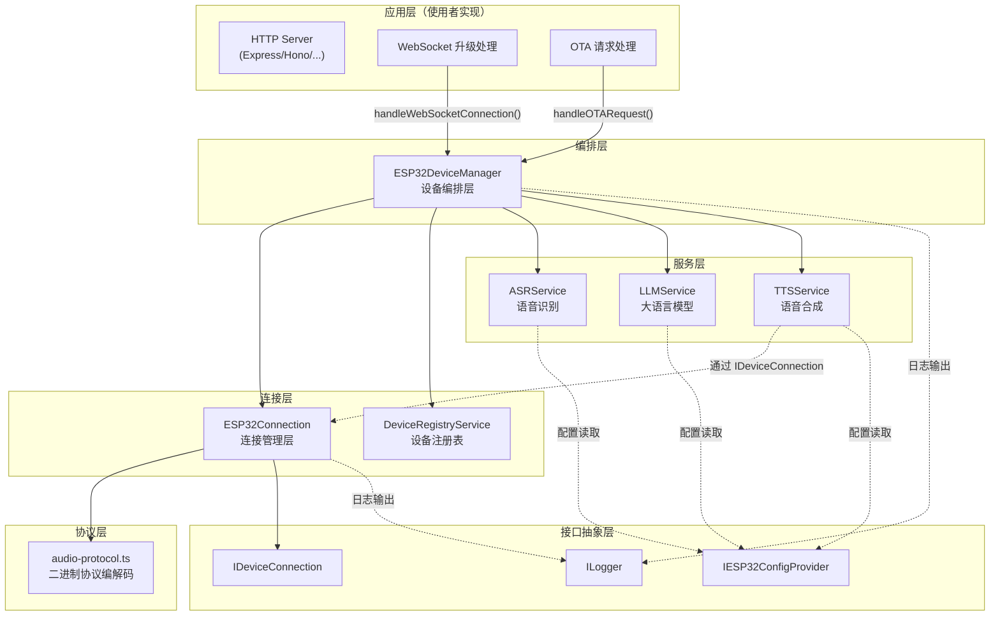
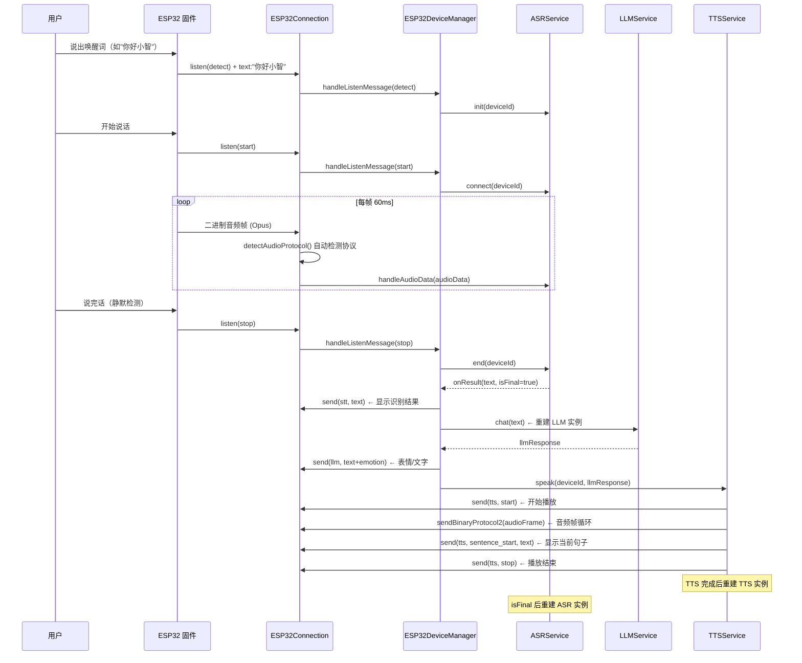

# 架构设计

本文档深入介绍 `@xiaozhi-client/esp32` 的内部架构设计，适合需要理解设计原理的贡献者和深度集成者。

## 整体架构分层



## 核心模块说明

### ESP32DeviceManager — 设备编排层

**文件**: `packages/esp32/src/esp32-manager.ts`

这是 SDK 的**核心入口类**，负责协调所有子模块的工作：

| 职责 | 方法 |
|------|------|
| 处理 OTA 请求，自动注册设备 | `handleOTARequest()` |
| 处理 WebSocket 连接，管理连接生命周期 | `handleWebSocketConnection()` |
| 路由设备消息到对应处理器 | `handleDeviceMessage()` |
| 编排 ASR → LLM → TTS 流水线 | 内部事件驱动 |
| 管理设备状态和查询 | `getDevice()`, `getConnection()` |
| 资源清理 | `destroy()` |

**关键设计**：
- 不绑定任何 HTTP 框架，通过方法调用与外部交互
- 内部维护 `connections` 映射表（deviceId → ESP32Connection）
- 采用**服务重建模式**：每次语音交互结束后重建 ASR/TTS/LLM 服务实例，确保配置热更新生效

### ESP32Connection — 连接管理层

**文件**: `packages/esp32/src/connection.ts`

管理**单个设备**的 WebSocket 连接生命周期：

| 能力 | 说明 |
|------|------|
| Hello 握手 | 解析设备 hello 消息，返回服务端确认 |
| 心跳检测 | 定期 ping/pong，超时自动断开 |
| 消息收发 | JSON 文本消息 + 二进制音频帧 |
| 二进制协议解析 | 自动检测 Protocol1/2/3 并解析 |
| 实现 IDeviceConnection | 供 TTS 服务向设备发送数据 |

同时实现了 `IDeviceConnection` 接口，作为 TTS 服务向设备发送数据的通道。

### DeviceRegistryService — 设备注册表

**文件**: `packages/esp32/src/device-registry.ts`

维护所有已注册 ESP32 设备的状态信息：

- 设备创建与查询（按 deviceId/MAC 地址）
- 状态管理（activating → active → offline）
- 最后活跃时间追踪
- 设备销毁与清理

### ASRService — 语音识别服务

**文件**: `packages/esp32/src/services/asr.service.ts`

负责将设备上传的 Opus 音频数据转换为文本：

- 管理与 ASR 云服务的流式连接
- 支持 Opus → PCM → ASR 的解码链路
- 通过 `onResult` 回调通知识别结果（含中间结果和最终结果）
- 支持多设备并发识别（按 deviceId 隔离会话）

### LLMService — 大语言模型服务

**文件**: `packages/esp32/src/services/llm.service.ts`

将 ASR 识别出的文本发送给大语言模型获取回复：

- 使用 OpenAI SDK 兼容接口
- 支持自定义系统提示词（prompt）
- 每次调用前重建实例以获取最新配置

### TTSService — 语音合成服务

**文件**: `packages/esp32/src/services/tts.service.ts`

将 LLM 的文本回复合成为 Opus 音频并发送给设备：

- 调用 TTS 云服务获取音频流
- 将音频数据通过 `IDeviceConnection` 发送到设备
- 管理 TTS 状态机（start → sentence_start → stop）
- TTS 完成后自动重建服务实例

### audio-protocol.ts — 二进制协议编解码

**文件**: `packages/esp32/src/audio-protocol.ts`

处理固件上传的二进制音频数据的编解码：

| 函数 | 用途 |
|------|------|
| `isBinaryProtocol2()` | 检测数据是否符合 Protocol2 格式 |
| `parseBinaryProtocol2()` | 解析 Protocol2 数据（16 字节头） |
| `encodeBinaryProtocol2()` | 编码 Protocol2 数据 |
| `isBinaryProtocol3()` | 检测数据是否符合 Protocol3 格式 |
| `parseBinaryProtocol3()` | 解析 Protocol3 数据（4 字节头） |
| `detectAudioProtocol()` | 自动检测协议版本 |

## 语音交互完整数据流

以下时序图展示了一次完整的语音交互过程——从用户说出自定义唤醒词到设备播放 AI 回复：



## 关键设计决策

### 1. 接口驱动解耦

SDK 通过三个核心接口实现与外部系统的解耦：

```typescript
// 日志接口 —— 不绑定具体日志库
interface ILogger {
  debug(message: string, ...args: unknown[]): void;
  info(message: string, ...args: unknown[]): void;
  warn(message: string, ...args: unknown[]): void;
  error(message: string, ...args: unknown[]): void;
}

// 配置提供者 —— 不绑定具体配置来源
interface IESP32ConfigProvider {
  getASRConfig(): ASRConfig | null;
  getTTSConfig(): TTSConfig | null;
  getLLMConfig(): LLMConfig | null;
  isLLMConfigValid(): boolean;
}

// 设备连接接口 —— 解耦 TTS 服务与连接实现
interface IDeviceConnection {
  send(message: ESP32WSMessage): Promise<void>;
  sendBinaryProtocol2(data: Uint8Array, timestamp?: number): Promise<void>;
  getSessionId(): string;
}
```

<Callout type="info">
  **好处**：你可以使用任意日志库（pino、winston、console）、任意配置来源（文件、数据库、环境变量），SDK 无需关心。
</Callout>

### 2. 服务重建机制

每次语音交互的关键节点后，SDK 会**重建**对应的语音服务实例：

| 触发时机 | 重建的服务 | 目的 |
|---------|-----------|------|
| ASR 返回最终结果 (`isFinal=true`) | ASRService | 确保下次识别从干净状态开始 |
| ASR 返回最终结果前 | LLMService | 获取最新的 LLM 配置（API Key、模型等） |
| TTS 播放完成 | TTSService | 确保下次合成从干净状态开始 |

这种设计使得**配置热更新**无需重启服务——修改 ASR/LLM/TTS 配置后，下一次交互就会使用新配置。

### 3. 多协议音频自动检测

固件可以配置使用不同的二进制协议版本（1/2/3）。SDK 在接收音频数据时会**自动检测**协议类型：

```typescript
// 在 ESP32Connection 中自动检测
if (isBinaryProtocol2(data)) {
  const parsed = parseBinaryProtocol2(data);  // 16 字节头
  // 使用 parsed.payload 作为音频数据
} else if (isBinaryProtocol3(data)) {
  const parsed = parseBinaryProtocol3(data);  // 4 字节头
  // 使用 parsed.payload 作为音频数据
} else {
  // 版本 1：直接就是 Opus 数据，无头部
}
```

各协议版本的差异详见 [音频传输协议](/esp32/audio-protocol) 文档。

### 4. camelCase ↔ snake_case 自动转换

ESP32 固件使用 **snake_case** 命名规范（如 `device_id`, `server_time`），而 SDK 内部使用 **camelCase**（如 `deviceId`, `serverTime`）。SDK 通过 `camelToSnakeCase()` 工具函数在边界处自动转换：

- **OTA 响应**：内部使用 camelCase 构建，返回给设备时自动转为 snake_case
- **设备上报**：收到 snake_case 数据后在内部统一处理

这保证了 SDK 内部代码的一致性，同时与固件协议保持兼容。
