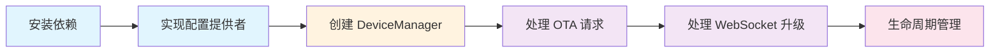

import { Callout, Steps, Tabs } from "nextra/components";

# 集成指南

本文档以 `src/server`（项目的 Web 服务器）为实际案例，详细说明如何使用 ESP32 模块。

<Callout type="info">
  在开始之前，建议先阅读 [快速上手](/esp32/quick-start) 了解基本概念。
</Callout>

## 集成模式总览

使用 ESP32 模块需要在你的 HTTP 服务中完成以下工作：



下面以 Hono 框架为例逐步说明（同样适用于 Express、Fastify 等框架）。

<Steps>

## 步骤 1：确认依赖已安装

ESP32 模块已包含在 `xiaozhi-client` 包中。确保你的项目已安装该包：

```bash
pnpm add xiaozhi-client
```

同时需要安装 WebSocket 依赖（peer dependency）：

```bash
pnpm add ws
```

## 步骤 2：实现 IESP32ConfigProvider 接口

`IESP32ConfigProvider` 是 ESP32 模块与你的配置系统之间的桥梁。你需要实现以下四个方法：

```typescript
import type { IESP32ConfigProvider } from "@/esp32";
import type { ASRConfig, LLMConfig, TTSConfig } from "@/types";
import { configManager } from "@/config";

/**
 * 基于 configManager 的配置提供者实现
 *
 * 这个实现直接从 xiaozhi.config.json 读取配置，
 * 你也可以替换为从数据库、环境变量或其他来源读取。
 */
class Esp32ConfigProvider implements IESP32ConfigProvider {
  /** 获取 ASR 配置 */
  getASRConfig(): ASRConfig | null {
    try {
      return configManager.getASRConfig();
    } catch {
      return null;
    }
  }

  /** 获取 TTS 配置 */
  getTTSConfig(): TTSConfig | null {
    try {
      return configManager.getTTSConfig();
    } catch {
      return null;
    }
  }

  /** 获取 LLM 配置 */
  getLLMConfig(): LLMConfig | null {
    try {
      return configManager.getLLMConfig();
    } catch {
      return null;
    }
  }

  /** 检查 LLM 配置是否有效 */
  isLLMConfigValid(): boolean {
    try {
      return configManager.isLLMConfigValid();
    } catch {
      return false;
    }
  }
}

// 创建单例实例
export const esp32ConfigProvider = new Esp32ConfigProvider();
```

<Callout type="info">
  以上代码来自 `src/server/WebServer.ts` 中的实际实现。如果不使用 `@/config`，可以从任何来源返回配置对象——文件、数据库、环境变量均可。
</Callout>

## 步骤 3：创建 ESP32DeviceManager 实例

```typescript
import { ESP32DeviceManager } from "@/esp32";
import { esp32ConfigProvider } from "./Esp32ConfigProvider";
import { logger } from "./Logger"; // 你的日志实现

// 创建设备管理器
const esp32Manager = new ESP32DeviceManager({
  logger,                    // ILogger 实现（可选，默认空日志）
  configProvider: esp32ConfigProvider, // IESP32ConfigProvider 实现
  firmwareVersion: "2.2.2", // 固件版本（可选，默认 "2.2.2"）
  // firmwareUrl: "",        // 固件下载 URL（可选）
  // forceUpdate: false,     // 是否强制更新（可选）
  // buildWebSocketUrl: (host) => `wss://${host}/ws`, // 自定义 URL 构建函数（可选）
});
```

## 步骤 4：处理 OTA HTTP 请求（薄适配层模式）

ESP32 设备上电后的第一个动作是向 OTA 接口发送 HTTP POST 请求。你需要一个**薄适配层**将 HTTP 请求转化为 ESP32 模块方法调用：

```typescript
// src/server/handlers/esp32.handler.ts（简化版）
import type { Context } from "hono";
import type { ESP32DeviceManager, ESP32DeviceReport } from "@/esp32";
import { ESP32ErrorCode } from "@/esp32";

export class ESP32Handler {
  constructor(private esp32Manager: ESP32DeviceManager) {}

  /**
   * 处理 OTA/配置请求
   * POST /xiaozhi/ota/
   *
   * 请求头:
   * - Device-Id: 设备 MAC 地址
   * - Client-Id: 设备 UUID
   * - Host: 请求主机地址（用于构建 WebSocket URL）
   * - Device-Model / Device-Version: 可选的设备型号和版本
   *
   * 请求体 (ESP32DeviceReport):
   * ```json
   * {
   *   "application": {
   *     "version": "2.2.2",
   *     "board": { "type": "ESP32-S3-BOX" }
   *   }
   * }
   * ```
   */
  async handleOTA(c: Context): Promise<Response> {
    // 从请求头提取设备标识
    const deviceId =
      c.req.header("Device-Id") || c.req.header("device-id");
    const clientId =
      c.req.header("Client-Id") || c.req.header("client-id");

    if (!deviceId) {
      return c.json(
        { success: false, code: ESP32ErrorCode.MISSING_DEVICE_ID },
        400
      );
    }

    if (!clientId) {
      return c.json(
        { success: false, code: ESP32ErrorCode.MISSING_DEVICE_ID },
        400
      );
    }

    // 解析请求体
    const report: ESP32DeviceReport = await c.req.json();

    // ★ 核心逻辑：委托给 ESP32DeviceManager 处理
    const response = await this.esp32Manager.handleOTARequest(
      deviceId,
      clientId,
      report,
      // 从请求头提取设备信息（优先级高于 body）
      {
        deviceModel:
          c.req.header("device-model") ||
          c.req.header("Device-Model"),
        deviceVersion:
          c.req.header("device-version") ||
          c.req.header("Device-Version"),
      },
      c.req.header("host") // 用于构建完整的 WebSocket URL
    );

    return c.json(response);
  }
}
```

<Callout type="info">
  **薄适配层模式**：Handler 本身不做业务逻辑，只负责从 HTTP 请求中提取参数，然后委托给 `ESP32DeviceManager` 处理。这样 ESP32 模块的核心逻辑完全独立于 HTTP 框架。
</Callout>

## 步骤 5：处理 WebSocket 连接升级

设备获取到 WebSocket URL 后会发起 WebSocket 连接。你需要在 WebSocket 服务器的 `connection` 事件中将连接委托给 ESP32 模块：

```typescript
// 在你的 HTTP 服务器启动代码中
import { WebSocketServer } from "ws";
import type { Server } from "node:http";
import type WebSocket from "ws";

// 挂载 WebSocket 服务器到 HTTP server
const wss = new WebSocketServer({ server: httpServer });

wss.on("connection", (ws: WebSocket, req) => {
  // 判断是否是 ESP32 设备连接（根据 URL 路径区分）
  const url = req.url ? new URL(req.url, `http://${req.headers.host}`) : null;
  const isESP32Device = url?.pathname === "/ws";

  if (!isESP32Device) {
    // 非 ESP32 连接，走其他处理逻辑（如 Web 客户端）
    return;
  }

  // 从请求头提取设备标识
  const deviceId = req.headers["device-id"] as string;
  const clientId = req.headers["client-id"] as string;
  const token = req.headers.authorization?.replace("Bearer ", "");

  // 校验必要参数
  if (!deviceId || !clientId) {
    ws.close(1008, "Missing required headers");
    return;
  }

  // ★ 核心逻辑：委托给 ESP32DeviceManager 处理
  esp32Manager
    .handleWebSocketConnection(ws, deviceId, clientId, token)
    .then(() => {
      logger.info(`ESP32 设备连接成功: ${deviceId}`);
    })
    .catch((error) => {
      logger.error(`ESP32 设备连接失败: ${deviceId}`, error);
      if (ws.readyState === ws.OPEN || ws.readyState === ws.CONNECTING) {
        ws.close(1011, "Connection handling failed");
      }
    });
});
```

## 步骤 6：生命周期管理（destroy）

当你的服务关闭时，必须调用 `destroy()` 方法清理 ESP32 模块占用的资源：

```typescript
class MyServer {
  private esp32Manager: ESP32DeviceManager;
  private wss: WebSocketServer;
  private httpServer: Server;

  async start() {
    // ... 启动 HTTP 和 WebSocket 服务器 ...
  }

  async stop() {
    // 1. 销毁 ESP32 设备管理器
    //    - 断开所有设备 WebSocket 连接
    //    - 销毁 ASR/LLM/TTS 服务实例
    //    - 清空设备注册表
    await this.esp32Manager.destroy();

    // 2. 关闭 WebSocket 服务器（强制断开所有客户端）
    for (const client of this.wss.clients) {
      client.terminate();
    }
    this.wss.close();

    // 3. 关闭 HTTP 服务器
    this.httpServer.close();
  }

  destroy() {
    // 同步销毁（用于 process 信号处理）
    this.esp32Manager.destroy();
  }
}

// 注册进程信号
const server = new MyServer();
process.on("SIGINT", () => server.stop());
process.on("SIGTERM", () => server.stop());
```

</Steps>

## 高级选项

### 自定义 WebSocket URL 构建

默认情况下，SDK 使用 `ws://${host}/ws` 作为 WebSocket URL。如果需要自定义（比如使用 wss:// 或不同的路径），可以通过 `buildWebSocketUrl` 选项：

```typescript
const manager = new ESP32DeviceManager({
  buildWebSocketUrl: (host: string) => {
    // 示例：使用 wss 并添加自定义路径
    return `wss://${host}/esp32/ws`;
  },
});
```

### 固件版本配置

通过 `firmwareVersion`、`firmwareUrl` 和 `forceUpdate` 选项控制 OTA 响应中的固件信息：

```typescript
const manager = new ESP32DeviceManager({
  firmwareVersion: "2.3.0",         // 当前最新固件版本
  firmwareUrl: "https://example.com/firmware.bin", // 固件下载地址
  forceUpdate: false,                // 是否强制设备更新
});
```

设备收到这些信息后会自行决定是否执行 OTA 更新。

### 不使用配置提供者（仅连接管理）

如果只需要设备连接管理而不需要语音交互功能，可以不传 `configProvider`：

```typescript
// 仅连接管理模式（无 LLM 能力）
const manager = new ESP32DeviceManager({
  logger: console,
  // 不传 configProvider → LLM 服务不可用
});
```

这种模式下，设备仍然可以连接、收发消息，但 ASR 识别完成后不会触发 LLM 调用。

## 常见问题 FAQ

### Q: 设备连接后立即断开？

**A:** 最常见的原因是设备未先完成 OTA 注册就直接尝试 WebSocket 连接。确保设备先调用了 `POST /xiaozhi/ota/` 并获得了有效的 WebSocket URL。

### Q: 如何查看当前已连接的设备？

```typescript
// 获取指定设备的连接
const conn = esp32Manager.getConnection("aa:bb:cc:dd:ee:ff");

// 获取设备信息
const device = esp32Manager.getDevice("aa:bb:cc:dd:ee:ff");
console.log(device?.status); // "active" | "offline" | "activating"
```

### Q: 如何处理多设备并发？

SDK 内部已经支持多设备并发。每个设备有独立的 `ESP32Connection` 实例和 ASR 会话，互不影响。你无需做额外处理。

### Q: ASR/LLM/TTS 配置修改后何时生效？

由于采用了**服务重建机制**，配置修改后会在**下一次语音交互**时自动生效，无需重启服务。

### Q: 可以在不使用 HTTP 框架的情况下使用吗？

可以。`ESP32DeviceManager` 的核心方法（`handleOTARequest`、`handleWebSocketConnection`）都是纯 TypeScript 方法调用，不依赖任何 HTTP 框架。你可以在 CLI 工具、定时任务、甚至 Worker 线程中使用。
