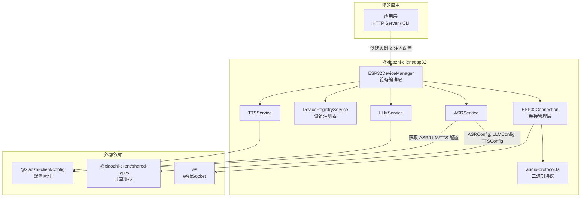

import { Callout, Tabs } from "nextra/components";

# ESP32 SDK 概览

`@xiaozhi-client/esp32` 是一个独立的 npm 包，负责 **ESP32 硬件设备**的全部通信逻辑。它从 `apps/backend` 中抽取出来，使设备通信能力可以被任何 Node.js 项目独立使用。

<Callout type="info">
  本包不绑定任何 HTTP 框架（Express、Hono、Fastify 等），通过接口注入实现解耦，可灵活集成到各类服务端项目中。
</Callout>

## 核心能力

| 能力 | 说明 |
|------|------|
| **设备连接管理** | 管理多个 ESP32 设备的 WebSocket 连接生命周期（建立、心跳、断开、重连） |
| **语音交互流水线** | 完整的 ASR → LLM → TTS 处理链路：唤醒词检测 → 语音识别 → 大模型对话 → 语音合成 |
| **二进制音频协议** | 支持三种协议版本（Protocol1/2/3）的编解码，自动检测并解析固件上传的 Opus 音频数据 |
| **OTA 配置下发** | 设备首次连接时自动激活，返回 WebSocket 地址、服务器时间、固件信息等配置 |
| **设备注册表** | 维护所有已注册设备的状态信息（在线/离线、最后活跃时间等） |

## 与项目其他包的关系



## 适用场景

- **自建小智服务端**：在自己的 Node.js 服务中集成 ESP32 设备支持
- **定制化网关**：在现有系统中添加硬件设备接入能力
- **二次开发**：基于本包构建具有特定业务逻辑的 IoT 网关
- **测试与调试**：独立使用设备通信能力进行功能验证

## 安装

<Tabs items={["pnpm", "npm"]}>
  <Tabs.Tab>
  ```bash
  pnpm add @xiaozhi-client/esp32
  ```
  </Tabs.Tab>
  <Tabs.Tab>
  ```bash
  npm install @xiaozhi-client/esp32
  ```
  </Tabs.Tab>
</Tabs>

### Peer Dependencies

本包依赖以下 peer dependency，需要在使用方项目中自行安装：

| 包名 | 用途 |
|------|------|
| `ws` | WebSocket 通信 |

```bash
pnpm add ws
```

## 快速体验

最简单的使用方式——创建设备管理器并处理一次 OTA 请求：

```typescript
import { ESP32DeviceManager } from "@xiaozhi-client/esp32";

// 创建设备管理器
const manager = new ESP32DeviceManager({
  logger: console, // 可选，默认为空日志
});

// 处理设备的 OTA 请求（设备首次连接时调用）
const otaResponse = await manager.handleOTARequest(
  "aa:bb:cc:dd:ee:ff", // deviceId（MAC 地址）
  "uuid-xxxx-xxxx",     // clientId（设备 UUID）
  {
    application: {
      version: "2.2.2",
      board: { type: "ESP32-S3-BOX" },
    },
  },                     // 设备上报信息
  undefined,             // 可选的请求头设备信息
  "192.168.1.100:9999"   // Host 头（用于构建 WebSocket URL）
);

console.log(otaResponse);
// 输出: { websocket: { url: "ws://192.168.1.100:9999/ws", ... }, ... }
```

> 完整的集成流程请参阅 [快速上手](/esp32/quick-start) 和 [集成指南](/esp32/integration)。

## 导出 API 总览

```typescript
// 核心类
import { ESP32DeviceManager } from "@xiaozhi-client/esp32";
import { ESP32Connection } from "@xiaozhi-client/esp32";
import { DeviceRegistryService } from "@xiaozhi-client/esp32";

// 接口
import type { ILogger, IESP32ConfigProvider, IDeviceConnection } from "@xiaozhi-client/esp32";

// 类型
import type { ESP32Device, ESP32WSMessage, ESP32OTAResponse, ... } from "@xiaozhi-client/esp32";

// 音频协议工具
import { detectAudioProtocol, parseBinaryProtocol2, encodeBinaryProtocol2, ... } from "@xiaozhi-client/esp32";

// 工具函数
import { extractDeviceInfo, camelToSnakeCase } from "@xiaozhi-client/esp32";

// 语音服务
import { ASRService, LLMService, TTSService } from "@xiaozhi-client/esp32";
```
