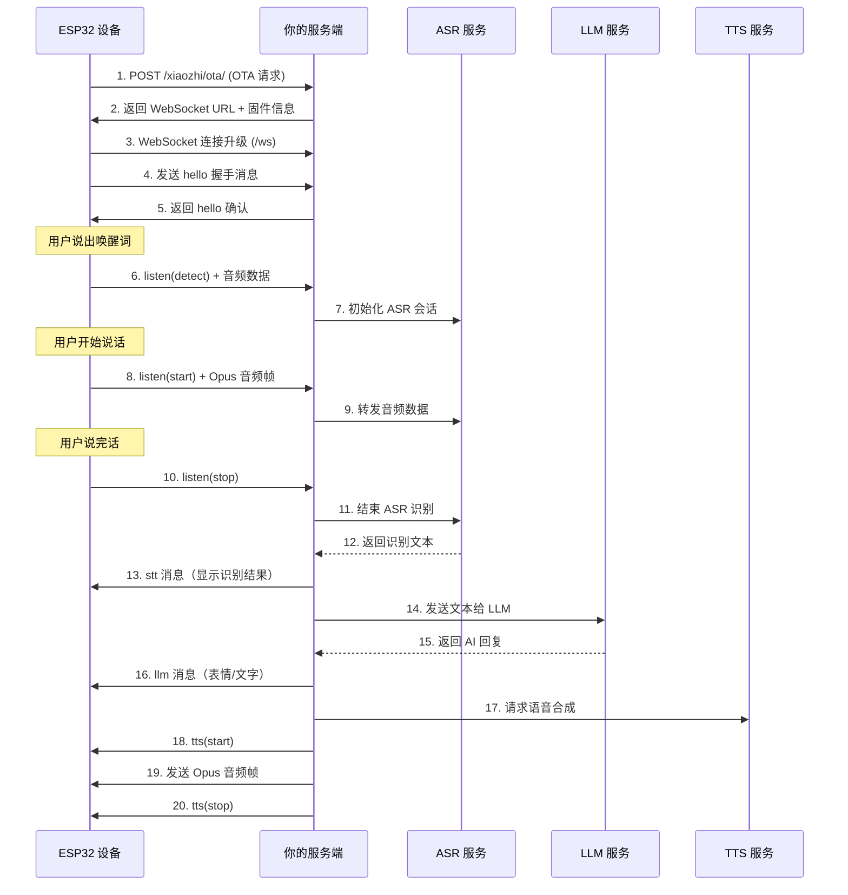

import { Callout, Steps, Tabs } from "nextra/components";

# 快速上手

本指南将引导你在 5 分钟内完成 ESP32 模块的基本集成，实现从设备连接到语音交互的完整流程。

<Callout type="info">
  **前提条件**
  - Node.js 20+
  - pnpm 或 npm
  - 一台已烧录 xiaozhi-esp32 固件的 ESP32 设备
  - 已完成 [ASR / LLM / TTS 服务配置](/usage/local-voice)（语音交互必需）
</Callout>

<Steps>

## 安装依赖

ESP32 模块已包含在 `xiaozhi-client` 包中，安装该包即可：

<Tabs items={['pnpm', 'npm']}>
  <Tabs.Tab>
  ```bash
  # 安装 xiaozhi-client（包含 ESP32 模块）
  pnpm add xiaozhi-client

  # 安装 WebSocket 依赖（peer dependency）
  pnpm add ws
  ```
  </Tabs.Tab>
  <Tabs.Tab>
  ```bash
  # 安装 xiaozhi-client（包含 ESP32 模块）
  npm install xiaozhi-client

  # 安装 WebSocket 依赖（peer dependency）
  npm install ws
  ```
  </Tabs.Tab>
</Tabs>

## 创建设备管理器

首先创建 `ESP32DeviceManager` 实例，它是整个 ESP32 模块的核心入口：

```typescript
import { ESP32DeviceManager, type IESP32ConfigProvider } from "@/esp32";
import { createServer } from "node:http";
import { WebSocketServer } from "ws";

// 1. 定义配置提供者（将 ASR/LLM/TTS 配置注入给 ESP32 模块）
const configProvider: IESP32ConfigProvider = {
  getASRConfig() {
    // 返回你的 ASR 配置，例如豆包 ASR
    return { model: "doubao", appid: "your-appid", accessToken: "your-token" };
  },
  getTTSConfig() {
    // 返回你的 TTS 配置
    return {
      model: "doubao",
      appid: "your-appid",
      accessToken: "your-token",
      voice_type: "zh_female_xiaohe_uranus_bigtts",
    };
  },
  getLLMConfig() {
    // 返回你的 LLM 配置
    return {
      model: "gpt-4o-mini",
      apiKey: "your-api-key",
      baseURL: "https://api.openai.com/v1",
    };
  },
  isLLMConfigValid() {
    // 检查 LLM 配置是否有效
    return true;
  },
};

// 2. 创建设备管理器
const esp32Manager = new ESP32DeviceManager({
  logger: console,           // 日志器（可选）
  configProvider,            // 配置提供者（语音交互必需）
  firmwareVersion: "2.2.2",  // 固件版本（可选，默认 "2.2.2"）
});
```

<Callout type="warning">
  如果不提供 `configProvider`，LLM 服务将不可用，设备只能进行 ASR 识别而无法获得 AI 回复。
</Callout>

## 处理 OTA HTTP 请求

ESP32 设备上电后会先向 OTA 接口发送 HTTP POST 请求获取 WebSocket 连接地址。你需要提供一个 HTTP 端点来处理这个请求：

```typescript
import http from "node:http";

const server = createServer(async (req, res) => {
  // 只处理 POST /xiaozhi/ota/ 路径
  if (req.method === "POST" && req.url === "/xiaozhi/ota/") {
    const deviceId = req.headers["device-id"] as string;
    const clientId = req.headers["client-id"] as string;
    const host = req.headers.host;

    if (!deviceId || !clientId) {
      res.writeHead(400);
      res.end(JSON.stringify({ error: "缺少必要请求头" }));
      return;
    }

    // 读取请求体
    const chunks: Buffer[] = [];
    for await (const chunk of req) {
      chunks.push(chunk);
    }
    const body = JSON.parse(Buffer.concat(chunks).toString());

    // 委托给设备管理器处理
    try {
      const response = await esp32Manager.handleOTARequest(
        deviceId,
        clientId,
        body,
        undefined, // 可选的请求头设备信息
        host       // Host 头，用于构建 WebSocket URL
      );

      res.writeHead(200, { "Content-Type": "application/json" });
      res.end(JSON.stringify(response));
    } catch (error) {
      res.writeHead(500);
      res.end(JSON.stringify({ error: String(error) }));
    }
  } else {
    res.writeHead(404);
    res.end("Not Found");
  }
});

server.listen(9999);
console.log("HTTP 服务器已启动，监听端口 9999");
```

设备收到响应后，会根据返回的 `websocket.url` 建立 WebSocket 连接。

## 处理 WebSocket 连接升级

当设备通过 OTA 响应获取到 WebSocket 地址后，会发起 WebSocket 连接。你需要在 HTTP 服务器上挂载 WebSocket 服务：

```typescript
import { WebSocketServer } from "ws";

const wss = new WebSocketServer({ server });

wss.on("connection", (ws, req) => {
  const deviceId = req.headers["device-id"] as string;
  const clientId = req.headers["client-id"] as string;
  const token = req.headers.authorization?.replace("Bearer ", "");

  if (!deviceId || !clientId) {
    ws.close(1008, "缺少必要请求头");
    return;
  }

  // 委托给设备管理器处理 WebSocket 连接
  esp32Manager
    .handleWebSocketConnection(ws, deviceId, clientId, token)
    .catch((error) => {
      console.error("WebSocket 连接处理失败:", error);
      ws.close(1011, "连接处理失败");
    });
});
```

## 验证完整语音交互流程

完成以上步骤后，整个语音交互流程如下：



<Callout type="info">
  **提示**：以上步骤中，步骤 6-20 全部由 `ESP32DeviceManager` 内部自动处理，你只需要正确地完成步骤 1-4 的接入即可。
</Callout>

## 配置 ASR / LLM / TTS

语音交互需要配置三个服务。详细的配置说明请参考 [本地语音互动文档](/usage/local-voice)，以下是简要说明：

### ASR（语音识别）

目前支持 **豆包 ASR** 服务。需要在 [豆包语音控制台](https://console.volcengine.com/speech/app) 创建应用并获取 `appid` 和 `accessToken`。

### LLM（大语言模型）

使用 OpenAI SDK 兼容接口，支持 GPT-4o、Qwen、Claude 等任意兼容模型。

### TTS（语音合成）

同样支持 **豆包 TTS** 服务，可选择不同音色（推荐 `zh_female_xiaohe_uranus_bigtts`）。

<Callout type="warning">
  语音服务的音频处理依赖 [ffmpeg](https://www.ffmpeg.org/download.html)，请确保运行环境已安装 ffmpeg。
</Callout>

## 清理资源

当服务关闭时，记得销毁设备管理器以释放资源：

```typescript
// 关闭时清理
async function shutdown() {
  // 销毁设备管理器（断开所有设备连接、释放语音服务资源）
  await esp32Manager.destroy();

  // 关闭 WebSocket 服务器
  wss.close();

  // 关闭 HTTP 服务器
  server.close();
}

// 监听退出信号
process.on("SIGINT", shutdown);
process.on("SIGTERM", shutdown);
```

</Steps>
