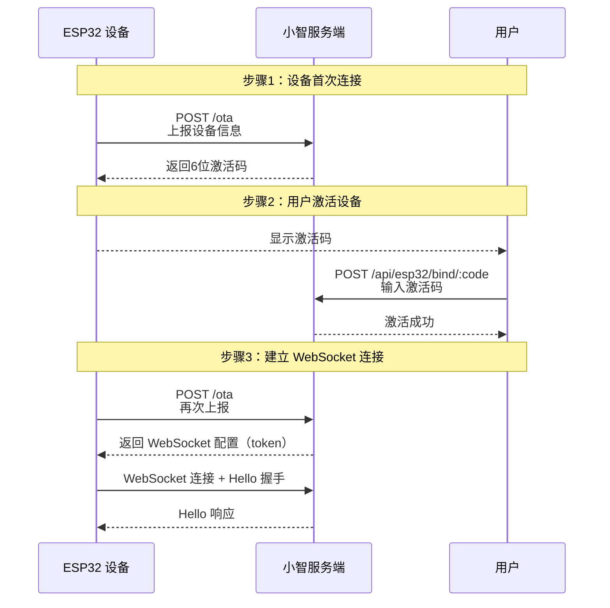

import { Tabs, Tab, Steps, Callout } from "nextra/components";

# 小智硬件设备绑定指南

<Callout type="info">
  **前期准备**:
  在开始之前，你需要：
  - 已部署小智客户端服务端
  - 拥有小智 ESP32 硬件设备
  - 确保设备与服务器在同一网络或设备能访问服务器地址
</Callout>

## 绑定流程概述

小智硬件设备绑定（激活）流程涉及三个角色的交互：



## 详细步骤

### 步骤1：设备首次连接

设备首次启动时，会向服务端上报设备信息以获取激活码。

<Tabs items={['请求示例', '响应示例']}>
  <Tabs.Tab>

```bash
POST /ota HTTP/1.1
Host: your-server.com
Content-Type: application/json
Device-Id: AA:BB:CC:DD:EE:FF
Client-Id: 550e8400-e29b-41d4-a716-446655440000

{
  "application": {
    "version": "1.0.0",
    "board": {
      "type": "ESP32-S3-BOX"
    }
  },
  "chipModelName": "ESP32-S3"
}
```

  </Tabs.Tab>
  <Tabs.Tab>

```json
{
  "success": true,
  "data": {
    "activation": {
      "code": "123456",
      "challenge": "1704067200000-abc123",
      "message": "请在Web界面输入激活码完成设备绑定",
      "timeoutMs": 300000
    },
    "serverTime": {
      "timestamp": 1704067200000,
      "timezoneOffset": 28800000
    }
  }
}
```

  </Tabs.Tab>
</Tabs>

<Callout type="warning">
  **重要提示**:
  - 激活码有效期为 **5 分钟**
  - 激活码为 **6 位数字**
  - 请在有效期内完成激活操作
</Callout>

### 步骤2：用户激活设备

用户在 Web 管理界面输入设备显示的激活码完成绑定。

<Tabs items={['请求示例', '成功响应', '错误响应']}>
  <Tabs.Tab>

```bash
POST /api/esp32/bind/123456 HTTP/1.1
Host: your-server.com
Content-Type: application/json

# 可选：指定用户ID
{
  "userId": "user123"
}
```

  </Tabs.Tab>
  <Tabs.Tab>

```json
{
  "success": true,
  "message": "设备绑定成功",
  "data": {
    "deviceId": "AA:BB:CC:DD:EE:FF",
    "macAddress": "AA:BB:CC:DD:EE:FF",
    "board": "ESP32-S3-BOX",
    "appVersion": "1.0.0",
    "status": "active",
    "createdAt": "2024-01-01T00:00:00.000Z",
    "lastSeenAt": "2024-01-01T00:00:00.000Z"
  }
}
```

  </Tabs.Tab>
  <Tabs.Tab>

```json
{
  "success": false,
  "code": "INVALID_ACTIVATION_CODE",
  "message": "激活码无效或已过期"
}
```

  </Tabs.Tab>
</Tabs>

### 步骤3：建立 WebSocket 连接

激活成功后，设备需要重新请求 OTA 接口获取 WebSocket 连接配置。

<Tabs items={['获取配置', '连接 WebSocket']}>
  <Tabs.Tab>

```bash
# 设备再次 POST /ota
POST /ota HTTP/1.1
Host: your-server.com
Content-Type: application/json
Device-Id: AA:BB:CC:DD:EE:FF
Client-Id: 550e8400-e29b-41d4-a716-446655440000

{
  "application": {
    "version": "1.0.0",
    "board": {
      "type": "ESP32-S3-BOX"
    }
  }
}
```

**响应**：
```json
{
  "success": true,
  "data": {
    "websocket": {
      "url": "/ws",
      "token": "1704067200000-xyz789",
      "version": 1
    },
    "serverTime": {
      "timestamp": 1704067200000,
      "timezoneOffset": 28800000
    }
  }
}
```

  </Tabs.Tab>
  <Tabs.Tab>

```javascript
// 设备建立 WebSocket 连接
const ws = new WebSocket(
  "ws://your-server.com/ws",
  ["token-1704067200000-xyz789"]
);

// 连接成功后发送 Hello 消息
ws.addEventListener("open", () => {
  ws.send(JSON.stringify({
    type: "hello",
    version: 1,
    transport: "websocket",
    features: {
      aec: true,
      mcp: true
    },
    audioParams: {
      format: "opus",
      sampleRate: 16000,
      channels: 1,
      frameDuration: 60
    }
  }));
});

// 接收服务端响应
ws.addEventListener("message", (event) => {
  const message = JSON.parse(event.data);
  console.log("收到消息:", message);
});
```

**服务端 Hello 响应**：
```json
{
  "type": "hello",
  "version": 1,
  "sessionId": "session-abc123",
  "audioParams": {
    "format": "opus",
    "sampleRate": 16000,
    "channels": 1,
    "frameDuration": 60
  }
}
```

  </Tabs.Tab>
</Tabs>

## API 参考

### OTA 接口

设备通过此接口上报信息并获取配置。

**端点**: `POST /ota` 或 `POST /xiaozhi/ota/`

**请求头**:
| 名称 | 必填 | 说明 |
|------|------|------|
| Device-Id | 是 | 设备 MAC 地址 |
| Client-Id | 是 | 设备 UUID |

**请求体**:
| 字段 | 类型 | 必填 | 说明 |
|------|------|------|------|
| application.version | string | 是 | 固件版本号 |
| application.board.type | string | 是 | 硬件板型号 |
| chipModelName | string | 否 | 芯片型号名称 |

**响应**:
- 设备未激活：返回激活码
- 设备已激活：返回 WebSocket 配置

### 激活接口

用户通过此接口使用激活码绑定设备。

**端点**: `POST /api/esp32/bind/:code`

**路径参数**:
| 名称 | 说明 |
|------|------|
| code | 6 位激活码 |

**请求体**（可选）:
| 字段 | 类型 | 说明 |
|------|------|------|
| userId | string | 用户 ID |

### WebSocket 接口

设备通过此接口与服务端建立持久连接。

**端点**: `WebSocket /ws`

**子协议**: `token-{认证token}`

**消息类型**:
| 类型 | 方向 | 说明 |
|------|------|------|
| hello | 双向 | 握手消息 |
| audio | 双向 | 音频数据 |
| text | 双向 | 文本数据 |
| stt | 服务端→设备 | 语音识别结果 |
| tts | 设备→服务端 | 语音合成请求 |
| llm | 双向 | 大模型消息 |
| mcp | 双向 | MCP 协议消息 |
| system | 服务端→设备 | 系统消息 |
| error | 服务端→设备 | 错误消息 |

### 设备管理接口

<Steps>
## 获取设备列表

```bash
GET /api/esp32/devices
```

**响应**：
```json
{
  "success": true,
  "data": {
    "devices": [
      {
        "deviceId": "AA:BB:CC:DD:EE:FF",
        "macAddress": "AA:BB:CC:DD:EE:FF",
        "board": "ESP32-S3-BOX",
        "appVersion": "1.0.0",
        "status": "active",
        "createdAt": "2024-01-01T00:00:00.000Z",
        "lastSeenAt": "2024-01-01T01:00:00.000Z"
      }
    ],
    "total": 1
  }
}
```

## 获取设备状态

```bash
GET /api/esp32/devices/{deviceId}/status
```

**响应**：
```json
{
  "success": true,
  "data": {
    "deviceId": "AA:BB:CC:DD:EE:FF",
    "status": "active",
    "lastSeenAt": "2024-01-01T01:00:00.000Z",
    "connected": true
  }
}
```

## 删除设备

```bash
DELETE /api/esp32/devices/{deviceId}
```

**响应**：
```json
{
  "success": true,
  "message": "设备已删除"
}
```

## 断开设备连接

```bash
POST /api/esp32/devices/{deviceId}/disconnect
```

**响应**：
```json
{
  "success": true,
  "message": "设备连接已断开"
}
```

</Steps>

## 常见问题

### 激活码相关问题

**Q: 激活码有效期是多久？**
A: 激活码有效期为 5 分钟，超时需要重新获取。

**Q: 激活码可以重复使用吗？**
A: 不可以。激活码是一次性的，使用后即失效。

**Q: 输入激活码后提示无效？**
A: 请检查：
1. 激活码是否输入正确（6 位数字）
2. 激活码是否已过期（5 分钟有效期）
3. 设备是否已被其他用户激活

### WebSocket 连接相关问题

**Q: WebSocket 连接失败？**
A: 请检查：
1. 设备是否已成功激活
2. Token 是否有效（24 小时有效期）
3. 服务端 WebSocket 服务是否正常运行
4. 防火墙是否允许 WebSocket 连接

**Q: Token 有效期是多久？**
A: Token 有效期为 24 小时，过期后需要重新获取。

### 设备状态相关问题

**Q: 设备状态显示为 offline？**
A: 可能原因：
1. 设备断电或网络断开
2. WebSocket 连接异常断开
3. 设备固件崩溃

**Q: 如何查看设备是否在线？**
A: 调用 `GET /api/esp32/devices/{deviceId}/status` 接口，查看 `connected` 字段。
