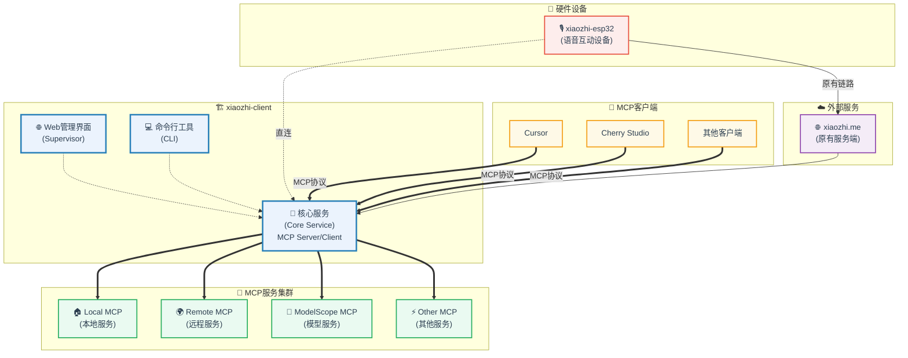

```mermaid
graph TB
  subgraph ProjectComponents["🏗️ xiaozhi-client"]
      Core["🔧 核心服务<br/>(Core Service)<br/>MCP Server/Client"]
      Web["🌐 Web管理界面<br/>(Supervisor)"]
      CLI["💻 命令行工具<br/>(CLI)"]
  end

  subgraph Hardware["📱 硬件设备"]
      ESP32["🎙️ xiaozhi-esp32<br/>(语音互动设备)"]
  end

  subgraph MCPClients["💼 MCP客户端"]
      Cursor["Cursor"]
      Cherry["Cherry Studio"]
      OtherClient["其他客户端"]
  end

  subgraph External["☁️ 外部服务"]
      XiaozhiMe["🌐 xiaozhi.me<br/>(原有服务端)"]
  end

  subgraph MCPServices["🔌 MCP服务集群"]
      direction LR
      MCP1["🏠 Local MCP<br/>(本地服务)"]
      MCP2["🌍 Remote MCP<br/>(远程服务)"]
      MCP3["🤖 ModelScope MCP<br/>(模型服务)"]
      MCPn["⚡ Other MCP<br/>(其他服务)"]
  end

  %% 新的MCP客户端连接 (重要)
  Cursor ==>|"MCP协议"| Core
  Cherry ==>|"MCP协议"| Core
  OtherClient ==>|"MCP协议"| Core

  %% ESP32连接链路
  ESP32 -.->|"直连"| Core
  ESP32 -->|"原有链路"| XiaozhiMe
  XiaozhiMe --> Core

  %% Core Service到MCP服务
  Core ==> MCP1
  Core ==> MCP2
  Core ==> MCP3
  Core ==> MCPn

  %% 项目内部管理连接
  Web -.-> Core
  CLI -.-> Core

  %% 样式定义
  classDef coreComponent stroke:#2980b9,stroke-width:3px,fill:#ebf3fd,color:#2c3e50
  classDef hardware stroke:#e74c3c,stroke-width:2px,fill:#fdedec,color:#2c3e50
  classDef external stroke:#8e44ad,stroke-width:2px,fill:#f4ecf7,color:#2c3e50
  classDef mcp stroke:#27ae60,stroke-width:2px,fill:#eafaf1,color:#2c3e50
  classDef mcpClient stroke:#f39c12,stroke-width:2px,fill:#fef9e7,color:#2c3e50
  classDef primaryFlow stroke:#27ae60,stroke-width:4px
  classDef secondaryFlow stroke:#95a5a6,stroke-width:2px

  class Core,Web,CLI coreComponent
  class ESP32 hardware
  class XiaozhiMe external
  class MCP1,MCP2,MCP3,MCPn mcp
  class Cursor,Cherry,OtherClient mcpClient

```
