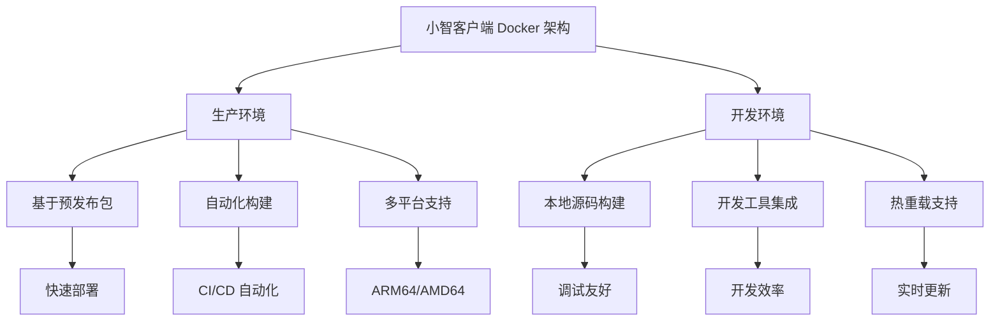
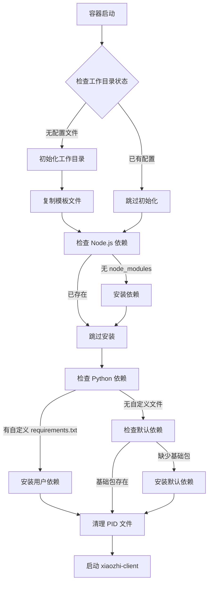

# Docker 镜像构建指南

本文档详细介绍小智客户端项目的 Docker 容器化架构和构建流程，帮助贡献者和开发者理解项目的容器化设计理念和参与开发。

## 📋 目录

- [项目 Docker 架构概览](#项目-docker-架构概览)
- [构建文件详解](#构建文件详解)
- [核心机制解析](#核心机制解析)
- [开发工作流](#开发工作流)
- [故障排除指南](#故障排除指南)

## 🏗️ 项目 Docker 架构概览

### 设计理念

小智客户端采用**双环境 Docker 架构**，针对不同的使用场景提供了专门的解决方案：

- **生产环境**：基于预发布包，提供开箱即用的稳定体验
- **开发环境**：支持本地构建，便于调试和功能开发

### 目录结构

项目将 Docker 相关文件组织在独立的 `docker/` 目录中：

```
docker/
├── .dockerignore              # 生产环境构建忽略文件
├── .dockerignore.dev          # 开发环境构建忽略文件
├── Dockerfile                 # 生产环境镜像构建文件
├── Dockerfile.dev             # 开发环境镜像构建文件
├── docker-compose.yml         # 生产环境容器编排
├── docker-compose.dev.yml     # 开发环境容器编排
├── scripts/                   # 脚本文件
│   ├── entrypoint.sh          # 容器启动初始化脚本
│   ├── start.sh               # 一键启动脚本
│   └── update-version.js      # 版本号自动更新脚本
└── templates/                 # 模板文件
    ├── mcpServers/            # MCP 服务器模板
    ├── package.json           # 项目模板配置
    ├── requirements.txt       # Python 依赖模板
    └── xiaozhi.config.json    # 配置文件模板
```

### 架构特点



## 📦 构建文件详解

### 关键差异

| 特性 | 生产环境 | 开发环境 |
|------|---------|---------|
| **基础包** | xiaozhi-client 预发布包 | 本地源码构建 |
| **用户权限** | root 用户运行 | 非 root 用户(后续会保持一致) |
| **Python 环境** | 完整虚拟环境 | 无 Python 环境(后续会保持一致) |
| **启动方式** | 直接运行可执行文件 | 通过源码运行 |
| **调试支持** | 基础日志 | 完整开发工具链 |

## ⚙️ 核心机制解析

### 容器启动流程

`entrypoint.sh` 脚本实现了智能的容器初始化流程：



### 版本管理

`update-version.js` 脚本实现了版本号的自动同步：

```javascript
// 自动更新 Dockerfile 中的版本号
const version = process.argv[2] || require('../../package.json').version;

// 更新生产环境 Dockerfile
const dockerfileContent = fs.readFileSync(dockerfilePath, 'utf8')
  .replace(/ARG XIAOZHI_VERSION=.*$/, `ARG XIAOZHI_VERSION=${version}`);

// 更新 docker-compose 版本标签
const composeContent = fs.readFileSync(composePath, 'utf8')
  .replace(/image: shenjingnan\/xiaozhi-client:.*$/, `image: shenjingnan/xiaozhi-client:${version}`);
```

## 🚀 开发工作流

### 本地开发环境

1. **构建开发镜像**：
```bash
cd docker/
docker build -f Dockerfile.dev -t xiaozhi-client:dev .
```

2. **启动开发容器**：
```bash
docker-compose -f docker-compose.dev.yml up --build
```

3. **调试和开发**：
```bash
# 查看容器日志
docker logs -f xiaozhi-client-dev

# 进入容器调试
docker exec -it xiaozhi-client-dev /bin/bash

# 重新构建并启动
docker-compose -f docker-compose.dev.yml up --build --force-recreate
```

### 生产环境部署

1. **构建生产镜像**：
```bash
# 指定版本号构建
docker build --build-arg XIAOZHI_VERSION=1.6.1 -t shenjingnan/xiaozhi-client:1.6.1 .

# 多平台构建（支持 ARM64 和 AMD64）
docker buildx build --platform linux/amd64,linux/arm64 \
  --build-arg XIAOZHI_VERSION=1.6.1 \
  -t shenjingnan/xiaozhi-client:1.6.1 \
  --push .
```

2. **使用 Docker Compose**：
```bash
# 使用默认配置启动
docker-compose up -d

# 指定版本启动
XIAOZHI_VERSION=1.6.1 docker-compose up -d

# 查看服务状态
docker-compose ps
docker-compose logs -f
```

### 版本发布流程

1. **更新版本号**：
```bash
# 使用项目脚本自动更新
pnpm docker:update-version 1.6.2

# 手动更新 package.json 和相关文件
npm version patch
```

2. **自动化构建**：

使用 Github 工作流 `.github/workflows/docker-publish.yml`

## 调试技巧

1. **查看详细日志**：
```bash
# 启动时显示详细日志
docker run --rm -it shenjingnan/xiaozhi-client:latest xiaozhi --help

# 实时查看容器日志
docker logs -f --tail=100 xiaozhi-client
```

2. **进入容器调试**：
```bash
# 进入运行中的容器
docker exec -it xiaozhi-client /bin/bash

# 检查环境配置
docker exec xiaozhi-client env | grep XIAOZHI
docker exec xiaozhi-client cat /workspaces/xiaozhi.config.json
```

3. **网络连接测试**：
```bash
# 测试容器内网络连接
docker exec xiaozhi-client curl -I http://localhost:9999

# 检查端口映射
docker port xiaozhi-client
```

## 📚 参考资料

- [Docker 官方文档](https://docs.docker.com/)
- [Docker Compose 文档](https://docs.docker.com/compose/)
- [Node.js 最佳实践](https://github.com/nodejs/docker-node/blob/main/docs/BestPractices.md)
- [小智客户端部署文档](/docs/usage/docker)

---

## 💡 参与贡献

欢迎参与小智客户端的 Docker 相关开发！请参考以下资源：

- **提交 Issue**：在 GitHub 上报告 Bug 或提出功能建议
- **提交 PR**：贡献代码改进和文档更新
- **讨论交流**：参与技术讨论和方案设计

在提交 Docker 相关的改动时，请确保：
- 遵循现有的文件组织结构
- 添加适当的注释和文档
- 测试在不同环境下的兼容性
- 保持与现有 CI/CD 流程的一致性
