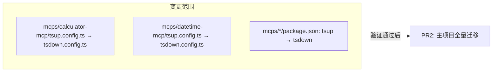
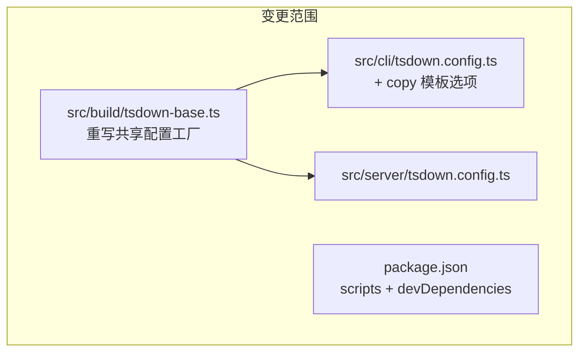

# tsup → tsdown 迁移深度分析报告

> **分析日期**: 2026-04-20
> **项目版本**: xiaozhi-client v2.3.1-beta.1
> **当前构建工具**: tsup ^8.5.0 (基于 esbuild)
> **目标构建工具**: tsdown (基于 Rolldown/Oxc)

## Context

xiaozhi-client 当前使用 **tsup ^8.5.0**（基于 esbuild）作为 CLI 和 Server 模块的构建工具。本报告通过源码级分析，逐项对照项目实际使用的每个 tsup 配置项在 tsdown 中的映射情况，给出可行性结论和实施建议。

---

## 一、执行摘要

### 核心结论：**高度可行，建议分阶段实施**

| 维度 | 判定 | 置信度 |
|------|------|--------|
| 配置项覆盖率 | **100%** -- 所有当前使用的 tsup 选项均有 tsdown 对应方案 | 高 |
| 构建产物等价性 | **高** -- banner/define/external/minify 全部可精确映射 | 高 |
| 行为差异风险 | **低** -- 仅 `drop console` 的语义有微小差异（MCP 子包需注意） | 中 |
| 生态成熟度 | **中** -- Rolldown 仍处 beta，但 VoidZero 团队（Vite 同团队）活跃维护 | 中 |
| 迁移工作量 | **小** -- 预计修改 ~10 个文件，核心配置约 200 行代码 | 高 |

### 关键数据速览

- **tsup 配置文件数量**: 4 个（不含共享基础配置）
- **需要修改的文件**: ~10 个
- **可删除的 workaround**: require polyfill banner 脚本、模板复制内联脚本
- **可移除依赖**: tsup, esbuild (devDependencies)
- **新增依赖**: tsdown
- **Node.js 兼容性**: 项目要求 >=22.0，tsdown 要求 >=20.19 -- **完全兼容**

---

## 二、现状分析 -- 当前 tsup 使用全景

### 2.1 构建架构总览

```
xiaozhi-client/ (pnpm workspace monorepo)
├── src/build/tsup-base.ts      # [核心] 共享基础配置工厂函数
├── src/build/version.ts          # 版本号注入工具
├── src/cli/tsup.config.ts        # CLI 构建目标 → dist/cli/
├── src/server/tsup.config.ts     # Server 构建目标 → dist/backend/
├── mcps/calculator-mcp/tsup.config.ts   # MCP 子包 1
├── mcps/datetime-mcp/tsup.config.ts     # MCP 子包 2
└── templates/                     # CLI 模板资源 (post-build 复制)
```

### 2.2 共享基础配置 `src/build/tsup-base.ts` 关键选项

| 选项 | 值 | 用途 |
|------|-----|------|
| `format` | `["esm"]` | ESM 输出 |
| `target` | `"node22"` | Node.js 22 目标 |
| `platform` | `"node"` | Node.js 平台 |
| `bundle` | `true` | 全量打包 |
| `outExtension` | `{ js: ".js" }` | 强制 .js 扩展名 |
| `clean` / `sourcemap` | `true` / `true` | 清理 + sourcemap |
| `minify` | 条件式 (`NODE_ENV=production`) | 生产压缩 |
| `splitting` | `false` | 禁用分裂 |
| `keepNames` | `true` | 保留名称 |
| **`esbuildOptions.drop`** | `["console", "debugger"]` | 生产去日志 |
| **`esbuildOptions.banner.js`** | require polyfill | ESM 注入 CJS require |
| **`esbuildOptions.define`** | `__VERSION__`, `__APP_NAME__` | 版本常量注入 |

### 2.3 构建脚本链 (package.json)

```json
{
  "build": "clean:dist && build:server && build:cli && <模板复制内联脚本> && build:web",
  "build:server": "cd src/server && tsup",
  "build:cli": "cd src/cli && tsup"
}
```

**三处 post-build 操作需要关注**:

1. **模板复制**: 内联 `node -e` 脚本复制 `templates/` → `dist/cli/templates/`
2. **require polyfill**: 通过 esbuildOptions.banner 注入
3. **版本注入**: 通过 getVersionDefine() + esbuildOptions.define

---

## 三、tsdown 能力逐项深度对照

### 3.1 核心选项映射（从 tsdown 源码确认）

| # | tsup 选项 | 当前值 | tsdown 对应 | 默认值 | 状态 |
|---|-----------|--------|-------------|--------|------|
| 1 | `entry` | 对象/数组 | `entry` | `src/index.ts` | 直接等效 |
| 2 | `format: ["esm"]` | `["esm"]` | `format: ['es']` | `['es']` | **默认值一致** |
| 3 | `target: "node22"` | `"node22"` | `target: "node22"` | 从 engines.node 读取 | 直接等效 |
| 4 | `platform: "node"` | `"node"` | `platform: "node"` | `'node'` | **默认值一致** |
| 5 | `bundle: true` | `true` | `unbundle: false` | `false` | bundle 已废弃 |
| 6 | `outExtension` | `{js: ".js"}` | `outExtensions` | 由 fixedExtension 决定 | 直接等效 |
| 7 | `clean: true` | `true` | `clean: true` | `true` | **默认值一致** |
| 8 | `sourcemap: true` | `true` | `sourcemap: true` | `false` | 需显式设置 |
| 9 | `minify` | 条件布尔 | `minify` | `false` | 需显式设置 |
| 10 | `external` | 字符串数组 | `external` | -- | 直接等效 |
| 11 | `tsconfig` | 路径字符串 | `tsconfig` | 自动检测 | 直接等效 |
| 12 | `splitting: false` | `false` | (无需设置) | Rolldown 默认不分裂 | 无需处理 |
| 13 | **banner** (via esbuildOptions) | require polyfill | **`banner`** | -- | **原生支持** |
| 14 | **define** (via esbuildOptions) | version constants | **`define`** | -- | **原生支持** |
| 15 | `watch` | `--watch` | `watch` | `false` | 直接等效 |

> 数据来源: tsdown 源码 `src/config/types.ts` + `src/features/rolldown.ts` + 测试快照 `banner-and-footer-option.snap.md`

### 3.2 高级/特殊选项映射

| # | tsup 特性 | tsdown 处理方式 | 说明 |
|---|-----------|----------------|------|
| 17 | `esbuildOptions.drop: ["console", "debugger"]` | `minify: { compress: { dropConsole: true, dropDebugger: true } }` | 通过 oxc-minifier |
| 18 | `keepNames: true` | `minify: { mangle: { keepNames: true } }` | oxc 原生支持 |
| 19 | `esbuildOptions.pure: ["console.log"]` (MCP子包) | `minify: { compress: { dropConsole: true } }` | **语义有差异** (见下) |
| 20 | 模板复制 (post-build 脚本) | **`copy` 选项** | 内置支持，可替代内联脚本 |
| 21 | onSuccess 回调 | **`onSuccess`** | 内置钩子 |

### 3.3 关键语义差异

#### 差异 A: `drop console` 行为

- **主项目** (`tsup-base.ts`): `drop: ["console", "debugger"]` = 移除**所有** console 调用 → 与 oxc `dropConsole: true` **完全一致**
- **MCP 子包**: `pure: ["console.log", "console.debug"]` = 仅当返回值未使用时移除 → 改为 `dropConsole` 会**额外移除** console.error/warn → **需保持细粒度控制**

#### 差异 B: `keepNames` 传递路径

tsup 是顶层选项；tsdown 需通过 `minify.mangle.keepNames` 或 `outputOptions` 传递。

### 3.4 tsdown 额外能力（值得关注）

| 能力 | 对本项目的价值 |
|------|---------------|
| `env` 选项 | 自动映射 process.env.XXX 和 import.meta.env.XXX |
| `shims: true` | 可能替代手动 banner 注入 require polyfill |
| `workspace` 模式 | 可统一管理 4 个构建目标 |
| `dts` 自动检测 | 根据 package.json types 字段自动决定 |

---

## 四、迁移影响评估

### 4.1 文件变更清单

| 文件 | 操作 | 改动量 |
|------|------|--------|
| `src/build/tsup-base.ts` | **重写**为 tsdown-base.ts | ~50 行 |
| `src/build/version.ts` | 保留不变 | 0 |
| `src/cli/tsup.config.ts` | **重写**为 tsdown.config.ts | ~15 行 |
| `src/server/tsup.config.ts` | **重写**为 tsdown.config.ts | ~20 行 |
| `mcps/*/tsup.config.ts` (x2) | **重写**为 tsdown.config.ts | 各 ~25 行 |
| `package.json` (根) | 修改 scripts + devDependencies | ~10 行 |
| `mcps/*/package.json` (x2) | 替换 tsup → tsdown | 各 ~5 行 |

### 4.2 可删除的代码

- `esbuildOptions.banner.js` 中的 require polyfill → 改用顶层 `banner` 选项
- package.json build 脚本中的模板复制内联脚本 → 改用 `copy` 选项
- `devDependencies` 中的 `tsup` 和 `esbuild`

---

## 五、风险评估

### 5.1 技术风险矩阵

| 风险项 | 概率 | 影响 | 缓解措施 |
|--------|------|------|----------|
| **Rolldown beta 稳定性** | 中 | 高 | MCP 子包先试点；保留回滚方案 |
| **oxc-minifier 与 esbuild 行为差异** | 低 | 中 | 对比构建产物大小和运行时行为 |
| **dropConsole 导致日志丢失** | 低 | 高 | 全面回归测试 |
| **Windows 兼容性** | 低 | 中 | CI 已有三平台矩阵验证 |
| **Node.js 22 兼容性** | 极低 | 低 | 完全兼容 |

### 5.2 生态对比

| 维度 | tsup | tsdown |
|------|------|--------|
| 成熟度 | 成熟稳定 (~13k stars) | Beta 但活跃 (~3.9k stars) |
| 团队 | @egoist (个人) | VoidZero (Vite/Rollup 团队) |
| 迁移工具 | 无 | **`npx tsdown-migrate` 可用** |
| 战略定位 | 维护模式 | Vite 生态未来方向 |

---

## 六、收益分析

### 6.1 性能收益

基于 Rolldown vs esbuild 公开基准:

| 指标 | 预期提升 |
|------|----------|
| 冷启动速度 | 快 20-40% (Oxc parser) |
| 增量构建 (watch) | 快 30-50% (Rust-native) |
| 开发体验影响 | `pnpm run dev` 同时运行 server+cli+vite watch，构建性能直接影响 DX |

### 6.2 代码简化收益

| 简化项 | 效果 |
|--------|------|
| require polyfill banner | 从 esbuildOptions 回调中提取为顶层选项 |
| 模板复制脚本 | 从内联 node -e 命令变为声明式 `copy` 选项 |
| esbuildOptions 嵌套回调 | 扁平化为直接配置项 |
| build 脚本 | 删除 ~100 字符的内联脚本 |

### 6.3 战略收益

- **面向未来**: Rolldown 是 Vite 未来默认打包器
- **工具链统一**: 项目已使用 Vite(web) + Vitest(test)，迁移后进入统一 Rolldown 生态
- **减少依赖复杂度**: 移除 esbuild 间接依赖

---

## 七、实施策略：2 个 PR

### 策略选择依据

**关键发现 -- 项目中的耦合边界**:

```
┌─────────────────────────────────────────────────┐
│  主项目 (强耦合 -- 共享 tsup-base.ts)            │
│                                                  │
│  src/build/tsup-base.ts  ◄── 被 CLI 和 Server 引用 │
│        ▲                    ▲                   │
│        │                    │                   │
│  src/cli/tsup.config.ts   src/server/tsup.config │
│        └────────┬───────────┘                   │
│                 ▼                               │
│       package.json (统一 build scripts)          │
└─────────────────────────────────────────────────┘

┌──────────────┐  ┌──────────────┐
│ calculator-  │  │ datetime-mcp │  ← 完全独立，零耦合
│ mcp          │  │              │
│ (独立 define) │  │ (独立 define) │
└──────────────┘  └──────────────┘
```

- **MCP 子包** 与主项目零耦合（独立的 config、package.json、构建流程）
- **CLI 和 Server** 通过 `tsup-base.ts` 强耦合，拆分会产生中间态垃圾代码
- 因此自然分割点在 **MCP vs 主项目**，而非 CLI vs Server

### 为什么不是 1 个 PR？

| 因素 | 分析 |
|------|------|
| MCP 是免费试错沙箱 | 先在此验证 tsdown 真实行为（pure→dropConsole 语义、产物大小、运行时），主项目 PR 会稳很多 |
| Review 聚焦 | 单 PR 混合 3 种不同风格配置迁移，reviewer 难以聚焦 |
| 问题隔离 | 如果构建产物有细微差异，1 个 PR 需同时排查 MCP + 主项目 |

### 为什么不是 3+ 个 PR？

| 因素 | 分析 |
|------|------|
| `tsup-base.ts` 是硬耦合点 | 拆 CLI/Server 为两个 PR 需要中间态同时支持两套工具或复制配置 |
| build scripts 是统一的 | `build:server` + `build:cli` 在同一链中，拆开导致脚本不协调 |
| 原子性价值 | ~100 行配置变更作为一个完整故事，上下文更清晰 |

---

### PR1：MCP 子包迁移（试点验证）



| 项目 | 内容 |
|------|------|
| **范围** | 仅 `mcps/calculator-mcp` + `mcps/datetime-mcp` |
| **变更文件** | 4 个（2 config + 2 package.json） |
| **风险等级** | 极低 -- 不影响主项目任何功能 |
| **核心价值** | 验证 tsdown 在本项目中的真实行为：pure→dropConsole 语义差异、产物大小、Node.js 22 兼容性 |
| **特别注意** | MCP 子包使用 `pure: ["console.log", "console.debug"]` 而非 `drop: ["console"]`，需确认 tsdown 的等价方案 |

**通过标准**:
- [ ] 两个子包各自 `pnpm build` 成功
- [ ] `node dist/index.js` 可正常运行
- [ ] 生产构建 (`NODE_ENV=production`) 下 console 处理符合预期
- [ ] CI 构建通过

---

### PR2：主项目全量迁移（核心）



| 项目 | 内容 |
|------|------|
| **范围** | CLI + Server + 共享配置 + 根 package.json |
| **变更文件** | ~6 个 |
| **前置依赖** | PR1 已合并（已确认 tsdown 行为符合预期） |
| **核心变更** | `tsup-base.ts` → `tsdown-base.ts`、banner/define 扁平化、`copy` 替代内联模板脚本、scripts 简化 |
| **可删除代码** | esbuildOptions 回调嵌套、~100 字符的模板复制内联脚本 |

**通过标准**:
- [ ] `pnpm run build` 全量构建成功
- [ ] `node dist/cli/index.js -v` 版本号正确输出
- [ ] `node dist/cli/index.js create my-app` CLI 功能正常
- [ ] `dist/cli/templates/` 目录正确复制
- [ ] Server 启动正常
- [ ] `NODE_ENV=production pnpm run build` console 被移除
- [ ] `pnpm test` 全部测试通过
- [ ] `pnpm check:all` 所有质量检查通过
- [ ] CI 三平台 (ubuntu/windows/macOS) 绿

---

### 回滚策略

- **PR1 回滚**: 删除 MCP 子包的 `tsdown.config.ts`，恢复 `tsup.config.ts`
- **PR2 回滚**: 切换回 `tsup-base.ts` 分支，恢复 package.json scripts
- 每个 PR 独立可 revert，互不影响

---

## 八、最终结论

### 建议：**执行迁移**

理由：

1. **技术可行**: 100% 配置项覆盖率，全部有对应方案
2. **风险可控**: 三阶段策略将风险限制在可控范围
3. **收益明确**: 代码简化 + 性能提升 + 工具链统一
4. **战略对齐**: 进入 Rolldown/Vite 统一生态
5. **回滚成本低**: 仅涉及配置文件，不触碰业务逻辑

### 不建议迁移的条件

- 即将进入发布冻结期
- 团队时间预算不足 2-3 工作日
- Phase 1 发现 Windows 平台兼容性问题

---

## 关键文件清单

| 文件 | 角色 |
|------|------|
| `src/build/tsup-base.ts` | 共享基础配置核心，需完全重写 |
| `src/cli/tsup.config.ts` | CLI 构建，含模板 copy 迁移 |
| `src/server/tsup.config.ts` | Server 构建，external 最复杂 |
| `package.json` | 构建脚本 + 依赖管理 |
| `mcps/calculator-mcp/tsup.config.ts` | Phase 1 试点目标 |
| `src/build/version.ts` | 版本注入工具（无需修改） |

## 验证方案

1. `pnpm run build` -- 全量构建成功
2. `node dist/cli/index.js -v` -- 版本号正确输出
3. `node dist/cli/index.js create my-app` -- CLI 功能正常
4. 检查 `dist/cli/templates/` 目录正确复制
5. `NODE_ENV=production pnpm run build` -- 生产构建 console 被移除
6. `pnpm test` -- 全部测试通过
7. `pnpm check:all` -- 所有质量检查通过
8. CI 三平台 (ubuntu/windows/macOS) 构建通过
