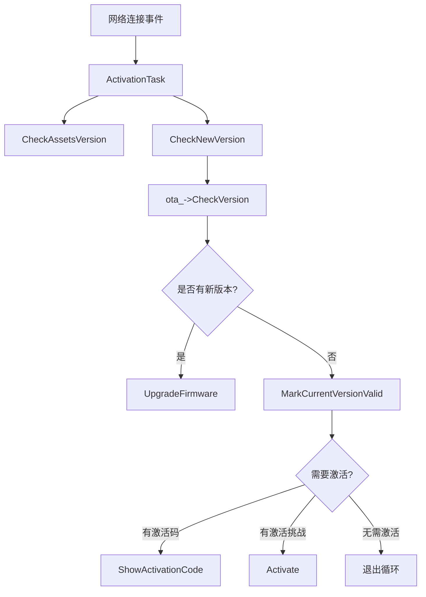
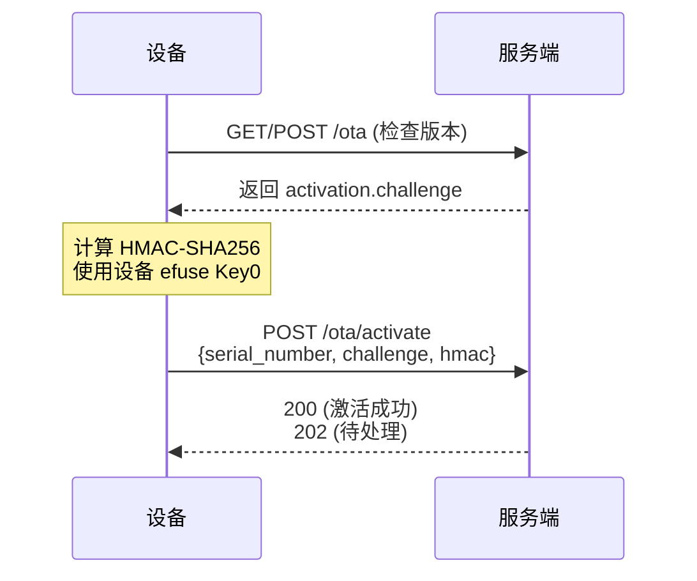
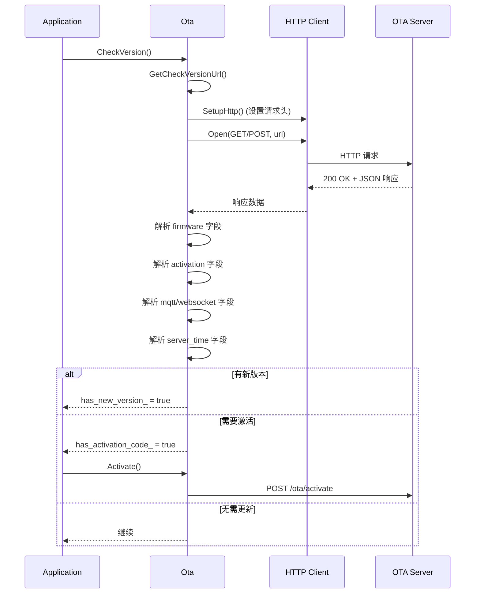

# 小智硬件版本检查与激活流程分析报告

## 一、概述

本报告分析小智 ESP32 硬件项目中 `Application::CheckNewVersion()` 函数的实现，详细说明设备如何请求服务端检查新版本，以及服务端响应的数据格式。

## 二、调用链路



## 三、HTTP 请求详情

### 3.1 请求 URL

```cpp
std::string GetCheckVersionUrl() {
    Settings settings("wifi", false);
    std::string url = settings.GetString("ota_url");
    if (url.empty()) {
        url = CONFIG_OTA_URL;  // 使用配置的默认 URL
    }
    return url;
}
```

### 3.2 请求头

| 请求头 | 说明 | 示例值 |
|--------|------|--------|
| `Activation-Version` | 激活协议版本 | "2"（有序列号）或 "1"（无序列号） |
| `Device-Id` | 设备 MAC 地址 | "a4:cf:12:34:56:78" |
| `Client-Id` | 设备 UUID | 唯一标识符 |
| `Serial-Number` | 设备序列号（可选） | 从 efuse USER_DATA 读取 |
| `User-Agent` | 用户代理 | 包含项目名称、版本、芯片型号等 |
| `Accept-Language` | 语言设置 | 如 "zh-CN" |
| `Content-Type` | 内容类型 | "application/json" |

### 3.3 请求方法与请求体

```cpp
std::string data = board.GetSystemInfoJson();
std::string method = data.length() > 0 ? "POST" : "GET";
```

- **有系统信息数据**：使用 **POST** 方法，请求体为 JSON 格式的系统信息
- **无系统信息数据**：使用 **GET** 方法，无请求体

## 四、服务端响应数据格式

### 4.1 完整响应结构

```json
{
  "firmware": {
    "version": "1.0.0",
    "url": "https://example.com/firmware.bin",
    "force": 0
  },
  "activation": {
    "message": "请访问网站完成激活",
    "code": "12345678",
    "challenge": "random-challenge-string",
    "timeout_ms": 30000
  },
  "mqtt": {
    "host": "mqtt.example.com",
    "port": 1883,
    "username": "device",
    "password": "secret"
  },
  "websocket": {
    "url": "wss://ws.example.com"
  },
  "server_time": {
    "timestamp": 1234567890000,
    "timezone_offset": 480
  }
}
```

### 4.2 字段说明

#### firmware（固件信息）

| 字段 | 类型 | 必需 | 说明 |
|------|------|------|------|
| `version` | string | 是 | 新固件版本号（如 "1.0.0"） |
| `url` | string | 是 | 固件下载地址 |
| `force` | number | 否 | 强制升级标志，1 表示强制升级 |

#### activation（激活信息）

| 字段 | 类型 | 必需 | 说明 |
|------|------|------|------|
| `message` | string | 否 | 激活提示消息 |
| `code` | string | 否 | 激活码，用于展示给用户 |
| `challenge` | string | 否 | 激活挑战字符串，用于 HMAC 签名 |
| `timeout_ms` | number | 否 | 激活超时时间（毫秒） |

#### mqtt（MQTT 配置）

包含 MQTT 连接所需的配置项，以键值对形式存储，如：
- `host`、`port`、`username`、`password`、`topic` 等

#### websocket（WebSocket 配置）

包含 WebSocket 连接所需的配置项，以键值对形式存储

#### server_time（服务器时间）

| 字段 | 类型 | 说明 |
|------|------|------|
| `timestamp` | number | 服务器时间戳（毫秒） |
| `timezone_offset` | number | 时区偏移（分钟） |

## 五、版本比较逻辑

```cpp
bool IsNewVersionAvailable(const std::string& currentVersion, const std::string& newVersion) {
    // 按 '.' 分割版本号，逐位比较
    // 例如: 1.2.0 > 1.1.9, 0.1.0 > 0.0.1
}
```

## 六、激活流程（有序列号设备）

### 6.1 激活请求



### 6.2 激活负载格式

```json
{
  "algorithm": "hmac-sha256",
  "serial_number": "设备序列号",
  "challenge": "服务端返回的挑战字符串",
  "hmac": "HMAC-SHA256(challenge, Key0) 的十六进制表示"
}
```

### 6.3 激活响应状态码

| 状态码 | 含义 | 设备行为 |
|--------|------|----------|
| 200 | 激活成功 | 继续启动流程 |
| 202 | 激活处理中 | 3 秒后重试 |
| 其他 | 激活失败 | 10 秒后重试 |

## 七、完整流程时序图



## 八、配置项说明

| 配置项 | 来源 | 说明 |
|--------|------|------|
| `ota_url` | NVS "wifi" 命名空间 | OTA 服务器地址 |
| `CONFIG_OTA_URL` | 编译时配置 | 默认 OTA 服务器地址 |
| `Serial-Number` | efuse USER_DATA | 设备序列号（32 字节） |

## 九、总结

小智硬件的版本检查与激活流程具有以下特点：

1. **灵活的请求方式**：支持 GET 和 POST 方法，POST 时携带设备系统信息
2. **丰富的设备信息**：通过请求头传递设备标识、序列号、语言等
3. **多合一响应**：服务端一次性返回固件、激活、协议配置、时间等信息
4. **HMAC 签名激活**：使用硬件 efuse 中的 Key0 进行签名，确保设备身份真实性
5. **重试机制**：版本检查和激活都有完善的重试策略
6. **时序同步**：支持从服务端同步时间戳和时区

---

**分析完成时间**：2026-02-07
**代码版本**：xiaozhi-esp32 (commit: e446be97)
