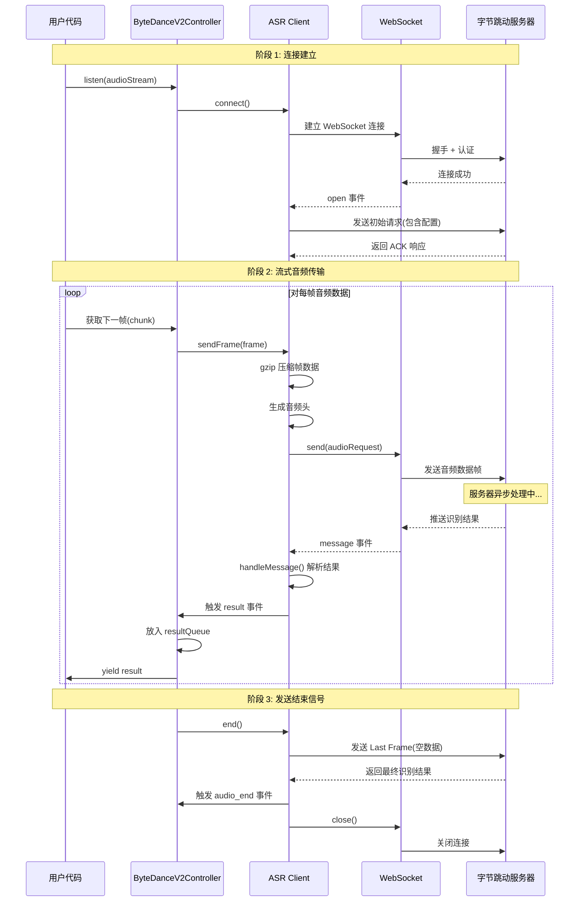
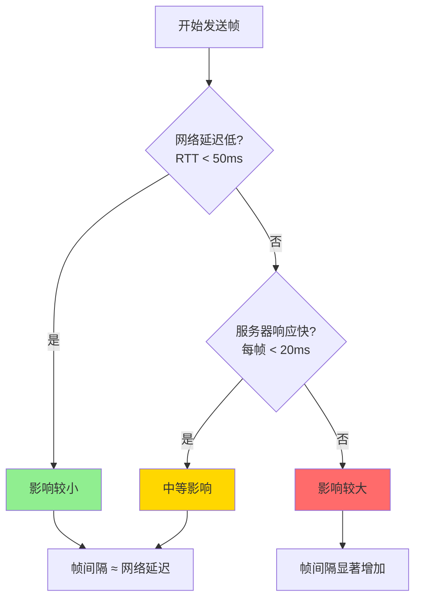
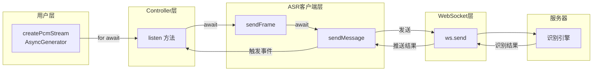

# ByteDance V2 流式 ASR 通信原理分析

## 概述

本文档分析 `packages/asr/examples/demo-bytedance-v2-stream.ts` 中 `listen()` 方法的通信工作原理，以及当前实现对音频帧发送速度的影响。

## 代码调用流程

```typescript
for await (const result of client.bytedance.v2.listen(createPcmStream())) {
  resultCount++;
  const status = result.isFinal ? "最终" : "中间";
  console.log(status, result);
}
```

## 完整通信架构图



## 核心实现分析

### ByteDanceV2Controller.listen() 核心逻辑

```typescript
// 位置: packages/asr/src/platforms/bytedance/controllers/ByteDanceV2Controller.ts:130-149

// 发送音频帧并处理结果
for await (const chunk of asyncIterable) {
  const frame = Buffer.isBuffer(chunk) ? chunk : Buffer.from(chunk);

  // 关键: 等待帧发送完成
  await this.asr.sendFrame(frame);

  // 发送完后立即检查并 yield 结果
  while (resultQueue.length > 0) {
    yield resultQueue.shift()!;
  }
}
```

### ASR.sendFrame() 实现

```typescript
// 位置: packages/asr/src/client/ASR.ts:760-785

async sendFrame(frame: Buffer): Promise<void> {
  // 1. gzip 压缩
  const compressedChunk = compressGzipSync(frame);

  // 2. 生成音频头
  const header = generateAudioDefaultHeader();

  // 3. 构建请求
  const audioRequest = Buffer.alloc(compressedChunk.length + 8);
  header.copy(audioRequest, 0);
  audioRequest.writeUInt32BE(compressedChunk.length, 4);
  compressedChunk.copy(audioRequest, 8);

  // 4. 发送 (等待 WebSocket 发送完成)
  await this.sendMessage(audioRequest);
}
```

### ASR.sendMessage() 实现

```typescript
// 位置: packages/asr/src/client/ASR.ts:398-410

private async sendMessage(message: Buffer): Promise<void> {
  return new Promise((resolve, reject) => {
    this.ws.send(message, (err) => {
      if (err) reject(err);
      else resolve();  // 等待 WebSocket 回调完成
    });
  });
}
```

## 对发送音频帧速度的影响分析

### 当前实现的特性

| 特性 | 说明 |
|------|------|
| 执行模式 | **串行执行** - 发送一帧 → 等待完成 → 处理结果 → 发送下一帧 |
| 等待策略 | 等待 `ws.send()` 回调完成才算帧发送成功 |
| 结果处理 | 发送完当前帧后立即检查队列，处理完再发下一帧 |

### 是否会影响发送速度？

**答案：是的，当前实现会影响发送音频帧的速度，原因如下：**

1. **串行等待机制**
   - 每帧必须等待 `await this.asr.sendFrame(frame)` 完成
   - 这不仅等待数据写入 TCP 缓冲区，还等待回调触发

2. **结果处理阻塞**
   - 发送完一帧后，立即处理所有已接收的结果
   - 如果服务器响应快，结果处理会占用时间

3. **无并发发送**
   - 无法像 HTTP/2那样并行发送多帧
   - 无法利用 WebSocket 的全双工特性

### 影响程度评估



### 潜在优化方向

1. **批量发送**
   - 积累多帧后批量发送，减少等待次数

2. **后台发送**
   - 使用生产者-消费者模式，发送和处理结果并行

3. **流式背压**
   - 实现简单的背压机制，根据服务器处理能力动态调整发送速度

### 当前设计的合理性

虽然有上述影响，但当前设计也有其合理性：

- ✅ **简单可靠**：实现清晰，易于理解和维护
- ✅ **顺序保证**：结果与音频顺序一致
- ✅ **避免过载**：不会一次性发送大量数据导致服务器积压
- ✅ **调试友好**：便于观察每帧的发送和响应关系

## 数据流总览



## 结论

当前 `for await (const result of client.bytedance.v2.listen(...))` 的实现方式**会影响发送音频帧的速度**，主要体现在：

1. 串行执行导致每帧必须等待前帧发送完成
2. 结果处理与发送串行，增加等待时间

对于大多数实时语音识别场景（如实时通话、直播字幕），当前实现通常足够。但如果对延迟有更高要求（如超低延迟语音交互），可以考虑优化为并行发送+后台结果处理的架构。

## 相关文件

| 文件 | 说明 |
|------|------|
| `packages/asr/src/platforms/bytedance/controllers/ByteDanceV2Controller.ts` | listen 方法实现 |
| `packages/asr/src/client/ASR.ts` | ASR 客户端核心实现 |
| `packages/asr/examples/demo-bytedance-v2-stream.ts` | 示例代码 |
