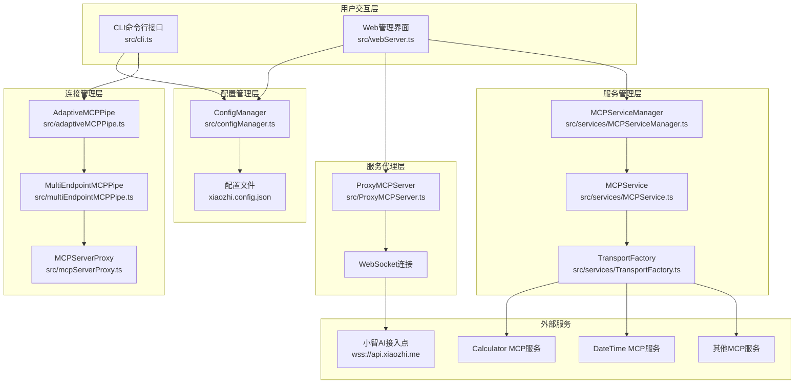
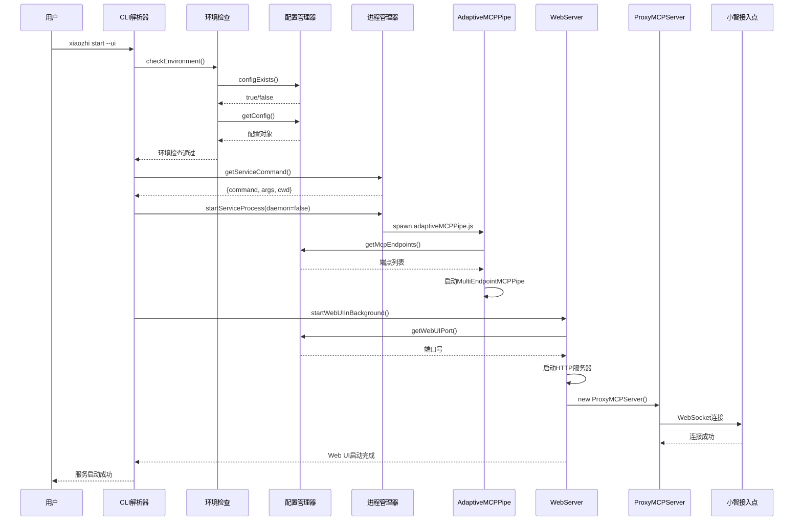
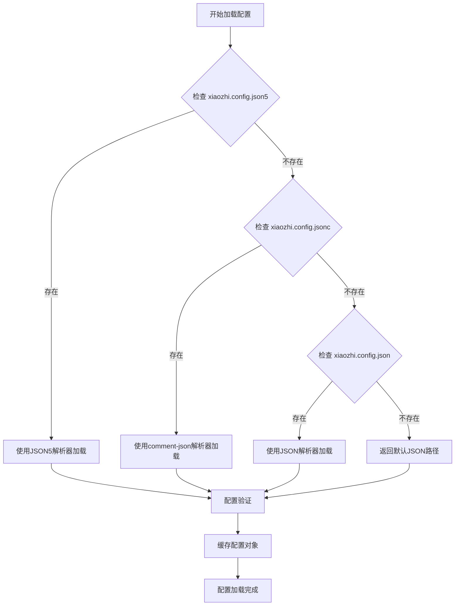
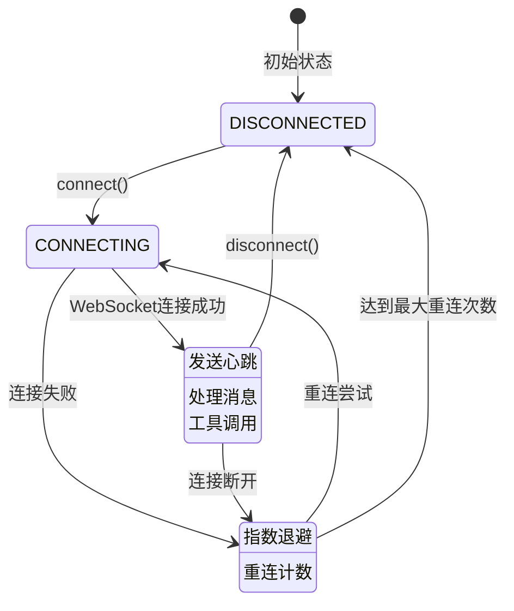
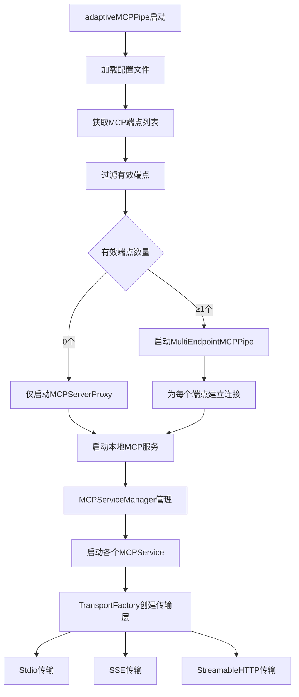
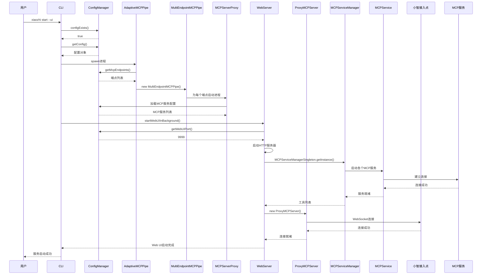
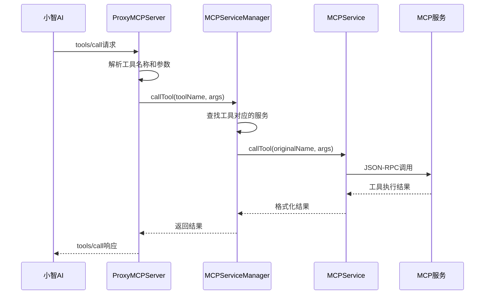

# 小智客户端架构深度分析报告

## 项目概述

小智客户端（xiaozhi-client）是一个基于 Node.js 的 MCP（Model Context Protocol）客户端应用，主要功能是连接小智AI服务和本地MCP服务，提供工具调用和配置管理能力。项目采用 TypeScript 开发，支持多种运行模式和配置格式。

## 整体架构设计

### 架构层次图

### 核心组件职责分析

**CLI层（src/cli.ts）**
- 命令行参数解析和路由
- 服务启动、停止、状态检查
- 环境验证和配置检查
- 进程管理（前台/后台模式）

**配置管理层（src/configManager.ts）**
- 支持 JSON5、JSONC、JSON 三种配置格式
- 配置文件的读取、解析、验证、保存
- 单例模式确保配置一致性
- 支持配置热更新和注释保留

**Web服务层（src/webServer.ts）**
- HTTP API 服务器（端口9999）
- WebSocket 服务器
- 静态文件服务
- 配置管理界面

**代理层（src/ProxyMCPServer.ts）**
- 与小智接入点的WebSocket连接
- 工具注册和管理
- 消息转发和响应处理
- 连接状态管理和重连机制

## 启动流程详细分析

### xiaozhi start --ui 命令执行流程

### 启动时机和连接顺序

1. **环境检查阶段**：验证配置文件存在性和格式正确性
2. **主服务启动**：启动 adaptiveMCPPipe 进程处理MCP连接
3. **Web UI启动**：启动Web服务器和小智接入点连接
4. **并行连接**：MCP服务连接和小智接入点连接并行进行

## 配置加载机制分析

### 配置文件优先级和格式支持

### 配置管理特性

**多格式支持**：
- JSON5：支持注释、尾随逗号、更灵活的语法
- JSONC：支持注释的JSON格式
- JSON：标准JSON格式

**注释保留机制**：
- JSON5：使用 json5-writer 库保留注释
- JSONC：使用 comment-json 库保留注释
- 配置更新时自动保留原有注释

**配置验证**：
- 结构验证：检查必需字段和数据类型
- MCP服务配置验证：验证传输类型和参数
- 端点URL验证：支持字符串和数组格式

## 小智接入点连接机制分析

### ProxyMCPServer 连接流程

### 连接特性分析

**连接管理**：
- WebSocket 长连接
- 自动重连机制（指数退避策略）
- 连接超时处理（默认30秒）
- 手动断开和重连支持

**消息处理**：
- JSON-RPC 2.0 协议
- 工具注册和调用
- 错误处理和响应

**状态监控**：
- 连接状态实时跟踪
- 重连次数和间隔管理
- 错误信息记录

## MCP服务连接机制分析

### 自适应连接架构

### 传输层抽象设计

**TransportFactory 模式**：
- 统一的传输层接口
- 支持三种传输类型：Stdio、SSE、StreamableHTTP
- 配置验证和传输层创建

**MCPService 生命周期**：
- 连接建立和初始化
- 工具列表获取和缓存
- 工具调用和响应处理
- 连接监控和重连

**MCPServiceManager 统一管理**：
- 多服务实例管理
- 工具聚合和路由
- 服务状态监控
- 配置热更新支持

## 架构设计评估

### 优点分析

**1. 模块化设计**
- 各组件职责相对清晰，便于独立开发和维护
- 良好的分层架构，降低了组件间的耦合度
- 支持插件化的MCP服务扩展

**2. 配置管理灵活性**
- 支持多种配置文件格式（JSON5、JSONC、JSON）
- 配置注释保留机制，提升用户体验
- 支持多端点配置，适应不同部署场景

**3. 连接可靠性**
- 实现了完善的重连机制和错误恢复
- 支持多种传输协议（Stdio、SSE、HTTP）
- 连接状态实时监控和管理

**4. 传输层抽象**
- TransportFactory 提供了良好的传输层抽象
- 支持不同类型的MCP服务连接
- 便于扩展新的传输协议

**5. 单例模式应用**
- ConfigManager 使用单例模式，避免重复加载
- 确保配置的一致性和内存效率

### 问题识别

**1. 架构复杂度过高**
- 存在功能重叠的组件（ProxyMCPServer vs mcpServerProxy）
- 连接逻辑分散在多个文件中，增加了理解和维护难度
- 启动流程涉及多个组件，调试困难

**2. 状态管理混乱**
- 连接状态在多个组件中分别维护
- 缺乏统一的状态管理机制
- 状态同步可能存在不一致问题

**3. 错误处理不统一**
- 不同组件采用不同的错误处理策略
- 重连机制实现不一致
- 错误信息格式和级别不统一

**4. 测试覆盖不足**
- 复杂的启动流程难以进行单元测试
- 集成测试覆盖率较低
- 缺乏端到端测试

**5. 性能监控缺失**
- 缺乏详细的性能指标收集
- 连接质量监控不足
- 资源使用情况不透明

### 改进建议

**1. 架构简化**
- 合并功能重叠的组件，减少代码重复
- 建立统一的连接管理器，集中处理所有连接逻辑
- 简化启动流程，减少组件间的依赖关系

**2. 状态管理优化**
- 引入状态管理库（如 Redux 或自定义状态机）
- 建立统一的状态更新和通知机制
- 实现状态持久化和恢复

**3. 错误处理标准化**
- 建立统一的错误分类和处理策略
- 实现标准化的重连机制
- 统一错误日志格式和级别

**4. 监控能力增强**
- 添加详细的性能指标收集
- 实现连接质量监控和告警
- 提供资源使用情况的可视化界面

**5. 测试体系完善**
- 增加单元测试覆盖率
- 建立完整的集成测试套件
- 实现端到端测试自动化

**6. 配置管理增强**
- 支持配置文件热重载
- 增加配置验证和提示功能
- 提供配置迁移和备份机制

## 关键流程时序分析

### 完整启动时序图

### 工具调用流程图

## 总结

小智客户端项目采用了分层的模块化架构设计，在功能完整性和扩展性方面表现良好。项目支持多种配置格式、多种传输协议，具备完善的重连机制和错误处理能力。

然而，当前架构也存在一些问题，主要体现在组件复杂度过高、状态管理分散、错误处理不统一等方面。这些问题在一定程度上影响了代码的可维护性和系统的稳定性。

建议在后续的开发中，重点关注架构简化、状态管理优化、错误处理标准化等方面的改进，同时加强测试覆盖和监控能力，以提升整体的代码质量和系统可靠性。

通过持续的架构优化和重构，小智客户端项目有望成为一个更加稳定、高效、易维护的MCP客户端解决方案。
