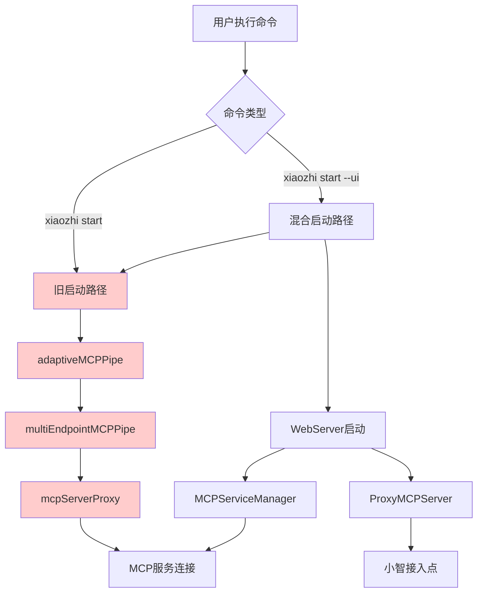
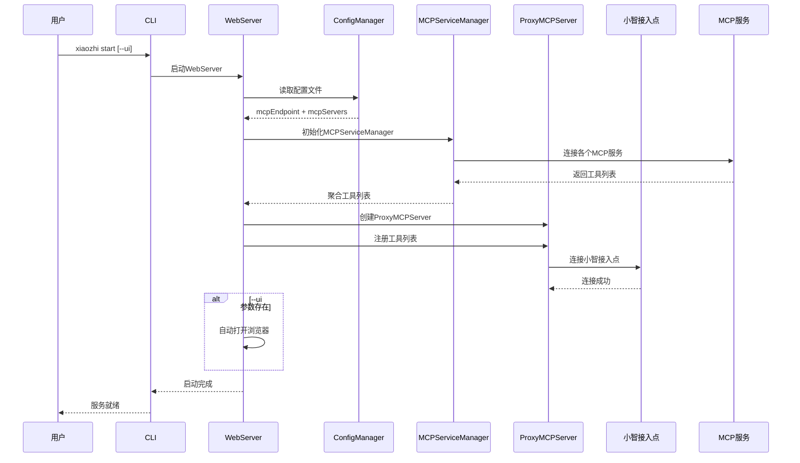
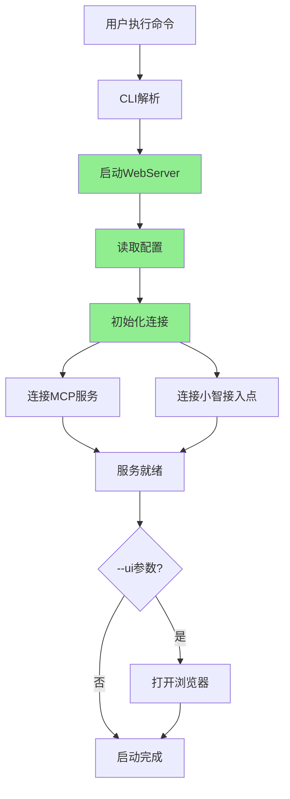

# 小智客户端架构重构技术实施方案

## 执行摘要

本方案旨在简化小智客户端的启动流程，统一连接管理，提升用户体验和系统可维护性。核心目标是将分散的连接逻辑集中到 WebServer 中管理，废弃复杂的多进程启动模式，实现配置驱动的统一架构。

**主要变更**：
- 统一启动流程：`xiaozhi start` 和 `xiaozhi start --ui` 都启动 WebServer
- 移除硬编码：删除 DEFAULT_MCP_SERVERS 和 MOCK_TOOLS
- 配置驱动：通过 xiaozhi.config.json 获取所有连接信息
- 废弃旧逻辑：移除 adaptiveMCPPipe、multiEndpointMCPPipe 等复杂连接逻辑

## 现状分析

### 当前架构问题

**1. 启动流程复杂**
- 存在两套独立的启动逻辑：CLI 启动和 WebServer 启动
- `xiaozhi start` 通过 adaptiveMCPPipe → multiEndpointMCPPipe → mcpServerProxy 的复杂链路
- `xiaozhi start --ui` 额外启动 WebServer，形成双重连接管理

**2. 硬编码问题**
```typescript
// src/webServer.ts 中的硬编码
const DEFAULT_MCP_SERVERS = {
  calculator: {
    command: "node",
    args: ["/Users/nemo/github/shenjingnan/xiaozhi-client/templates/hello-world/mcpServers/calculator.js"],
  },
  // ...
};

const MOCK_TOOLS: Tool[] = [
  {
    name: "calculator_add",
    description: "简单的加法计算器",
    // ...
  }
];
```

**3. 连接管理分散**
- ProxyMCPServer：处理小智接入点连接
- MCPServiceManager：管理本地 MCP 服务
- adaptiveMCPPipe：处理端点适配
- multiEndpointMCPPipe：处理多端点连接
- mcpServerProxy：处理 MCP 服务代理

**4. 状态不一致**
- 不同组件维护各自的连接状态
- 缺乏统一的状态同步机制
- 错误处理和重连策略不统一

### 当前连接流程分析



## 需求理解与技术考量

### 核心需求分析

**1. 启动流程统一化**
- **技术考量**：简化用户认知负担，减少维护成本
- **实现策略**：将 WebServer 作为唯一启动入口，--ui 参数仅控制浏览器打开行为
- **向后兼容**：保持命令行接口不变，内部实现统一

**2. 配置驱动架构**
- **技术考量**：提升灵活性，支持动态配置
- **实现策略**：从 xiaozhi.config.json 读取所有连接配置
- **配置优先级**：配置文件 > 环境变量 > 默认值

**3. 连接管理统一**
- **技术考量**：降低复杂度，提升可维护性
- **实现策略**：WebServer 作为连接管理中心，统一处理所有连接逻辑
- **状态管理**：建立统一的连接状态管理机制

### 技术架构设计

**新架构连接流程**：



## 改造方案

### 阶段一：WebServer 重构（核心改造）

**1. 移除硬编码逻辑**

```typescript
// 移除 src/webServer.ts 中的硬编码
// 删除 DEFAULT_MCP_SERVERS 和 MOCK_TOOLS 常量
// 删除构造函数中的硬编码初始化逻辑

// 新的初始化逻辑
constructor(port?: number) {
  // 端口配置
  this.port = port ?? configManager.getWebUIPort() ?? 9999;
  this.logger = new Logger();

  // 延迟初始化，在 start() 方法中进行
  this.app = new Hono();
  this.setupMiddleware();
  this.setupRoutes();
}
```

**2. 实现配置驱动的连接管理**

```typescript
// 新增 initializeConnections 方法
private async initializeConnections(): Promise<void> {
  try {
    // 1. 读取配置
    const config = configManager.getConfig();

    // 2. 初始化 MCP 服务管理器
    this.mcpServiceManager = await MCPServiceManagerSingleton.getInstance();

    // 3. 从配置加载 MCP 服务
    await this.loadMCPServicesFromConfig(config.mcpServers);

    // 4. 获取工具列表
    const tools = this.mcpServiceManager.getAllTools();

    // 5. 初始化小智接入点连接
    await this.initializeXiaozhiConnection(config.mcpEndpoint, tools);

  } catch (error) {
    this.logger.error("连接初始化失败:", error);
    throw error;
  }
}

private async loadMCPServicesFromConfig(mcpServers: Record<string, MCPServerConfig>): Promise<void> {
  for (const [name, config] of Object.entries(mcpServers)) {
    this.mcpServiceManager.addServiceConfig(name, config);
  }
  await this.mcpServiceManager.startAllServices();
}

private async initializeXiaozhiConnection(mcpEndpoint: string | string[], tools: Tool[]): Promise<void> {
  // 处理多端点配置
  const endpoints = Array.isArray(mcpEndpoint) ? mcpEndpoint : [mcpEndpoint];
  const validEndpoint = endpoints.find(ep => ep && !ep.includes('<请填写'));

  if (!validEndpoint) {
    this.logger.warn("未配置有效的小智接入点，跳过连接");
    return;
  }

  this.proxyMCPServer = new ProxyMCPServer(validEndpoint);
  this.proxyMCPServer.setServiceManager(this.mcpServiceManager);

  // 注册工具并连接
  await this.proxyMCPServer.connect();
}
```

**3. 更新 start 方法**

```typescript
public async start(): Promise<void> {
  // 1. 启动 HTTP 服务器
  const server = serve({
    fetch: this.app.fetch,
    port: this.port,
    hostname: "0.0.0.0",
    createServer,
  });

  this.httpServer = server;
  this.wss = new WebSocketServer({ server: this.httpServer });
  this.setupWebSocket();

  this.logger.info(`Web server listening on http://0.0.0.0:${this.port}`);

  // 2. 初始化所有连接
  try {
    await this.initializeConnections();
    this.logger.info("所有连接初始化完成");
  } catch (error) {
    this.logger.error("连接初始化失败，但 Web 服务器继续运行:", error);
  }
}
```

### 阶段二：CLI 启动逻辑简化

**1. 统一启动入口**

```typescript
// 修改 src/cli.ts 中的 startService 函数
async function startService(daemon = false, ui = false): Promise<void> {
  const spinner = ora("检查服务状态...").start();

  try {
    // 检查服务是否已经在运行
    const status = getServiceStatus();
    if (status.running) {
      spinner.fail(`服务已经在运行 (PID: ${status.pid})`);
      return;
    }

    // 检查环境配置
    spinner.text = "检查环境配置...";
    if (!checkEnvironment()) {
      spinner.fail("环境配置检查失败");
      return;
    }

    // 新的统一启动逻辑：直接启动 WebServer
    spinner.text = `启动服务 (${daemon ? "后台模式" : "前台模式"})...`;

    if (daemon) {
      await startWebServerInDaemon(ui);
    } else {
      await startWebServerInForeground(ui);
    }

  } catch (error) {
    spinner.fail(`启动服务失败: ${error instanceof Error ? error.message : String(error)}`);
  }
}
```

**2. 实现新的启动函数**

```typescript
// 后台模式启动 WebServer
async function startWebServerInDaemon(openBrowser = false): Promise<void> {
  const { spawn } = await import("node:child_process");

  // 构建启动命令
  const command = "node";
  const args = [
    path.join(__dirname, "webServerStandalone.js"), // 新的独立启动脚本
    openBrowser ? "--open-browser" : ""
  ].filter(Boolean);

  const child = spawn(command, args, {
    detached: true,
    stdio: ["ignore", logFile, logFile],
    env: {
      ...process.env,
      XIAOZHI_CONFIG_DIR: process.env.FORCE_CONFIG_DIR || process.cwd(),
    },
  });

  child.unref();
  savePidInfo(child.pid!, "daemon");

  console.log(chalk.green(`✅ 服务已在后台启动 (PID: ${child.pid})`));
  if (openBrowser) {
    console.log(chalk.green("🌐 浏览器将自动打开"));
  }
}

// 前台模式启动 WebServer
async function startWebServerInForeground(openBrowser = false): Promise<void> {
  const webServer = new WebServer();

  // 处理退出信号
  const cleanup = async () => {
    console.log(chalk.yellow("\n正在停止服务..."));
    await webServer.stop();
    process.exit(0);
  };

  process.on("SIGINT", cleanup);
  process.on("SIGTERM", cleanup);

  await webServer.start();

  console.log(chalk.green("✅ 服务已启动"));

  if (openBrowser) {
    const port = configManager.getWebUIPort();
    const url = `http://localhost:${port}`;
    // 自动打开浏览器逻辑
    await openBrowser(url);
  }
}
```

### 阶段三：创建独立启动脚本

**创建 src/webServerStandalone.ts**

```typescript
#!/usr/bin/env node

/**
 * WebServer 独立启动脚本
 * 用于后台模式启动，替代原有的 adaptiveMCPPipe 启动方式
 */

import { WebServer } from "./webServer.js";
import { configManager } from "./configManager.js";
import { Logger } from "./logger.js";
import { spawn } from "node:child_process";

const logger = new Logger().withTag("WEBSERVER_STANDALONE");

async function main() {
  const args = process.argv.slice(2);
  const openBrowser = args.includes("--open-browser");

  try {
    // 初始化日志
    if (process.env.XIAOZHI_CONFIG_DIR) {
      logger.initLogFile(process.env.XIAOZHI_CONFIG_DIR);
      logger.enableFileLogging(true);
    }

    // 启动 WebServer
    const webServer = new WebServer();
    await webServer.start();

    logger.info("WebServer 启动成功");

    // 自动打开浏览器
    if (openBrowser) {
      const port = configManager.getWebUIPort();
      const url = `http://localhost:${port}`;
      await openBrowserUrl(url);
    }

    // 处理退出信号
    const cleanup = async () => {
      logger.info("正在停止 WebServer...");
      await webServer.stop();
      process.exit(0);
    };

    process.on("SIGINT", cleanup);
    process.on("SIGTERM", cleanup);

  } catch (error) {
    logger.error("WebServer 启动失败:", error);
    process.exit(1);
  }
}

async function openBrowserUrl(url: string): Promise<void> {
  try {
    const { spawn } = await import("node:child_process");
    const platform = process.platform;

    let command: string;
    let args: string[];

    if (platform === "darwin") {
      command = "open";
      args = [url];
    } else if (platform === "win32") {
      command = "start";
      args = ["", url];
    } else {
      command = "xdg-open";
      args = [url];
    }

    spawn(command, args, { detached: true, stdio: "ignore" });
    logger.info(`已尝试打开浏览器: ${url}`);
  } catch (error) {
    logger.warn("自动打开浏览器失败:", error);
  }
}

if (require.main === module) {
  main();
}

## 改造后的效果

### 架构简化效果

**1. 启动流程统一**


**2. 连接管理统一**
- 所有连接逻辑集中在 WebServer 中
- 统一的错误处理和重连机制
- 一致的状态管理和监控

**3. 配置驱动**
- 完全基于 xiaozhi.config.json 配置
- 支持动态配置更新
- 移除所有硬编码依赖

### 用户体验提升

**1. 命令简化**
- `xiaozhi start`：启动服务，不打开浏览器
- `xiaozhi start --ui`：启动服务并打开浏览器
- 两个命令的底层实现完全一致

**2. 启动速度优化**
- 减少进程启动开销
- 简化连接建立流程
- 更快的服务就绪时间

**3. 错误处理改善**
- 统一的错误信息格式
- 更清晰的故障诊断
- 自动恢复机制

## 详细改造细节

### 配置文件适配

**xiaozhi.config.json 结构保持不变**：
```json
{
  "mcpEndpoint": "wss://api.xiaozhi.me/mcp/?token=...",
  "mcpServers": {
    "calculator": {
      "command": "node",
      "args": ["./mcpServers/calculator.js"]
    },
    "datetime": {
      "command": "node",
      "args": ["./mcpServers/datetime.js"]
    }
  },
  "webUI": {
    "port": 9999
  }
}
```

**配置读取优化**：
```typescript
// 新的配置读取逻辑
private async loadConfiguration(): Promise<{
  mcpEndpoint: string | string[];
  mcpServers: Record<string, MCPServerConfig>;
  webUIPort: number;
}> {
  if (!configManager.configExists()) {
    throw new Error("配置文件不存在，请先运行 'xiaozhi init' 初始化配置");
  }

  const config = configManager.getConfig();

  return {
    mcpEndpoint: config.mcpEndpoint,
    mcpServers: config.mcpServers,
    webUIPort: config.webUI?.port ?? 9999
  };
}
```

### 错误处理和重连机制

**统一错误处理**：
```typescript
// 新的错误处理类
class ConnectionManager {
  private logger: Logger;
  private retryConfig: RetryConfig;

  constructor() {
    this.logger = new Logger().withTag("CONNECTION_MANAGER");
    this.retryConfig = {
      maxAttempts: 5,
      initialDelay: 1000,
      maxDelay: 30000,
      backoffMultiplier: 2
    };
  }

  async connectWithRetry<T>(
    connectionFn: () => Promise<T>,
    context: string
  ): Promise<T> {
    let lastError: Error | null = null;

    for (let attempt = 1; attempt <= this.retryConfig.maxAttempts; attempt++) {
      try {
        this.logger.info(`${context} - 尝试连接 (${attempt}/${this.retryConfig.maxAttempts})`);
        return await connectionFn();
      } catch (error) {
        lastError = error as Error;
        this.logger.warn(`${context} - 连接失败:`, error);

        if (attempt < this.retryConfig.maxAttempts) {
          const delay = Math.min(
            this.retryConfig.initialDelay * Math.pow(this.retryConfig.backoffMultiplier, attempt - 1),
            this.retryConfig.maxDelay
          );
          await this.sleep(delay);
        }
      }
    }

    throw new Error(`${context} - 连接失败，已达到最大重试次数: ${lastError?.message}`);
  }

  private sleep(ms: number): Promise<void> {
    return new Promise(resolve => setTimeout(resolve, ms));
  }
}
```

### 状态管理优化

**统一状态接口**：
```typescript
interface ServiceStatus {
  webServer: {
    running: boolean;
    port: number;
    startTime: Date;
  };
  mcpServices: {
    [serviceName: string]: {
      connected: boolean;
      toolCount: number;
      lastHeartbeat: Date;
    };
  };
  xiaozhiConnection: {
    connected: boolean;
    endpoint: string;
    lastActivity: Date;
  };
}

// WebServer 中的状态管理
class WebServer {
  private status: ServiceStatus;

  getStatus(): ServiceStatus {
    return {
      webServer: {
        running: this.httpServer !== null,
        port: this.port,
        startTime: this.startTime
      },
      mcpServices: this.getMCPServicesStatus(),
      xiaozhiConnection: this.getXiaozhiConnectionStatus()
    };
  }

  private getMCPServicesStatus() {
    const status: any = {};
    if (this.mcpServiceManager) {
      for (const [name, service] of this.mcpServiceManager.getServices()) {
        status[name] = {
          connected: service.isConnected(),
          toolCount: service.getTools().length,
          lastHeartbeat: service.getLastHeartbeat()
        };
      }
    }
    return status;
  }
}
```

### 向后兼容性保证

**1. 命令行接口保持不变**
- `xiaozhi start` 和 `xiaozhi start --ui` 命令保持原有语法
- 内部实现变更对用户透明

**2. 配置文件格式不变**
- xiaozhi.config.json 结构完全兼容
- 现有配置文件无需修改

**3. API 接口保持稳定**
- Web API 端点保持不变
- WebSocket 接口保持兼容

**4. 渐进式迁移**
- 保留旧代码作为备用方案
- 提供配置开关控制新旧实现

## 分阶段实施计划

### 第一阶段：基础重构（1-2周）

**目标**：完成 WebServer 核心重构，实现配置驱动的连接管理

**任务清单**：
1. **WebServer 重构**
   - [ ] 移除 DEFAULT_MCP_SERVERS 和 MOCK_TOOLS 硬编码
   - [ ] 实现 initializeConnections 方法
   - [ ] 重构 start 方法，集成连接初始化
   - [ ] 添加统一的错误处理和重连机制

2. **配置管理优化**
   - [ ] 优化配置读取逻辑
   - [ ] 添加配置验证和错误提示
   - [ ] 实现配置热重载支持

3. **连接管理统一**
   - [ ] 创建 ConnectionManager 类
   - [ ] 实现统一的重连策略
   - [ ] 添加连接状态监控

**验收标准**：
- WebServer 能够基于配置文件正确连接所有服务
- 移除所有硬编码依赖
- 连接失败时有清晰的错误提示和自动重试

### 第二阶段：CLI 启动逻辑简化（1周）

**目标**：简化 CLI 启动流程，统一启动入口

**任务清单**：
1. **CLI 重构**
   - [ ] 修改 startService 函数，统一启动逻辑
   - [ ] 实现 startWebServerInDaemon 和 startWebServerInForeground
   - [ ] 创建 webServerStandalone.ts 独立启动脚本

2. **进程管理优化**
   - [ ] 简化进程启动逻辑
   - [ ] 优化日志管理
   - [ ] 改善信号处理

3. **浏览器自动打开**
   - [ ] 实现跨平台浏览器打开逻辑
   - [ ] 添加打开失败的降级处理

**验收标准**：
- `xiaozhi start` 和 `xiaozhi start --ui` 都能正确启动服务
- 后台模式和前台模式都能正常工作
- --ui 参数能正确控制浏览器打开行为

### 第三阶段：旧代码清理和优化（1周）

**目标**：移除废弃代码，优化性能和稳定性

**任务清单**：
1. **废弃代码移除**
   - [ ] 标记 adaptiveMCPPipe.ts 为废弃
   - [ ] 标记 multiEndpointMCPPipe.ts 为废弃
   - [ ] 移除相关的启动逻辑

2. **测试和验证**
   - [ ] 更新单元测试
   - [ ] 添加集成测试
   - [ ] 进行端到端测试

3. **文档更新**
   - [ ] 更新架构文档
   - [ ] 更新用户手册
   - [ ] 更新开发指南

**验收标准**：
- 所有测试通过
- 性能指标达到预期
- 文档完整准确

### 第四阶段：监控和优化（1周）

**目标**：添加监控能力，优化用户体验

**任务清单**：
1. **监控能力**
   - [ ] 添加性能指标收集
   - [ ] 实现健康检查接口
   - [ ] 添加连接质量监控

2. **用户体验优化**
   - [ ] 优化启动速度
   - [ ] 改善错误提示
   - [ ] 添加进度指示

3. **稳定性提升**
   - [ ] 压力测试
   - [ ] 内存泄漏检查
   - [ ] 异常场景测试

**验收标准**：
- 启动时间 < 5秒
- 内存使用稳定
- 异常恢复能力强

## 风险评估

### 高风险项

**1. 连接逻辑变更**
- **风险**：新的连接逻辑可能与现有实现有差异
- **缓解措施**：
  - 保留旧实现作为备用方案
  - 充分的测试验证
  - 渐进式部署

**2. 配置兼容性**
- **风险**：配置读取逻辑变更可能导致兼容性问题
- **缓解措施**：
  - 保持配置文件格式不变
  - 添加配置验证和迁移工具
  - 详细的错误提示

### 中风险项

**3. 性能影响**
- **风险**：架构变更可能影响性能
- **缓解措施**：
  - 性能基准测试
  - 优化关键路径
  - 监控性能指标

**4. 用户体验变化**
- **风险**：启动行为变化可能影响用户习惯
- **缓解措施**：
  - 保持命令行接口不变
  - 提供详细的变更说明
  - 渐进式功能发布

### 低风险项

**5. 代码维护**
- **风险**：代码结构变化增加维护复杂度
- **缓解措施**：
  - 完善的文档
  - 代码审查
  - 自动化测试

## 总结

本重构方案通过统一启动流程、移除硬编码、集中连接管理等措施，将显著简化小智客户端的架构复杂度，提升用户体验和系统可维护性。通过分阶段实施和充分的风险控制，可以确保重构过程的平稳进行。
```
