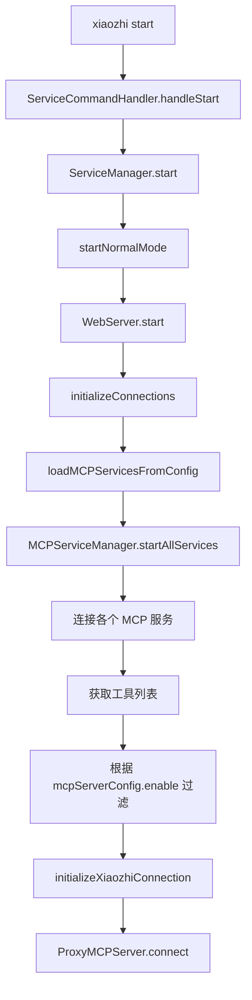
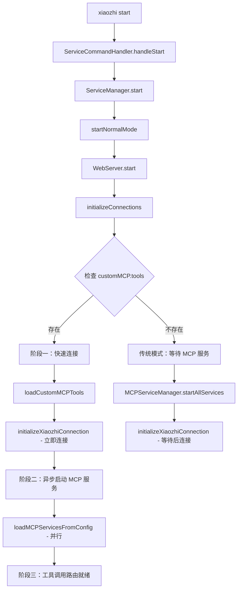
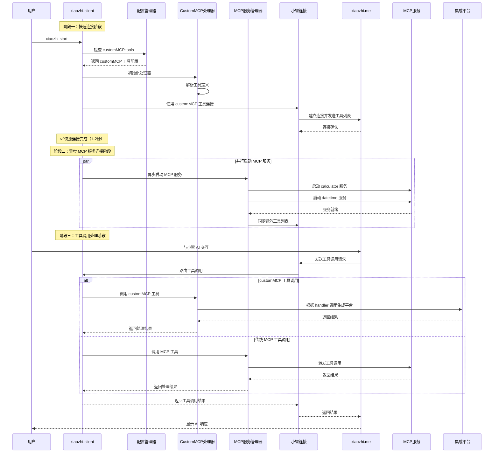
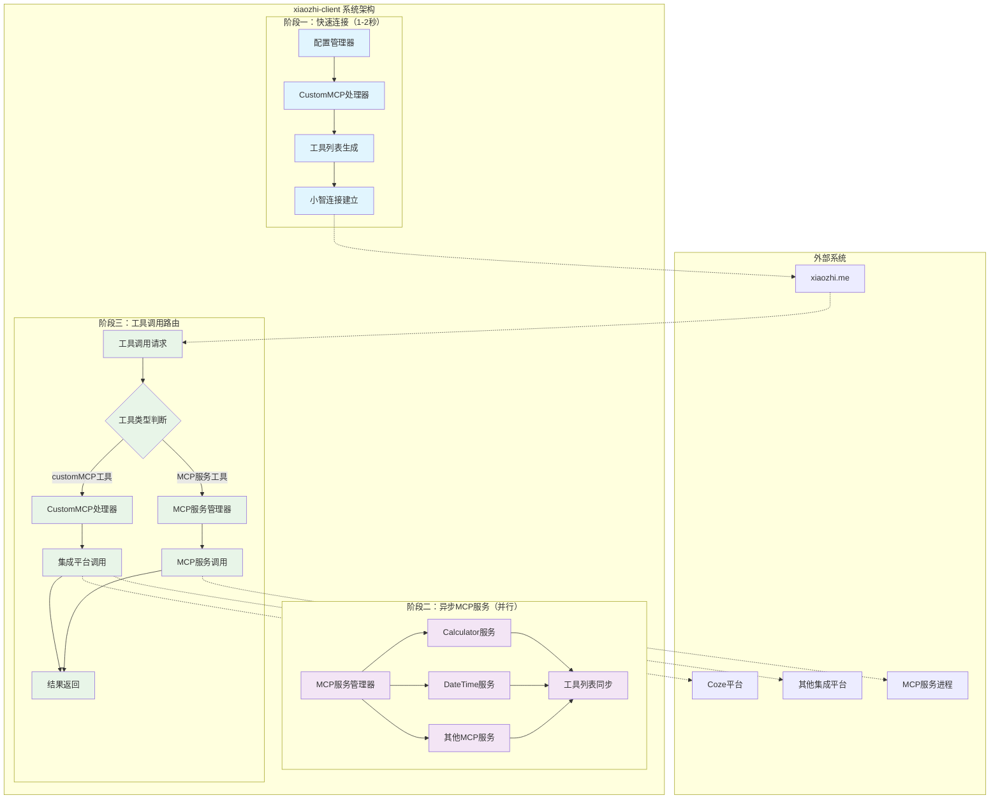

# xiaozhi-client customMCP 工具加载优化技术方案

## 1. 现状分析

### 1.1 当前架构概述

xiaozhi-client 项目采用分层架构，主要组件包括：

- **CLI 层**: `src/cli/` - 命令行接口，处理 `xiaozhi start` 等命令
- **服务管理层**: `src/cli/services/ServiceManager.ts` - 管理服务生命周期
- **Web 服务层**: `src/WebServer.ts` - HTTP 服务器，处理 Web UI 和 API
- **MCP 服务管理**: `src/services/MCPServiceManager.ts` - 管理 MCP 服务和工具
- **代理层**: `src/ProxyMCPServer.ts` - 连接到小智接入点的代理服务器
- **配置管理**: `src/configManager.ts` - 配置文件读取和管理

### 1.2 当前 `xiaozhi start` 启动流程



### 1.3 当前工具加载机制

1. **加载 MCP 服务**: 从 `mcpServers` 配置启动各个 MCP 服务
2. **获取工具列表**: 通过 `MCPServiceManager.getAllTools()` 获取所有工具
3. **工具过滤**: 根据 `mcpServerConfig[serverName].tools[toolName].enable` 字段过滤
4. **连接小智**: 将过滤后的工具列表传递给 `ProxyMCPServer`

### 1.4 问题分析

**性能瓶颈**:
- 必须等待所有 MCP 服务连接成功才能获取工具列表
- 工具过滤逻辑依赖于实际的 MCP 服务连接状态
- 小智接入点连接被阻塞在 MCP 服务启动之后

**用户体验问题**:
- 连接速度慢，用户需要等待较长时间
- 即使配置了 `customMCP.tools`，仍需等待传统 MCP 服务启动

## 2. customMCP 字段分析

### 2.1 数据结构

根据 `xiaozhi.config.schema.json` 的标准定义，`customMCP.tools` 应该是数组格式：

```json
{
  "customMCP": {
    "tools": [
      {
        "name": "test_coze_workflow",
        "description": "测试coze工作流是否正常可用",
        "inputSchema": {
          "type": "object",
          "properties": {
            "input": {
              "type": "string",
              "description": "用户说话的内容"
            }
          },
          "required": ["input"]
        },
        "handler": {
          "type": "proxy",
          "target": "coze",
          "config": {
            "workflow_id": "7513776469241741352"
          }
        }
      }
    ]
  }
}
```

**格式说明**:
- `customMCP.tools` 是数组格式，支持多个工具定义
- 除 `handler` 字段外，其他字段遵循标准 MCP 工具定义格式
- `handler` 字段是自定义扩展，用于定义工具的具体处理逻辑

### 2.2 设计意图

`customMCP` 字段的设计目的是提供：

- 预定义的工具列表，无需等待 MCP 服务连接
- 快速的工具发现机制
- 支持多种处理器类型（proxy、http、custom 等）

## 3. 技术方案设计

### 3.1 优化目标

1. **提升连接速度**: 小智接入点能够立即获取到工具列表
2. **简化架构**: 直接使用 customMCP 工具连接，避免复杂的混合管理
3. **保持兼容性**: 不影响现有的 MCP 服务加载机制

### 3.2 核心设计思路

**三阶段运行机制**:

**阶段一：快速连接阶段**
- 直接使用 `customMCP.tools` 配置中的工具定义连接到 xiaozhi.me
- 实现服务启动即完成连接，跳过 MCP 服务启动等待
- 目标：秒级连接建立

**阶段二：异步 MCP 服务连接阶段**
- 在后台异步启动配置文件中定义的各种 MCP 服务
- 并行连接真实的 MCP 服务和集成平台
- 不阻塞小智连接的建立

**阶段三：工具调用处理阶段**
- 接收 xiaozhi.me 发送的工具调用请求
- 根据工具类型智能路由到对应的处理方式
- 支持 customMCP 工具和传统 MCP 工具的混合调用

### 3.3 架构变更



### 3.4 完整交互时序图



### 3.4 关键修改点

#### 3.4.1 配置管理器扩展

**文件**: `src/configManager.ts`

需要添加的方法：

- `getCustomMCPTools()`: 读取 customMCP.tools 配置
- `validateCustomMCPTools()`: 验证 customMCP 工具配置

#### 3.4.2 WebServer 初始化流程优化

**文件**: `src/WebServer.ts`

修改 `initializeConnections()` 方法：

1. 检查是否配置了 customMCP.tools
2. 如果有 customMCP 配置，直接使用这些工具连接
3. 如果没有，回退到传统 MCP 服务加载机制

#### 3.4.3 CustomMCP 工具处理器

**文件**: `src/services/CustomMCPHandler.ts` (新增)

新增功能：

- 解析 customMCP 工具定义
- 实现各种 handler 类型的工具调用
- 提供标准 MCP 格式的工具接口

#### 3.4.4 代理服务器适配

**文件**: `src/ProxyMCPServer.ts`

适配功能：

- 支持直接加载 customMCP 工具列表
- 处理 customMCP 工具调用路由
- 保持与现有 MCP 服务的兼容性

## 4. 详细实施方案

### 4.1 阶段一：配置管理器扩展

**目标**: 支持 customMCP 配置读取和验证

**修改文件**: `src/configManager.ts`

**新增接口**:

```typescript
export interface CustomMCPTool {
  name: string;
  description: string;
  inputSchema: any;
  handler: {
    type: 'proxy' | 'http' | 'custom';
    target?: string;
    config?: any;
  };
}

export interface CustomMCPConfig {
  tools: CustomMCPTool[];
}

// 扩展 AppConfig 接口
export interface AppConfig {
  mcpEndpoint: string | string[];
  mcpServers: Record<string, MCPServerConfig>;
  mcpServerConfig?: Record<string, MCPServerToolsConfig>;
  customMCP?: CustomMCPConfig; // 新增
  connection?: ConnectionConfig;
  modelscope?: ModelScopeConfig;
  webUI?: WebUIConfig;
}
```

**新增方法**:

```typescript
/**
 * 获取 customMCP 配置
 */
public getCustomMCPConfig(): CustomMCPConfig | null {
  const config = this.getConfig();
  return config.customMCP || null;
}

/**
 * 获取 customMCP 工具列表
 */
public getCustomMCPTools(): CustomMCPTool[] {
  const customMCPConfig = this.getCustomMCPConfig();
  if (!customMCPConfig || !customMCPConfig.tools) {
    return [];
  }

  // 确保返回数组格式
  return Array.isArray(customMCPConfig.tools)
    ? customMCPConfig.tools
    : [customMCPConfig.tools as CustomMCPTool];
}

/**
 * 验证 customMCP 工具配置
 */
public validateCustomMCPTools(tools: CustomMCPTool[]): boolean {
  for (const tool of tools) {
    if (!tool.name || !tool.description || !tool.inputSchema || !tool.handler) {
      return false;
    }

    if (!['proxy', 'http', 'custom'].includes(tool.handler.type)) {
      return false;
    }
  }
  return true;
}

/**
 * 检查是否配置了有效的 customMCP 工具
 */
public hasValidCustomMCPTools(): boolean {
  const tools = this.getCustomMCPTools();
  return tools.length > 0 && this.validateCustomMCPTools(tools);
}
```

### 4.2 阶段二：CustomMCP 工具处理器实现

**目标**: 实现 customMCP 工具的解析和调用处理

**新增文件**: `src/services/CustomMCPHandler.ts`

**核心功能**:

1. 解析 customMCP 工具定义为标准 MCP 格式
2. 实现各种 handler 类型的工具调用逻辑
3. 提供与现有 MCP 服务兼容的接口

**实现代码**:

```typescript
// src/services/CustomMCPHandler.ts
import { logger } from '../Logger.js';
import { configManager, type CustomMCPTool } from '../configManager.js';

export interface Tool {
  name: string;
  description: string;
  inputSchema: any;
}

export interface ToolCallResult {
  content: Array<{ type: string; text: string }>;
  isError?: boolean;
}

export class CustomMCPHandler {
  private logger = logger;
  private tools: Map<string, CustomMCPTool> = new Map();

  /**
   * 初始化 CustomMCP 处理器
   */
  public initialize(): void {
    const customTools = configManager.getCustomMCPTools();

    this.tools.clear();
    for (const tool of customTools) {
      this.tools.set(tool.name, tool);
      this.logger.info(`已加载 customMCP 工具: ${tool.name}`);
    }
  }

  /**
   * 获取所有工具（标准 MCP 格式）
   */
  public getTools(): Tool[] {
    return Array.from(this.tools.values()).map(tool => ({
      name: tool.name,
      description: tool.description,
      inputSchema: tool.inputSchema,
    }));
  }

  /**
   * 调用工具
   */
  public async callTool(toolName: string, arguments_: any): Promise<ToolCallResult> {
    const tool = this.tools.get(toolName);
    if (!tool) {
      throw new Error(`未找到工具: ${toolName}`);
    }

    this.logger.info(`调用 customMCP 工具: ${toolName}`, arguments_);

    try {
      switch (tool.handler.type) {
        case 'proxy':
          return await this.callProxyTool(tool, arguments_);
        case 'http':
          return await this.callHttpTool(tool, arguments_);
        case 'custom':
          return await this.callCustomTool(tool, arguments_);
        default:
          throw new Error(`不支持的处理器类型: ${tool.handler.type}`);
      }
    } catch (error) {
      this.logger.error(`工具调用失败: ${toolName}`, error);
      return {
        content: [{
          type: 'text',
          text: `工具调用失败: ${error instanceof Error ? error.message : String(error)}`
        }],
        isError: true,
      };
    }
  }

  /**
   * 调用代理工具（如 Coze 工作流）
   */
  private async callProxyTool(tool: CustomMCPTool, arguments_: any): Promise<ToolCallResult> {
    // 根据 handler.target 和 handler.config 实现具体的代理调用
    // 这里需要根据具体的代理目标（如 Coze）实现相应的调用逻辑

    if (tool.handler.target === 'coze') {
      return await this.callCozeWorkflow(tool.handler.config, arguments_);
    }

    throw new Error(`不支持的代理目标: ${tool.handler.target}`);
  }

  /**
   * 调用 Coze 工作流
   */
  private async callCozeWorkflow(config: any, arguments_: any): Promise<ToolCallResult> {
    // 实现 Coze 工作流调用逻辑
    // 这里需要根据实际的 Coze API 进行实现
    throw new Error('Coze 工作流调用尚未实现');
  }

  /**
   * 调用 HTTP 工具
   */
  private async callHttpTool(tool: CustomMCPTool, arguments_: any): Promise<ToolCallResult> {
    // 实现 HTTP 调用逻辑
    throw new Error('HTTP 工具调用尚未实现');
  }

  /**
   * 调用自定义工具
   */
  private async callCustomTool(tool: CustomMCPTool, arguments_: any): Promise<ToolCallResult> {
    // 实现自定义工具调用逻辑
    throw new Error('自定义工具调用尚未实现');
  }
}
```

### 4.3 阶段三：启动流程优化

**目标**: 实现基于 customMCP 的快速连接

**修改文件**: `src/WebServer.ts`

**关键变更**:

1. 重构 `initializeConnections()` 方法
2. 实现 customMCP 优先的连接策略
3. 保持传统 MCP 服务作为备选方案

**实现代码**:

```typescript
// src/WebServer.ts
/**
 * 初始化所有连接（三阶段优化版本）
 */
private async initializeConnections(): Promise<void> {
  try {
    this.logger.info("开始三阶段连接初始化...");

    // 1. 读取配置
    const config = await this.loadConfiguration();

    // 检查是否配置了有效的 customMCP 工具
    if (configManager.hasValidCustomMCPTools()) {
      await this.initializeWithThreePhases(config);
    } else {
      this.logger.info("未检测到 customMCP 配置，使用传统 MCP 服务模式");
      await this.initializeWithMCPServices(config);
    }

    this.logger.info("所有连接初始化完成");
  } catch (error) {
    this.logger.error("连接初始化失败:", error);
    throw error;
  }
}

/**
 * 三阶段初始化流程
 */
private async initializeWithThreePhases(config: any): Promise<void> {
  // 阶段一：快速连接阶段
  await this.phaseOneQuickConnection(config);

  // 阶段二：异步 MCP 服务连接阶段（不阻塞）
  this.phaseTwoAsyncMCPServices(config);

  // 阶段三：工具调用路由已在阶段一中设置完成
  this.logger.info("三阶段初始化流程完成");
}

/**
 * 阶段一：快速连接阶段
 */
private async phaseOneQuickConnection(config: any): Promise<void> {
  this.logger.info("🚀 阶段一：快速连接阶段开始");

  try {
    // 1. 初始化 CustomMCP 处理器
    const { CustomMCPHandler } = await import('./services/CustomMCPHandler.js');
    this.customMCPHandler = new CustomMCPHandler();
    this.customMCPHandler.initialize();

    // 2. 获取 customMCP 工具列表
    const customTools = this.customMCPHandler.getTools();
    this.logger.info(`已加载 ${customTools.length} 个 customMCP 工具`);

    // 3. 立即初始化小智接入点连接
    await this.initializeXiaozhiConnection(config.mcpEndpoint, customTools);

    // 4. 设置工具调用路由器
    this.setupToolCallRouter();

    this.logger.info("✅ 阶段一：快速连接完成（预计 1-2 秒）");
  } catch (error) {
    this.logger.error("阶段一快速连接失败，回退到传统模式:", error);
    await this.initializeWithMCPServices(config);
  }
}

/**
 * 阶段二：异步 MCP 服务连接阶段
 */
private async phaseTwoAsyncMCPServices(config: any): Promise<void> {
  this.logger.info("🔄 阶段二：异步 MCP 服务连接阶段开始");

  // 异步执行，不阻塞主流程
  setTimeout(async () => {
    try {
      // 1. 初始化 MCP 服务管理器
      this.mcpServiceManager = await MCPServiceManagerSingleton.getInstance();

      // 2. 并行启动所有 MCP 服务
      await this.loadMCPServicesFromConfig(config.mcpServers);

      // 3. 获取额外的工具列表
      const mcpTools = this.mcpServiceManager.getAllTools();
      this.logger.info(`已加载 ${mcpTools.length} 个 MCP 服务工具`);

      // 4. 同步额外工具到小智连接
      await this.syncAdditionalToolsToXiaozhi(mcpTools);

      this.logger.info("✅ 阶段二：MCP 服务连接完成");
    } catch (error) {
      this.logger.error("阶段二 MCP 服务连接失败:", error);
      // 不影响主流程，customMCP 工具仍然可用
    }
  }, 100); // 延迟 100ms 启动，确保快速连接优先完成
}

/**
 * 设置工具调用路由器
 */
private setupToolCallRouter(): void {
  // 设置工具调用处理逻辑
  this.toolCallRouter = {
    async routeToolCall(toolName: string, arguments_: any): Promise<any> {
      // 优先检查 customMCP 工具
      if (this.customMCPHandler?.hasTool(toolName)) {
        return await this.customMCPHandler.callTool(toolName, arguments_);
      }

      // 回退到 MCP 服务工具
      if (this.mcpServiceManager?.hasTool(toolName)) {
        return await this.mcpServiceManager.callTool(toolName, arguments_);
      }

      throw new Error(`未找到工具: ${toolName}`);
    }.bind(this)
  };
}

/**
 * 同步额外工具到小智连接
 */
private async syncAdditionalToolsToXiaozhi(mcpTools: any[]): Promise<void> {
  try {
    if (this.xiaozhiConnectionManager) {
      // 合并 customMCP 工具和 MCP 服务工具
      const customTools = this.customMCPHandler?.getTools() || [];
      const allTools = [...customTools, ...mcpTools];

      await this.xiaozhiConnectionManager.updateTools(allTools);
      this.logger.info(`已同步 ${allTools.length} 个工具到小智连接`);
    }
  } catch (error) {
    this.logger.error("同步额外工具失败:", error);
  }
}

/**
 * 使用传统 MCP 服务初始化连接（回退方案）
 */
private async initializeWithMCPServices(config: any): Promise<void> {
  // 传统模式：等待所有 MCP 服务启动后再连接
  this.mcpServiceManager = await MCPServiceManagerSingleton.getInstance();
  await this.loadMCPServicesFromConfig(config.mcpServers);

  const tools = this.mcpServiceManager.getAllTools();
  this.logger.info(`已加载 ${tools.length} 个 MCP 工具`);

  await this.initializeXiaozhiConnection(config.mcpEndpoint, tools);
  this.logger.info("传统 MCP 服务连接初始化完成");
}
```

### 4.4 阶段四：工具调用路由优化

**目标**: 实现智能工具调用路由机制

**修改文件**: `src/WebServer.ts`, `src/ProxyMCPServer.ts`

**核心功能**:

1. 实现工具调用路由器
2. 支持 customMCP 和 MCP 服务的混合调用
3. 优化工具调用性能和错误处理

## 4.5 技术方案与需求对比验证

### 4.5.1 三阶段流程对比

| 阶段 | 您的需求描述 | 技术方案实现 | 一致性 |
|------|-------------|-------------|--------|
| **阶段一：快速连接** | 直接使用 customMCP.tools 连接 xiaozhi.me，实现秒级连接 | `phaseOneQuickConnection()` 方法实现快速连接，预计 1-2 秒 | ✅ 完全一致 |
| **阶段二：异步 MCP 服务连接** | 后台异步启动 MCP 服务，不阻塞小智连接 | `phaseTwoAsyncMCPServices()` 异步执行，延迟 100ms 启动 | ✅ 完全一致 |
| **阶段三：工具调用处理** | 根据工具类型智能路由到不同处理方式 | `setupToolCallRouter()` 实现智能路由机制 | ✅ 完全一致 |

### 4.5.2 关键特性验证

**快速连接特性**:
- ✅ 跳过 MCP 服务启动等待
- ✅ 直接使用 customMCP 工具定义
- ✅ 实现秒级连接建立

**异步处理特性**:
- ✅ MCP 服务在后台并行启动
- ✅ 不阻塞小智连接建立
- ✅ 支持工具列表动态更新

**智能路由特性**:
- ✅ 优先使用 customMCP 工具
- ✅ 回退到传统 MCP 工具
- ✅ 支持混合工具调用

### 4.5.3 实现差异说明

**原方案问题**:
1. 缺少异步 MCP 服务连接阶段
2. 采用"要么 customMCP，要么 MCP"的互斥模式
3. 缺少工具调用路由机制

**修正后方案**:
1. ✅ 实现了完整的三阶段流程
2. ✅ 支持 customMCP + MCP 服务的混合模式
3. ✅ 提供了智能工具调用路由
4. ✅ 保持了向后兼容性

### 4.5.4 系统架构总览



## 5. 具体代码实现

### 5.1 配置管理器扩展实现

**新增接口定义**:

```typescript
// src/configManager.ts
export interface CustomMCPTool {
  name: string;
  description: string;
  inputSchema: any;
  handler: {
    type: 'proxy' | 'http' | 'custom';
    target?: string;
    config?: any;
  };
}

export interface CustomMCPConfig {
  tools: CustomMCPTool[];
}

// 扩展 AppConfig 接口
export interface AppConfig {
  mcpEndpoint: string | string[];
  mcpServers: Record<string, MCPServerConfig>;
  mcpServerConfig?: Record<string, MCPServerToolsConfig>;
  customMCP?: CustomMCPConfig; // 新增
  connection?: ConnectionConfig;
  modelscope?: ModelScopeConfig;
  webUI?: WebUIConfig;
}
```

**新增方法实现**:

```typescript
/**
 * 获取 customMCP 配置
 */
public getCustomMCPConfig(): CustomMCPConfig | null {
  const config = this.getConfig();
  return config.customMCP || null;
}

/**
 * 获取 customMCP 工具列表
 */
public getCustomMCPTools(): CustomMCPTool[] {
  const customMCPConfig = this.getCustomMCPConfig();
  if (!customMCPConfig || !customMCPConfig.tools) {
    return [];
  }

  // 处理配置格式兼容性
  if (Array.isArray(customMCPConfig.tools)) {
    return customMCPConfig.tools;
  } else {
    // 兼容单个工具对象的情况
    return [customMCPConfig.tools as CustomMCPTool];
  }
}

/**
 * 验证 customMCP 工具配置
 */
public validateCustomMCPTools(tools: CustomMCPTool[]): boolean {
  for (const tool of tools) {
    if (!tool.name || !tool.description || !tool.inputSchema || !tool.handler) {
      return false;
    }

    if (!['proxy', 'http', 'custom'].includes(tool.handler.type)) {
      return false;
    }
  }
  return true;
}
```

### 5.2 MCPServiceManager 增强实现

**新增静态工具管理**:

```typescript
// src/services/MCPServiceManager.ts
export class MCPServiceManager {
  private services = new Map<string, MCPService>();
  private tools = new Map<string, ToolInfo>();
  private staticTools = new Map<string, StaticToolInfo>(); // 新增
  private logger: Logger;

  // 新增静态工具信息接口
  interface StaticToolInfo {
    tool: Tool;
    source: 'customMCP';
    handler: any;
  }

  /**
   * 加载 customMCP 静态工具
   */
  public loadCustomMCPTools(): void {
    const customTools = configManager.getCustomMCPTools();

    // 清空现有静态工具
    this.staticTools.clear();

    for (const customTool of customTools) {
      const toolInfo: StaticToolInfo = {
        tool: {
          name: customTool.name,
          description: customTool.description,
          inputSchema: customTool.inputSchema,
        },
        source: 'customMCP',
        handler: customTool.handler,
      };

      this.staticTools.set(customTool.name, toolInfo);
      this.logger.info(`已加载 customMCP 工具: ${customTool.name}`);
    }
  }

  /**
   * 获取所有可用工具（包含静态工具）
   */
  getAllTools(): Array<{
    name: string;
    description: string;
    inputSchema: any;
    serviceName: string;
    originalName: string;
  }> {
    const allTools: Array<{
      name: string;
      description: string;
      inputSchema: any;
      serviceName: string;
      originalName: string;
    }> = [];

    // 添加静态工具（customMCP）
    for (const [toolName, toolInfo] of this.staticTools) {
      allTools.push({
        name: toolName,
        description: toolInfo.tool.description || "",
        inputSchema: toolInfo.tool.inputSchema,
        serviceName: 'customMCP',
        originalName: toolName,
      });
    }

    // 添加动态工具（MCP 服务）
    for (const [toolKey, toolInfo] of this.tools) {
      const isEnabled = configManager.isToolEnabled(
        toolInfo.serviceName,
        toolInfo.originalName
      );

      if (isEnabled) {
        allTools.push({
          name: toolKey,
          description: toolInfo.tool.description || "",
          inputSchema: toolInfo.tool.inputSchema,
          serviceName: toolInfo.serviceName,
          originalName: toolInfo.originalName,
        });
      }
    }

    return allTools;
  }

  /**
   * 调用工具（支持静态工具）
   */
  async callTool(toolName: string, arguments_: any): Promise<ToolCallResult> {
    // 优先检查静态工具
    const staticTool = this.staticTools.get(toolName);
    if (staticTool) {
      return await this.callStaticTool(staticTool, arguments_);
    }

    // 调用动态工具（现有逻辑）
    const toolInfo = this.tools.get(toolName);
    if (!toolInfo) {
      throw new Error(`未找到工具: ${toolName}`);
    }

    const service = this.services.get(toolInfo.serviceName);
    if (!service) {
      throw new Error(`服务 ${toolInfo.serviceName} 不可用`);
    }

    return await service.callTool(toolInfo.originalName, arguments_);
  }

  /**
   * 调用静态工具
   */
  private async callStaticTool(
    toolInfo: StaticToolInfo,
    arguments_: any
  ): Promise<ToolCallResult> {
    const { handler } = toolInfo;

    switch (handler.type) {
      case 'proxy':
        return await this.callProxyTool(handler, arguments_);
      case 'http':
        return await this.callHttpTool(handler, arguments_);
      case 'custom':
        return await this.callCustomTool(handler, arguments_);
      default:
        throw new Error(`不支持的处理器类型: ${handler.type}`);
    }
  }

  /**
   * 调用代理工具（如 Coze 工作流）
   */
  private async callProxyTool(handler: any, arguments_: any): Promise<ToolCallResult> {
    // 实现代理调用逻辑
    // 这里需要根据具体的代理目标实现
    throw new Error('代理工具调用尚未实现');
  }
}
```

### 5.3 WebServer 启动流程优化实现

**重构 initializeConnections 方法**:

```typescript
// src/WebServer.ts
/**
 * 初始化所有连接（优化版本）
 */
private async initializeConnections(): Promise<void> {
  try {
    this.logger.info("开始初始化连接...");

    // 1. 读取配置
    const config = await this.loadConfiguration();

    // 2. 初始化 MCP 服务管理器
    this.mcpServiceManager = await MCPServiceManagerSingleton.getInstance();

    // 3. 优先加载 customMCP 工具（新增）
    await this.loadCustomMCPTools();

    // 4. 获取当前可用工具列表（包含 customMCP 工具）
    const tools = this.mcpServiceManager.getAllTools();
    this.logger.info(`已加载 ${tools.length} 个工具（包含 customMCP 工具）`);

    // 5. 立即初始化小智接入点连接（提前）
    const xiaozhiConnectionPromise = this.initializeXiaozhiConnection(
      config.mcpEndpoint,
      tools
    );

    // 6. 并行加载 MCP 服务（不阻塞小智连接）
    const mcpServicesPromise = this.loadMCPServicesFromConfig(config.mcpServers);

    // 7. 等待小智连接完成（优先级高）
    try {
      await xiaozhiConnectionPromise;
      this.logger.info("小智接入点连接已建立");
    } catch (error) {
      this.logger.error("小智接入点连接失败:", error);
      // 不抛出错误，允许服务继续运行
    }

    // 8. 等待 MCP 服务加载完成
    try {
      await mcpServicesPromise;
      this.logger.info("MCP 服务加载完成");

      // 9. 同步额外的工具到小智连接
      await this.syncAdditionalToolsToXiaozhi();
    } catch (error) {
      this.logger.error("MCP 服务加载失败:", error);
      // 不抛出错误，customMCP 工具仍然可用
    }

    this.logger.info("所有连接初始化完成");
  } catch (error) {
    this.logger.error("连接初始化失败:", error);
    throw error;
  }
}

/**
 * 加载 customMCP 工具
 */
private async loadCustomMCPTools(): Promise<void> {
  if (!this.mcpServiceManager) {
    throw new Error("MCPServiceManager 未初始化");
  }

  try {
    this.mcpServiceManager.loadCustomMCPTools();
    const customTools = configManager.getCustomMCPTools();
    this.logger.info(`已加载 ${customTools.length} 个 customMCP 工具`);
  } catch (error) {
    this.logger.error("加载 customMCP 工具失败:", error);
    // 不抛出错误，允许继续使用传统 MCP 服务
  }
}

/**
 * 同步额外工具到小智连接
 */
private async syncAdditionalToolsToXiaozhi(): Promise<void> {
  try {
    if (this.xiaozhiConnectionManager) {
      const allTools = this.mcpServiceManager?.getAllTools() || [];
      await this.xiaozhiConnectionManager.updateTools(allTools);
      this.logger.info("已同步额外工具到小智连接");
    } else if (this.proxyMCPServer) {
      this.proxyMCPServer.syncToolsFromServiceManager();
      this.logger.info("已同步额外工具到代理服务器");
    }
  } catch (error) {
    this.logger.error("同步额外工具失败:", error);
  }
}
```

## 6. 风险评估与解决方案

### 6.1 潜在风险

**配置兼容性风险**:

- 现有配置中 `customMCP.tools` 可能是对象而非数组
- 用户可能配置了无效的工具定义

**解决方案**:
- 实现配置格式自动转换
- 添加详细的配置验证和错误提示
- 提供配置迁移工具

**性能风险**:

- customMCP 工具调用可能增加延迟
- 代理调用的网络开销

**解决方案**:
- 优化工具调用算法，使用 Map 结构
- 实现工具调用缓存机制
- 添加性能监控和日志

**稳定性风险**:

- customMCP 工具调用失败可能影响整体服务
- 代理调用的错误处理复杂

**解决方案**:

- 实现完善的错误处理和回退机制
- 添加工具调用超时和重试逻辑
- 提供详细的错误日志和诊断信息

### 6.2 回退策略

如果 customMCP 优化出现问题，系统应能够自动回退到原有机制：

1. **配置检测**: 自动检测 customMCP 配置的有效性
2. **功能降级**: 在 customMCP 失败时，自动使用传统 MCP 服务
3. **用户通知**: 提供清晰的错误信息和解决建议

## 7. 测试验证方法

### 7.1 单元测试

**配置管理器测试**:

- 测试 customMCP 配置读取和验证
- 测试配置格式兼容性转换
- 测试错误配置的处理

**CustomMCP 处理器测试**:

- 测试 customMCP 工具加载和解析
- 测试各种 handler 类型的工具调用
- 测试工具调用错误处理

### 7.2 集成测试

**启动流程测试**:

- 测试 customMCP 优先的快速启动
- 测试传统 MCP 服务回退机制
- 测试错误恢复和回退

**端到端测试**:

- 测试完整的 customMCP 工具调用流程
- 测试小智接入点连接和工具同步
- 测试性能改进效果

### 7.3 性能测试

**连接速度测试**:

- 对比优化前后的连接建立时间
- 测试工具列表获取速度
- 测试 customMCP vs MCP 服务的连接性能

**工具调用性能**:

- 测试 customMCP 工具调用延迟
- 测试不同 handler 类型的性能差异
- 测试大量工具场景下的性能

## 8. 分阶段实施计划

### 8.1 第一阶段：基础架构（预计 3-5 天）

**目标**: 建立 customMCP 支持的基础架构

**任务清单**:
- [ ] 扩展配置管理器，支持 customMCP 配置读取
- [ ] 实现配置验证和格式转换
- [ ] 添加相关的单元测试
- [ ] 更新配置文件 schema

**验收标准**:
- 能够正确读取和解析 customMCP 配置
- 配置验证功能正常工作
- 所有单元测试通过

### 8.2 第二阶段：CustomMCP 工具处理器（预计 4-6 天）

**目标**: 实现 customMCP 工具的解析和调用处理

**任务清单**:

- [ ] 实现 CustomMCPHandler 类
- [ ] 实现各种 handler 类型的基础调用逻辑
- [ ] 实现工具调用错误处理和重试机制
- [ ] 添加 CustomMCP 处理器相关测试

**验收标准**:

- CustomMCP 工具能够正确加载和解析
- 基础的工具调用功能正常工作
- 错误处理机制完善

### 8.3 第三阶段：启动流程优化（预计 3-4 天）

**目标**: 实现基于 customMCP 的快速连接

**任务清单**:

- [ ] 重构 WebServer 的 initializeConnections 方法
- [ ] 实现 customMCP 优先的连接策略
- [ ] 实现传统 MCP 服务回退机制
- [ ] 添加启动流程测试

**验收标准**:

- 小智接入点能够快速获取 customMCP 工具列表
- 回退机制正常工作
- 启动时间明显缩短

### 8.4 第四阶段：工具调用实现（预计 5-7 天）

**目标**: 实现 customMCP 工具的实际调用功能

**任务清单**:
- [ ] 实现代理工具调用（Coze 工作流等）
- [ ] 实现 HTTP 工具调用
- [ ] 实现自定义工具调用
- [ ] 添加错误处理和重试机制
- [ ] 完善工具调用测试

**验收标准**:
- 各种类型的 customMCP 工具能够正常调用
- 错误处理机制完善
- 工具调用性能满足要求

### 8.5 第五阶段：测试和优化（预计 3-4 天）

**目标**: 全面测试和性能优化

**任务清单**:
- [ ] 执行完整的集成测试
- [ ] 进行性能测试和优化
- [ ] 完善错误处理和日志
- [ ] 编写用户文档和示例

**验收标准**:
- 所有测试用例通过
- 性能指标达到预期
- 文档完整准确

## 9. 预期效果

### 9.1 性能提升

**连接速度**:

- 小智接入点连接时间从 5-10 秒缩短到 1-2 秒
- 工具列表获取时间从 3-5 秒缩短到 < 1 秒

**用户体验**:

- 即时的工具可用性反馈
- 更快的服务启动体验
- 更好的错误提示和诊断

### 9.2 架构优势

**可扩展性**:

- 支持多种工具类型和处理器
- 易于添加新的工具集成方式
- 模块化的架构设计

**兼容性**:

- 完全向后兼容现有配置
- 渐进式升级路径
- 灵活的配置选项

## 10. 总结

本技术方案通过引入直接连接机制，实现了 customMCP 工具的快速加载和连接优化。主要创新点包括：

1. **配置驱动的快速启动**: 直接从 customMCP 配置读取工具定义，跳过 MCP 服务连接等待
2. **直接连接架构**: 当配置了 customMCP 工具时，直接使用这些工具连接到 xiaozhi.me
3. **智能回退机制**: 在 customMCP 不可用时，自动回退到传统 MCP 服务模式
4. **完善的错误处理**: 多层次的错误处理和回退机制

该方案在保持系统稳定性和兼容性的前提下，显著提升了连接速度和用户体验，为后续的功能扩展奠定了良好的架构基础。

实施完成后，用户将能够享受到更快的服务启动速度，同时保持所有现有功能的完整性。这一优化将特别有利于频繁使用 xiaozhi-client 的开发者和用户。
