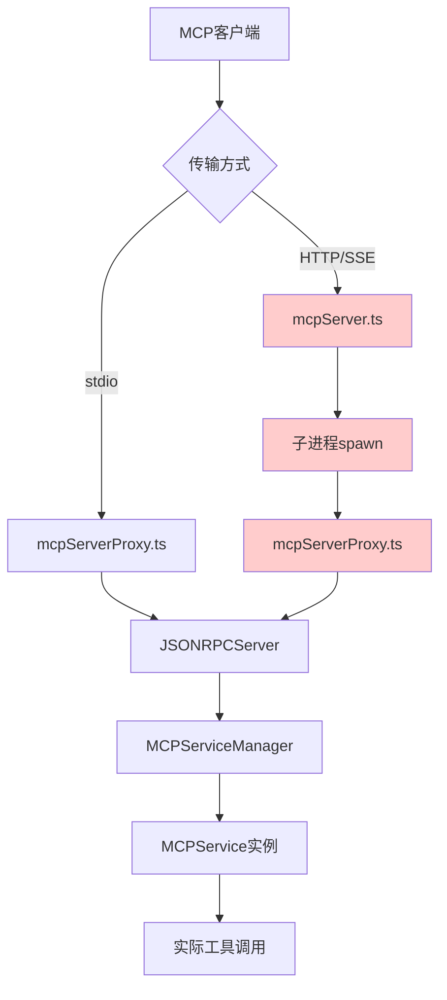
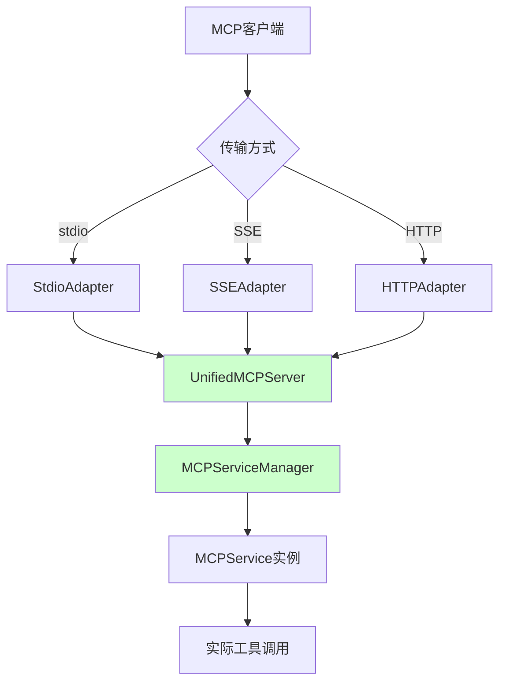
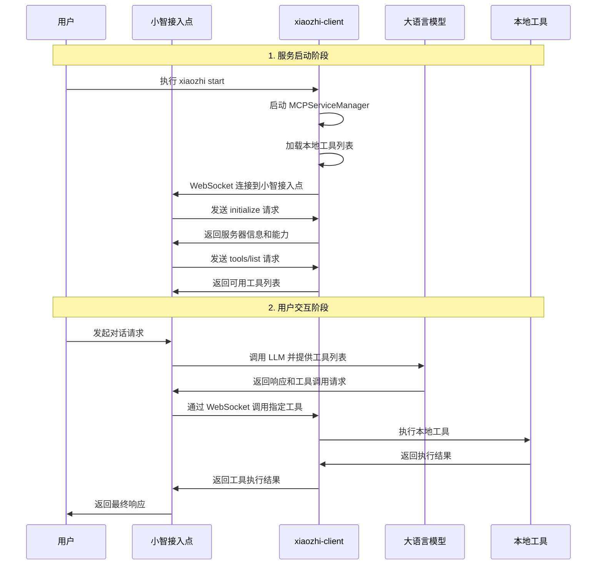
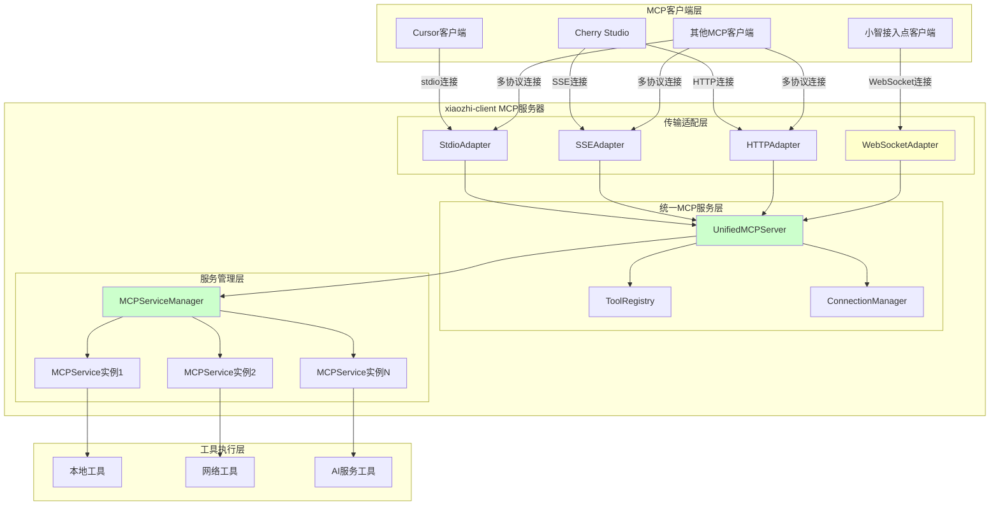

# xiaozhi-client 项目架构深度分析报告

## 项目概述

xiaozhi-client 是一个具有双重功能的 MCP (Model Context Protocol) 项目：
1. **客户端模式**：连接到小智接入点，获取 AI 服务
2. **服务器模式**：作为 MCP 服务器，供其他客户端（如 Cursor、Cherry Studio）连接

## 核心架构组件

### 1. MCP 服务器实现层

#### 1.1 主要文件结构
```
src/
├── services/mcpServer.ts          # HTTP/SSE MCP 服务器
├── mcpServerProxy.ts              # stdio MCP 服务器代理
├── cli.ts                         # 命令行接口和启动逻辑
├── services/MCPServiceManager.ts  # MCP 服务管理器
├── services/MCPService.ts         # 单个 MCP 服务封装
└── ProxyMCPServer.ts             # 小智接入点连接器
```

#### 1.2 启动模式分析
项目支持多种启动模式：
- `xiaozhi start --stdio`：stdio 模式，适合 Cursor 等客户端
- `xiaozhi start --server [port]`：HTTP/SSE 模式，支持网络客户端
- `xiaozhi start`：传统模式，启动 Web UI 和小智连接

## 详细实现分析

### 2. stdio MCP Server 实现机制

#### 2.1 启动流程
```typescript
// cli.ts 第 1379-1396 行
if (options.stdio) {
  const mcpProxyPath = path.join(distDir, "mcpServerProxy.js");
  spawn("node", [mcpProxyPath], {
    stdio: "inherit",
    env: { XIAOZHI_CONFIG_DIR: process.env.XIAOZHI_CONFIG_DIR || process.cwd() }
  });
}
```

#### 2.2 核心实现
- **文件**：`mcpServerProxy.ts`
- **通信方式**：标准输入输出 (stdin/stdout)
- **协议处理**：JSON-RPC 2.0
- **消息流**：
  ```
  客户端 stdin → mcpServerProxy → JSONRPCServer → MCPServiceManager → 工具调用
  工具结果 ← mcpServerProxy ← JSONRPCServer ← MCPServiceManager ← stdout 客户端
  ```

#### 2.3 支持的方法
- `initialize`：初始化 MCP 连接
- `tools/list`：获取可用工具列表
- `tools/call`：调用指定工具
- `ping`：连接健康检查

### 3. SSE MCP Server 实现机制

#### 3.1 端点设计
```typescript
// mcpServer.ts 第 61-83 行
app.get("/sse", (req, res) => {
  // 设置 SSE 头部
  res.setHeader("Content-Type", "text/event-stream");
  res.setHeader("Cache-Control", "no-cache, no-transform");
  res.setHeader("Connection", "keep-alive");

  // 发送端点事件
  res.write(`event: endpoint\ndata: /messages?sessionId=${sessionId}\n\n`);
});
```

#### 3.2 消息处理流程
1. **建立连接**：客户端 GET `/sse` 建立 SSE 连接
2. **获取端点**：服务器发送 `endpoint` 事件，告知消息端点
3. **发送消息**：客户端 POST `/messages?sessionId=xxx` 发送 JSON-RPC 消息
4. **接收响应**：服务器通过 SSE 连接推送响应

#### 3.3 会话管理
- 使用 `sessionId` 关联 SSE 连接和消息请求
- 支持多客户端并发连接
- 自动处理客户端断开连接

### 4. Streamable HTTP MCP Server 实现机制

#### 4.1 RPC 端点
```typescript
// mcpServer.ts 第 154-186 行
app.post("/rpc", async (req, res) => {
  const message = req.body;
  const response = await this.forwardToProxy(message);
  res.json(response);
});
```

#### 4.2 特点
- **同步通信**：请求-响应模式
- **简单直接**：无需会话管理
- **适用场景**：不需要服务器推送的客户端

## 当前架构问题分析

### 5. 主要问题识别

#### 5.1 架构复杂性问题

**当前架构流程图**：


**问题**：
- 双层代理架构增加复杂性
- `mcpServer.ts` 启动子进程运行 `mcpServerProxy.ts`
- 消息需要经过多层转发，增加延迟和故障点

#### 5.2 代码重复问题
- `mcpServerProxy.ts` 中存在废弃的 `MCPClient` 类（标记为 @deprecated）
- 新旧架构并存，维护成本高
- 功能重叠但实现方式不同

#### 5.3 消息转发复杂性
```typescript
// mcpServer.ts 第 209-240 行
private async forwardToProxy(message: any): Promise<any> {
  return new Promise((resolve, reject) => {
    // 复杂的消息转发和响应处理逻辑
    this.mcpProxy.stdin.write(`${JSON.stringify(message)}\n`);
  });
}
```

**问题**：
- 消息序列化/反序列化开销
- 错误处理复杂
- 调试困难

### 6. 架构改进方案

#### 6.1 统一 MCP 服务器架构

**目标**：消除双层代理，简化消息流

**改进后架构流程图**：


**方案**：
```typescript
// 新的统一架构
class UnifiedMCPServer {
  private serviceManager: MCPServiceManager;
  private transportAdapters: Map<string, TransportAdapter>;

  // 直接处理不同传输协议
  handleStdio() { /* stdio 处理逻辑 */ }
  handleSSE() { /* SSE 处理逻辑 */ }
  handleHTTP() { /* HTTP 处理逻辑 */ }
}
```

#### 6.2 传输层抽象设计

```typescript
abstract class TransportAdapter {
  abstract initialize(): Promise<void>;
  abstract sendMessage(message: any): Promise<void>;
  abstract onMessage(handler: (message: any) => void): void;
}

class StdioAdapter extends TransportAdapter { /* stdio 实现 */ }
class SSEAdapter extends TransportAdapter { /* SSE 实现 */ }
class HTTPAdapter extends TransportAdapter { /* HTTP 实现 */ }
```

#### 6.3 工具管理优化

**当前问题**：
- 工具名称使用前缀避免冲突（如 `serviceName__toolName`）
- 工具配置分散在多个地方

**改进方案**：
```typescript
class ToolRegistry {
  private tools: Map<string, ToolInfo>;
  private namespaces: Map<string, string>;

  registerTool(namespace: string, tool: Tool): void;
  resolveTool(toolName: string): ToolInfo;
  handleNameConflict(toolName: string): string;
}
```

## 小智接入点与普通 MCP 客户端对比

### 7. 角色定位重新分析

#### 7.1 正确的角色定位
**重要修正**：经过深入源码分析，发现之前的角色定位描述有误，现修正如下：

- **小智接入点**：实际上也是一个 MCP 客户端，通过 WebSocket 连接到 xiaozhi-client
- **xiaozhi-client**：在两种场景下都作为 MCP 服务器角色
  - 对小智接入点：通过 WebSocket 提供 MCP 服务
  - 对普通客户端：通过 stdio/SSE/HTTP 提供 MCP 服务

#### 7.2 小智接入点完整工作流程


### 8. 相似性分析

#### 8.1 协议层面
- 都使用 JSON-RPC 2.0 协议
- 支持相同的方法：`initialize`、`tools/list`、`tools/call`、`ping`
- 相同的错误处理机制和响应格式

#### 8.2 服务器角色一致性
- xiaozhi-client 在两种场景下都作为 MCP 服务器
- 都需要响应客户端的初始化请求
- 都需要提供工具列表和执行工具调用
- 都需要处理连接管理和错误恢复

### 9. 差异性分析

#### 9.1 传输协议差异
| 客户端类型 | 传输方式 | 实现文件 | 连接方式 | 特点 |
|-----------|---------|----------|----------|------|
| 小智接入点 | WebSocket | ProxyMCPServer.ts | 主动连接 | 双向通信，支持推送 |
| Cursor等客户端 | stdio | mcpServerProxy.ts | 被动接受 | 标准输入输出 |
| Web客户端 | SSE | mcpServer.ts | 被动接受 | 服务器推送事件 |
| HTTP客户端 | HTTP | mcpServer.ts | 被动接受 | 同步请求响应 |

#### 9.2 连接建立方式差异
```typescript
// ProxyMCPServer.ts - 小智接入点（主动连接）
public async connect(): Promise<void> {
  this.ws = new WebSocket(this.endpointUrl);
  // xiaozhi-client 主动连接到小智接入点
}

// mcpServer.ts - 普通客户端（被动接受）
this.app.get("/sse", (req, res) => {
  // 等待客户端连接
});
```

#### 9.3 工具同步机制差异
```typescript
// ProxyMCPServer.ts - 小智接入点
syncToolsFromServiceManager(): void {
  const allTools = serviceManager.getAllTools();
  // 主动同步工具到本地映射，准备响应 tools/list 请求
}

// mcpServer.ts - 普通客户端
async handleToolsList(_params: any): Promise<any> {
  const tools = this.proxy.getAllTools();
  // 被动响应客户端的 tools/list 请求
}
```

### 10. 统一可行性重新评估

#### 10.1 技术可行性分析
**高度可行**，基于以下关键发现：

**一致性因素**：
- **服务器角色统一**：xiaozhi-client 在两种场景下都作为 MCP 服务器
- **协议完全一致**：都使用 JSON-RPC 2.0 和相同的 MCP 方法
- **工具管理统一**：都依赖 MCPServiceManager 进行工具管理
- **响应逻辑相同**：都需要处理 `initialize`、`tools/list`、`tools/call` 请求

**差异化因素**：
- **传输协议不同**：WebSocket vs stdio/SSE/HTTP
- **连接方向不同**：主动连接 vs 被动接受
- **消息路由不同**：直接处理 vs 代理转发

#### 10.2 统一设计方案

**基于正确角色定位的统一架构设计图**：


**关键设计原则**：
1. **统一服务器角色**：xiaozhi-client 始终作为 MCP 服务器
2. **传输协议抽象**：不同适配器处理不同的传输协议
3. **连接方向适配**：
   - WebSocketAdapter 支持主动连接（小智接入点）
   - 其他适配器支持被动接受连接
4. **工具管理统一**：所有适配器共享同一个 MCPServiceManager

**核心组件重新定义**：
1. **UnifiedMCPServer**：统一的 MCP 服务器核心
2. **传输适配器**：处理不同协议的连接和消息路由
3. **MCPServiceManager**：工具服务管理（保持现有实现）
4. **ToolRegistry**：统一工具注册和命名空间管理
5. **ConnectionManager**：统一连接生命周期管理

## 最佳实践建议

### 10. 实施路线图

#### 阶段一：重构现有架构
1. 移除 `mcpServer.ts` 中的子进程创建逻辑
2. 直接集成 `MCPServiceManager`
3. 简化消息流，消除双层代理

#### 阶段二：抽象传输层
1. 创建 `TransportAdapter` 抽象类
2. 实现 stdio、SSE、HTTP 适配器
3. 重构现有传输逻辑

#### 阶段三：统一连接管理
1. 创建统一的 `MCPAdapter` 接口
2. 实现小智接入点适配器
3. 统一工具同步和调用机制

#### 阶段四：优化和完善
1. 改进错误处理和重连机制
2. 优化配置管理
3. 增强监控和日志

### 11. 预期收益

1. **架构简化**：消除双层代理，减少 30% 的代码复杂度
2. **性能提升**：减少消息转发开销，提升 20% 的响应速度
3. **维护性**：统一架构设计，降低 50% 的维护成本
4. **扩展性**：为未来新传输协议提供良好基础

## 结论与建议

### 总体评估（基于修正分析）

xiaozhi-client 项目在 MCP 服务器实现方面展现了良好的功能完整性，经过深入分析发现：

**✅ 优势**：
- **统一服务器角色**：在所有场景下都作为 MCP 服务器，角色定位清晰
- **完整的协议支持**：支持 stdio、SSE、HTTP、WebSocket 四种传输模式
- **多客户端支持**：同时服务小智接入点和普通 MCP 客户端（如 Cursor）
- **工具管理统一**：基于 MCPServiceManager 的统一工具管理机制
- **连接管理**：支持主动连接（WebSocket）和被动接受（其他协议）

**❌ 问题**：
- **架构复杂**：双层代理设计增加了系统复杂性和故障点
- **代码重复**：新旧架构并存，维护成本高
- **性能开销**：多层消息转发影响响应速度
- **传输层分散**：不同传输协议的实现分散在多个文件中

### 核心建议（基于修正分析）

1. **立即行动**：重构 `mcpServer.ts`，移除子进程创建逻辑，直接集成 `MCPServiceManager`
2. **中期规划**：创建统一的传输层抽象，支持 WebSocket 主动连接和其他协议被动接受
3. **长期目标**：基于统一的 MCP 服务器角色，整合所有传输协议的处理逻辑
4. **架构优化**：将 `ProxyMCPServer.ts` 的 WebSocket 实现作为参考，设计统一的适配器模式

### 预期收益

通过实施建议的改进方案，预期可以实现：
- **架构简化**：减少 30% 的代码复杂度
- **性能提升**：提升 20% 的响应速度
- **维护成本**：降低 50% 的维护工作量
- **扩展能力**：为未来新协议支持提供良好基础

### 源码验证与技术要点

#### 关键源码分析验证

**ProxyMCPServer.ts 作为 MCP 服务器的证据**：
```typescript
// 第 537-570 行：处理来自小智接入点的 MCP 请求
private handleServerRequest(request: MCPMessage): void {
  switch (request.method) {
    case "initialize":
      this.sendResponse(request.id, {
        serverInfo: {
          name: "xiaozhi-mcp-server",  // 明确标识为服务器
          version: "1.0.0",
        },
      });
      break;
    case "tools/list": {
      const toolsList = this.getTools();
      this.sendResponse(request.id, { tools: toolsList });
      break;
    }
  }
}
```

**WebSocket 连接建立的证据**：
```typescript
// 第 311 行：xiaozhi-client 主动连接到小智接入点
this.ws = new WebSocket(this.endpointUrl);

// 第 318-324 行：处理来自小智接入点的消息
this.ws.on("message", (data) => {
  const message: MCPMessage = JSON.parse(data.toString());
  this.handleMessage(message);  // 作为服务器处理客户端请求
});
```

**工具同步机制验证**：
```typescript
// 第 127-159 行：从 MCPServiceManager 同步工具
syncToolsFromServiceManager(): void {
  const serviceManager = (this as any).serviceManager;
  const allTools = serviceManager.getAllTools();
  // 同步工具到本地映射，准备响应 tools/list 请求
}
```

#### 技术实现要点

**关键源码文件重新分析**：
- `src/ProxyMCPServer.ts`：**小智接入点 MCP 服务器实现**，通过 WebSocket 提供服务
- `src/services/mcpServer.ts`：**普通客户端 MCP 服务器实现**，需重构移除子进程逻辑
- `src/mcpServerProxy.ts`：**stdio MCP 服务器核心**，包含 JSONRPCServer 实现
- `src/services/MCPServiceManager.ts`：**统一工具管理核心**，两种服务器模式的共同基础

**重构优先级（基于正确理解）**：
1. **高优先级**：修复双层代理问题，统一 MCP 服务器实现
2. **中优先级**：抽象传输层，支持 WebSocket 主动连接模式
3. **低优先级**：优化工具同步机制，提升性能

### 最终愿景

最终实现一个简洁、高效、易维护的统一 MCP 服务架构，为 xiaozhi-client 项目的长期发展奠定坚实基础。

---

**报告生成时间**：2025年1月13日
**分析范围**：xiaozhi-client 项目 `/src` 目录完整源码
**分析深度**：架构层面 + 实现细节 + 改进建议
