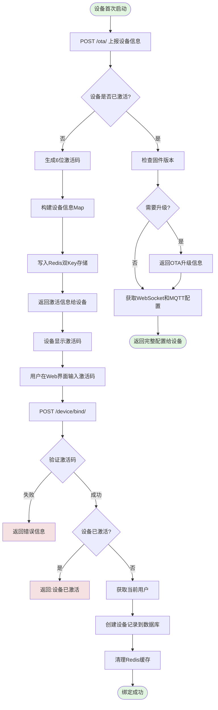
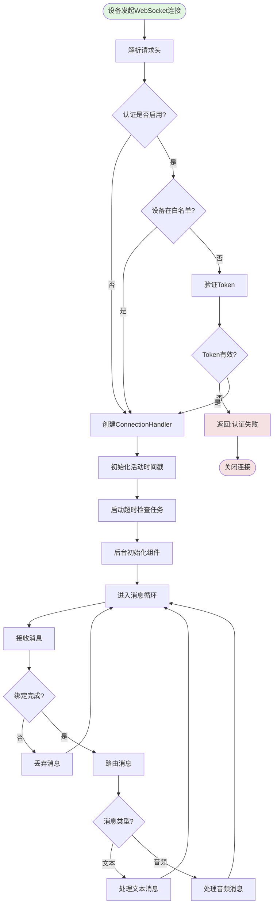
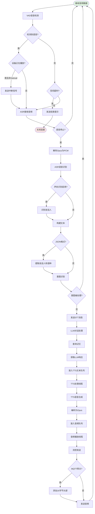
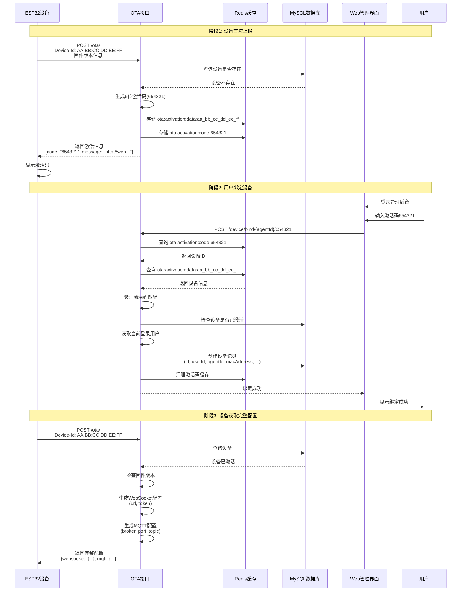
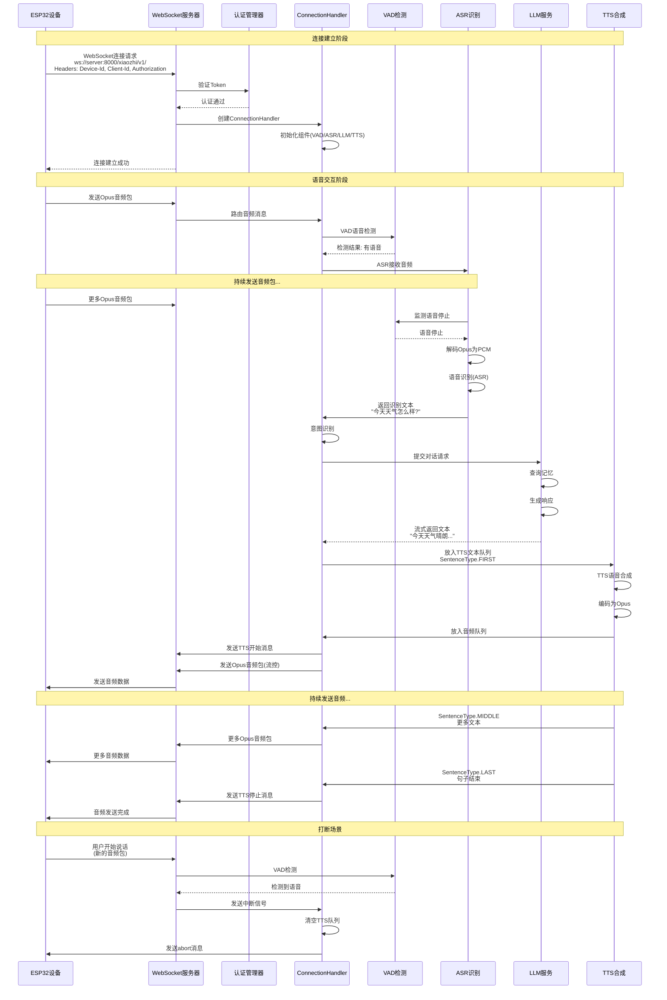
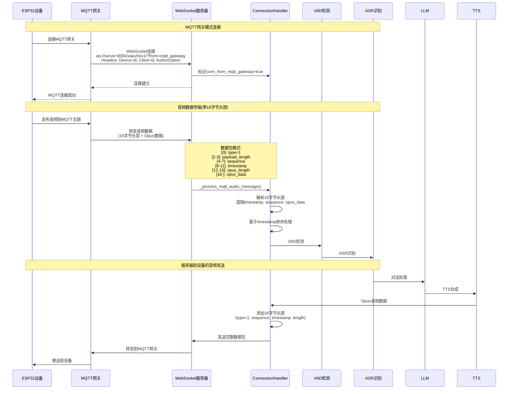

# 小智ESP32服务器 - 技术分析报告

## 目录

1. [项目概述](#项目概述)
2. [验证码和配网流程](#验证码和配网流程)
3. [硬件通信机制](#硬件通信机制)
4. [语音数据传输和交互](#语音数据传输和交互)
5. [关键代码路径](#关键代码路径)
6. [流程图](#流程图)
7. [时序图](#时序图)
8. [技术架构总结](#技术架构总结)

---

## 项目概述

### 1.1 项目简介

**项目名称**: xiaozhi-esp32-server（小智ESP32后端服务）

**项目定位**: 为开源智能硬件项目 xiaozhi-esp32 提供后端服务，基于人机共生智能理论和技术研发的智能终端软硬件体系。

### 1.2 技术架构

本项目采用**多语言协作架构**：

| 模块 | 技术栈 | 端口 | 职责 |
|------|--------|------|------|
| **Python核心服务** | Python + asyncio + websockets | 8000 (WS) | WebSocket服务、语音交互、AI能力 |
| **Java管理后台** | Spring Boot 3.4.3 + Java 21 | 8002 | 用户管理、设备管理、API接口 |
| **Vue Web管理** | Vue 2.6.14 + Element UI | - | 网页管理界面 |
| **UniApp移动端** | UniApp 3.0.0 + Vue 3 | - | 移动端应用 |

### 1.3 项目目录结构

```
xiaozhi-esp32-server/
├── main/
│   ├── xiaozhi-server/          # Python核心服务 ⭐
│   │   ├── app.py               # 应用入口
│   │   ├── config.yaml          # 主配置文件
│   │   ├── core/                # 核心业务逻辑
│   │   │   ├── websocket_server.py    # WebSocket服务器
│   │   │   ├── http_server.py         # HTTP服务器（OTA/视觉）
│   │   │   ├── connection.py          # 连接处理器
│   │   │   ├── auth.py               # 认证管理器
│   │   │   └── handle/               # 消息处理器
│   │   │       ├── receiveAudioHandle.py  # 音频接收处理
│   │   │       ├── sendAudioHandle.py     # 音频发送处理
│   │   │       └── textHandler.py         # 文本消息处理
│   │   ├── providers/           # AI提供者（ASR/TTS/LLM/VAD）
│   │   └── models/              # AI模型存储
│   │
│   ├── manager-api/             # Java管理后台 ⭐
│   │   └── src/main/java/xiaozhi/
│   │       ├── AdminApplication.java        # 启动类
│   │       ├── modules/
│   │       │   ├── device/                # 设备管理模块
│   │       │   │   ├── controller/
│   │       │   │   │   ├── DeviceController.java     # 设备绑定/注册
│   │       │   │   │   └── OTAController.java        # OTA接口
│   │       │   │   └── service/
│   │       │   │       └── impl/DeviceServiceImpl.java
│   │       │   └── security/              # 安全认证模块
│   │       └── common/                    # 公共模块
│   │           ├── redis/RedisKeys.java   # Redis键定义
│   │           └── exception/ErrorCode.java
│   │
│   ├── manager-web/             # Vue Web管理界面
│   └── manager-mobile/          # UniApp移动端应用
│
└── docs/                        # 文档目录
```

---

## 验证码和配网流程

### 2.1 配网架构概述

本项目采用**双通道配网机制**：

```
┌─────────────────────────────────────────────────────────────┐
│                      配网双通道架构                           │
├─────────────────────────────────────────────────────────────┤
│                                                             │
│  通道一: 设备注册通道（简单验证码）                            │
│  ├─ 接口: POST /device/register                             │
│  ├─ 功能: 生成6位随机验证码                                  │
│  ├─ 存储: Redis (sys:device:captcha:{code})                 │
│  └─ 用途: 快速获取设备验证码                                  │
│                                                             │
│  通道二: 设备激活通道（完整配网）                             │
│  ├─ 接口: POST /ota/                                        │
│  ├─ 功能: 设备上报 + 生成激活码                              │
│  ├─ 存储: Redis (ota:activation:*)                          │
│  └─ 用途: 完整设备激活流程                                   │
│                                                             │
└─────────────────────────────────────────────────────────────┘
```

### 2.2 通道一：设备注册（简单验证码）

#### 2.2.1 接口定义

**文件位置**: `main/manager-api/src/main/java/xiaozhi/modules/device/controller/DeviceController.java`

```java
// 第57-76行
@PostMapping("/register")
@Operation(summary = "注册设备")
public Result<String> registerDevice(@RequestBody DeviceRegisterDTO deviceRegisterDTO)
```

**请求示例**:
```json
POST /xiaozhi/device/register
{
    "macAddress": "AA:BB:CC:DD:EE:FF"
}
```

**响应示例**:
```json
{
    "code": 0,
    "msg": "success",
    "data": "123456"
}
```

#### 2.2.2 验证码生成逻辑

```java
// DeviceController.java:64-75
String code;
String key;
String existsMac = null;
do {
    // 生成6位随机数字验证码
    code = String.valueOf(Math.random()).substring(2, 8);
    key = RedisKeys.getDeviceCaptchaKey(code);
    existsMac = (String) redisUtils.get(key);
} while (StringUtils.isNotBlank(existsMac)); // 确保验证码唯一

// 存储验证码与MAC地址的映射
redisUtils.set(key, macAddress);
```

#### 2.2.3 Redis存储结构

```
Key格式: sys:device:captcha:{验证码}
示例:    sys:device:captcha:123456
Value:   "AA:BB:CC:DD:EE:FF" (MAC地址)
TTL:     默认不过期（需配置）
```

### 2.3 通道二：设备激活（完整配网）

#### 2.3.1 设备上报接口

**文件位置**: `main/manager-api/src/main/java/xiaozhi/modules/device/controller/OTAController.java`

```java
// 第42-60行
@Operation(summary = "OTA版本和设备激活状态检查")
@PostMapping
public ResponseEntity<String> checkOTAVersion(
    @RequestBody DeviceReportReqDTO deviceReportReqDTO,
    @RequestHeader("Device-Id") String deviceId,
    @RequestHeader(value = "Client-Id", required = false) String clientId
)
```

**请求头**:
```
Device-Id: AA:BB:CC:DD:EE:FF  (设备MAC地址)
Client-Id: xxx                  (可选，默认为Device-Id)
```

**请求体**:
```json
{
    "application": {
        "version": "1.0.0",
        "board": {
            "type": "ESP32-S3-BOX"
        },
        "chipModelName": "ESP32-S3"
    }
}
```

#### 2.3.2 设备激活状态检查

**文件位置**: `main/manager-api/src/main/java/xiaozhi/modules/device/service/impl/DeviceServiceImpl.java`

```java
// 第198-288行
public DeviceReportRespDTO checkDeviceActive(String macAddress, String clientId,
                                            DeviceReportReqDTO deviceReport) {
    DeviceReportRespDTO response = new DeviceReportRespDTO();

    // 1. 查询设备是否已激活
    DeviceEntity deviceById = getDeviceByMacAddress(macAddress);

    // 2. 设备未激活，生成激活码
    if (deviceById == null) {
        response.setFirmware(buildFirmware(false));
        DeviceReportRespDTO.Activation code = buildActivation(macAddress, deviceReport);
        response.setActivation(code);
        return response;
    }

    // 3. 设备已激活，返回完整配置
    // ... 返回WebSocket、MQTT等配置
}
```

#### 2.3.3 激活码生成详解

```java
// DeviceServiceImpl.java:412-452
private DeviceReportRespDTO.Activation buildActivation(String deviceId,
                                                       DeviceReportReqDTO deviceReport) {
    String safeDeviceId = deviceId.replace(":", "_").toLowerCase();

    // 1. 检查是否已有激活码
    String cachedCode = geCodeByDeviceId(deviceId);

    // 2. 生成新的6位数字激活码
    String newCode = RandomUtil.randomNumbers(6);

    // 3. 构建设备信息数据结构
    Map<String, Object> dataMap = new HashMap<>();
    dataMap.put("id", deviceId);
    dataMap.put("mac_address", deviceId);
    dataMap.put("board", deviceReport.getApplication().getBoard().getType());
    dataMap.put("app_version", deviceReport.getApplication().getVersion());
    dataMap.put("deviceId", deviceId);
    dataMap.put("activation_code", newCode);

    // 4. Redis双Key存储
    // 主数据Key: ota:activation:data:aa_bb_cc_dd_ee_ff
    String dataKey = "ota:activation:data:" + safeDeviceId;
    redisUtils.set(dataKey, dataMap);

    // 反查Key: ota:activation:code:123456
    String codeKey = "ota:activation:code:" + newCode;
    redisUtils.set(codeKey, deviceId);

    // 5. 返回激活信息
    Activation code = new Activation();
    code.setCode(newCode);
    code.setMessage(frontedUrl + "\n" + newCode);
    code.setChallenge(deviceId);
    return code;
}
```

**Redis存储结构**:
```
# 主数据存储
Key:   ota:activation:data:aa_bb_cc_dd_ee_ff
Value: {
    "id": "AA:BB:CC:DD:EE:FF",
    "mac_address": "AA:BB:CC:DD:EE:FF",
    "board": "ESP32-S3-BOX",
    "app_version": "1.0.0",
    "activation_code": "654321"
}

# 反查索引
Key:   ota:activation:code:654321
Value: "AA:BB:CC:DD:EE:FF"
```

#### 2.3.4 设备绑定（激活完成）

**接口**: `POST /xiaozhi/device/bind/{agentId}/{deviceCode}`

**文件位置**: `DeviceController.java:49-55`

```java
@PostMapping("/bind/{agentId}/{deviceCode}")
@Operation(summary = "绑定设备")
@RequiresPermissions("sys:role:normal")
public Result<Void> bindDevice(@PathVariable String agentId,
                               @PathVariable String deviceCode) {
    deviceService.deviceActivation(agentId, deviceCode);
    return new Result<>();
}
```

**激活逻辑**:

```java
// DeviceServiceImpl.java:100-152
public Boolean deviceActivation(String agentId, String activationCode) {
    // 1. 验证激活码非空
    if (StringUtils.isBlank(activationCode)) {
        throw new RenException(ErrorCode.ACTIVATION_CODE_EMPTY);
    }

    // 2. 通过激活码反查设备ID
    String deviceKey = "ota:activation:code:" + activationCode;
    Object cacheDeviceId = redisUtils.get(deviceKey);

    // 3. 获取设备详细信息
    String safeDeviceId = deviceId.replace(":", "_").toLowerCase();
    String cacheDeviceKey = "ota:activation:data:" + safeDeviceId;
    Map<String, Object> cacheMap = (Map<String, Object>) redisUtils.get(cacheDeviceKey);

    // 4. 验证激活码匹配
    String cachedCode = (String) cacheMap.get("activation_code");
    if (!activationCode.equals(cachedCode)) {
        throw new RenException(ErrorCode.ACTIVATION_CODE_ERROR);
    }

    // 5. 检查设备是否已激活
    if (selectById(deviceId) != null) {
        throw new RenException(ErrorCode.DEVICE_ALREADY_ACTIVATED);
    }

    // 6. 获取当前登录用户
    UserDetail user = SecurityUser.getUser();

    // 7. 创建设备记录
    DeviceEntity deviceEntity = new DeviceEntity();
    deviceEntity.setId(deviceId);              // 使用MAC地址作为ID
    deviceEntity.setBoard(board);
    deviceEntity.setAgentId(agentId);          // 关联智能体
    deviceEntity.setAppVersion(appVersion);
    deviceEntity.setMacAddress(macAddress);
    deviceEntity.setUserId(user.getId());      // 关联用户
    deviceEntity.setAutoUpdate(1);
    deviceEntity.setLastConnectedAt(new Date());
    deviceDao.insert(deviceEntity);

    // 8. 清理Redis缓存
    redisUtils.delete(List.of(
        cacheDeviceKey,                          // 设备信息缓存
        deviceKey,                              // 激活码缓存
        RedisKeys.getAgentDeviceCountById(agentId) // 智能体设备数量缓存
    ));

    return true;
}
```

### 2.4 配网状态流转

```
┌──────────────────────────────────────────────────────────────────┐
│                         设备生命周期                              │
└──────────────────────────────────────────────────────────────────┘

  ┌─────────────────────────────────────────────────────────────┐
  │  1. 未注册状态                                               │
  │     ├─ 设备首次连接 POST /ota/                              │
  │     ├─ 系统生成6位激活码                                     │
  │     ├─ 设备信息写入Redis (ota:activation:data:*)            │
  │     ├─ 激活码反查索引写入Redis (ota:activation:code:*)       │
  │     └─ 返回激活信息给设备（设备端显示激活码）                │
  └─────────────────────────────────────────────────────────────┘
                              │
                              ▼
  ┌─────────────────────────────────────────────────────────────┐
  │  2. 待激活状态                                               │
  │     ├─ 用户在Web界面输入激活码                              │
  │     ├─ 调用 POST /device/bind/{agentId}/{deviceCode}        │
  │     ├─ 验证激活码有效性                                      │
  │     ├─ 从Redis读取设备信息                                  │
  │     └─ 检查设备是否已激活                                    │
  └─────────────────────────────────────────────────────────────┘
                              │
                              ▼
  ┌─────────────────────────────────────────────────────────────┐
  │  3. 已激活状态                                               │
  │     ├─ 创建设备记录（ai_device表）                          │
  │     ├─ 关联用户ID和智能体ID                                 │
  │     ├─ 清理Redis缓存                                        │
  │     └─ 设备可正常使用                                        │
  └─────────────────────────────────────────────────────────────┘
                              │
                              ▼
  ┌─────────────────────────────────────────────────────────────┐
  │  4. 运行状态                                                 │
  │     ├─ 设备定期上报 POST /ota/                              │
  │     ├─ 更新最后连接时间（异步）                             │
  │     ├─ 检查固件版本，返回升级信息（如需要）                  │
  │     ├─ 返回WebSocket配置和认证token                         │
  │     └─ 返回MQTT网关配置                                     │
  └─────────────────────────────────────────────────────────────┘
```

### 2.5 数据库表结构

**表名**: `ai_device`

| 字段名 | 类型 | 说明 |
|--------|------|------|
| id | VARCHAR(64) | 设备ID（使用MAC地址） |
| user_id | BIGINT | 关联用户ID |
| mac_address | VARCHAR(32) | MAC地址 |
| agent_id | VARCHAR(64) | 智能体ID |
| board | VARCHAR(64) | 设备硬件型号 |
| app_version | VARCHAR(32) | 固件版本号 |
| auto_update | INT | 自动更新开关(0关闭/1开启) |
| last_connected_at | DATETIME | 最后连接时间 |
| alias | VARCHAR(64) | 设备别名 |
| sort | INT | 排序 |

---

## 硬件通信机制

### 3.1 通信协议概览

```
┌──────────────────────────────────────────────────────────────────┐
│                        硬件通信协议栈                             │
├──────────────────────────────────────────────────────────────────┤
│                                                                  │
│  ┌────────────────────────────────────────────────────────────┐  │
│  │  WebSocket (主要协议)                                       │  │
│  │  ├─ 端口: 8000                                             │  │
│  │  ├─ 路径: /xiaozhi/v1/                                     │  │
│  │  ├─ 数据: 文本消息 + Opus音频包                            │  │
│  │  └─ 用途: 实时双向通信、语音交互                            │  │
│  └────────────────────────────────────────────────────────────┘  │
│                                                                  │
│  ┌────────────────────────────────────────────────────────────┐  │
│  │  HTTP (辅助协议)                                            │  │
│  │  ├─ 端口: 8003                                             │  │
│  │  ├─ 接口: /xiaozhi/ota/, /mcp/vision/explain               │  │
│  │  └─ 用途: OTA升级、视觉分析                                │  │
│  └────────────────────────────────────────────────────────────┘  │
│                                                                  │
│  ┌────────────────────────────────────────────────────────────┐  │
│  │  MQTT Gateway (网关模式)                                    │  │
│  │  ├─ 标识: ?from=mqtt_gateway                               │  │
│  │  ├─ 数据格式: 16字节头部 + Opus音频                        │  │
│  │  └─ 用途: 支持MQTT设备接入                                 │  │
│  └────────────────────────────────────────────────────────────┘  │
│                                                                  │
└──────────────────────────────────────────────────────────────────┘
```

### 3.2 WebSocket连接建立

#### 3.2.1 服务器启动

**文件位置**: `main/xiaozhi-server/app.py`

```python
# 第46-76行
async def main():
    config = load_config()

    # 启动全局GC管理器（5分钟清理一次）
    gc_manager = get_gc_manager(interval_seconds=300)
    await gc_manager.start()

    # 启动 WebSocket 服务器
    ws_server = WebSocketServer(config)
    ws_task = asyncio.create_task(ws_server.start())

    # 启动 Simple HTTP 服务器
    ota_server = SimpleHttpServer(config)
    ota_task = asyncio.create_task(ota_server.start())

    # 等待退出信号
    await wait_for_exit()
```

#### 3.2.2 WebSocket服务器实现

**文件位置**: `main/xiaozhi-server/core/websocket_server.py`

```python
# 第71-79行
async def start(self):
    server_config = self.config["server"]
    host = server_config.get("ip", "0.0.0.0")
    port = int(server_config.get("port", 8000))

    async with websockets.serve(
        self._handle_connection,    # 连接处理器
        host, port,
        process_request=self._http_response  # HTTP请求处理
    ):
        await asyncio.Future()  # 永久运行
```

#### 3.2.3 连接认证机制

**认证管理器**: `main/xiaozhi-server/core/auth.py`

```python
# 第13-73行
class AuthManager:
    """统一授权认证管理器
    生成与验证 client_id, device_id, token (HMAC-SHA256) 认证三元组
    """

    def generate_token(self, client_id: str, username: str) -> str:
        """生成 token"""
        ts = int(time.time())
        content = f"{client_id}|{username}|{ts}"
        signature = self._sign(content)  # HMAC-SHA256签名
        token = f"{signature}.{ts}"
        return token

    def verify_token(self, token: str, client_id: str, username: str) -> bool:
        """验证token有效性"""
        sig_part, ts_str = token.split(".")
        ts = int(ts_str)

        # 检查过期
        if int(time.time()) - ts > self.expire_seconds:
            return False

        # 验证签名
        expected_sig = self._sign(f"{client_id}|{username}|{ts}")
        return hmac.compare_digest(sig_part, expected_sig)
```

**认证流程**:

```python
# websocket_server.py:206-227
async def _handle_auth(self, websocket: websockets.ServerConnection):
    if self.auth_enable:
        headers = dict(websocket.request.headers)
        device_id = headers.get("device-id", None)
        client_id = headers.get("client-id", None)

        # 白名单设备跳过认证
        if self.allowed_devices and device_id in self.allowed_devices:
            return

        # 验证token
        token = headers.get("authorization", "")
        if token.startswith("Bearer "):
            token = token[7:]

        auth_success = self.auth.verify_token(
            token, client_id=client_id, username=device_id
        )
        if not auth_success:
            raise AuthenticationError("Invalid token")
```

**请求头要求**:
```http
Device-ID: AA:BB:CC:DD:EE:FF
Client-ID: xiaozhi_client_001
Authorization: Bearer signature.timestamp
```

#### 3.2.4 连接处理器初始化

**文件位置**: `main/xiaozhi-server/core/connection.py`

```python
# 第172-242行
async def handle_connection(self, ws: websockets.ServerConnection):
    # 1. 获取请求头和IP
    self.headers = dict(ws.request.headers)
    self.client_ip = ws.remote_address[0]

    # 2. 检查MQTT网关连接
    request_path = ws.request.path
    self.conn_from_mqtt_gateway = request_path.endswith("?from=mqtt_gateway")

    # 3. 初始化时间戳
    self.first_activity_time = time.time() * 1000
    self.last_activity_time = time.time() * 1000

    # 4. 启动超时检查任务
    self.timeout_task = asyncio.create_task(self._check_timeout())

    # 5. 后台初始化配置和组件
    asyncio.create_task(self._background_initialize())

    # 6. 消息循环
    async for message in self.websocket:
        await self._route_message(message)
```

### 3.3 MQTT网关支持

当设备通过MQTT网关连接时，数据包带有16字节头部：

**数据包格式** (`sendAudioHandle.py:77-98`):

```python
# 16字节头部格式：
# [0]:       type (固定为1)
# [1]:       保留
# [2-3]:     payload length (2字节大端序)
# [4-7]:     sequence (4字节大端序)
# [8-11]:    timestamp (4字节大端序)
# [12-15]:   opus length (4字节大端序)

header = bytearray(16)
header[0] = 1
header[2:4] = len(opus_packet).to_bytes(2, "big")
header[4:8] = sequence.to_bytes(4, "big")
header[8:12] = timestamp.to_bytes(4, "big")
header[12:16] = len(opus_packet).to_bytes(4, "big")

complete_packet = bytes(header) + opus_packet
```

**MQTT网关音频包解析** (`connection.py:326-357`):

```python
async def _process_mqtt_audio_message(self, message):
    # 解析16字节头部
    timestamp = int.from_bytes(message[8:12], "big")
    audio_length = int.from_bytes(message[12:16], "big")
    audio_data = message[16 : 16 + audio_length]

    # 基于时间戳排序处理
    self._process_websocket_audio(audio_data, timestamp)
```

---

## 语音数据传输和交互

### 4.1 音频格式和编解码

#### 4.1.1 支持的音频格式

**配置位置**: `main/xiaozhi-server/config.yaml`

```yaml
audio_params:
  format: opus          # 音频格式: opus 或 pcm
  sample_rate: 24000    # 采样率: 8000/12000/16000/24000/48000
  channels: 1           # 声道数
  frame_duration: 60    # 帧时长（毫秒）
```

#### 4.1.2 Opus编码器

**文件位置**: `main/xiaozhi-server/core/utils/opus_encoder_utils.py`

```python
class OpusEncoderUtils:
    def __init__(self, sample_rate: int, channels: int, frame_size_ms: int):
        self.encoder = Encoder(
            sample_rate,
            channels,
            constants.APPLICATION_AUDIO
        )
        self.encoder.bitrate = 24000  # 比特率
        self.encoder.complexity = 10  # 编码复杂度(0-10, 10最高质量)

    def encode(self, pcm_data: bytes) -> bytes:
        """编码PCM为Opus"""
        opus_data = self.encoder.encode(pcm_data, self.frame_size)
        return opus_data
```

#### 4.1.3 Opus解码器

**文件位置**: `main/xiaozhi-server/core/providers/asr/base.py`

```python
# 第349-381行
@staticmethod
def decode_opus(opus_data: List[bytes]) -> List[bytes]:
    """解码Opus为PCM"""
    decoder = opuslib_next.Decoder(16000, 1)
    pcm_data = []
    buffer_size = 960  # 60ms at 16kHz

    for opus_packet in opus_data:
        pcm_frame = decoder.decode(opus_packet, buffer_size)
        pcm_data.append(pcm_frame)

    return pcm_data
```

### 4.2 语音活动检测（VAD）

#### 4.2.1 Silero VAD实现

**文件位置**: `main/xiaozhi-server/core/providers/vad/silero.py`

```python
# 第71-92行
def is_vad(self, conn, audio):
    # 使用Silero模型进行VAD检测
    speech_prob = self.model(audio, 16000).item()

    # 双阈值检测机制
    if speech_prob >= self.vad_threshold:  # 高阈值：确认有语音
        is_voice = True
    elif speech_prob <= self.vad_threshold_low:  # 低阈值：确认无语音
        is_voice = False
    else:
        is_voice = conn.last_is_voice  # 中间值：保持前一个状态

    conn.last_is_voice = is_voice

    # 语音停止检测
    if conn.client_have_voice and not is_voice:
        stop_duration = time.time() * 1000 - conn.last_activity_time
        if stop_duration >= self.silence_threshold_ms:
            conn.client_voice_stop = True

    return is_voice
```

### 4.3 完整语音交互流程

#### 4.3.1 音频接收流程

```
┌──────────────────────────────────────────────────────────────────┐
│                       音频接收处理流程                            │
└──────────────────────────────────────────────────────────────────┘

  WebSocket接收
       │
       ▼
  _route_message()
       │
       ├─ MQTT网关消息?
       │   ├─ 是: _process_mqtt_audio_message()
       │   │      └─ 解析16字节头部
       │   └─ 否: 直接处理
       │
       ▼
  asr_audio_queue.put()
       │
       ▼
  asr_text_priority_thread (后台线程)
       │
       ▼
  handleAudioMessage()
       │
       ├─ vad.is_vad()              # VAD检测
       ├─ no_voice_close_connect()  # 空闲检测
       └─ asr.receive_audio()       # ASR接收音频
            │
            ▼
            client_voice_stop?      # 检测到语音停止?
            │
            ├─ 是: handle_voice_stop()
            │        ├─ decode_opus()           # 解码Opus
            │        ├─ speech_to_text()        # ASR识别
            │        ├─ voiceprint.identify()   # 声纹识别
            │        └─ startToChat()           # 开始聊天
            │
            └─ 否: 继续接收音频
```

**代码实现**:

```python
# receiveAudioHandle.py:17-34
async def handleAudioMessage(conn: "ConnectionHandler", audio):
    # 1. VAD检测
    have_voice = conn.vad.is_vad(conn, audio)

    # 2. 打断检测（manual模式不打断）
    if have_voice:
        if conn.client_is_speaking and conn.client_listen_mode != "manual":
            await handleAbortMessage(conn)

    # 3. 空闲检测
    await no_voice_close_connect(conn, have_voice)

    # 4. ASR接收音频
    await conn.asr.receive_audio(conn, audio, have_voice)
```

#### 4.3.2 语音识别（ASR）

```python
# asr/base.py:84-179
async def handle_voice_stop(self, conn, asr_audio_task):
    # 1. 解码Opus为PCM
    if conn.audio_format == "pcm":
        pcm_data = asr_audio_task
    else:
        pcm_data = self.decode_opus(asr_audio_task)

    # 2. 并行处理ASR和声纹识别
    asr_task = self.speech_to_text_wrapper(
        asr_audio_task, conn.session_id, conn.audio_format
    )

    if conn.voiceprint_provider:
        voiceprint_task = conn.voiceprint_provider.identify_speaker(
            wav_data, conn.session_id
        )
        asr_result, voiceprint_result = await asyncio.gather(
            asr_task, voiceprint_task, return_exceptions=True
        )

    # 3. 构建增强文本（包含说话人信息）
    enhanced_text = self._build_enhanced_text(raw_text, speaker_name)

    # 4. 触发聊天
    await startToChat(conn, enhanced_text)
```

#### 4.3.3 文本处理和意图识别

```python
# receiveAudioHandle.py:43-100
async def startToChat(conn: "ConnectionHandler", text):
    # 1. 解析说话人和语种信息
    # JSON格式: {"speaker": "name", "content": "text", "language": "zh"}

    # 2. 绑定检查
    if conn.need_bind:
        await check_bind_device(conn)
        return

    # 3. 输出限制检查
    if check_device_output_limit(conn.headers.get("device-id"), conn.max_output_size):
        await max_out_size(conn)
        return

    # 4. 意图识别
    intent_handled = await handle_user_intent(conn, actual_text)
    if intent_handled:
        return

    # 5. 发送STT消息并触发LLM
    await send_stt_message(conn, actual_text)
    conn.executor.submit(conn.chat, actual_text)
```

#### 4.3.4 LLM对话处理

```python
# connection.py:797-1025
def chat(self, query, depth=0):
    # 1. 生成新sentence_id并发送FIRST消息
    self.sentence_id = str(uuid.uuid4().hex)
    self.dialogue.put(Message(role="user", content=query))
    self.tts.tts_text_queue.put(
        TTSMessageDTO(
            sentence_id=self.sentence_id,
            sentence_type=SentenceType.FIRST,
            content_type=ContentType.ACTION,
        )
    )

    # 2. 查询记忆
    if self.memory is not None and query:
        memory_str = self.memory.query_memory(query).result()

    # 3. LLM响应（支持function call）
    if self.intent_type == "function_call":
        llm_responses = self.llm.response_with_functions(
            self.session_id,
            self.dialogue.get_llm_dialogue_with_memory(memory_str),
            functions=functions,
        )
    else:
        llm_responses = self.llm.response(
            self.session_id,
            self.dialogue.get_llm_dialogue_with_memory(memory_str),
        )

    # 4. 流式处理响应
    for response in llm_responses:
        if self.client_abort:
            break
        # 获取情绪
        textUtils.get_emotion(self, content)
        # 发送到TTS队列
        self.tts.tts_text_queue.put(
            TTSMessageDTO(
                sentence_type=SentenceType.MIDDLE,
                content_type=ContentType.TEXT,
                content_detail=content,
            )
        )

    # 5. 发送LAST消息
    self.tts.tts_text_queue.put(
        TTSMessageDTO(
            sentence_type=SentenceType.LAST,
            content_type=ContentType.ACTION,
        )
    )
```

#### 4.3.5 语音合成（TTS）

```python
# tts/base.py:280-320
def tts_text_priority_thread(self):
    while not self.conn.stop_event.is_set():
        message = self.tts_text_queue.get(timeout=1)

        if message.sentence_type == SentenceType.FIRST:
            self.conn.client_abort = False
            self.tts_text_buff = []
            self.is_first_sentence = True

        elif ContentType.TEXT == message.content_type:
            self.tts_text_buff.append(message.content_detail)
            segment_text = self._get_segment_text()
            if segment_text:
                # 调用TTS合成
                self.to_tts_stream(segment_text, opus_handler=self.handle_opus)

        elif ContentType.FILE == message.content_type:
            self._process_audio_file_stream(
                message.content_file, callback=self.handle_opus
            )

        if message.sentence_type == SentenceType.LAST:
            self._process_remaining_text_stream(opus_handler=self.handle_opus)
```

#### 4.3.6 音频发送流程

```
┌──────────────────────────────────────────────────────────────────┐
│                       音频发送处理流程                            │
└──────────────────────────────────────────────────────────────────┘

  LLM生成文本
       │
       ▼
  tts_text_queue.put()     # 放入TTS文本队列
       │
       ▼
  tts_text_priority_thread (后台线程)
       │
       ├─ SentenceType.FIRST: 初始化流控器
       ├─ ContentType.TEXT:   调用TTS合成
       └─ SentenceType.LAST:  处理剩余文本
       │
       ▼
  text_to_speak()           # TTS合成
       │
       ▼
  audio_bytes_to_data_stream()  # 音频流转Opus
       │
       ├─ opus_encoder.encode()  # Opus编码
       │
       ▼
  tts_audio_queue.put()     # 放入音频队列
       │
       ▼
  _audio_play_priority_thread (后台线程)
       │
       ├─ enqueue_tts_report()  # 上报数据
       └─ sendAudioMessage()
            │
            ▼
            sendAudio()
            │
            ├─ AudioRateController  # 流控器
            └─ _do_send_audio()
                 │
                 ├─ MQTT网关: 添加16字节头部
                 └─ 直接发送: websocket.send()
```

**代码实现**:

```python
# sendAudioHandle.py:101-130
async def sendAudio(conn: "ConnectionHandler", audios,
                   frame_duration=AUDIO_FRAME_DURATION):
    """发送音频包，使用 AudioRateController 进行流量控制"""

    # 获取或创建流控器
    rate_controller, flow_control = _get_or_create_rate_controller(
        conn, frame_duration, is_single_packet
    )

    # 统一转换为列表处理
    audio_list = [audios] if isinstance(audios, bytes) else audios

    # 发送音频包
    await _send_audio_with_rate_control(
        conn, audio_list, rate_controller, flow_control, send_delay
    )
```

### 4.4 音频流控机制

**流控器实现**: `main/xiaozhi-server/core/utils/audioRateController.py`

```python
# 关键参数
AUDIO_FRAME_DURATION = 60      # 音频帧时长（毫秒）
PRE_BUFFER_COUNT = 5           # 预缓冲包数量

# 流控策略
# 1. 前5个包直接发送（减少延迟）
# 2. 后续包按帧时长精确控制发送速率
# 3. 支持动态调整延迟（tts_audio_send_delay配置）
```

---

## 关键代码路径

### 5.1 配网流程完整调用链

```
设备首次启动
│
├─ POST /ota/                                    # OTA接口
│   └─ OTAController.checkOTAVersion()           # OTAController.java:44
│       └─ DeviceServiceImpl.checkDeviceActive() # DeviceServiceImpl.java:198
│           ├─ 检查设备是否存在 [line:202]
│           ├─ 设备不存在，生成激活码 [line:283]
│           └─ DeviceServiceImpl.buildActivation() # DeviceServiceImpl.java:412
│               ├─ 生成6位随机激活码 [line:423]
│               ├─ 构建设备信息Map [line:429-441]
│               ├─ 写入Redis（双Key） [line:444-449]
│               └─ 返回激活信息 [line:425-427]
│
├─ 用户在Web界面输入激活码
│   └─ POST /device/bind/{agentId}/{deviceCode}  # 绑定接口
│       └─ DeviceController.bindDevice()         # DeviceController.java:52
│           └─ DeviceServiceImpl.deviceActivation() # DeviceServiceImpl.java:100
│               ├─ 验证激活码非空 [line:101-103]
│               ├─ 从Redis获取设备ID [line:104-108]
│               ├─ 获取设备详细信息 [line:111-115]
│               ├─ 验证激活码匹配 [line:116-119]
│               ├─ 检查设备是否已激活 [line:120-123]
│               ├─ 获取当前登录用户 [line:128-131]
│               ├─ 创建设备实体 [line:134-147]
│               └─ 清理Redis缓存 [line:150]
│
└─ 设备再次连接，获取完整配置
    └─ POST /ota/
        └─ DeviceServiceImpl.checkDeviceActive()
            ├─ 设备已存在 [line:202]
            ├─ 检查固件版本 [line:212-217]
            ├─ 生成WebSocket配置 [line:220-253]
            └─ 生成MQTT配置 [line:258-272]
```

### 5.2 WebSocket通信完整调用链

```
建立连接
│
├─ app.py:main()                              # 应用入口
│   └─ WebSocketServer.start()                # websocket_server.py:72
│       └─ _handle_connection()               # websocket_server.py:81
│           ├─ _handle_auth()                 # 认证 [line:110]
│           └─ ConnectionHandler.handle_connection() # connection.py:172
│               ├─ _background_initialize()   # 初始化组件
│               └─ _route_message()          # 消息路由
```

### 5.3 语音交互完整调用链

```
音频接收路径
│
├─ websocket接收
│   └─ _route_message()                       # connection.py:291
│       ├─ _process_mqtt_audio_message()      # MQTT网关
│       └─ asr_audio_queue.put()              # 直接
│
├─ asr_text_priority_thread                   # ASR处理线程
│   └─ handleAudioMessage()                   # receiveAudioHandle.py:17
│       ├─ vad.is_vad()                       # VAD检测
│       ├─ no_voice_close_connect()           # 空闲检测
│       └─ asr.receive_audio()                # ASR接收
│           └─ handle_voice_stop()            # 语音停止
│               ├─ decode_opus()              # 解码
│               ├─ speech_to_text()           # ASR识别
│               ├─ voiceprint.identify_speaker() # 声纹识别
│               └─ startToChat()              # 开始聊天
│
├─ startToChat()                              # receiveAudioHandle.py:43
│   ├─ handle_user_intent()                   # 意图识别
│   ├─ send_stt_message()                     # 发送STT消息
│   └─ chat()                                 # LLM处理
│       ├─ memory.query_memory()              # 查询记忆
│       ├─ llm.response()                     # LLM响应
│       └─ tts.tts_text_queue.put()           # 放入TTS队列
│
└─ 音频发送路径
    ├─ tts_text_queue                         # TTS文本队列
    │   └─ tts_text_priority_thread()         # TTS处理线程
    │       ├─ text_to_speak()                # TTS合成
    │       └─ audio_bytes_to_data_stream()   # 音频流转换
    │           └─ opus_encoder.encode()      # Opus编码
    │               └─ tts_audio_queue.put()  # 音频队列
    │
    └─ _audio_play_priority_thread()          # 音频播放线程
        ├─ enqueue_tts_report()               # 上报数据
        └─ sendAudioMessage()
            └─ sendAudio()
                └─ _do_send_audio()
                    ├─ websocket.send()       # 直接发送
                    └─ _send_to_mqtt_gateway() # MQTT网关发送
```

---

## 流程图

### 6.1 配网流程图



### 6.2 WebSocket连接流程图



### 6.3 语音交互流程图



---

## 时序图

### 7.1 配网时序图



### 7.2 WebSocket通信时序图



### 7.3 MQTT网关通信时序图



---

## 技术架构总结

### 8.1 核心技术栈

| 层级 | 技术 | 说明 |
|------|------|------|
| **通信协议** | WebSocket | 实时双向通信，端口8000 |
| **通信协议** | HTTP | OTA和视觉分析接口，端口8003 |
| **网关支持** | MQTT Gateway | 支持16字节头部的音频包转发 |
| **认证方式** | HMAC-SHA256 | 签名+时间戳的Token认证 |
| **音频编码** | Opus | 低延迟音频编解码 |
| **语音检测** | Silero VAD | 双阈值语音活动检测 |
| **语音识别** | FunASR/Sherpa/云端API | 多种ASR支持 |
| **语音合成** | EdgeTTS/云端API | 多种TTS支持 |
| **大模型** | OpenAI/智谱/阿里百炼等 | 多LLM支持 |
| **缓存** | Redis | 激活码、设备信息缓存 |
| **数据库** | MySQL | 设备、用户数据存储 |
| **后端框架** | Spring Boot 3.4.3 | Java管理后台 |
| **前端框架** | Vue 2.6.14 | Web管理界面 |

### 8.2 设计亮点

1. **双通道配网机制**
   - 简单验证码通道用于快速获取
   - 完整激活通道用于设备绑定
   - Redis双Key设计确保数据一致性

2. **HMAC-SHA256认证**
   - Token不含明文，仅含签名和时间戳
   - 支持过期时间验证
   - 白名单设备可跳过认证

3. **Opus音频编码**
   - 低延迟(60ms帧)
   - 高质量(比特率24kbps)
   - 流式处理支持

4. **双阈值VAD检测**
   - 高阈值确认有语音
   - 低阈值确认无语音
   - 中间值保持前状态

5. **音频流控机制**
   - 前5个包预缓冲(减少延迟)
   - 后续包精确流控
   - 支持动态延迟调整

6. **MQTT网关支持**
   - 16字节头部数据包
   - 基于时间戳排序
   - 与原生WebSocket兼容

### 8.3 关键文件清单

#### Python服务

| 文件路径 | 功能描述 |
|----------|----------|
| `main/xiaozhi-server/app.py` | 应用入口 |
| `main/xiaozhi-server/core/websocket_server.py` | WebSocket服务器 |
| `main/xiaozhi-server/core/connection.py` | 连接处理器 |
| `main/xiaozhi-server/core/auth.py` | 认证管理器 |
| `main/xiaozhi-server/core/handle/receiveAudioHandle.py` | 音频接收处理 |
| `main/xiaozhi-server/core/handle/sendAudioHandle.py` | 音频发送处理 |
| `main/xiaozhi-server/core/providers/vad/silero.py` | Silero VAD |
| `main/xiaozhi-server/core/providers/asr/base.py` | ASR基类 |
| `main/xiaozhi-server/core/providers/tts/base.py` | TTS基类 |
| `main/xiaozhi-server/core/utils/audioRateController.py` | 音频流控器 |

#### Java服务

| 文件路径 | 功能描述 |
|----------|----------|
| `main/manager-api/src/main/java/xiaozhi/AdminApplication.java` | 启动类 |
| `main/manager-api/.../device/controller/DeviceController.java` | 设备控制器 |
| `main/manager-api/.../device/controller/OTAController.java` | OTA控制器 |
| `main/manager-api/.../device/service/impl/DeviceServiceImpl.java` | 设备服务实现 |
| `main/manager-api/.../common/redis/RedisKeys.java` | Redis键定义 |
| `main/manager-api/.../common/exception/ErrorCode.java` | 错误码定义 |

---

## 附录

### A. 配置文件示例

**Python服务配置**: `main/xiaozhi-server/config.yaml`

```yaml
server:
  ip: "0.0.0.0"
  port: 8000              # WebSocket端口
  http_port: 8003         # HTTP服务端口
  auth_key: "your-secret-key"
  auth:
    enabled: false
    allowed_devices: []
    expire_seconds: 2592000  # 30天

audio_params:
  format: opus
  sample_rate: 24000
  channels: 1
  frame_duration: 60

close_connection_no_voice_time: 120
tts_audio_send_delay: 0

# OTA接口地址
ota: "http://your-server:8002/xiaozhi/ota/"
```

### B. 数据库表结构

**ai_device表**:

```sql
CREATE TABLE ai_device (
    id VARCHAR(64) PRIMARY KEY COMMENT '设备ID(MAC地址)',
    user_id BIGINT COMMENT '用户ID',
    mac_address VARCHAR(32) COMMENT 'MAC地址',
    agent_id VARCHAR(64) COMMENT '智能体ID',
    board VARCHAR(64) COMMENT '硬件型号',
    app_version VARCHAR(32) COMMENT '固件版本',
    auto_update INT DEFAULT 1 COMMENT '自动更新开关',
    last_connected_at DATETIME COMMENT '最后连接时间',
    alias VARCHAR(64) COMMENT '设备别名',
    sort INT COMMENT '排序',
    create_date DATETIME COMMENT '创建时间',
    update_date DATETIME COMMENT '更新时间'
);
```

### C. Redis键设计

```
# 设备注册验证码
sys:device:captcha:{6位验证码} -> MAC地址

# OTA激活码反查
ota:activation:code:{6位激活码} -> 设备ID(MAC地址)

# OTA设备信息
ota:activation:data:{safe_device_id} -> 设备信息Map

# 智能体设备数量
agent:device:count:{agent_id} -> 数量

# 智能体最后连接时间
agent:device:lastConnected:{agent_id} -> 时间戳
```

---

**文档生成时间**: 2026年2月5日

**分析版本**: v1.0

**项目地址**: https://github.com/xinnan-tech/xiaozhi-esp32-server
