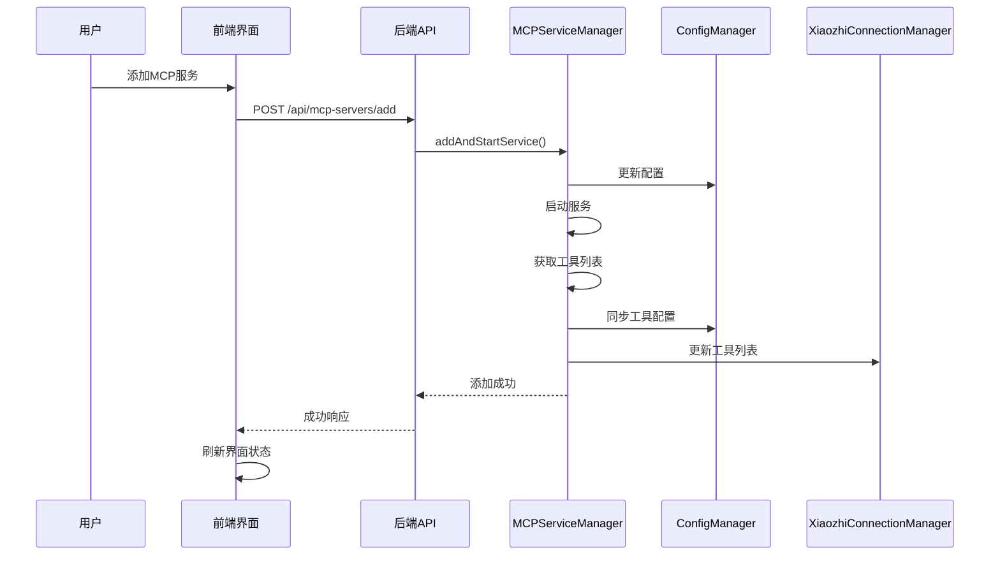
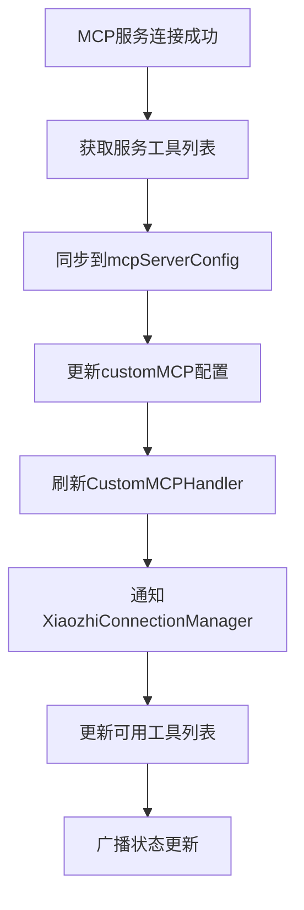
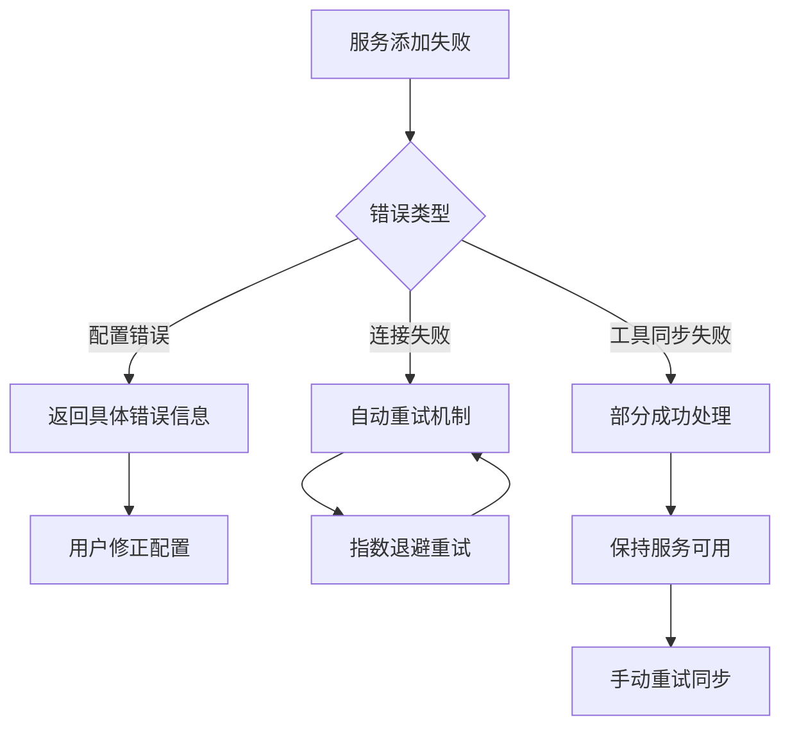

# 小智客户端动态 MCP 服务管理技术分析报告

## 执行摘要

本报告针对小智客户端实现动态 MCP 服务管理功能进行全面的技术分析。通过深入分析现有架构、技术可行性和实现方案，确认该功能在技术上是完全可行的，并提供了详细的实施方案和风险评估。

## 1. 现状分析

### 1.1 当前 MCP 服务管理机制

**架构组件：**
- **MCPServiceManager** (`src/services/MCPServiceManager.ts`): 核心服务管理器，负责管理多个 MCP 服务的生命周期
- **ConfigManager** (`src/configManager.ts`): 配置文件管理，支持动态配置更新和事件通知
- **WebServer** (`src/WebServer.ts`): Web 服务器，提供 HTTP API 和 WebSocket 实时通信
- **XiaozhiConnectionManager** (`src/services/XiaozhiConnectionManager.ts`): 小智接入点连接管理器

**现有功能：**
- ✅ 支持多种传输协议（WebSocket、HTTP、Stdio）
- ✅ 完整的服务生命周期管理（启动、停止、监控）
- ✅ 事件驱动的架构设计
- ✅ 配置文件热更新机制
- ✅ 工具同步和缓存管理

### 1.2 Web 界面与后端交互方式

**API 接口：**
- `PUT /api/config` - 更新配置
- `GET /api/config/mcp-servers` - 获取 MCP 服务器列表
- `POST /api/config/reload` - 重新加载配置
- `GET /api/tools/list` - 获取工具列表
- `POST /api/services/restart` - 重启服务

**WebSocket 实时通信：**
- 配置更新广播
- 服务状态实时通知
- 心跳检测和状态监控

### 1.3 配置文件读写和同步机制

**配置管理特性：**
- 支持 JSON5/JSONC/JSON 多种格式
- 注释保留功能
- 原子性写入保证
- 事件驱动的配置同步
- 并发控制机制

**工具同步机制：**
- ToolSyncManager 负责工具配置同步
- 自动将启用的 MCP 工具同步到 customMCP 配置
- 双写机制保证数据一致性

## 2. 技术可行性评估

### 2.1 动态添加和连接 MCP 服务 - ★★★★★ (完全可行)

**现有基础：**
- MCPServiceManager 已具备完整的动态服务管理能力
- 支持运行时添加、启动、停止服务
- 事件驱动的连接管理机制

**实现路径：**
- 利用现有的 `addServiceConfig()` 和 `startService()` 方法
- 通过事件总线监听连接状态变化
- 无需修改核心架构

### 2.2 实时配置同步 - ★★★★★ (完全可行)

**现有基础：**
- ConfigManager 支持动态配置更新
- 事件总线机制实现模块间通信
- WebSocket 实时通知机制

**实现路径：**
- 扩展现有的配置更新 API
- 利用事件总线同步配置变更
- 通过 WebSocket 通知前端

### 2.3 接入点连接重建 - ★★★★☆ (高度可行)

**现有基础：**
- XiaozhiConnectionManager 支持多端点管理
- 具备健康检查和重连机制
- 工具列表动态更新能力

**实现路径：**
- 调用现有的工具更新方法
- 利用健康检查机制验证连接
- 支持渐进式连接重建

## 3. 实现方案

### 3.1 核心实现步骤

#### 第一阶段：后端 API 增强

1. **扩展 ConfigApiHandler**
```typescript
// 新增 API 端点
POST /api/mcp-servers/add
POST /api/mcp-servers/remove
POST /api/mcp-servers/test-connection
GET /api/mcp-servers/:serviceName/status
```

2. **增强 MCPServiceManager**
```typescript
// 新增方法
async addAndStartService(serviceName: string, config: MCPServiceConfig): Promise<void>
async testServiceConnection(config: MCPServiceConfig): Promise<boolean>
async getServiceStatus(serviceName: string): Promise<ServiceStatus>
```

3. **优化工具同步流程**
```typescript
// 增强工具同步
async syncToolsAfterServiceAdded(serviceName: string): Promise<void>
async updateXiaozhiConnectionTools(): Promise<void>
```

#### 第二阶段：前端界面增强

1. **新增动态服务管理组件**
```typescript
// McpServerDynamicManager.tsx
- 服务配置表单
- 连接测试功能
- 实时状态显示
- 工具同步进度
```

2. **优化用户体验**
- 添加服务的引导式流程
- 实时连接状态反馈
- 错误处理和重试机制
- 工具同步进度显示

#### 第三阶段：连接管理优化

1. **增强 XiaozhiConnectionManager**
```typescript
// 新增方法
async updateToolsWithoutReconnect(): Promise<void>
async partialReconnect(endpoints: string[]): Promise<void>
```

2. **实现智能重连策略**
- 渐进式工具更新
- 连接状态保持
- 失败回滚机制

### 3.2 详细技术方案

#### 3.2.1 服务添加流程



#### 3.2.2 工具同步机制



#### 3.2.3 错误处理策略



### 3.3 关键技术实现

#### 3.3.1 并发控制机制

```typescript
class ServiceOperationManager {
  private operationLocks: Map<string, Promise<void>> = new Map();
  
  async withLock<T>(operation: string, fn: () => Promise<T>): Promise<T> {
    if (this.operationLocks.has(operation)) {
      throw new Error(`Operation ${operation} is already in progress`);
    }
    
    const promise = fn();
    this.operationLocks.set(operation, promise);
    
    try {
      return await promise;
    } finally {
      this.operationLocks.delete(operation);
    }
  }
}
```

#### 3.3.2 事务性工具同步

```typescript
async syncToolsTransaction(serviceName: string): Promise<void> {
  const backupConfig = this.getCurrentConfig();
  
  try {
    // 1. 获取新工具列表
    const newTools = await this.getServiceTools(serviceName);
    
    // 2. 更新配置
    this.updateServerToolsConfig(serviceName, newTools);
    
    // 3. 同步到 customMCP
    await this.syncToCustomMCP(serviceName, newTools);
    
    // 4. 刷新处理器
    await this.refreshCustomMCPHandler();
    
  } catch (error) {
    // 回滚配置
    this.restoreConfig(backupConfig);
    throw error;
  }
}
```

## 4. 风险评估

### 4.1 技术风险

#### 4.1.1 高风险项
- **服务连接失败**: 已有重试机制，影响可控
- **工具同步冲突**: 通过并发控制解决
- **配置文件损坏**: 原子性写入保证

#### 4.1.2 中风险项
- **性能影响**: 新增服务可能影响性能，需要监控
- **内存使用**: 长时间运行可能内存泄漏，需要测试
- **并发操作**: 多用户同时操作可能导致冲突

#### 4.1.3 低风险项
- **界面响应**: 通过异步操作优化
- **数据一致性**: 事务性操作保证
- **向后兼容**: 现有功能不受影响

### 4.2 缓解策略

1. **渐进式部署**: 分阶段实施，每个阶段充分测试
2. **监控机制**: 添加性能监控和告警
3. **回滚方案**: 保留现有机制作为备选
4. **用户教育**: 提供清晰的错误提示和操作指导

### 4.3 向后兼容性

- ✅ 现有配置格式保持不变
- ✅ 现有 API 接口保持兼容
- ✅ 现有功能不受影响
- ✅ 支持手动和自动两种模式

## 5. 实施计划

### 5.1 第一阶段：基础功能实现 (2-3周)

**目标：** 实现基本的动态服务添加功能

**任务：**
1. 扩展后端 API 接口
2. 增强 MCPServiceManager 功能
3. 实现基础的前端界面
4. 集成测试

### 5.2 第二阶段：优化完善 (1-2周)

**目标：** 完善错误处理和用户体验

**任务：**
1. 添加错误处理机制
2. 优化用户界面交互
3. 实现连接测试功能
4. 性能优化

### 5.3 第三阶段：稳定性和监控 (1周)

**目标：** 确保功能稳定可靠

**任务：**
1. 添加监控和日志
2. 压力测试
3. 文档完善
4. 部署上线

## 6. 成功指标

### 6.1 功能指标
- ✅ 用户无需重启即可添加 MCP 服务
- ✅ 工具列表自动同步更新
- ✅ 小智接入点连接保持稳定
- ✅ 配置文件正确更新

### 6.2 性能指标
- 服务添加响应时间 < 5秒
- 工具同步完成时间 < 10秒
- 系统内存使用增长 < 10%
- 并发操作支持 > 10个

### 6.3 可靠性指标
- 操作成功率 > 95%
- 错误恢复成功率 > 90%
- 配置文件完整性 100%
- 向后兼容性 100%

## 7. 结论

经过全面的技术分析，**动态 MCP 服务管理功能在技术上是完全可行的**。项目现有的架构设计为实现该功能提供了良好的基础，主要优势包括：

1. **架构优势**: 模块化设计、事件驱动架构、完善的配置管理
2. **技术基础**: 现有组件已具备大部分所需功能
3. **实现路径**: 清晰的分阶段实施方案，风险可控
4. **兼容性**: 完全向后兼容，不影响现有功能

**建议：** 按照三阶段实施计划推进项目，优先实现基础功能，逐步优化完善，确保功能的稳定性和可靠性。

---

**报告生成时间**: 2025-01-23  
**分析范围**: 小智客户端动态 MCP 服务管理功能  
**技术栈**: TypeScript, Node.js, Hono, MCP Protocol