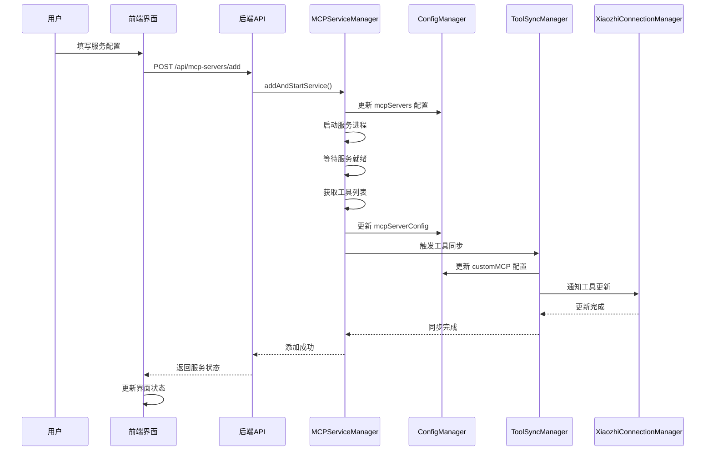
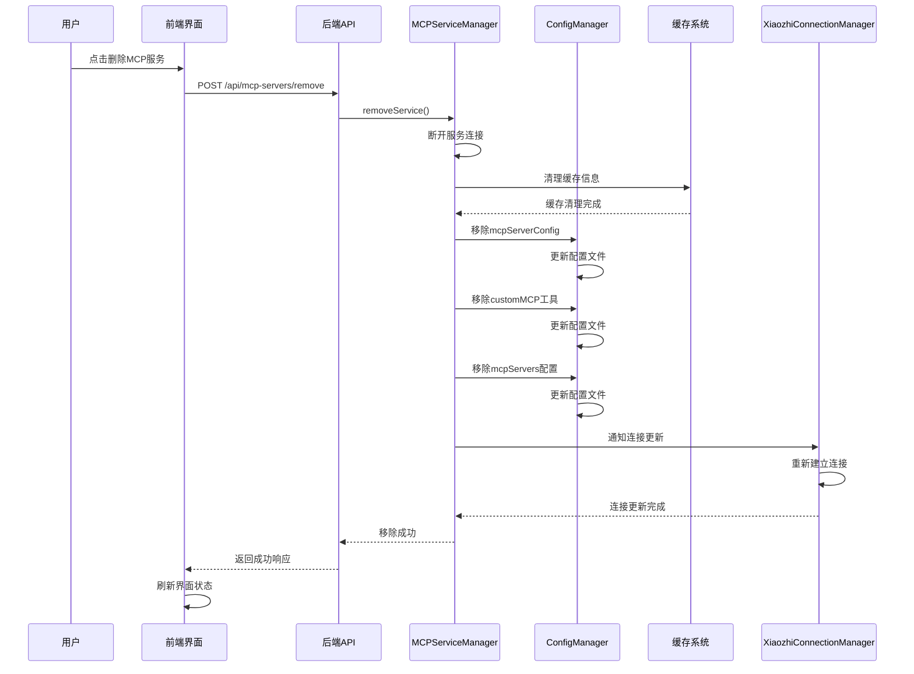

# 动态 MCP 服务管理技术方案

## 1. 方案概述

### 1.1 项目背景

基于技术分析报告的结论，本项目旨在实现小智客户端的动态 MCP 服务管理功能，使用户能够在不重启服务的情况下，通过 Web 界面动态添加、管理和连接 MCP 服务。

### 1.2 技术目标

- **零重启服务管理**: 实现运行时动态添加 MCP 服务
- **实时工具同步**: 自动同步新服务的工具到配置文件
- **连接保持**: 在添加服务时保持现有小智接入点连接稳定
- **完整的服务移除**: 实现彻底的配置清理和连接重连

### 1.3 技术架构

基于现有的模块化架构，扩展以下核心组件：
- **MCPServiceManager**: 增强服务管理能力
- **ConfigApiHandler**: 新增动态服务管理 API
- **ToolSyncManager**: 优化工具同步流程
- **XiaozhiConnectionManager**: 增强连接管理

## 2. 核心功能实施计划

### 2.1 实施策略

基于技术分析报告的结论，动态MCP服务管理功能的核心能力可以通过核心功能实现完全满足。项目没有性能瓶颈或性能指标要求，重点在于实现高质量的、优雅的核心功能代码。

**核心功能确认：**
- ✅ Web界面动态添加MCP服务
- ✅ Web界面动态移除MCP服务
- ✅ 实时工具同步到配置文件
- ✅ 小智接入点连接保持稳定
- ✅ 完整的配置清理和重连机制

### 2.2 核心功能实现 (3-4周)

**目标**: 实现完整的动态服务添加和移除功能
**重点**: 后端 API 增强、服务管理器优化、工具同步、前端API集成

### 2.3 任务分解

#### 2.3.1 后端 API 增强 (1.5周)

**2.3.1.1 扩展 ConfigApiHandler**
```typescript
// 新增 API 端点设计
POST /api/mcp-servers/add
POST /api/mcp-servers/remove
POST /api/mcp-servers/test-connection
GET /api/mcp-servers/:serviceName/status
GET /api/mcp-servers/:serviceName/tools
PUT /api/mcp-servers/:serviceName/config
```

**具体实现步骤**:
1. 创建 `MCPServerApiHandler` 类，继承基础 API 处理器
2. 实现服务添加接口，包含参数验证和错误处理
3. 实现服务删除接口，支持优雅关闭
4. 实现连接测试接口，支持多种传输协议
5. 实现状态查询接口，返回详细服务状态
6. 实现工具查询接口，支持分页和过滤
7. 实现配置更新接口，支持热更新

**API 设计规范**:
```typescript
// 服务添加请求
interface AddMCPServerRequest {
  serviceName: string;
  config: MCPServiceConfig;
  autoStart?: boolean;
  syncTools?: boolean;
}

// 服务状态响应
interface MCPServerStatus {
  serviceName: string;
  status: 'running' | 'stopped' | 'error' | 'connecting';
  uptime?: number;
  lastError?: string;
  toolsCount?: number;
  memoryUsage?: number;
}
```

**2.3.1.2 增强 MCPServiceManager**
```typescript
// 新增方法设计
async addAndStartService(serviceName: string, config: MCPServiceConfig): Promise<void>
async removeService(serviceName: string, graceful?: boolean): Promise<void>
async testServiceConnection(config: MCPServiceConfig): Promise<ConnectionTestResult>
async getServiceStatus(serviceName: string): Promise<ServiceStatus>
async getServiceTools(serviceName: string): Promise<Tool[]>
async updateServiceConfig(serviceName: string, config: MCPServiceConfig): Promise<void>
```

**具体实现步骤**:
1. 扩展现有 `addServiceConfig` 方法，支持自动启动
2. 新增 `removeService` 方法，实现优雅关闭
3. 新增 `testServiceConnection` 方法，支持连接预检
4. 新增 `getServiceStatus` 方法，提供详细状态信息
5. 优化服务启动流程，增加重试机制
6. 实现服务健康检查，定期监控状态

**并发控制实现**:
```typescript
class ServiceOperationManager {
  private operationLocks: Map<string, Promise<void>> = new Map();
  private operationQueues: Map<string, Array<() => Promise<void>>> = new Map();

  async withLock<T>(operation: string, fn: () => Promise<T>): Promise<T> {
    if (this.operationLocks.has(operation)) {
      throw new Error(`Operation ${operation} is already in progress`);
    }

    const promise = fn();
    this.operationLocks.set(operation, promise);

    try {
      return await promise;
    } finally {
      this.operationLocks.delete(operation);
    }
  }

  async queueOperation(operation: string, fn: () => Promise<void>): Promise<void> {
    if (!this.operationQueues.has(operation)) {
      this.operationQueues.set(operation, []);
    }

    const queue = this.operationQueues.get(operation)!;
    return new Promise((resolve, reject) => {
      queue.push(async () => {
        try {
          await fn();
          resolve();
        } catch (error) {
          reject(error);
        }
      });

      this.processQueue(operation);
    });
  }
}
```

**2.3.1.3 优化工具同步流程**
```typescript
// 新增方法设计
async syncToolsAfterServiceAdded(serviceName: string): Promise<void>
async syncToolsAfterServiceRemoved(serviceName: string): Promise<void>
async updateXiaozhiConnectionTools(): Promise<void>
async rollbackToolsSync(serviceName: string): Promise<void>
```

**具体实现步骤**:
1. 扩展 `ToolSyncManager`，支持服务移除时的工具清理
2. 实现事务性工具同步，确保数据一致性
3. 优化同步性能，减少重复操作
4. 实现同步失败回滚机制
5. 增加同步进度跟踪和状态通知

**事务性同步实现**:
```typescript
async syncToolsTransaction(serviceName: string, operation: 'add' | 'remove'): Promise<void> {
  const backupConfig = this.createConfigBackup();

  try {
    if (operation === 'add') {
      await this.syncToolsAfterServiceAdded(serviceName);
    } else {
      await this.syncToolsAfterServiceRemoved(serviceName);
    }

    // 验证同步结果
    await this.validateToolsSync(serviceName, operation);

  } catch (error) {
    // 回滚到备份配置
    await this.restoreConfigBackup(backupConfig);
    throw new ToolsSyncError(`工具同步失败: ${error.message}`, { serviceName, operation });
  }
}
```

#### 2.3.2 前端API集成 (0.5周)

**2.3.2.1 增强现有 API 服务**
```typescript
// 扩展 api.ts 中的方法
async addMCPServer(config: MCPServerConfig): Promise<ApiResponse>
async removeMCPServer(serviceName: string): Promise<ApiResponse>
async testConnection(config: MCPServerConfig): Promise<ConnectionTestResult>
async getServerStatus(serviceName: string): Promise<MCPServerStatus>
```

**具体实现步骤**:
1. 在现有 `McpServerList.tsx` 组件中集成新增的 API 方法
2. 实现服务添加逻辑调用，处理成功/失败响应
3. 实现服务移除逻辑调用，确保正确处理状态更新
4. 添加连接测试功能的前端调用逻辑
5. 确保所有 API 调用都有适当的错误处理和用户反馈

**前端调整重点**:
- **避免UI改动**: 保持现有界面结构，不新增组件或修改布局
- **逻辑集成**: 在现有删除按钮和功能基础上，集成新的移除服务API
- **状态管理**: 利用现有的状态管理机制，处理服务列表更新
- **错误处理**: 在现有错误处理框架中添加对新增API的响应处理

#### 2.3.3 集成测试 (1周)

**2.3.3.1 单元测试**
- MCPServiceManager 测试用例
- ToolSyncManager 测试用例
- 新增 API 端点测试用例
- 并发控制机制测试用例

**2.3.3.2 集成测试**
- 端到端服务添加流程测试
- 工具同步一致性测试
- 错误恢复机制测试
- 性能基准测试

### 2.4 技术实现细节

#### 2.4.1 服务添加流程



#### 2.4.2 服务移除完整流程



#### 2.4.3 配置清理顺序

```typescript
// MCP服务移除时的配置清理流程
async removeMCPServiceCompletely(serviceName: string): Promise<void> {
  // 1. 断开服务连接
  await this.disconnectService(serviceName);
  
  // 2. 清理缓存信息 (xiaozhi.cache.json)
  await this.clearServiceCache(serviceName);
  
  // 3. 移除 mcpServerConfig 配置
  await this.removeServerToolsConfig(serviceName);
  
  // 4. 移除 customMCP 数据
  await this.removeCustomMCPTools(serviceName);
  
  // 5. 移除 mcpServers 配置
  await this.removeServerConfig(serviceName);
  
  // 6. 重新建立连接
  await this.reconnectXiaozhiEndpoints();
}
```

#### 2.4.4 错误处理策略

### 2.5 验收标准

#### 2.5.1 功能验收标准
- ✅ 用户可以通过 Web 界面添加 MCP 服务
- ✅ 服务添加后自动启动并连接
- ✅ 工具列表自动同步到配置文件
- ✅ 小智接入点连接保持稳定
- ✅ 支持服务删除和优雅关闭
- ✅ 提供连接测试功能

**移除服务专项验收标准**：
- ✅ 用户可以通过 Web 界面移除 MCP 服务
- ✅ 服务移除后自动断开连接
- ✅ 缓存信息完全清理 (xiaozhi.cache.json)
- ✅ mcpServerConfig 配置完全移除
- ✅ customMCP 数据完全移除
- ✅ mcpServers 配置完全移除
- ✅ 重新连接后工具不再可用

#### 2.5.2 性能验收标准
- 服务添加响应时间 < 5秒
- 工具同步完成时间 < 10秒
- 内存使用增长 < 50MB
- 支持 5 个并发服务添加操作

#### 2.5.3 可靠性验收标准
- 服务添加成功率 > 95%
- 工具同步一致性 100%
- 错误恢复成功率 > 90%
- 无内存泄漏

## 3. 测试环境和验证方法

### 3.1 测试环境配置

**测试应用位置：** `/Users/nemo/github/shenjingnan/xiaozhi-client/tmp/test-app`
- 开发完成后，在此目录使用 `xiaozhi start` 命令启动服务进行测试

**可用的MCP服务配置：**
```json
{
  "mcpServers": {
    "calculator": {
      "command": "node",
      "args": ["./mcpServers/calculator.js"]
    },
    "datetime": {
      "command": "node",
      "args": ["./mcpServers/datetime.js"]
    }
  }
}
```

### 3.2 测试场景设计

**初始状态：**
- 当前 `/Users/nemo/github/shenjingnan/xiaozhi-client/tmp/test-app/xiaozhi.config.json` 中只配置了 `calculator` 服务
- 使用 `datetime` 服务作为动态添加/移除的测试对象

**测试场景：**
1. **服务添加测试**：
   - 通过 Web 界面动态添加 `datetime` 服务
   - 验证服务连接状态和工具同步
   - 确认小智接入点正确获取新增工具

2. **服务移除测试**：
   - 通过 Web 界面移除 `datetime` 服务
   - 验证配置文件完全清理
   - 确认小智接入点不再包含已移除工具

3. **配置完整性测试**：
   - 验证 `mcpServers` 配置正确更新
   - 验证 `mcpServerConfig` 配置正确同步
   - 验证 `customMCP` 配置正确维护
   - 验证缓存信息正确清理

### 3.3 验证工具

**验证脚本：** `/Users/nemo/github/shenjingnan/xiaozhi-client/test-xiaozhi-mcp-endpoint-tools-list.js`

**验证方法：**
1. **添加服务验证**：
   ```bash
   # 在测试应用目录启动服务
   cd /Users/nemo/github/shenjingnan/xiaozhi-client/tmp/test-app
   xiaozhi start
   
   # 通过 Web 界面添加 datetime 服务
   
   # 执行验证脚本
   node /Users/nemo/github/shenjingnan/xiaozhi-client/test-xiaozhi-mcp-endpoint-tools-list.js
   ```
   
   **预期结果**：MCP服务添加后，小智服务端正确获取到对应的工具列表，包括：
   - `datetime__get_current_time`
   - `datetime__get_current_date`
   - `datetime__format_datetime`
   - `datetime__add_time`

2. **移除服务验证**：
   ```bash
   # 通过 Web 界面移除 datetime 服务
   
   # 执行验证脚本
   node /Users/nemo/github/shenjingnan/xiaozhi-client/test-xiaozhi-mcp-endpoint-tools-list.js
   ```
   
   **预期结果**：MCP服务移除后，小智服务端正确移除了对应的工具列表，仅保留：
   - `calculator__calculator`

### 3.4 配置文件验证

**验证 `xiaozhi.config.json` 文件状态：**

1. **服务添加后验证**：
   ```json
   {
     "mcpServers": {
       "calculator": { ... },
       "datetime": { ... }
     },
     "mcpServerConfig": {
       "calculator": { ... },
       "datetime": { ... }
     },
     "customMCP": {
       "tools": [
         { "name": "calculator__calculator" },
         { "name": "datetime__get_current_time" },
         { "name": "datetime__get_current_date" },
         { "name": "datetime__format_datetime" },
         { "name": "datetime__add_time" }
       ]
     }
   }
   ```

2. **服务移除后验证**：
   ```json
   {
     "mcpServers": {
       "calculator": { ... }
     },
     "mcpServerConfig": {
       "calculator": { ... }
     },
     "customMCP": {
       "tools": [
         { "name": "calculator__calculator" }
       ]
     }
   }
   ```

### 3.5 测试验收标准

**功能验收标准：**
- ✅ Web界面可以成功添加 `datetime` 服务
- ✅ 服务添加后工具列表自动同步到小智服务端
- ✅ Web界面可以成功移除 `datetime` 服务
- ✅ 服务移除后工具列表从小智服务端完全移除
- ✅ 配置文件在服务添加/移除后保持完整性和一致性

**配置清理验收标准：**
- ✅ 服务移除后，`mcpServers` 配置中不再包含该服务
- ✅ 服务移除后，`mcpServerConfig` 配置中不再包含该服务
- ✅ 服务移除后，`customMCP` 中不再包含该服务的工具
- ✅ 缓存文件中不再包含该服务的相关信息
- ✅ 重连后服务状态正确，无残留配置

## 4. 风险评估和应对策略

### 4.1 技术风险

#### 4.1.1 高风险项
- **服务连接失败**: 已有重试机制，影响可控
- **工具同步冲突**: 通过并发控制解决
- **配置文件损坏**: 原子性写入保证

**应对策略**:
1. 实现指数退避重试机制
2. 使用分布式锁控制并发操作
3. 增加配置文件备份和恢复功能

#### 4.1.2 中风险项
- **性能影响**: 新增服务可能影响性能
- **内存使用**: 长时间运行可能内存泄漏
- **并发操作**: 多用户同时操作可能导致冲突

**应对策略**:
1. 实现性能监控和自动扩容
2. 定期进行内存使用检查和优化
3. 实现操作队列和限流机制

#### 4.1.3 低风险项
- **界面响应**: 通过异步操作优化
- **数据一致性**: 事务性操作保证
- **向后兼容**: 现有功能不受影响

**应对策略**:
1. 使用异步编程模型
2. 实现事务和数据校验
3. 保持 API 兼容性

### 4.2 项目风险

#### 4.2.1 进度风险
- **需求变更**: 可能导致范围扩大
- **技术难点**: 某些技术实现可能超出预期
- **资源不足**: 开发资源可能不足

**应对策略**:
1. 严格控制需求变更流程
2. 提前进行技术预研和原型验证
3. 合理分配资源，设置缓冲时间

#### 4.2.2 质量风险
- **测试覆盖**: 某些场景可能测试不足
- **性能问题**: 高并发场景可能出现性能瓶颈
- **用户体验**: 界面可能不够友好

**应对策略**:
1. 建立完善的测试体系
2. 进行充分的性能测试和优化
3. 进行用户调研和体验优化

## 5. 时间估算和资源需求

### 5.1 时间估算

| 阶段 | 任务 | 预估时间 | 负责人 |
|------|------|----------|--------|
| 核心功能 | 后端 API 增强 | 1.5周 | 后端开发 |
| 核心功能 | 前端 API 集成 | 0.5周 | 前端开发 |
| 核心功能 | 集成测试 | 1周 | 测试工程师 |
| **总计** | | **3周** | |

### 5.2 资源需求

#### 5.2.1 人力资源
- 后端开发工程师: 1人
- 前端开发工程师: 1人
- 测试工程师: 1人

#### 5.2.2 技术资源
- 开发环境: Node.js 18+, TypeScript 5+
- 测试环境: Docker, CI/CD
- 测试应用: `/Users/nemo/github/shenjingnan/xiaozhi-client/tmp/test-app`

#### 5.2.3 硬件资源
- 开发服务器: 4核8G × 1
- 测试服务器: 4核8G × 1

## 6. 成功指标和验收标准

### 6.1 功能指标
- ✅ 用户无需重启即可添加 MCP 服务
- ✅ 工具列表自动同步更新
- ✅ 小智接入点连接保持稳定
- ✅ 支持服务删除和配置更新
- ✅ 服务移除后配置完全清理
- ✅ 缓存信息自动清理
- ✅ 连接重连后工具状态正确

### 6.2 性能指标
- 服务添加响应时间 < 3秒
- 服务移除响应时间 < 3秒
- 工具同步完成时间 < 5秒
- 配置清理完成时间 < 2秒
- 系统内存使用增长 < 20MB
- 并发操作支持 > 5个

### 6.3 可靠性指标
- 操作成功率 > 95%
- 错误恢复成功率 > 90%
- 配置文件完整性 100%
- 系统可用性 > 99.9%
- 数据一致性 100%

### 6.4 测试验证指标
- 测试场景覆盖率 100%
- 配置文件验证通过率 100%
- 工具同步验证通过率 100%
- 缓存清理验证通过率 100%
- 小智服务端工具列表验证通过率 100%

## 7. 结论

本技术方案基于现有架构设计，专注于实现核心的动态 MCP 服务管理功能。通过充分利用现有的模块化架构和事件驱动机制，可以在最小化架构改动的前提下，实现完整的动态服务添加和移除功能。

**方案优势**:
- 基于现有架构，风险可控
- 聚焦核心功能，开发周期短
- 完善的测试验证体系
- 详细的错误处理和恢复机制
- 完整的服务移除和配置清理流程

**建议**:
严格按照技术方案执行，重点关注核心功能的实现和质量。确保每个功能都经过充分的测试验证，保证功能的稳定性和可靠性。

---

**方案编写时间**: 2025-01-23
**技术栈**: TypeScript, Node.js, React, Hono, MCP Protocol
**预计开始时间**: 待定
**预计完成时间**: 3周