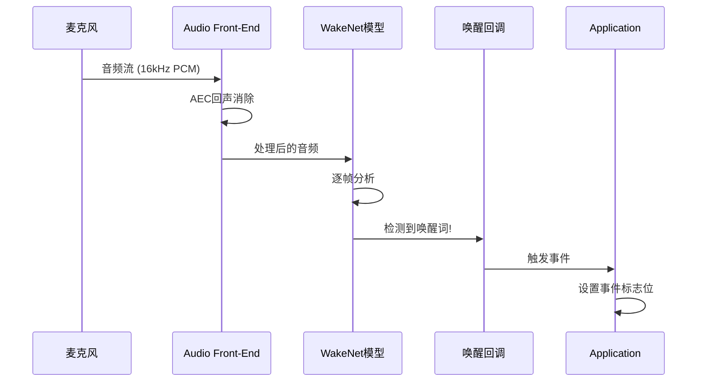
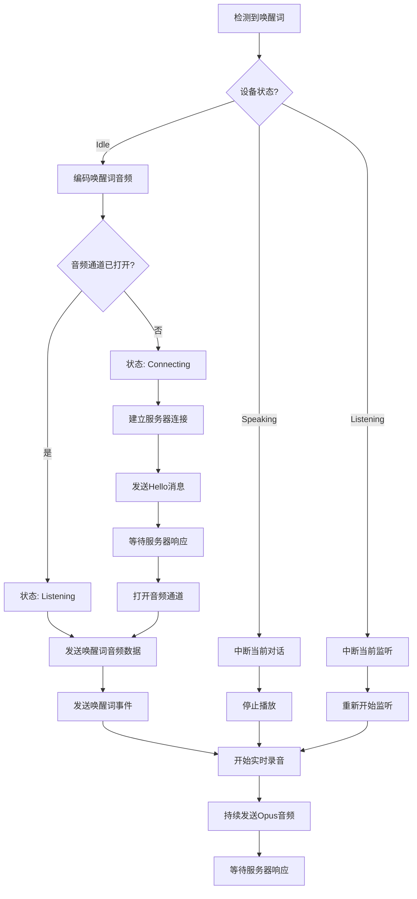

# 小智ESP32唤醒词"你好小智"执行流程与服务端通信分析报告

## 目录
1. [整体架构概述](#一整体架构概述)
2. [唤醒词检测机制](#二唤醒词检测机制)
3. [唤醒后的执行流程](#三唤醒后的执行流程)
4. [服务端通信协议](#四服务端通信协议)
5. [数据结构与接口定义](#五数据结构与接口定义)
6. [关键文件路径](#六关键文件路径)

---

## 一、整体架构概述

小智ESP32项目采用**分层架构**实现语音交互：

```
┌────────────────────────────────────────────────────────┐
│                    Application Layer                   │
│                   (application.cc)                     │
│  ┌──────────────┐  ┌──────────────┐  ┌──────────────┐  │
│  │  Wake Word   │→ │  Audio       │→ │   Protocol   │  │
│  │   Handler    │  │  Service     │  │   (WS/MQTT)  │  │
│  └──────────────┘  └──────────────┘  └──────────────┘  │
└────────────────────────────────────────────────────────┘
                            ↓
┌────────────────────────────────────────────────────────┐
│                   Middleware Layer                     │
│                  (ESP-SR Library)                      │
│  ┌──────────────┐  ┌──────────────┐  ┌──────────────┐  │
│  │  WakeNet     │  │  MultiNet    │  │     AFE      │  │
│  │   Model      │  │   Model      │  │  (Front-End) │  │
│  └──────────────┘  └──────────────┘  └──────────────┘  │
└────────────────────────────────────────────────────────┘
                            ↓
┌────────────────────────────────────────────────────────┐
│                     Hardware Layer                     │
│                   (ESP32 + AudioCodec)                 │
└────────────────────────────────────────────────────────┘
```

**核心组件**：
- **AudioService**: 音频处理服务，负责麦克风输入、唤醒词检测、音频编码
- **Protocol**: 通信协议抽象层，支持WebSocket和MQTT两种协议
- **Application**: 应用层，协调各组件工作

---

## 二、唤醒词检测机制

### 2.1 模型选择策略

项目根据芯片型号自动选择最优的唤醒词检测方案：

| 芯片型号 | PSRAM | 推荐方案 | 模型类型 | 特性 |
|---------|-------|---------|---------|------|
| ESP32-C3/C5/C6 | - | EspWakeWord | Wakenet | 轻量级，无AFE |
| ESP32-S3/P4 | ✅ | AfeWakeWord | Wakenet + AFE | 支持回声消除 |
| ESP32-S3/P4 | ✅ | CustomWakeWord | MultiNet | 自定义唤醒词 |

### 2.2 默认唤醒词配置

**模型名称**: `wn9_nihaoxiaozhi_tts`

**配置位置**:
```
/Users/nemo/github/shenjingnan/xiaozhi-esp32/sdkconfig.defaults.esp32
```

```ini
CONFIG_SR_WN_WN9_NIHAOXIAOZHI_TTS=y
```

### 2.3 检测流程



### 2.4 唤醒词检测核心代码

**AfeWakeWord实现** (ESP32-S3为例):

```cpp
// 文件: main/audio/wake_words/afe_wake_word.cc:135-161

void AfeWakeWord::AudioDetectionTask() {
    while (true) {
        // 等待检测运行标志
        xEventGroupWaitBits(event_group_, DETECTION_RUNNING_EVENT, ...);

        // 从AFE获取检测结果
        auto res = afe_iface_->fetch_with_delay(afe_data_, portMAX_DELAY);

        // 存储音频数据（用于后续发送到服务器）
        StoreWakeWordData(res->data, res->data_size / sizeof(int16_t));

        // 检测到唤醒词
        if (res->wakeup_state == WAKENET_DETECTED) {
            Stop(); // 停止检测

            // 获取唤醒词索引
            last_detected_wake_word_ = wake_words_[res->wakenet_model_index - 1];

            // 触发回调函数
            if (wake_word_detected_callback_) {
                wake_word_detected_callback_(last_detected_wake_word_);
            }
        }
    }
}
```

### 2.5 事件触发链路

```cpp
// 1. AudioService注册回调
// 文件: main/audio/audio_service.cc:80-82
callbacks.on_wake_word_detected = [this](const std::string& wake_word) {
    xEventGroupSetBits(event_group_, MAIN_EVENT_WAKE_WORD_DETECTED);
};

// 2. Application监听事件
// 文件: main/application.cc:228-230
auto bits = xEventGroupWaitBits(event_group_, ...);
if (bits & MAIN_EVENT_WAKE_WORD_DETECTED) {
    HandleWakeWordDetectedEvent();
}
```

---

## 三、唤醒后的执行流程

### 3.1 完整流程图



### 3.2 唤醒词处理函数

```cpp
// 文件: main/application.cc:774-840

void Application::HandleWakeWordDetectedEvent() {
    auto state = GetDeviceState();
    auto wake_word = audio_service_.GetLastWakeWord();

    if (state == kDeviceStateIdle) {
        // === 空闲状态：开始新对话 ===

        // 1. 编码唤醒词音频为Opus格式
        audio_service_.EncodeWakeWord();

        // 2. 检查音频通道是否已打开
        if (!protocol_->IsAudioChannelOpened()) {
            SetDeviceState(kDeviceStateConnecting);

            // 3. 延迟执行（避免阻塞）
            Schedule([this, wake_word]() {
                ContinueWakeWordInvoke(wake_word);
            });
        } else {
            // 音频通道已打开，直接发送
            SendWakeWordData(wake_word);
        }
    }
    else if (state == kDeviceStateSpeaking) {
        // === 正在播放：中断当前对话 ===
        AbortSpeaking(kAbortReasonWakeWordDetected);
        // 重新开始监听
        protocol_->SendStartListening(GetDefaultListeningMode());
        audio_service_.EnableWakeWordDetection(true);
    }
    else if (state == kDeviceStateListening) {
        // === 正在监听：重新开始 ===
        protocol_->SendStartListening(GetDefaultListeningMode());
        audio_service_.EnableWakeWordDetection(true);
    }
}
```

### 3.3 唤醒词数据发送

```cpp
// 文件: main/application.cc:834-840

#if CONFIG_SEND_WAKE_WORD_DATA
    // 1. 发送唤醒词音频数据包
    while (auto packet = audio_service_.PopWakeWordPacket()) {
        protocol_->SendAudio(std::move(packet));
    }

    // 2. 发送唤醒词检测事件
    protocol_->SendWakeWordDetected(wake_word);

    // 3. 开始实时录音
    audio_service_.StartRecording();
#endif
```

---

## 四、服务端通信协议

### 4.1 双协议架构

小智ESP32支持两种通信协议：

| 协议 | 适用场景 | 音频传输 | 特点 |
|-----|---------|---------|------|
| **WebSocket** | 通用场景 | WebSocket连接 | 实时双向通信 |
| **MQTT + UDP** | 高并发场景 | MQTT信令 + UDP数据 | 低延迟、高效率 |

### 4.2 WebSocket协议详解

#### 4.2.1 连接配置

```cpp
// 文件: main/protocols/websocket_protocol.cc:85-87

// 从NVS读取配置（命名空间: "websocket"）
std::string url = settings.GetString("url");      // ws://或wss://地址
std::string token = settings.GetString("token");  // 认证令牌
int version = settings.GetInt("version");         // 协议版本 (1/2/3)
```

#### 4.2.2 连接流程

```
┌─────────────┐                                    ┌─────────────┐
│   ESP32     │                                    │   Server    │
└──────┬──────┘                                    └──────┬──────┘
       │                                                  │
       │  1. WebSocket Connect(url)                       │
       │────────────────────────────────────────────────> │
       │                                                  │
       │  2. 设置请求头                                    │
       │     - Authorization: Bearer <token>              │
       │     - Protocol-Version: <version>                │
       │     - Device-Id: <MAC地址>                       │
       │     - Client-Id: <设备UUID>                      │
       │                                                   │
       │  3. 发送Hello消息                                 │
       │─────────────────────────────────────────────────> │
       │                                                   │
       │                          4. Hello响应 (10秒超时)  │
       │<─────────────────────────────────────────────────│
       │                                                   │
       │  5. 开始发送音频数据                              │
       │─────────────────────────────────────────────────> │
       │                                                   │
       │  6. 接收服务器响应 (TTS/指令)                     │
       │<─────────────────────────────────────────────────│
```

#### 4.2.3 Hello消息格式

**客户端 → 服务器**:
```json
{
  "type": "hello",
  "version": 1,
  "features": {
    "aec": true,      // 支持回声消除
    "mcp": true       // 支持MCP协议
  },
  "transport": "websocket",
  "audio_params": {
    "format": "opus",
    "sample_rate": 16000,
    "channels": 1,
    "frame_duration": 60
  }
}
```

**服务器 → 客户端**:
```json
{
  "type": "hello",
  "transport": "websocket",
  "session_id": "会话唯一标识",
  "audio_params": {
    "sample_rate": 24000,
    "frame_duration": 60
  }
}
```

#### 4.2.4 音频数据协议

支持三种二进制协议版本：

**版本2协议** (推荐):
```c
// BinaryProtocol2 结构
struct __attribute__((packed)) {
    uint16_t version;       // 协议版本 = 2
    uint16_t type;          // 消息类型: 0=Opus, 1=JSON
    uint32_t reserved;      // 保留字段
    uint32_t timestamp;     // 时间戳(毫秒，用于AEC)
    uint32_t payload_size;  // 载荷大小
    uint8_t payload[];      // Opus音频数据
}
```

**版本3协议** (精简):
```c
struct __attribute__((packed)) {
    uint8_t type;           // 消息类型
    uint8_t reserved;       // 保留字段
    uint16_t payload_size;  // 载荷大小
    uint8_t payload[];      // Opus音频数据
}
```

**版本1**: 直接发送原始Opus数据，无协议头

### 4.3 MQTT + UDP协议详解

#### 4.3.1 连接配置

```cpp
// 文件: main/protocols/mqtt_protocol.cc:66-71

// 从NVS读取配置（命名空间: "mqtt"）
auto endpoint = settings.GetString("endpoint");     // MQTT代理地址
auto client_id = settings.GetString("client_id");   // 客户端ID
auto username = settings.GetString("username");     // 用户名
auto password = settings.GetString("password");     // 密码
int keepalive = settings.GetInt("keepalive");       // 保活间隔(默认240秒)
auto publish_topic = settings.GetString("publish_topic");  // 发布主题
```

#### 4.3.2 连接流程

```
┌─────────────┐                                    ┌─────────────┐
│   ESP32     │                                    │   Server    │
└──────┬──────┘                                    └──────┬──────┘
       │                                                   │
       │  1. MQTT Connect                                  │
       │─────────────────────────────────────────────────> │
       │                                                   │
       │  2. Publish Hello (publish_topic)                 │
       │─────────────────────────────────────────────────> │
       │                                                   │
       │                          3. Hello响应 (包含UDP配置)│
       │<─────────────────────────────────────────────────│
       │                                                   │
       │  4. 建立UDP连接                                   │
       │─────────────────────────────────────────────────> │
       │                                                   │
       │  5. 发送加密的UDP音频包                            │
       │─────────────────────────────────────────────────> │
```

#### 4.3.3 Hello消息格式

**客户端 → 服务器** (MQTT):
```json
{
  "type": "hello",
  "version": 3,
  "transport": "udp",
  "features": {
    "aec": true,
    "mcp": true
  },
  "audio_params": {
    "format": "opus",
    "sample_rate": 16000,
    "channels": 1,
    "frame_duration": 60
  }
}
```

**服务器 → 客户端** (MQTT):
```json
{
  "type": "hello",
  "transport": "udp",
  "session_id": "会话ID",
  "audio_params": {
    "sample_rate": 24000,
    "frame_duration": 60
  },
  "udp": {
    "server": "UDP服务器地址",
    "port": 端口号,
    "key": "AES加密密钥(十六进制)",
    "nonce": "加密随机数(十六进制)"
  }
}
```

#### 4.3.4 UDP音频包格式

**加密方式**: AES-CTR (128位密钥)

```c
// UDP包结构
struct __attribute__((packed)) {
    uint8_t type;           // 固定值 0x01
    uint8_t flags;          // 标志位
    uint16_t payload_len;   // 载荷长度 (网络字节序)
    uint32_t ssrc;          // 同步源标识符
    uint32_t timestamp;     // 时间戳 (网络字节序)
    uint32_t sequence;      // 序列号 (递增，网络字节序)
    uint8_t payload[];      // AES-CTR加密的Opus数据
}
```

---

## 五、数据结构与接口定义

### 5.1 JSON消息类型

| 消息类型 | 方向 | 说明 |
|---------|------|------|
| `hello` | 双向 | 握手协议 |
| `goodbye` | 双向 | 会话结束 |
| `listen` | 客户端→服务器 | 监听状态变化 |
| `abort` | 客户端→服务器 | 中断当前请求 |
| `mcp` | 双向 | MCP协议消息 |

### 5.2 监听状态消息

```json
{
  "type": "listen",
  "state": "detect|start|stop",
  "mode": "auto|manual|realtime",
  "text": "你好小智"  // state=detect时包含唤醒词文本
}
```

**状态说明**:
- `detect`: 检测到唤醒词
- `start`: 开始监听
- `stop`: 停止监听

**模式说明**:
- `auto`: 自动模式（检测到唤醒词后自动开始）
- `manual`: 手动模式
- `realtime`: 实时模式

### 5.3 MCP (Model Context Protocol) 消息

MCP协议允许AI模型调用设备工具：

**工具调用请求**:
```json
{
  "jsonrpc": "2.0",
  "method": "tools/call",
  "params": {
    "name": "self.audio_speaker.set_volume",
    "arguments": {
      "volume": 50
    }
  },
  "id": 123
}
```

**工具调用响应**:
```json
{
  "jsonrpc": "2.0",
  "id": 123,
  "result": {
    "content": [
      {
        "type": "text",
        "text": "音量已设置为50"
      }
    ],
    "isError": false
  }
}
```

**内置工具列表**:

| 工具名 | 可见性 | 说明 |
|-------|-------|------|
| `self.get_device_status` | AI可见 | 获取设备状态 |
| `self.audio_speaker.set_volume` | AI可见 | 设置音量(0-100) |
| `self.screen.set_brightness` | AI可见 | 设置屏幕亮度 |
| `self.camera.take_photo` | AI可见 | 拍照并解释 |
| `self.get_system_info` | 用户可见 | 获取系统信息 |
| `self.reboot` | 用户可见 | 重启系统 |
| `self.upgrade_firmware` | 用户可见 | 固件升级 |

### 5.4 音频编解码参数

| 参数 | 上行(ESP32→服务器) | 下行(服务器→ESP32) |
|------|------------------|------------------|
| 编码格式 | Opus | Opus |
| 采样率 | 16000 Hz | 24000 Hz (可协商) |
| 声道数 | 1 (单声道) | 1 |
| 帧时长 | 60 ms | 60 ms |

### 5.5 超时与重连机制

| 超时类型 | WebSocket | MQTT |
|---------|-----------|------|
| Hello响应超时 | 10秒 | 10秒 |
| 音频通道超时 | 120秒 | 120秒 |
| 保活间隔 | - | 240秒 |
| 重连间隔 | 60秒 | 60秒 |

---

## 六、关键文件路径

### 6.1 唤醒词检测相关

| 文件路径 | 说明 |
|---------|------|
| `main/audio/wake_word.h` | 唤醒词基类定义 |
| `main/audio/wake_words/esp_wake_word.cc` | 基础唤醒词实现 |
| `main/audio/wake_words/afe_wake_word.cc` | AFE增强唤醒词实现 |
| `main/audio/wake_words/custom_wake_word.cc` | 自定义唤醒词实现 |

### 6.2 音频处理相关

| 文件路径 | 说明 |
|---------|------|
| `main/audio/audio_service.h` | 音频服务头文件 |
| `main/audio/audio_service.cc` | 音频服务实现 |
| `main/audio/encoder.h` | 音频编码器接口 |
| `main/audio/encoders/opus_encoder.cc` | Opus编码器实现 |

### 6.3 协议通信相关

| 文件路径 | 说明 |
|---------|------|
| `main/protocols/protocol.h` | 协议基类定义 |
| `main/protocols/protocol.cc` | 协议基类实现 |
| `main/protocols/websocket_protocol.h` | WebSocket协议头文件 |
| `main/protocols/websocket_protocol.cc` | WebSocket协议实现 |
| `main/protocols/mqtt_protocol.h` | MQTT协议头文件 |
| `main/protocols/mqtt_protocol.cc` | MQTT协议实现 |

### 6.4 应用层相关

| 文件路径 | 说明 |
|---------|------|
| `main/application.h` | 应用层头文件 |
| `main/application.cc` | 应用层实现 |
| `main/main.cc` | 主入口 |

### 6.5 配置文件

| 文件路径 | 说明 |
|---------|------|
| `sdkconfig.defaults.esp32` | ESP32默认配置 |
| `main/Kconfig.projbuild` | Kconfig配置定义 |
| `main/network_settings.cc` | NVS配置读取 |

---

## 总结

### 核心流程回顾

1. **唤醒词检测**: ESP-SR库的WakeNet模型在本地检测"你好小智"
2. **事件触发**: 检测成功后触发回调，设置事件标志位
3. **音频编码**: 将唤醒词音频编码为Opus格式
4. **建立连接**: 连接到服务器（WebSocket或MQTT+UDP）
5. **握手协议**: 交换Hello消息，协商参数
6. **发送数据**: 发送唤醒词音频和事件消息
7. **实时对话**: 持续发送用户语音，接收服务器响应

### 通信特点

- **双协议支持**: WebSocket和MQTT+UDP两种方案
- **加密传输**: UDP模式使用AES-CTR加密
- **MCP协议**: 支持AI模型调用设备工具
- **动态配置**: 通过OTA服务器动态下发配置
- **断线重连**: 自动重连机制保证可靠性
