# 小智ESP32配网与语音交互完整流程分析报告

## 目录
1. [项目概述](#1-项目概述)
2. [项目架构](#2-项目架构)
3. [WiFi配网流程分析](#3-wifi配网流程分析)
4. [设备激活与服务器连接](#4-设备激活与服务器连接)
5. [语音交互完整流程](#5-语音交互完整流程)
6. [通信协议详解](#6-通信协议详解)
7. [设备状态机](#7-设备状态机)
8. [核心代码位置索引](#8-核心代码位置索引)
9. [流程图与时序图](#9-流程图与时序图)

---

## 1. 项目概述

### 1.1 项目简介
**项目名称**: xiaozhi-esp32
**类型**: 基于ESP32系列芯片的AI聊天机器人
**编程框架**: ESP-IDF 5.4+
**编程语言**: C++17
**代码规模**: 262个源文件，211个头文件，核心代码约4000+行
**支持硬件**: 70+种ESP32开发板

### 1.2 核心功能
- **网络连接**: WiFi配网（热点/BluFi/声波）、4G网络（ML307）
- **语音交互**: 离线唤醒词检测、在线ASR+LLM+TTS
- **音频处理**: Opus编解码、AEC回声消除、VAD语音活动检测
- **显示系统**: OLED/LCD显示屏、LVGL图形库、表情动画
- **设备控制**: MCP协议实现智能家居控制

### 1.3 技术栈

| 组件 | 技术 | 库/接口 |
|------|------|---------|
| 唤醒词检测 | 神经网络 | ESP-SR WakeNet / MultiNet |
| AEC | 自适应滤波 | ESP-ADF AFE |
| 降噪 | 深度学习 | ESP-SR NSNet |
| VAD | 能量检测 + ML | ESP-SR VADNet |
| 音频编码 | Opus Codec | esp-opus |
| 加密 | DH + AES | mbedtls |

---

## 2. 项目架构

### 2.1 整体架构图

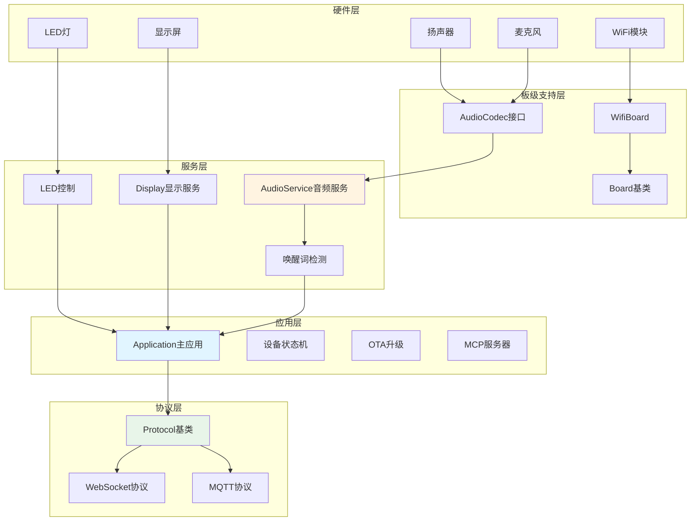

### 2.2 目录结构

```
xiaozhi-esp32/
├── main/                          # 主程序源代码
│   ├── application.cc/h           # 应用程序主入口
│   ├── device_state_machine.cc/h  # 设备状态机
│   ├── mcp_server.cc/h            # MCP服务器实现
│   ├── ota.cc/h                   # OTA升级功能
│   ├── settings.cc/h              # 配置管理
│   │
│   ├── audio/                     # 音频处理模块
│   │   ├── audio_service.cc/h     # 音频服务核心
│   │   ├── audio_codec.cc/h       # 音频编解码器接口
│   │   ├── codecs/                # 编解码器实现
│   │   ├── processors/            # 音频处理器（AFE）
│   │   ├── wake_words/            # 唤醒词检测
│   │   └── demuxer/               # OGG解封装
│   │
│   ├── protocols/                 # 通信协议模块
│   │   ├── protocol.cc/h
│   │   ├── websocket_protocol.cc/h
│   │   └── mqtt_protocol.cc/h
│   │
│   └── boards/                    # 硬件板级支持
│       ├── common/
│       │   ├── board.cc/h
│       │   ├── wifi_board.cc/h    # WiFi板级实现
│       │   ├── blufi.cpp/h        # BluFi配网
│       │   └── afsk_demod.cc/h    # 声波配网
│       └── [70+板型目录]
│
├── docs/                          # 文档
├── scripts/                       # 工具脚本
└── managed_components/            # ESP-IDF组件依赖
```

---

## 3. WiFi配网流程分析

### 3.1 配网方式总览

xiaozhi-esp32支持**三种**WiFi配网方式：

| 配网方式 | 技术原理 | 适用场景 | 配置选项 |
|---------|---------|---------|---------|
| **热点配网** | 设备创建AP热点，用户通过Web界面配置 | 通用场景 | `CONFIG_USE_HOTSPOT_WIFI_PROVISIONING` |
| **声波配网** | 通过音频信号传输WiFi凭据（AFSK调制） | 特殊场景 | `CONFIG_USE_ACOUSTIC_WIFI_PROVISIONING` |
| **BluFi配网** | 通过蓝牙BLE传输WiFi凭据 | 推荐方式 | `CONFIG_USE_ESP_BLUFI_WIFI_PROVISIONING` |

### 3.2 配网入口流程

**关键文件**: `main/boards/common/wifi_board.cc`

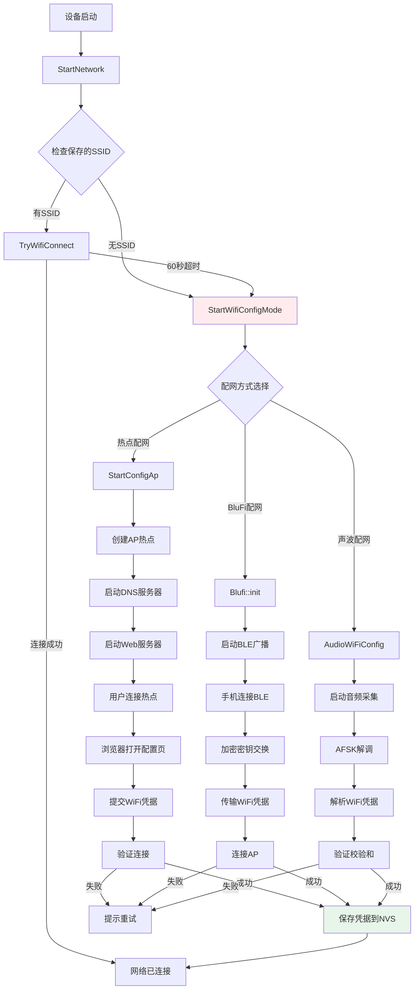

### 3.3 热点配网详细流程

**实现文件**: `managed_components/78__esp-wifi-connect/wifi_configuration_ap.cc`

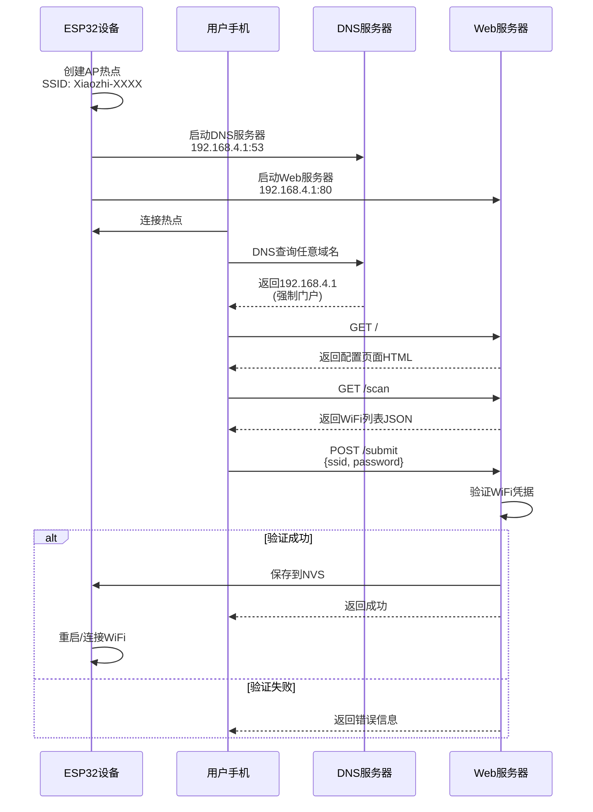

**关键API端点**:
- `GET /` - 配网页面（强制门户）
- `GET /scan` - 扫描周边WiFi
- `POST /submit` - 提交WiFi凭据
- `GET /saved/list` - 获取已保存的WiFi列表
- `POST /exit` - 退出配网模式

### 3.4 声波配网详细流程

**实现文件**: `main/boards/common/afsk_demod.cc`

**技术参数**:
- Mark频率: 1800Hz（代表数字1）
- Space频率: 1500Hz（代表数字0）
- 采样率: 6400Hz（降采样自16kHz）
- 比特率: 100 bps
- 调制方式: AFSK（音频频移键控）

```mermaid
flowchart LR
    subgraph 发送端（手机）
        A1[WiFi凭据] --> A2[添加校验和]
        A2 --> A3[添加起始/结束标识]
        A3 --> A4[AFSK调制]
        A4 --> A5[播放音频]
    end

    subgraph 传输介质
        A5 --> B1[空气传播]
    end

    subgraph 接收端（ESP32）
        B1 --> C1[麦克风采集]
        C1 --> C2[降采样到6.4kHz]
        C2 --> C3[Goertzel频率检测]
        C3 --> C4[比特流解码]
        C4 --> C5[查找起始标识]
        C5 --> C6[提取数据]
        C6 --> C7[验证校验和]
        C7 -->|成功| C8[解析SSID/Password]
        C7 -->|失败| C9[丢弃重试]
        C8 --> C10[保存到NVS]
    end

    style C7 fill:#ffebee
    style C8 fill:#e8f5e9
```

**数据帧格式**:
```
[起始标识 16bit][SSID\nPassword文本][校验和 8bit][结束标识 16bit]
```

**起始标识**: `0x01 0x02` (二进制: `00000001 00000010`)
**结束标识**: `0x03 0x04` (二进制: `00000011 00000100`)

**校验和算法**（简单累加和）:
```cpp
uint8_t CalculateChecksum(const std::string &text) {
    uint8_t checksum = 0;
    for (char character : text) {
        checksum += static_cast<uint8_t>(character);
    }
    return checksum;
}
```

### 3.5 BluFi配网详细流程

**实现文件**: `main/boards/common/blufi.cpp`

**安全机制**:
1. DH密钥交换（Diffie-Hellman）
2. AES-128-CFB加密
3. CRC-16校验

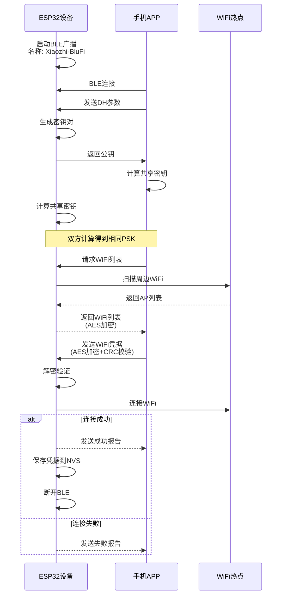

### 3.6 WiFi凭据存储

**实现文件**: `managed_components/78__esp-wifi-connect/ssid_manager.cc`

**NVS存储结构**:
```
命名空间: "wifi"
├── ssid: 第一个WiFi的SSID（默认连接）
├── password: 第一个WiFi的密码
├── ssid1: 第二个WiFi的SSID
├── password1: 第二个WiFi的密码
├── ...
└── ssid9/password9: 第十个WiFi
```

最多支持保存10个WiFi凭据，新添加的凭据会插入到列表开头作为默认连接。

---

## 4. 设备激活与服务器连接

### 4.1 激活流程时序图

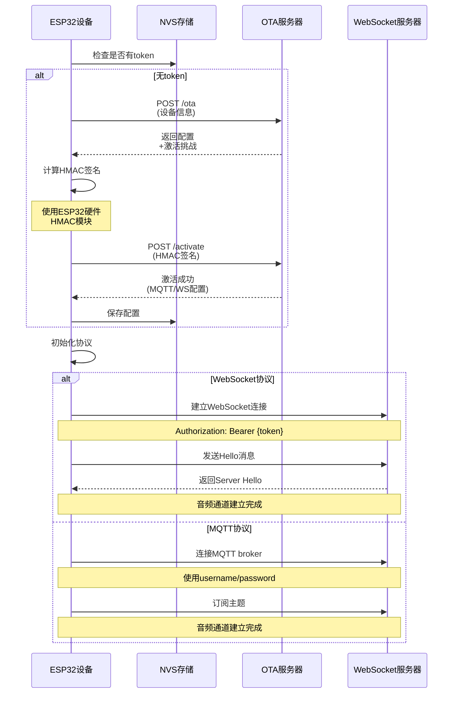

### 4.2 HTTP API端点

| 端点 | 方法 | 功能 |
|------|------|------|
| `/ota` | GET/POST | 检查版本、获取配置 |
| `/ota/activate` | POST | 设备激活 |

**激活请求头**:
```
Activation-Version: 2  (有序列号) 或 1 (无序列号)
Device-Id: AA:BB:CC:DD:EE:FF (MAC地址)
Client-Id: xxxxxxxx-xxxx-xxxx-xxxx-xxxxxxxxxxxx (UUID v4)
Serial-Number: 32字节序列号（如果有）
User-Agent: BOARD_NAME/version
```

**激活响应JSON**:
```json
{
    "activation": {
        "code": 200,
        "message": "OK",
        "challenge": "挑战字符串",
        "timeout_ms": 10000
    },
    "mqtt": {
        "endpoint": "broker:port",
        "client_id": "客户端ID",
        "username": "用户名",
        "password": "密码",
        "publish_topic": "发布主题",
        "keepalive": 240
    },
    "websocket": {
        "url": "wss://服务器地址",
        "token": "认证令牌",
        "version": 3
    },
    "server_time": {
        "timestamp": 1234567890,
        "timezone_offset": 28800
    },
    "firmware": {
        "version": "1.0.0",
        "url": "固件下载URL",
        "force": false
    }
}
```

### 4.3 设备标识

**MAC地址**: `esp_read_mac()` 从WiFi STA接口读取
**UUID v4**: 首次启动时生成，存储在NVS中
**序列号**: 从eFuse USER_DATA区读取32字节

### 4.4 心跳保活机制

**WebSocket保活**:
- 超时阈值: 120秒无数据接收
- 实现: 每次收到数据时更新`last_incoming_time_`

**MQTT保活**:
- Keep-Alive间隔: 默认240秒 (可配置)
- 重连间隔: 60秒

---

## 5. 语音交互完整流程

### 5.1 语音交互数据流图

```mermaid
flowchart TB
    subgraph 上行路径
        A1[麦克风] --> A2[I2S/PDM采集<br/>16kHz/48kHz]
        A2 --> A3[AudioInputTask<br/>10ms/160samples]
        A3 --> A4{检测模式}
        A4 -->|唤醒词检测| A5[WakeWord Feed]
        A4 -->|语音处理| A6[AudioProcessor Feed]

        A5 --> A7[ESP-SR WakeNet<br/>神经网络检测]
        A6 --> A8[AFE处理<br/>AEC/NS/VAD]

        A7 -->|检测到唤醒词| A9[触发回调]
        A8 --> A10[编码队列]

        A9 --> A11[缓存2秒PCM数据]
        A11 --> A10

        A10 --> A12[Opus编码<br/>60ms/VBR]
        A12 --> A13[发送队列]
    end

    subgraph 网络传输
        A13 --> B1[Protocol封装<br/>v2/v3]
        B1 --> B2[WebSocket/MQTT]
        B2 --> B3[云服务器]
    end

    subgraph 下行路径
        B3 --> C1[WebSocket/MQTT接收]
        C1 --> C2[Protocol解析]
        C2 --> C3[解码队列]

        C3 --> C4[Ogg解封装<br/>(如需要)]
        C4 --> C5[Opus解码<br/>24kHz]
        C5 --> C6[重采样]
        C6 --> C7[播放队列]

        C7 --> C8[AudioOutputTask]
        C8 --> C9[I2S输出]
        C9 --> C10[扬声器]
    end

    style A7 fill:#fff3e0
    style A8 fill:#e8eaf6
    style B3 fill:#e1f5fe
```

### 5.2 唤醒词检测

**支持的唤醒词方案**:

| 方案 | 适用芯片 | 使用的库 | 特点 |
|------|---------|---------|------|
| **AFE Wake Word** | ESP32-S3/P4 | ESP-SR WakeNet | 高性能，支持AEC |
| **Custom Wake Word** | ESP32-S3/P4 | ESP-SR MultiNet | 支持自定义命令词 |
| **ESP Wake Word** | ESP32-C3/S2 | ESP-SR WakeNet | 资源受限芯片 |

**默认唤醒词**:
- 中文: "你好，小智"
- 英文: "Hi, ESP"

**唤醒词检测流程**:
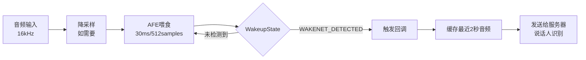

### 5.3 音频处理（AFE）

**AFE (Audio Front End)** 处理包含:
- **AEC (回声消除)**: `AEC_MODE_VOIP_HIGH_PERF`
- **NS (降噪)**: `AFE_NS_MODE_NET` (神经网络降噪)
- **VAD (语音活动检测)**: `VAD_MODE_0`
- **AGC (自动增益控制)**: 可选

### 5.4 音频编码（Opus）

**编码配置**:
```cpp
sample_rate: 16000 Hz
channel: 1 (单声道)
bitrate: AUTO
frame_duration: 60 ms
application: AUDIO
complexity: 0 (最低)
enable_fec: false
enable_dtx: true  (不连续传输)
enable_vbr: true  (可变比特率)
```

### 5.5 网络协议封装

**Protocol v2** (带时间戳，用于服务端AEC):
```cpp
struct BinaryProtocol2 {
    uint16_t version;      // 协议版本 = 2
    uint16_t type;         // 0: OPUS, 1: JSON
    uint32_t reserved;     // 保留字段
    uint32_t timestamp;    // 时间戳(毫秒)
    uint32_t payload_size; // 负载大小
    uint8_t payload[];     // OPUS数据
};
```

**Protocol v3** (精简版本):
```cpp
struct BinaryProtocol3 {
    uint8_t type;          // 消息类型
    uint8_t reserved;      // 保留字段
    uint16_t payload_size; // 负载大小(小端序)
    uint8_t payload[];     // OPUS数据
};
```

### 5.6 TTS语音播放

**解码流程**:
1. 接收Opus音频流（或Ogg封装的Opus）
2. Ogg解封装（如需要）
3. Opus解码（24kHz）
4. 重采样到codec输出采样率
5. I2S输出到扬声器

---

## 6. 通信协议详解

### 6.1 WebSocket协议

**握手请求头**:
```http
Authorization: Bearer <token>
Protocol-Version: 2
Device-Id: AA:BB:CC:DD:EE:FF
Client-Id: xxxxxxxx-xxxx-xxxx-xxxx-xxxxxxxxxxxx
```

**Hello消息** (设备→服务器):
```json
{
  "type": "hello",
  "version": 3,
  "features": {
    "aec": true,
    "mcp": true
  },
  "transport": "websocket",
  "audio_params": {
    "format": "opus",
    "sample_rate": 16000,
    "channels": 1,
    "frame_duration": 60
  }
}
```

### 6.2 JSON消息类型

**设备→服务器**:
| 类型 | 说明 |
|-----|------|
| `hello` | 握手消息 |
| `listen` | 监听控制 (start/stop/detect) |
| `abort` | 中断当前会话 |
| `mcp` | MCP协议消息 |

**服务器→设备**:
| 类型 | 说明 |
|-----|------|
| `hello` | 握手响应 |
| `stt` | 语音识别结果 |
| `tts` | TTS状态控制 (start/stop/sentence_start) |
| `llm` | LLM情感反馈 |
| `mcp` | MCP协议消息 |
| `system` | 系统命令 (reboot) |
| `custom` | 自定义消息 |

---

## 7. 设备状态机

### 7.1 状态流转图

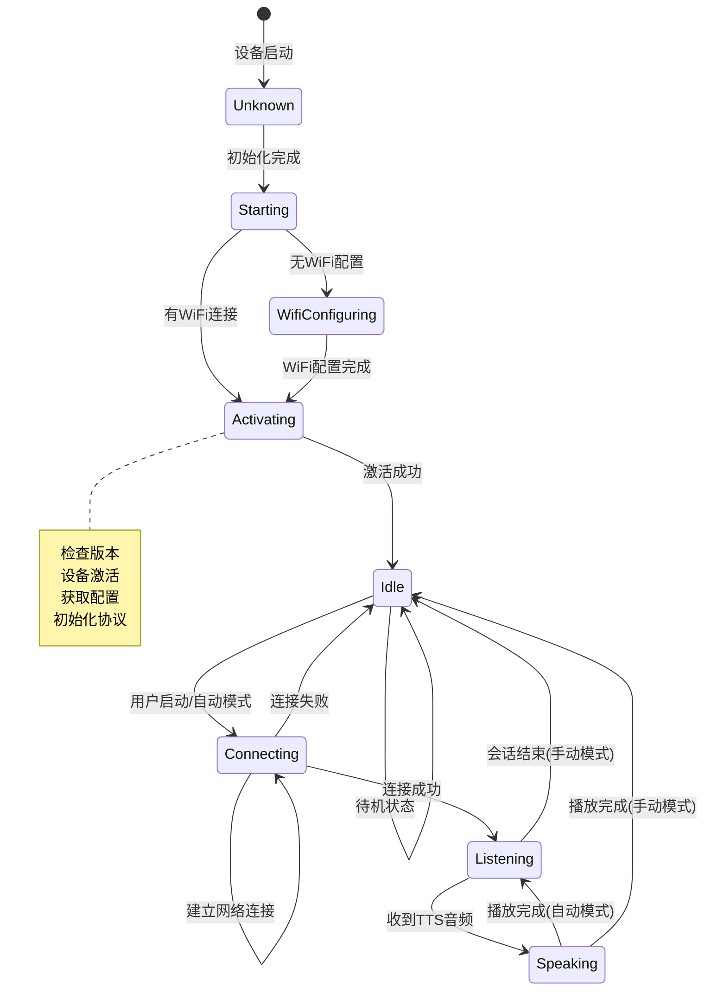

### 7.2 状态定义

| 状态 | 描述 |
|------|------|
| `kDeviceStateUnknown` | 未知状态 |
| `kDeviceStateStarting` | 启动中 |
| `kDeviceStateWifiConfiguring` | WiFi配网中 |
| `kDeviceStateActivating` | 激活中 |
| `kDeviceStateIdle` | 空闲 |
| `kDeviceStateConnecting` | 连接服务器中 |
| `kDeviceStateListening` | 监听中 |
| `kDeviceStateSpeaking` | 播放中 |

---

## 8. 核心代码位置索引

### 8.1 WiFi配网相关

| 文件路径 | 功能描述 |
|---------|---------|
| `main/boards/common/wifi_board.cc` | WiFi板级实现，配网入口 |
| `main/boards/common/blufi.cpp` | BluFi配网实现 |
| `main/boards/common/afsk_demod.cc` | 声波配网实现 |
| `managed_components/78__esp-wifi-connect/wifi_configuration_ap.cc` | 热点配网实现 |
| `managed_components/78__esp-wifi-connect/ssid_manager.cc` | WiFi凭据管理 |

### 8.2 语音交互相关

| 文件路径 | 功能描述 |
|---------|---------|
| `main/audio/audio_service.cc` | 音频服务核心 |
| `main/audio/wake_words/afe_wake_word.cc` | AFE唤醒词检测 |
| `main/audio/processors/afe_audio_processor.cc` | AFE音频处理 |
| `main/audio/demuxer/ogg_demuxer.cc` | OGG解封装 |
| `main/audio/codecs/` | 音频编解码器实现 |

### 8.3 网络通信相关

| 文件路径 | 功能描述 |
|---------|---------|
| `main/protocols/websocket_protocol.cc` | WebSocket协议 |
| `main/protocols/mqtt_protocol.cc` | MQTT协议 |
| `main/ota.cc` | 设备激活、OTA升级 |
| `main/settings.cc` | 配置存储 |

### 8.4 应用主逻辑

| 文件路径 | 功能描述 |
|---------|---------|
| `main/application.cc` | 应用程序主入口 |
| `main/device_state_machine.cc` | 设备状态机 |
| `main/mcp_server.cc` | MCP服务器 |

---

## 9. 流程图与时序图

### 9.1 完整启动流程

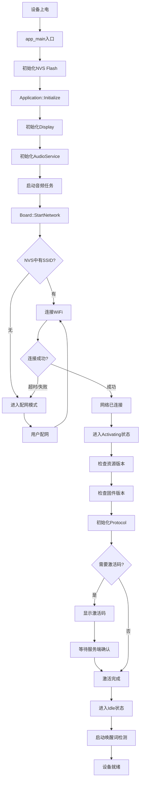

### 9.2 语音交互完整时序

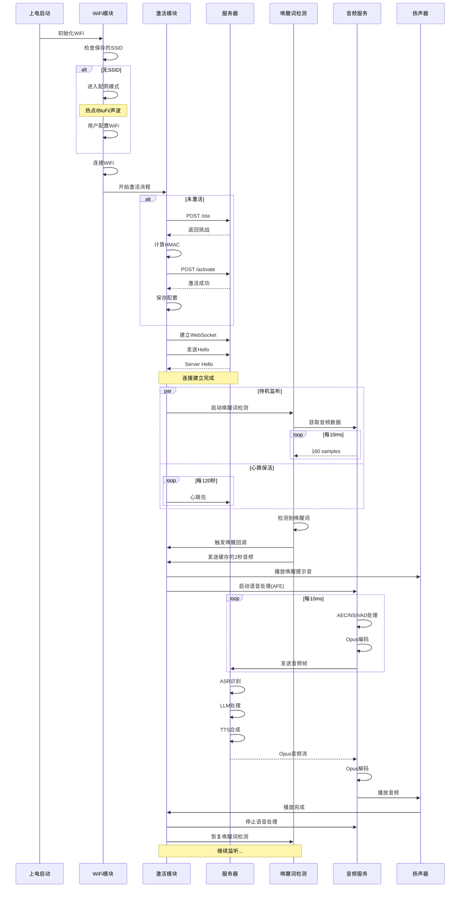

### 9.3 音频数据流详细时序

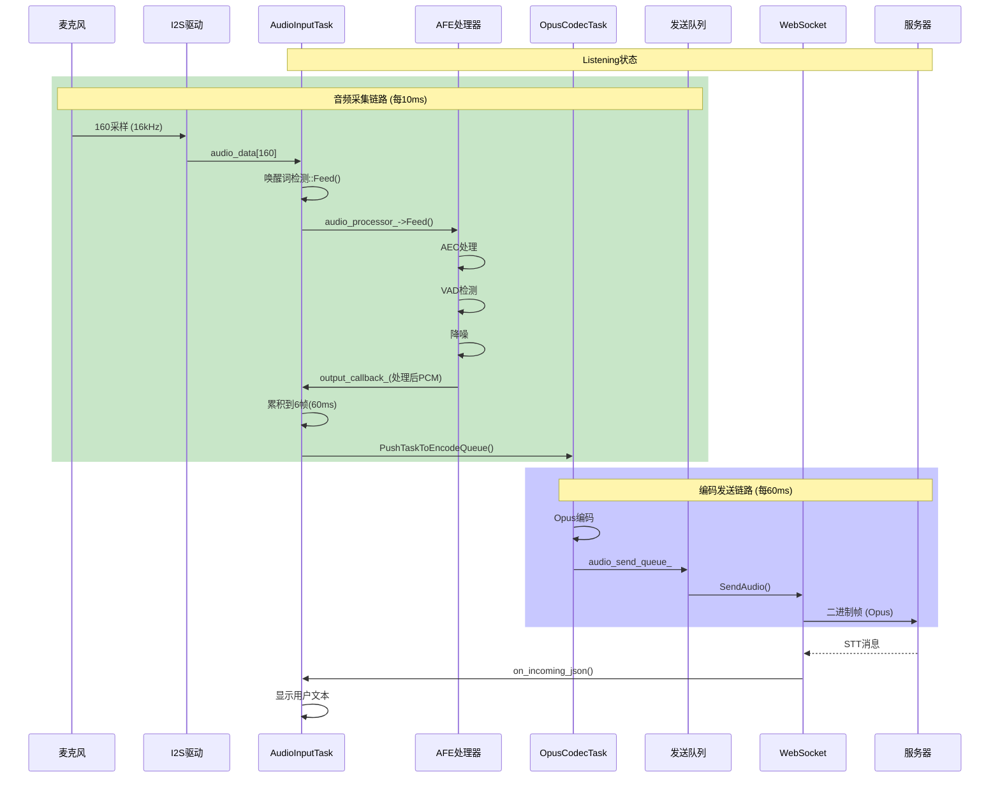

### 9.4 TTS播放数据流

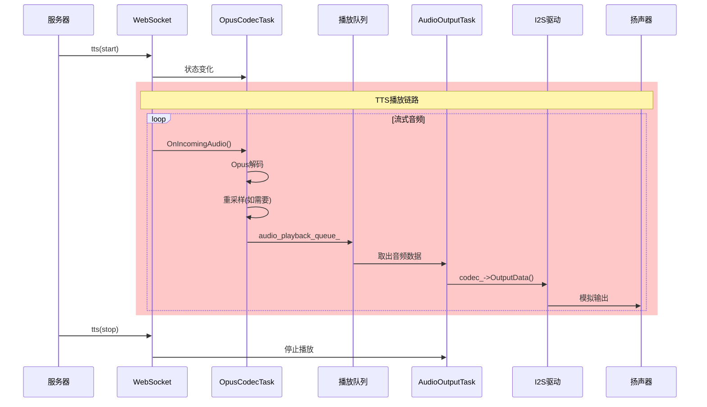

---

## 10. 总结

### 10.1 项目特点

1. **模块化设计**: 清晰的分层架构，硬件抽象层完善
2. **多种配网方式**: 热点/声波/蓝牙，适应不同使用场景
3. **流式音频处理**: 支持流式OGG解封装，低延迟
4. **状态机管理**: 严格的状态转换规则，系统稳定
5. **多协议支持**: WebSocket和MQTT可切换
6. **唤醒词打断**: Speaking状态下可响应新唤醒词

### 10.2 技术亮点

- **AEC回声消除**: 支持设备端和服务端两种模式
- **VAD语音活动检测**: 自动判断用户说话结束
- **Opus音频编解码**: 平衡音质和带宽
- **多任务架构**: 独立的音频输入/输出/编解码任务
- **MCP协议**: 标准化的设备能力扩展接口

### 10.3 关键配置参数

```cpp
// 音频参数
OPUS_FRAME_DURATION_MS = 60
MAX_ENCODE_TASKS_IN_QUEUE = 2
MAX_DECODE_PACKETS_IN_QUEUE = 40
AUDIO_POWER_TIMEOUT_MS = 15000

// 检测参数
WAKE_WORD_FEED_SIZE = 512
VAD_MIN_NOISE_MS = 100
WAKE_WORD_BUFFER_MS = 2000

// 网络参数
server_sample_rate = 24000
server_frame_duration = 60
MQTT_KEEPALIVE = 240
TIMEOUT_SECONDS = 120
```

### 10.4 关键文件速查

| 功能 | 核心文件 |
|-----|---------|
| 主程序 | `main/application.cc` |
| WiFi配网 | `main/boards/common/wifi_board.cc` |
| 音频服务 | `main/audio/audio_service.cc` |
| 唤醒词检测 | `main/audio/wake_words/afe_wake_word.cc` |
| WebSocket协议 | `main/protocols/websocket_protocol.cc` |
| 状态机 | `main/device_state_machine.cc` |

---

**报告生成时间**: 2026年2月5日
**项目版本**: xiaozhi-esp32 main分支
**分析工具**: Claude Code
