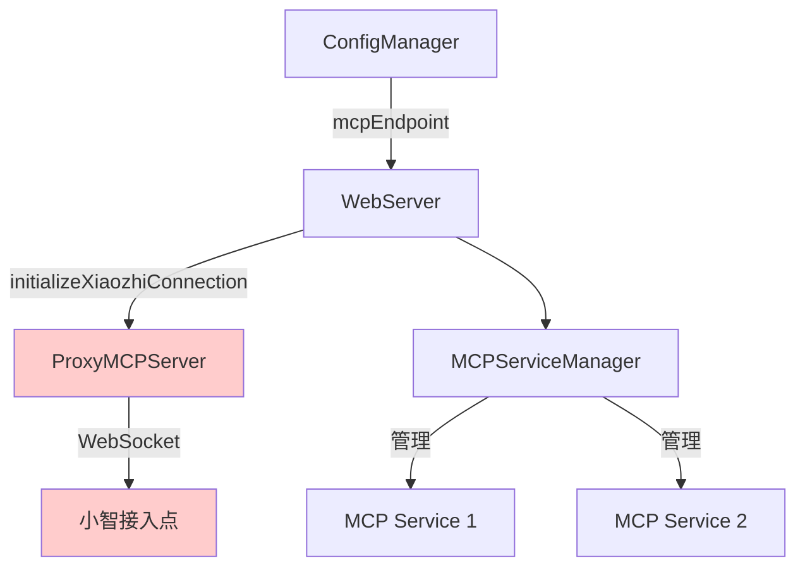

# 小智多接入点连接管理器技术方案

## 1. 现状分析

### 1.1 当前架构分析

当前 `WebServer.ts` 中的 `initializeXiaozhiConnection` 方法存在以下实现：

```typescript
private async initializeXiaozhiConnection(
  mcpEndpoint: string | string[],
  tools: Tool[]
): Promise<void> {
  // 处理多端点配置
  const endpoints = Array.isArray(mcpEndpoint) ? mcpEndpoint : [mcpEndpoint];
  const validEndpoint = endpoints.find((ep) => ep && !ep.includes("<请填写"));

  if (!validEndpoint) {
    this.logger.warn("未配置有效的小智接入点，跳过连接");
    return;
  }

  // 只连接第一个有效端点
  this.proxyMCPServer = new ProxyMCPServer(validEndpoint);
  // ...
}
```

### 1.2 现有问题识别

1. **单点连接限制**：只连接到第一个有效端点，忽略其他配置的端点
2. **缺乏故障转移**：单个连接失败时无法自动切换到备用端点
3. **管理能力不足**：无法统一管理多个接入点的状态和生命周期
4. **扩展性差**：难以支持负载均衡、健康检查等高级功能
5. **资源浪费**：配置的多个端点无法充分利用

### 1.3 与现有架构的关系

- **MCPServiceManager**：通过单例模式管理多个 MCP 服务，提供了良好的参考模式
- **ProxyMCPServer**：单个小智接入点的连接实现，功能完善但缺乏统一管理
- **ConfigManager**：已支持 `mcpEndpoint` 为字符串数组，配置层面已就绪

## 2. 技术设计方案

### 2.1 XiaozhiConnectionManager 核心设计

#### 2.1.1 类结构设计

```typescript
export interface XiaozhiConnectionOptions {
  healthCheckInterval?: number;      // 健康检查间隔（毫秒）
  reconnectInterval?: number;        // 重连间隔（毫秒）
  maxReconnectAttempts?: number;     // 最大重连次数
  loadBalanceStrategy?: 'round-robin' | 'random' | 'health-based';
}

export interface ConnectionStatus {
  endpoint: string;
  connected: boolean;
  lastConnected?: Date;
  lastError?: string;
  reconnectAttempts: number;
  healthScore: number;
}

export class XiaozhiConnectionManager {
  private connections: Map<string, ProxyMCPServer> = new Map();
  private connectionStates: Map<string, ConnectionStatus> = new Map();
  private mcpServiceManager: MCPServiceManager | null = null;
  private logger: Logger;
  private isInitialized = false;

  // 配置选项
  private options: XiaozhiConnectionOptions;

  // 健康检查和重连管理
  private healthCheckInterval: NodeJS.Timeout | null = null;
  private reconnectTimers: Map<string, NodeJS.Timeout> = new Map();

  constructor(options?: XiaozhiConnectionOptions);

  // 核心方法
  async initialize(endpoints: string[], tools: Tool[]): Promise<void>;
  async connect(): Promise<void>;
  async disconnect(): Promise<void>;
  async addEndpoint(endpoint: string): Promise<void>;
  async removeEndpoint(endpoint: string): Promise<void>;

  // 状态管理
  getHealthyConnections(): ProxyMCPServer[];
  getConnectionStatus(): ConnectionStatus[];
  isAnyConnected(): boolean;

  // 工具管理
  setServiceManager(manager: MCPServiceManager): void;

  // 资源清理
  async cleanup(): Promise<void>;
}
```

#### 2.1.2 单例模式实现

参考 `MCPServiceManagerSingleton` 的设计模式：

```typescript
export const XiaozhiConnectionManagerSingleton = {
  getInstance,
  cleanup,
  reset,
  isInitialized,
  getStatus,
  forceReinitialize,
  getCurrentInstance,
  waitForInitialization,
} as const;
```

### 2.2 核心功能设计

#### 2.2.1 连接管理策略

1. **并发连接**：同时连接所有配置的端点
2. **健康检查**：定期检查连接状态，维护健康度评分
3. **自动重连**：连接失败时自动重连，使用指数退避算法
4. **负载均衡**：支持多种负载均衡策略

#### 2.2.2 错误处理机制

1. **隔离故障**：单个连接失败不影响其他连接
2. **优雅降级**：部分连接失败时继续提供服务
3. **详细日志**：记录连接状态变化和错误信息
4. **状态监控**：提供实时的连接状态查询接口

### 2.3 与现有架构的集成

#### 2.3.1 WebServer.ts 集成方案

```typescript
// 重构后的 initializeXiaozhiConnection 方法
private async initializeXiaozhiConnection(
  mcpEndpoint: string | string[],
  tools: Tool[]
): Promise<void> {
  const endpoints = Array.isArray(mcpEndpoint) ? mcpEndpoint : [mcpEndpoint];
  const validEndpoints = endpoints.filter((ep) => ep && !ep.includes("<请填写"));

  if (validEndpoints.length === 0) {
    this.logger.warn("未配置有效的小智接入点，跳过连接");
    return;
  }

  // 使用连接管理器
  this.xiaozhiConnectionManager = await XiaozhiConnectionManagerSingleton.getInstance();
  this.xiaozhiConnectionManager.setServiceManager(this.mcpServiceManager);

  await this.xiaozhiConnectionManager.initialize(validEndpoints, tools);
  await this.xiaozhiConnectionManager.connect();

  this.logger.info(`小智接入点连接管理器初始化完成，管理 ${validEndpoints.length} 个端点`);
}
```

#### 2.3.2 配置管理集成

利用现有的配置管理能力：
- 使用 `configManager.getMcpEndpoints()` 获取端点列表
- 支持配置热重载时的动态更新
- 保持与现有配置格式的完全兼容

## 3. 实施计划

### 3.1 第一阶段：核心管理器实现（3-5 天）

#### 任务 1.1: 创建基础类结构
- **目标**：建立 XiaozhiConnectionManager 的基础框架
- **交付物**：
  - `src/services/XiaozhiConnectionManager.ts` 基础类
  - 接口和类型定义
  - 基础构造函数和属性初始化
- **验收标准**：类可以正常实例化，基础属性正确初始化

#### 任务 1.2: 实现核心连接管理
- **目标**：实现基本的连接管理功能
- **交付物**：
  - `initialize()` 方法实现
  - `connect()` 和 `disconnect()` 方法
  - 连接状态管理逻辑
- **验收标准**：可以管理多个 ProxyMCPServer 实例的生命周期

#### 任务 1.3: 创建单例包装器
- **目标**：提供全局唯一的管理器实例
- **交付物**：
  - `src/services/XiaozhiConnectionManagerSingleton.ts`
  - 资源清理和错误处理机制
- **验收标准**：单例模式正确工作，资源清理完善

#### 任务 1.4: 单元测试
- **目标**：确保核心功能的正确性
- **交付物**：
  - `src/services/__tests__/XiaozhiConnectionManager.test.ts`
  - 核心功能测试用例
- **验收标准**：测试覆盖率 > 80%，所有测试通过

### 3.2 第二阶段：高级功能实现（4-6 天）

#### 任务 2.1: 健康检查机制
- **目标**：实现连接健康监控
- **交付物**：
  - 定期健康检查逻辑
  - 连接状态评分算法
  - 异常检测和报告机制
- **验收标准**：能够准确检测和报告连接状态

#### 任务 2.2: 自动重连机制
- **目标**：提供智能重连能力
- **交付物**：
  - 指数退避重连算法
  - 连接失败处理逻辑
  - 重连状态管理
- **验收标准**：连接失败后能够自动恢复

#### 任务 2.3: 动态配置管理
- **目标**：支持运行时配置更新
- **交付物**：
  - 动态添加/移除端点功能
  - 配置热重载支持
  - 配置验证机制
- **验收标准**：配置更新不影响现有连接

#### 任务 2.4: 负载均衡策略
- **目标**：实现多种负载均衡算法
- **交付物**：
  - 轮询算法实现
  - 基于健康度的选择算法
  - 故障转移机制
- **验收标准**：请求能够合理分配到健康的连接

### 3.3 第三阶段：集成和优化（3-4 天）

#### 任务 3.1: WebServer 集成
- **目标**：将管理器集成到现有系统
- **交付物**：
  - 重构 `initializeXiaozhiConnection` 方法
  - 更新错误处理逻辑
  - 保持向后兼容性
- **验收标准**：现有功能不受影响，新功能正常工作

#### 任务 3.2: 集成测试
- **目标**：验证整体系统的正确性
- **交付物**：
  - 端到端测试用例
  - 多端点连接测试
  - 故障恢复测试
- **验收标准**：所有集成测试通过

#### 任务 3.3: 性能优化
- **目标**：确保系统性能满足要求
- **交付物**：
  - 连接池优化
  - 内存使用优化
  - 异步操作优化
- **验收标准**：性能指标达到验收标准

#### 任务 3.4: 文档和示例
- **目标**：提供完整的使用文档
- **交付物**：
  - API 文档更新
  - 配置示例
  - 迁移指南
- **验收标准**：文档完整，示例可运行

### 3.4 验收标准

#### 功能验收标准
1. ✅ 支持同时连接多个小智接入点
2. ✅ 单个连接失败不影响其他连接
3. ✅ 自动重连机制正常工作
4. ✅ 支持动态添加/移除端点
5. ✅ 提供详细的连接状态监控

#### 性能验收标准
1. ✅ 多连接启动时间不超过单连接的 2 倍
2. ✅ 内存使用增长线性且可控
3. ✅ 连接切换延迟小于 100ms

#### 质量验收标准
1. ✅ 单元测试覆盖率 > 90%
2. ✅ 集成测试通过率 100%
3. ✅ 无内存泄漏
4. ✅ 错误处理完善

### 3.5 风险评估和应对措施

#### 技术风险
- **风险**：多连接管理复杂性增加
- **应对**：参考成熟的 MCPServiceManager 设计模式，完善测试覆盖

- **风险**：性能影响
- **应对**：通过连接池和异步处理优化，设置性能基准测试

- **风险**：内存泄漏
- **应对**：确保资源正确清理，添加内存监控

#### 业务风险
- **风险**：功能回归
- **应对**：保持向后兼容，渐进式部署，完善回滚机制

- **风险**：配置复杂化
- **应对**：提供合理的默认值，完善文档和示例

## 4. 架构变更说明

### 4.1 当前架构

当前系统中，WebServer 直接管理单个 ProxyMCPServer 实例，只能连接到一个小智接入点。



### 4.2 新架构设计

新架构引入 XiaozhiConnectionManager 作为中间层，统一管理多个 ProxyMCPServer 实例。

```mermaid
graph TB
    WebServer[WebServer] --> |使用| XiaozhiConnectionManager[XiaozhiConnectionManager]
    WebServer --> MCPServiceManager[MCPServiceManager]
    ConfigManager[ConfigManager] --> |mcpEndpoints[]| WebServer

    XiaozhiConnectionManager --> |管理| ProxyMCPServer1[ProxyMCPServer 1]
    XiaozhiConnectionManager --> |管理| ProxyMCPServer2[ProxyMCPServer 2]
    XiaozhiConnectionManager --> |管理| ProxyMCPServerN[ProxyMCPServer N]

    ProxyMCPServer1 --> |WebSocket| XiaozhiEndpoint1[小智接入点 1]
    ProxyMCPServer2 --> |WebSocket| XiaozhiEndpoint2[小智接入点 2]
    ProxyMCPServerN --> |WebSocket| XiaozhiEndpointN[小智接入点 N]

    MCPServiceManager --> |管理| MCPService1[MCP Service 1]
    MCPServiceManager --> |管理| MCPService2[MCP Service 2]

    XiaozhiConnectionManager --> |共享工具| MCPServiceManager

    style XiaozhiConnectionManager fill:#ccffcc
    style ProxyMCPServer1 fill:#ccffcc
    style ProxyMCPServer2 fill:#ccffcc
    style ProxyMCPServerN fill:#ccffcc
    style XiaozhiEndpoint1 fill:#ccffcc
    style XiaozhiEndpoint2 fill:#ccffcc
    style XiaozhiEndpointN fill:#ccffcc
```

### 4.3 架构对比分析

#### 4.3.1 当前架构的局限性
- 单点连接，无法充分利用多端点配置
- 缺乏故障转移和负载均衡能力
- 连接管理逻辑分散在 WebServer 中

#### 4.3.2 新架构的优势
- 支持多端点并发连接
- 提供统一的连接管理接口
- 具备故障转移和负载均衡能力
- 更好的可扩展性和维护性

### 4.4 对现有代码的影响范围

#### 4.4.1 需要修改的文件
- `src/WebServer.ts`: 重构 `initializeXiaozhiConnection` 方法
- 新增 `src/services/XiaozhiConnectionManager.ts`
- 新增 `src/services/XiaozhiConnectionManagerSingleton.ts`

#### 4.4.2 无需修改的文件
- `src/ProxyMCPServer.ts`: 作为被管理的组件，无需修改
- `src/configManager.ts`: 已支持多端点配置
- `src/services/MCPServiceManager.ts`: 保持现有功能不变

#### 4.4.3 向后兼容性保证
- 保持现有 API 接口不变
- 支持单端点配置的向后兼容
- 渐进式迁移，不破坏现有功能

### 4.5 迁移策略

1. **阶段性部署**：先实现管理器，再逐步集成
2. **功能开关**：通过配置控制是否启用新功能
3. **回滚机制**：保留原有实现作为备选方案
4. **监控验证**：部署后密切监控系统状态

## 5. 总结

### 5.1 方案价值

本技术方案通过引入 XiaozhiConnectionManager，解决了当前系统在多接入点管理方面的不足，提供了：

1. **完整的多端点支持**：充分利用配置的所有小智接入点
2. **高可用性**：通过故障转移和自动重连提高系统可靠性
3. **可扩展性**：为未来的负载均衡和高级功能奠定基础
4. **统一管理**：提供一致的连接管理接口和监控能力

### 5.2 实施建议

1. **优先级排序**：按照实施计划的三个阶段逐步推进
2. **测试驱动**：每个阶段都要有充分的测试覆盖
3. **监控先行**：在实施过程中建立完善的监控体系
4. **文档同步**：及时更新相关文档和示例

### 5.3 后续规划

完成本方案后，可以考虑以下扩展功能：

1. **智能路由**：根据请求类型选择最适合的端点
2. **性能监控**：收集和分析连接性能数据
3. **配置中心**：支持远程配置管理
4. **集群支持**：支持多实例部署和协调

---

**文档版本**: v1.0
**创建日期**: 2025-08-13
**最后更新**: 2025-08-13
**作者**: Augment Agent
