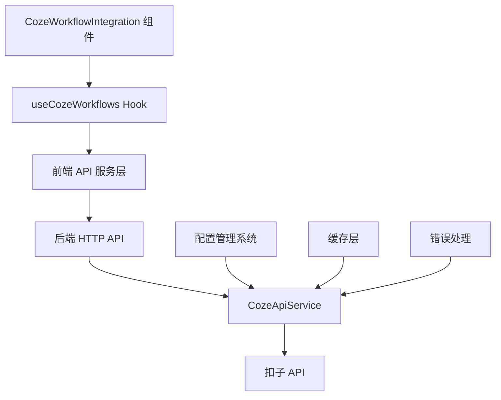

# 扣子工作流集成技术方案

## 1. 现状分析

### 1.1 当前架构分析

项目采用前后端分离架构：
- **后端服务**：基于 Node.js + TypeScript，使用 Hono 框架提供 HTTP API
- **前端界面**：基于 React + TypeScript + Vite，使用 Radix UI 组件库
- **配置管理**：统一的配置文件系统 (`xiaozhi.config.json`)
- **API 架构**：完善的 HTTP 客户端和错误处理机制

### 1.2 现有 CozeWorkflowIntegration 组件分析

当前组件特点：
- 使用静态 mock 数据（15个工作流）
- 支持分页显示（每页5项）
- 具备完整的 UI 交互逻辑
- 缺少工作空间选择功能
- 未集成真实 API 调用

### 1.3 扣子 API 分析

根据 `docs/coze-api.md` 文档：
- **工作空间 API**：`GET /v1/workspaces` - 获取用户工作空间列表
- **工作流 API**：`GET /v1/workflows?workspace_id=xxx` - 获取指定工作空间的工作流
- **认证方式**：Bearer Token（存储在配置文件中）
- **数据结构**：完整的工作空间和工作流元数据

## 2. 技术方案设计

### 2.1 整体架构设计



### 2.2 数据模型设计

```typescript
// 工作空间数据模型
interface CozeWorkspace {
  id: string;
  name: string;
  description: string;
  workspace_type: 'personal' | 'team';
  icon_url: string;
  role_type: 'owner' | 'admin' | 'member';
}

// 工作流数据模型
interface CozeWorkflow {
  workflow_id: string;
  workflow_name: string;
  description: string;
  icon_url: string;
  app_id: string;
  creator: {
    id: string;
    name: string;
  };
  created_at: number;
  updated_at: number;
}

// API 响应模型
interface CozeApiResponse<T> {
  code: number;
  data: T;
  msg: string;
  detail: {
    logid: string;
  };
}
```

### 2.3 配置管理扩展

扩展 `xiaozhi.config.json` 配置结构，仅添加必要的 token 配置：

```json
{
  "platforms": {
    "coze": {
      "token": "your-coze-token"
    }
  }
}
```

其他配置项（如 API 基础 URL、超时时间、重试次数、缓存策略等）将在代码中使用合理的默认值，避免配置过度复杂化。

### 2.4 新增后端 API 接口设计

本方案将新增以下后端 API 接口，用于前端调用扣子工作流相关功能：

| API 路径 | HTTP 方法 | 作用 | 业务场景 |
|---------|----------|------|----------|
| `/api/coze/workspaces` | GET | 获取用户工作空间列表 | 工作空间选择器数据源 |
| `/api/coze/workflows` | GET | 获取指定工作空间的工作流列表 | 工作流列表展示 |

#### 2.4.1 获取工作空间列表 API

**接口路径**：`GET /api/coze/workspaces`

**请求参数**：无

**响应数据结构**：

```typescript
interface WorkspacesResponse {
  success: boolean;
  data: {
    workspaces: Array<{
      id: string;           // 工作空间ID
      name: string;         // 工作空间名称
      description: string;  // 工作空间描述
      workspace_type: string; // 工作空间类型（personal/team）
      icon_url: string;     // 工作空间图标URL
      role_type: string;    // 用户在工作空间中的角色
    }>;
  };
  message?: string;
}
```

**错误响应**：

```typescript
interface ErrorResponse {
  success: false;
  message: string;
  error?: {
    code: string;
    details?: any;
  };
}
```

#### 2.4.2 获取工作流列表 API

**接口路径**：`GET /api/coze/workflows`

**请求参数**：

| 参数名 | 类型 | 必需 | 说明 |
|--------|------|------|------|
| workspace_id | string | 是 | 工作空间ID |
| page_num | number | 否 | 页码，默认为1 |
| page_size | number | 否 | 每页数量，默认为20 |

**响应数据结构**：

```typescript
interface WorkflowsResponse {
  success: boolean;
  data: {
    items: Array<{
      workflow_id: string;    // 工作流ID
      workflow_name: string;  // 工作流名称
      description: string;    // 工作流描述
      icon_url: string;       // 工作流图标URL
      app_id: string;         // 关联应用ID
      creator: {              // 创建者信息
        id: string;
        name: string;
      };
      created_at: number;     // 创建时间戳
      updated_at: number;     // 更新时间戳
    }>;
    has_more: boolean;        // 是否有更多数据
    total_count?: number;     // 总数量（可选）
  };
  message?: string;
}
```

**使用示例**：

```bash
# 获取工作空间列表
GET /api/coze/workspaces

# 获取指定工作空间的工作流列表（第一页）
GET /api/coze/workflows?workspace_id=7513770152291254324

# 获取指定工作空间的工作流列表（分页）
GET /api/coze/workflows?workspace_id=7513770152291254324&page_num=2&page_size=10
```

## 3. 实施方案

### 3.1 阶段一：后端 API 服务实现（第1-2天）

#### 3.1.1 创建类型定义文件
- `src/types/coze.ts` - 扣子 API 相关类型定义
- 包含工作空间、工作流、API 响应等接口

#### 3.1.2 实现扣子 API 服务
- `src/services/CozeApiService.ts` - 核心 API 服务类
- 功能包括：
  - 工作空间列表获取
  - 工作流列表获取（支持分页）
  - Token 认证管理
  - 错误处理和重试机制
  - 内存缓存实现

#### 3.1.3 创建 HTTP 路由处理器
- `src/handlers/CozeApiHandler.ts` - HTTP 路由处理
- 提供 RESTful API 接口：
  - `GET /api/coze/workspaces` - 获取工作空间列表
  - `GET /api/coze/workflows` - 获取工作流列表

#### 3.1.4 扩展配置管理
- 修改 `src/configManager.ts` 支持扣子平台配置
- 添加配置验证和默认值处理

### 3.2 阶段二：前端服务层实现（第3天）

#### 3.2.1 前端 API 调用封装
- `web/src/services/cozeApi.ts` - 前端 API 调用封装
- 基于现有 `ApiClient` 类扩展扣子相关方法

#### 3.2.2 React Hook 实现
- `web/src/hooks/useCozeWorkflows.ts` - 数据获取和状态管理
- 功能包括：
  - 工作空间列表管理
  - 工作流列表管理
  - 加载状态管理
  - 错误状态处理
  - 自动缓存和刷新

#### 3.2.3 类型定义
- `web/src/types/coze.ts` - 前端类型定义
- 与后端类型保持一致

### 3.3 阶段三：组件改造（第4天）

#### 3.3.1 添加工作空间选择功能
- 在组件顶部添加工作空间下拉选择器
- 使用 Radix UI Select 组件
- 支持工作空间图标和描述显示

#### 3.3.2 替换 mock 数据
- 移除现有 mock 数据
- 集成 `useCozeWorkflows` Hook
- 实现真实数据的加载和显示

#### 3.3.3 优化用户体验
- 添加骨架屏加载效果
- 优化错误状态显示
- 添加空状态处理
- 保持现有的分页和交互逻辑

### 3.4 阶段四：测试和优化（第5天）

#### 3.4.1 单元测试
- CozeApiService 测试用例
- useCozeWorkflows Hook 测试
- 组件渲染和交互测试

#### 3.4.2 集成测试
- 端到端 API 调用测试
- 配置管理集成测试
- 错误场景测试

#### 3.4.3 性能优化
- API 调用性能优化
- 缓存策略调优
- 内存使用优化

#### 3.4.4 代码质量检查
- 运行 `pnpm check:all` 进行全面检查
- 修复 lint、格式和拼写问题
- 确保 TypeScript 类型安全

## 4. 技术实现细节

### 4.1 缓存策略

```typescript
class CozeApiCache {
  private cache = new Map<string, CacheItem>();
  private readonly TTL = {
    workspaces: 30 * 60 * 1000, // 30分钟
    workflows: 5 * 60 * 1000,   // 5分钟
  };

  set(key: string, data: any, type: 'workspaces' | 'workflows') {
    this.cache.set(key, {
      data,
      timestamp: Date.now(),
      ttl: this.TTL[type]
    });
  }

  get(key: string): any | null {
    const item = this.cache.get(key);
    if (!item) return null;

    if (Date.now() - item.timestamp > item.ttl) {
      this.cache.delete(key);
      return null;
    }

    return item.data;
  }
}
```

### 4.2 错误处理策略

```typescript
class CozeApiError extends Error {
  constructor(
    message: string,
    public code: string,
    public statusCode?: number
  ) {
    super(message);
    this.name = 'CozeApiError';
  }
}

// 错误处理中间件
const handleCozeApiError = (error: any): CozeApiError => {
  if (error.statusCode === 401) {
    return new CozeApiError('认证失败，请检查 Token 配置', 'AUTH_FAILED', 401);
  }
  if (error.statusCode === 429) {
    return new CozeApiError('请求过于频繁，请稍后重试', 'RATE_LIMITED', 429);
  }
  return new CozeApiError('API 调用失败', 'API_ERROR', error.statusCode);
};
```

### 4.3 重试机制

```typescript
const retryWithBackoff = async <T>(
  fn: () => Promise<T>,
  maxAttempts: number = 3,
  baseDelay: number = 1000
): Promise<T> => {
  for (let attempt = 1; attempt <= maxAttempts; attempt++) {
    try {
      return await fn();
    } catch (error) {
      if (attempt === maxAttempts) throw error;

      const delay = baseDelay * Math.pow(2, attempt - 1);
      await new Promise(resolve => setTimeout(resolve, delay));
    }
  }
  throw new Error('Max retry attempts exceeded');
};
```

## 5. 验收标准

### 5.1 功能验收标准

- [ ] 能够正确获取和显示工作空间列表
- [ ] 工作空间选择器功能正常，支持切换
- [ ] 能够根据选择的工作空间加载对应的工作流列表
- [ ] 工作流列表支持分页显示
- [ ] 添加工作流功能正常工作
- [ ] 错误状态有友好的用户提示
- [ ] 加载状态显示正确

### 5.2 性能验收标准

- [ ] 首次加载时间 < 3 秒
- [ ] 工作空间切换响应时间 < 1 秒
- [ ] 工作流列表翻页响应时间 < 500ms
- [ ] 内存使用稳定，无内存泄漏
- [ ] API 调用支持缓存，减少重复请求

### 5.3 质量验收标准

- [ ] 单元测试覆盖率 > 80%
- [ ] 通过所有 lint 检查 (`pnpm lint`)
- [ ] 通过格式检查 (`pnpm format`)
- [ ] 通过拼写检查 (`pnpm spell:check`)
- [ ] 无 TypeScript 类型错误 (`pnpm type:check`)
- [ ] 通过重复代码检查 (`pnpm duplicate:check`)

### 5.4 安全验收标准

- [ ] Token 不在前端代码中暴露
- [ ] API 调用通过后端代理，避免 CORS 问题
- [ ] 输入参数严格验证
- [ ] 错误信息不暴露敏感信息

## 6. 风险评估与缓解措施

### 6.1 高风险项

**风险**：扣子 API 变更或服务不可用
**影响**：功能完全不可用
**缓解措施**：
- 实现降级机制，API 失败时显示友好提示
- 添加 mock 数据作为备选方案
- 监控 API 状态，及时响应变更

### 6.2 中风险项

**风险**：配置管理复杂性增加
**影响**：用户配置困难，影响使用体验
**缓解措施**：
- 提供详细的配置文档和示例
- 实现配置验证和错误提示
- 添加配置向导功能

### 6.3 低风险项

**风险**：UI 兼容性问题
**影响**：界面显示异常
**缓解措施**：
- 保持现有设计风格和组件结构
- 充分测试不同数据场景
- 渐进式改造，确保向后兼容

## 7. 详细实施步骤

### 7.1 第一天：环境准备和基础架构

#### 第一天任务清单

- [ ] 创建 `src/types/coze.ts` 类型定义文件
- [ ] 扩展 `src/configManager.ts` 支持扣子配置
- [ ] 创建 `src/services/CozeApiService.ts` 基础框架
- [ ] 编写基础单元测试

#### 第一天验收标准

- 类型定义完整且符合 API 文档
- 配置管理支持扣子平台配置项
- 服务类基础结构搭建完成

### 7.2 第二天：后端 API 服务完整实现

#### 第二天任务清单

- [ ] 完成 CozeApiService 所有方法实现
- [ ] 实现缓存机制和错误处理
- [ ] 创建 `src/handlers/CozeApiHandler.ts` 路由处理器
- [ ] 集成到主 Web 服务器

#### 第二天验收标准

- API 服务能够成功调用扣子接口
- 缓存机制正常工作
- HTTP 路由正确响应请求

### 7.3 第三天：前端服务层实现

#### 第三天任务清单

- [ ] 创建 `web/src/services/cozeApi.ts` 前端 API 封装
- [ ] 实现 `web/src/hooks/useCozeWorkflows.ts` Hook
- [ ] 创建 `web/src/types/coze.ts` 前端类型定义
- [ ] 编写 Hook 单元测试

#### 第三天验收标准

- 前端能够成功调用后端 API
- Hook 状态管理正确
- 错误处理机制完善

### 7.4 第四天：组件改造和集成

#### 第四天任务清单

- [ ] 添加工作空间选择器组件
- [ ] 修改 CozeWorkflowIntegration 组件逻辑
- [ ] 替换 mock 数据为真实 API 调用
- [ ] 优化 UI 交互和加载状态

#### 第四天验收标准

- 工作空间选择功能正常
- 工作流列表正确显示真实数据
- 用户体验流畅

### 7.5 第五天：测试和质量保证

#### 第五天任务清单

- [ ] 编写组件测试用例
- [ ] 执行集成测试
- [ ] 运行 `pnpm check:all` 质量检查
- [ ] 性能优化和问题修复

#### 第五天验收标准

- 所有测试用例通过
- 代码质量检查通过
- 性能指标达标

## 8. 关键代码示例

### 8.1 CozeApiService 核心实现

```typescript
export class CozeApiService {
  private cache = new CozeApiCache();
  private token: string;

  // 使用合理的默认配置，避免配置过度复杂化
  private readonly API_BASE_URL = 'https://api.coze.cn';
  private readonly TIMEOUT = 10000;
  private readonly RETRY_ATTEMPTS = 3;

  constructor(token: string) {
    this.token = token;
  }

  async getWorkspaces(): Promise<CozeWorkspace[]> {
    const cacheKey = 'workspaces';
    const cached = this.cache.get(cacheKey);
    if (cached) return cached;

    const response = await this.request<{
      workspaces: CozeWorkspace[];
    }>('/v1/workspaces');

    const workspaces = response.data.workspaces;
    this.cache.set(cacheKey, workspaces, 'workspaces');
    return workspaces;
  }

  async getWorkflows(workspaceId: string, page = 1, pageSize = 20): Promise<{
    items: CozeWorkflow[];
    hasMore: boolean;
  }> {
    const cacheKey = `workflows:${workspaceId}:${page}:${pageSize}`;
    const cached = this.cache.get(cacheKey);
    if (cached) return cached;

    const response = await this.request<{
      items: CozeWorkflow[];
      has_more: boolean;
    }>(`/v1/workflows?workspace_id=${workspaceId}&page_num=${page}&page_size=${pageSize}`);

    const result = {
      items: response.data.items,
      hasMore: response.data.has_more
    };

    this.cache.set(cacheKey, result, 'workflows');
    return result;
  }

  private async request<T>(endpoint: string): Promise<CozeApiResponse<T>> {
    return retryWithBackoff(async () => {
      const response = await fetch(`${this.API_BASE_URL}${endpoint}`, {
        headers: {
          'Authorization': `Bearer ${this.token}`,
          'Content-Type': 'application/json'
        },
        timeout: this.TIMEOUT
      });

      if (!response.ok) {
        throw handleCozeApiError(response);
      }

      return response.json();
    }, this.RETRY_ATTEMPTS);
  }
}
```

### 8.2 useCozeWorkflows Hook 实现

```typescript
export function useCozeWorkflows() {
  const [workspaces, setWorkspaces] = useState<CozeWorkspace[]>([]);
  const [selectedWorkspace, setSelectedWorkspace] = useState<string>('');
  const [workflows, setWorkflows] = useState<CozeWorkflow[]>([]);
  const [loading, setLoading] = useState(false);
  const [error, setError] = useState<string | null>(null);

  const loadWorkspaces = useCallback(async () => {
    try {
      setLoading(true);
      setError(null);
      const data = await cozeApi.getWorkspaces();
      setWorkspaces(data);
      if (data.length > 0 && !selectedWorkspace) {
        setSelectedWorkspace(data[0].id);
      }
    } catch (err) {
      setError(err instanceof Error ? err.message : '获取工作空间失败');
    } finally {
      setLoading(false);
    }
  }, [selectedWorkspace]);

  const loadWorkflows = useCallback(async (workspaceId: string) => {
    if (!workspaceId) return;

    try {
      setLoading(true);
      setError(null);
      const data = await cozeApi.getWorkflows(workspaceId);
      setWorkflows(data.items);
    } catch (err) {
      setError(err instanceof Error ? err.message : '获取工作流失败');
    } finally {
      setLoading(false);
    }
  }, []);

  useEffect(() => {
    loadWorkspaces();
  }, [loadWorkspaces]);

  useEffect(() => {
    if (selectedWorkspace) {
      loadWorkflows(selectedWorkspace);
    }
  }, [selectedWorkspace, loadWorkflows]);

  return {
    workspaces,
    selectedWorkspace,
    setSelectedWorkspace,
    workflows,
    loading,
    error,
    refresh: () => {
      loadWorkspaces();
      if (selectedWorkspace) {
        loadWorkflows(selectedWorkspace);
      }
    }
  };
}
```

## 9. 后续优化建议

1. **搜索功能**：添加工作流名称和描述的搜索过滤
2. **批量操作**：支持批量添加多个工作流
3. **工作流预览**：添加工作流详情预览功能
4. **使用统计**：记录工作流使用频率，优化排序
5. **离线支持**：添加离线缓存，提升用户体验
6. **国际化**：支持多语言界面
7. **主题适配**：支持深色模式
8. **快捷键**：添加键盘快捷键支持

## 10. 总结

本技术方案提供了将 CozeWorkflowIntegration 组件从 mock 数据迁移到真实 API 调用的完整解决方案。方案采用分阶段实施策略，确保每个阶段都有明确的目标和验收标准。通过合理的架构设计、完善的错误处理和缓存机制，能够提供稳定可靠的用户体验。

关键技术特点：

- **渐进式改造**：保持现有功能的同时逐步集成新特性
- **完善的错误处理**：多层次的错误处理和用户友好的提示
- **性能优化**：智能缓存和请求优化策略
- **类型安全**：完整的 TypeScript 类型定义
- **测试覆盖**：全面的单元测试和集成测试

---

**技术方案制定完成时间**：2025年9月8日
**预计实施周期**：5-7个工作日
**技术负责人**：开发团队
