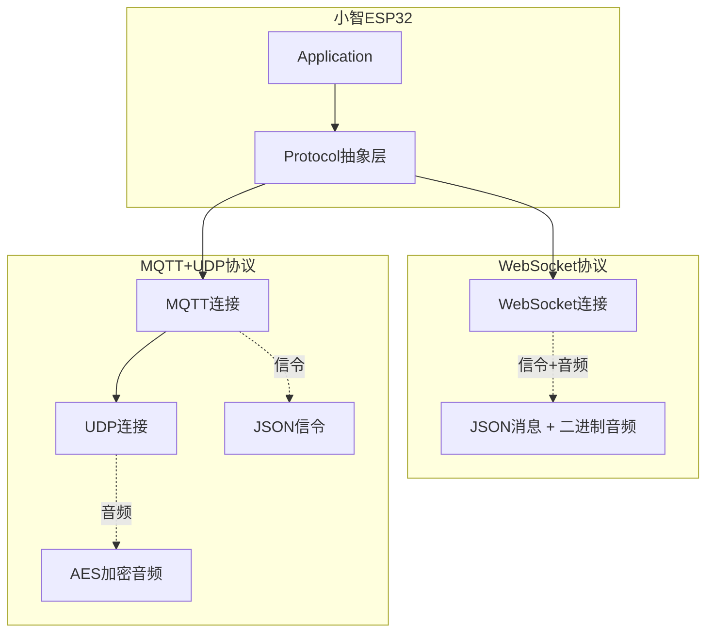
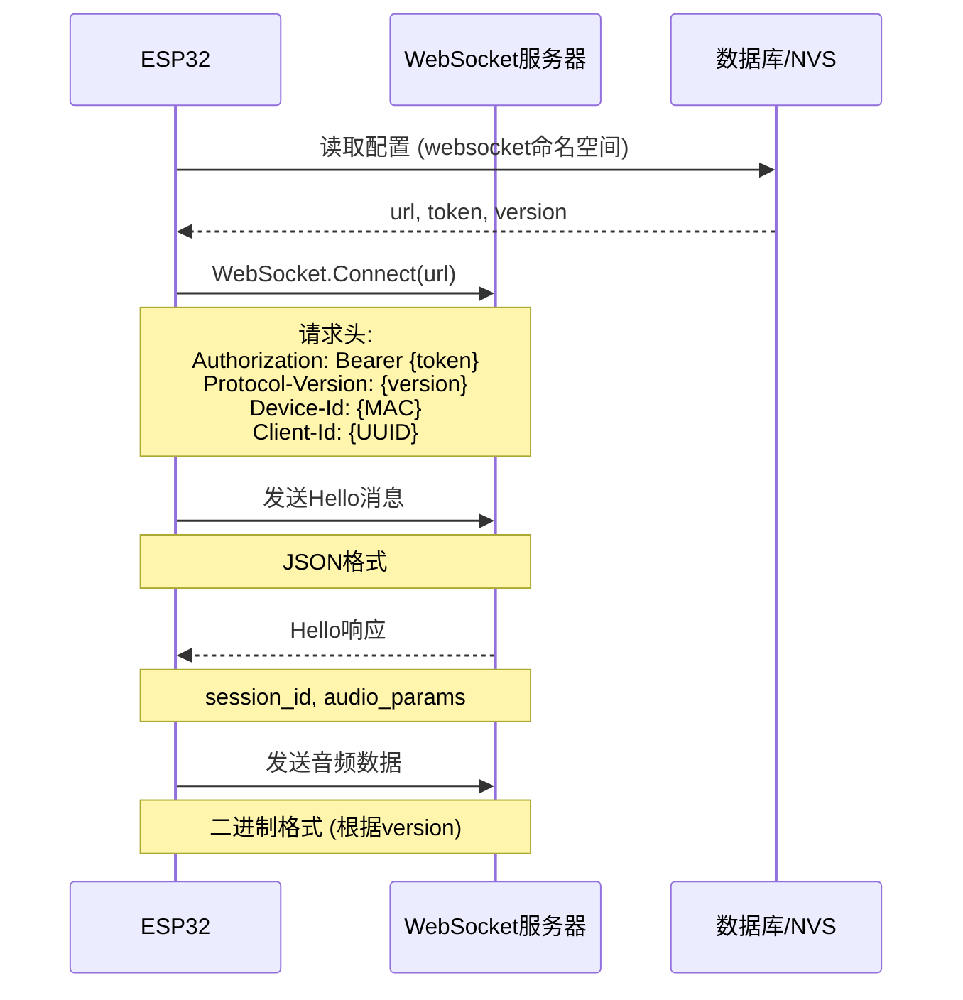
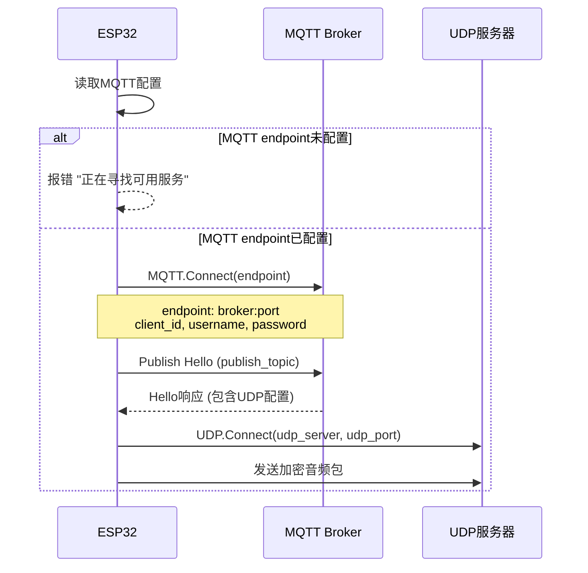
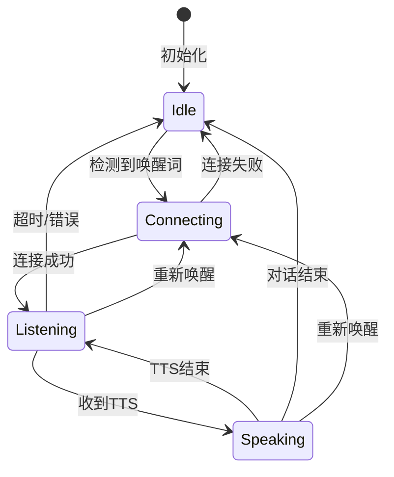
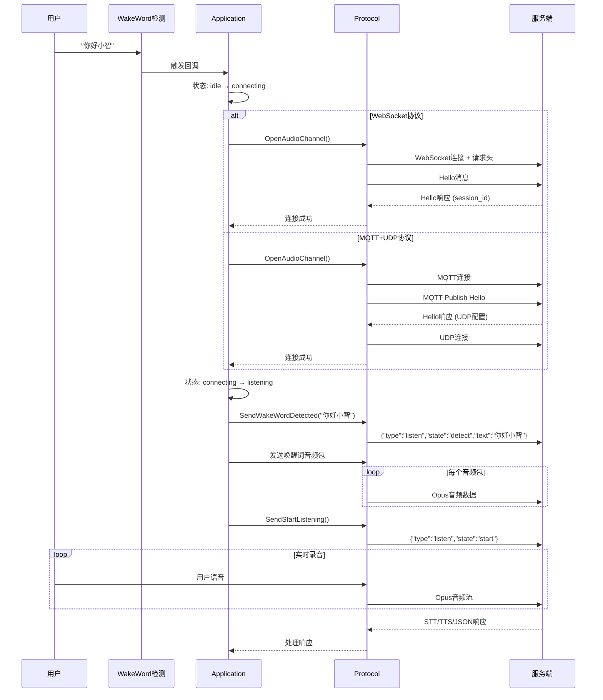
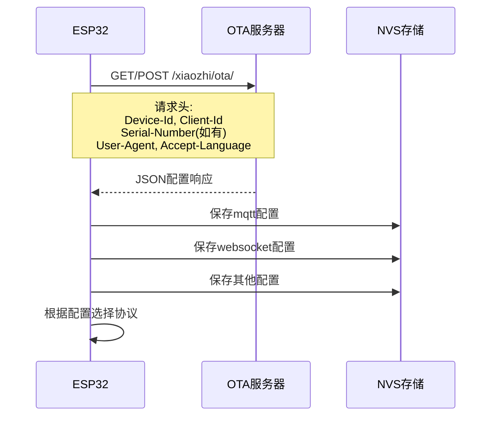

# 小智ESP32服务端通信详细分析报告

## 一、问题诊断

根据日志信息：
```
W (1579688) MQTT: MQTT endpoint is not specified
W (1579728) Application: Alert [circle_xmark] 错误: 正在寻找可用服务
```

**根本原因**: MQTT配置中的`endpoint`参数未设置，导致无法连接到服务端。

---

## 二、通信架构概览

### 2.1 双协议支持

小智ESP32支持两种服务端通信协议：



### 2.2 协议选择逻辑

```cpp
// application.cc:474-485
if (ota_->HasMqttConfig()) {
    protocol_ = std::make_unique<MqttProtocol>();
} else if (ota_->HasWebsocketConfig()) {
    protocol_ = std::make_unique<WebsocketProtocol>();
} else {
    ESP_LOGW(TAG, "No protocol specified in the OTA config, using MQTT");
    protocol_ = std::make_unique<MqttProtocol>();
}
```

**优先级**: MQTT配置 > WebSocket配置 > 默认MQTT

---

## 三、WebSocket协议详解

### 3.1 连接建立流程



### 3.2 配置参数

| 参数 | 说明 | 示例 | NVS命名空间 |
|------|------|------|------------|
| `url` | WebSocket服务器地址 | `wss://api.example.com/ws` | `websocket` |
| `token` | 认证令牌 | `Bearer eyJhbGc...` | `websocket` |
| `version` | 二进制协议版本 | `1`, `2`, `3` | `websocket` |

### 3.3 请求头格式

```http
Authorization: Bearer {token}
Protocol-Version: {version}
Device-Id: {MAC地址}
Client-Id: {设备UUID}
```

### 3.4 Hello消息交换

**设备 → 服务器**:
```json
{
  "type": "hello",
  "version": 1,
  "features": {
    "aec": true,
    "mcp": true
  },
  "transport": "websocket",
  "audio_params": {
    "format": "opus",
    "sample_rate": 16000,
    "channels": 1,
    "frame_duration": 60
  }
}
```

**服务器 → 设备**:
```json
{
  "type": "hello",
  "transport": "websocket",
  "session_id": "会话唯一标识",
  "audio_params": {
    "format": "opus",
    "sample_rate": 24000,
    "channels": 1,
    "frame_duration": 60
  }
}
```

### 3.5 音频数据协议

#### 版本1 (原始Opus)
直接发送Opus音频数据，无协议头。

#### 版本2 (带时间戳)
```c
struct BinaryProtocol2 {
    uint16_t version;       // 协议版本 = 2
    uint16_t type;          // 0=Opus, 1=JSON
    uint32_t reserved;      // 保留
    uint32_t timestamp;     // 时间戳(毫秒，用于AEC)
    uint32_t payload_size;  // 载荷大小
    uint8_t payload[];      // Opus数据
} __attribute__((packed));
```

#### 版本3 (精简版)
```c
struct BinaryProtocol3 {
    uint8_t type;           // 0=Opus, 1=JSON
    uint8_t reserved;       // 保留
    uint16_t payload_size;  // 载荷大小
    uint8_t payload[];      // Opus数据
} __attribute__((packed));
```

---

## 四、MQTT+UDP协议详解

### 4.1 连接建立流程



### 4.2 MQTT配置参数

| 参数 | 说明 | 示例 | NVS命名空间 |
|------|------|------|------------|
| `endpoint` | **必填**: MQTT代理地址 | `broker.example.com:8883` | `mqtt` |
| `client_id` | 客户端唯一标识 | `xiaozhi_001` | `mqtt` |
| `username` | 用户名 | `user` | `mqtt` |
| `password` | 密码 | `pass` | `mqtt` |
| `keepalive` | 心跳间隔(秒) | `240` | `mqtt` |
| `publish_topic` | 发布主题 | `xiaozhi/device/001` | `mqtt` |

### 4.3 MQTT Hello消息

**设备 → 服务器** (通过MQTT Publish):
```json
{
  "type": "hello",
  "version": 3,
  "transport": "udp",
  "features": {
    "aec": true,
    "mcp": true
  },
  "audio_params": {
    "format": "opus",
    "sample_rate": 16000,
    "channels": 1,
    "frame_duration": 60
  }
}
```

**服务器 → 设备** (通过MQTT Subscribe):
```json
{
  "type": "hello",
  "transport": "udp",
  "session_id": "会话ID",
  "audio_params": {
    "format": "opus",
    "sample_rate": 24000,
    "channels": 1,
    "frame_duration": 60
  },
  "udp": {
    "server": "192.168.1.100",
    "port": 8888,
    "key": "0123456789ABCDEF0123456789ABCDEF",
    "nonce": "FEDCBA9876543210FEDCBA9876543210"
  }
}
```

### 4.4 UDP加密音频包

**加密方式**: AES-CTR (128位密钥)

**包格式**:
```
┌─────────────────────────────────────────────────────────────────┐
│ Type(1B) │ Flags(1B) │ Payload Len(2B) │ SSRC(4B)              │
├─────────────────────────────────────────────────────────────────┤
│ Timestamp(4B) │ Sequence(4B) │ AES-CTR Encrypted Opus Data...  │
└─────────────────────────────────────────────────────────────────┘
```

| 字段 | 大小 | 说明 |
|------|------|------|
| Type | 1字节 | 固定值 `0x01` |
| Flags | 1字节 | 标志位 |
| Payload Len | 2字节 | 载荷长度(网络字节序) |
| SSRC | 4字节 | 同步源标识符 |
| Timestamp | 4字节 | 时间戳(网络字节序) |
| Sequence | 4字节 | 序列号(递增，网络字节序) |
| Payload | 变长 | AES-CTR加密的Opus数据 |

---

## 五、唤醒后通信完整流程

### 5.1 状态机转换



### 5.2 详细通信时序



### 5.3 上行消息类型汇总

| 消息 | 类型 | 方向 | 格式 |
|------|------|------|------|
| Hello | `hello` | 设备→服务器 | JSON |
| 唤醒词检测 | `listen` | 设备→服务器 | JSON |
| 开始监听 | `listen` | 设备→服务器 | JSON |
| 停止监听 | `listen` | 设备→服务器 | JSON |
| 中止说话 | `abort` | 设备→服务器 | JSON |
| MCP消息 | `mcp` | 双向 | JSON |
| 音频数据 | - | 设备→服务器 | 二进制Opus |

### 5.4 下行消息类型汇总

| 消息 | 类型 | 方向 | 格式 |
|------|------|------|------|
| Hello响应 | `hello` | 服务器→设备 | JSON |
| 语音识别 | `stt` | 服务器→设备 | JSON |
| TTS开始 | `tts` | 服务器→设备 | JSON |
| TTS结束 | `tts` | 服务器→设备 | JSON |
| 情感表达 | `llm` | 服务器→设备 | JSON |
| 系统控制 | `system` | 服务器→设备 | JSON |
| MCP消息 | `mcp` | 双向 | JSON |
| 音频数据 | - | 服务器→设备 | 二进制Opus |

---

## 六、配置来源：OTA服务器

### 6.1 配置获取流程



### 6.2 OTA请求

**默认URL**: `https://api.tenclass.net/xiaozhi/ota/`

**请求头**:
```http
Activation-Version: 2
Device-Id: {MAC地址}
Client-Id: {设备UUID}
Serial-Number: {序列号} (可选)
User-Agent: {用户代理}
Accept-Language: {语言代码}
Content-Type: application/json
```

### 6.3 OTA响应格式

```json
{
  "mqtt": {
    "endpoint": "broker.example.com:8883",
    "client_id": "xiaozhi_001",
    "username": "user",
    "password": "pass",
    "keepalive": 240,
    "publish_topic": "xiaozhi/device/001"
  },
  "websocket": {
    "url": "wss://api.example.com/ws",
    "token": "Bearer eyJhbGc...",
    "version": 2
  },
  "server_time": {
    "timestamp": 1735689600000,
    "timezone_offset": -480
  },
  "firmware": {
    "version": "1.2.0",
    "url": "https://example.com/firmware.bin"
  },
  "activation": {
    "message": "提示消息",
    "code": "激活码",
    "challenge": "挑战值",
    "timeout_ms": 30000
  }
}
```

---

## 七、关键代码文件

| 文件路径 | 说明 |
|---------|------|
| `main/protocols/protocol.h` | Protocol抽象基类定义 |
| `main/protocols/protocol.cc` | Protocol基类实现 |
| `main/protocols/websocket_protocol.h` | WebSocket协议头文件 |
| `main/protocols/websocket_protocol.cc` | WebSocket协议实现 |
| `main/protocols/mqtt_protocol.h` | MQTT协议头文件 |
| `main/protocols/mqtt_protocol.cc` | MQTT协议实现 |
| `main/application.cc` | 应用层协议选择和使用 |
| `main/ota.cc` | OTA配置获取和存储 |

---

## 八、协议对比

| 特性 | WebSocket | MQTT+UDP |
|------|-----------|----------|
| 连接方式 | 单一WebSocket连接 | MQTT信令 + UDP数据 |
| 音频传输 | WebSocket二进制帧 | UDP数据包 |
| 音频加密 | 无 | AES-CTR |
| 传输延迟 | 较低 | 最低 |
| 服务端复杂度 | 中等 | 较高 |
| 防火墙友好 | 是 | 需开放UDP端口 |
| 适用场景 | 通用场景 | 高并发低延迟场景 |

---

## 九、问题解决方案

### 9.1 解决MQTT endpoint未配置

1. **检查OTA服务器响应**:
   - 确认OTA服务器返回了`mqtt.endpoint`配置
   - 检查设备序列号是否正确绑定

2. **手动配置MQTT** (开发调试用):
   ```cpp
   // 通过NVS手动设置
   nvs_handle_t handle;
   nvs_open("mqtt", NVS_READWRITE, &handle);
   nvs_set_str(handle, "endpoint", "your-broker.com:8883");
   nvs_set_str(handle, "client_id", "xiaozhi_001");
   nvs_set_str(handle, "username", "your_username");
   nvs_set_str(handle, "password", "your_password");
   nvs_set_str(handle, "publish_topic", "xiaozhi/device/001");
   nvs_commit(handle);
   nvs_close(handle);
   ```

3. **使用WebSocket协议**:
   - 通过OTA配置`websocket.url`和`websocket.token`
   - 或直接在NVS中配置

### 9.2 配置验证

```bash
# 查看NVS配置 (ESP-IDF命令)
nvs_partition_tool.py dump nvs.bin nvs_dump.txt

# 或通过串口查看日志
idf.py monitor
# 搜索 "MQTT endpoint" 或 "WebSocket" 相关日志
```

---

## 十、总结

### 通信方式

| 协议 | 通信方式 | 路径 | 数据格式 |
|------|---------|------|---------|
| **WebSocket** | ws://或wss:// | 配置的url | JSON信令 + 二进制Opus |
| **MQTT+UDP** | MQTT信令 + UDP数据 | MQTT endpoint + UDP server:port | JSON信令 + AES加密Opus |

### 上行数据

1. **Hello握手**: JSON格式，声明设备能力和音频参数
2. **唤醒词事件**: `{"type":"listen","state":"detect","text":"你好小智"}`
3. **音频数据**: Opus编码的音频包（带或不带协议头）
4. **控制消息**: listen/abort/mcp等JSON消息

### 下行数据

1. **Hello响应**: JSON格式，返回session_id和音频参数
2. **TTS音频**: Opus编码的语音数据
3. **控制消息**: stt/tts/llm/system等JSON消息
4. **MCP调用**: AI模型调用设备工具的请求和响应
